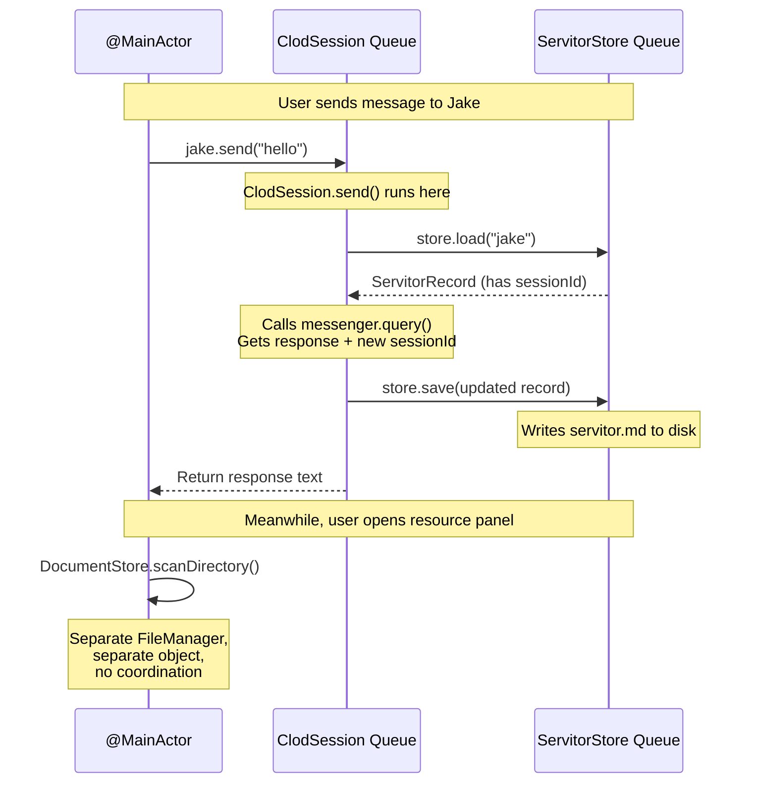
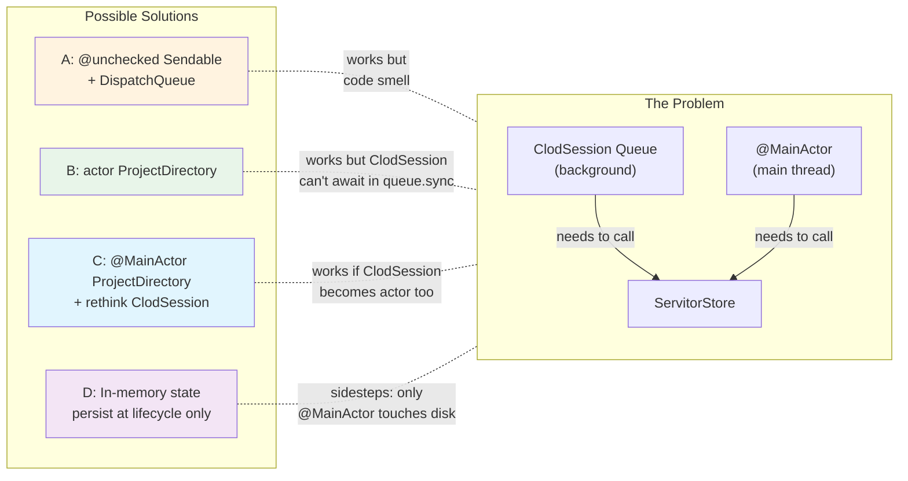
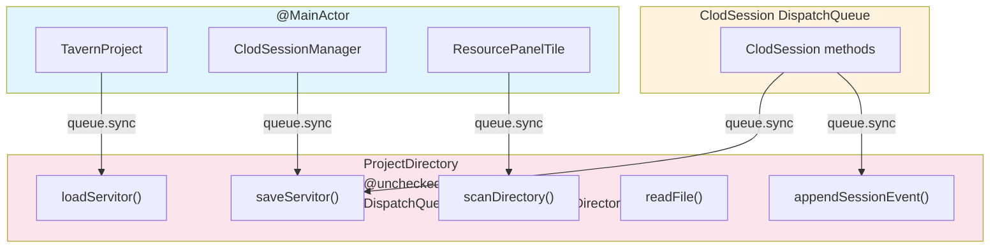
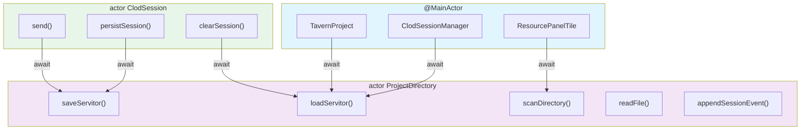
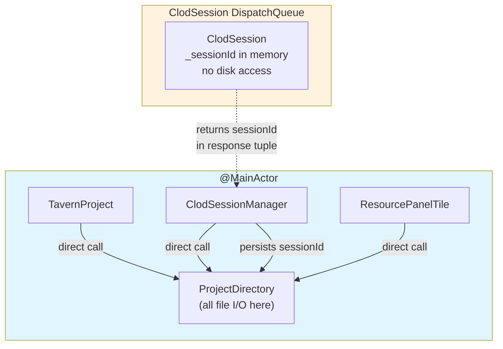
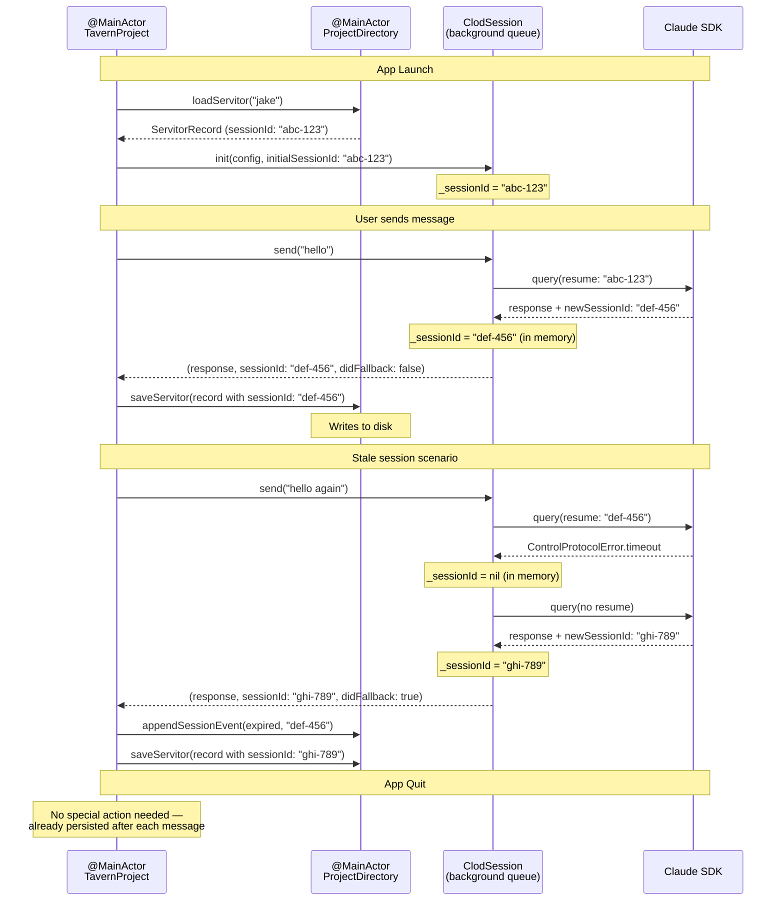
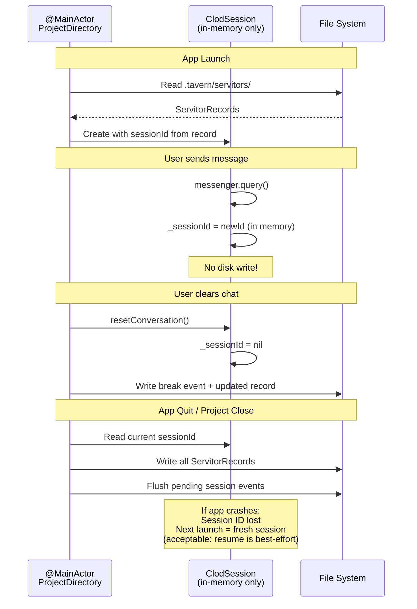

# UDD Consolidation — Threading Analysis Diagrams

**Date:** 2026-03-05
**Context:** Understanding the isolation domain problem before designing ProjectDirectory


## Current Isolation Domains

Five separate objects touch the file system, each from different isolation domains.

```mermaid
graph TB
    subgraph MainActor["@MainActor (Main Thread)"]
        TP["TavernProject.initialize()"]
        CSM[ClodSessionManager]
        CVM[ChatViewModel]
        RPT[ResourcePanelTile]
    end

    subgraph ClodQ["DispatchQueue: com.tavern.ClodSession"]
        CS_persist["ClodSession.persistSession()"]
        CS_clear["ClodSession.clearSession()"]
        CS_log["ClodSession.logSessionExpired()"]
    end

    subgraph StoreQ["DispatchQueue: com.tavern.ServitorStore"]
        SS_save["ServitorStore.save()"]
        SS_load["ServitorStore.load()"]
        SS_list["ServitorStore.listAll()"]
        SS_event["ServitorStore.appendSessionEvent()"]
    end

    subgraph DocStoreQ["@MainActor (DocumentStore)"]
        DS_scan["DocumentStore.scanDirectory()"]
        DS_read["DocumentStore.readFile()"]
    end

    TP -->|"store.listAll()"| SS_list
    TP -->|"store.save()"| SS_save
    CSM -->|"store.load()"| SS_load
    CSM -->|"store.save()"| SS_save
    CSM -->|"store.remove()"| SS_save

    CS_persist -->|"store.save()"| SS_save
    CS_clear -->|"store.load() + save()"| SS_load
    CS_log -->|"store.appendSessionEvent()"| SS_event

    RPT -->|"scanDirectory()"| DS_scan
    RPT -->|"readFile()"| DS_read

    style MainActor fill:#e1f5fe
    style ClodQ fill:#fff3e0
    style StoreQ fill:#fce4ec
    style DocStoreQ fill:#e8f5e9
```




## The Cross-Domain Problem

ClodSession runs on a background DispatchQueue. It calls ServitorStore methods (which have their own queue). Meanwhile, @MainActor callers also hit ServitorStore. Two isolation domains accessing one object.




## Why @unchecked Sendable Is Needed Today

The root problem: two isolation domains need the same object.




## Solution A: @unchecked Sendable + DispatchQueue (current pattern)

Same as today's ServitorStore. Works but compiler can't verify safety.



**Pros:** Minimal refactor — just merge classes.
**Cons:** `@unchecked Sendable` shifts safety burden to code review. A future maintainer could add unprotected state.


## Solution B: Actor Chain (compiler-enforced safety)

Both ProjectDirectory and ClodSession become actors. All access is `await`-based.



**Pros:** No `@unchecked` anywhere. Compiler enforces all isolation.
**Cons:** Requires converting ClodSession from DispatchQueue to actor. ClodSession currently uses `queue.sync {}` — can't `await` inside that. Deeper refactor of Jake/Mortal threading model too (they also use DispatchQueues that call ClodSession).

**Cascade:** Jake has `DispatchQueue(label: "com.tavern.Jake")` protecting `_isCogitating` and calling `session.send()`. If ClodSession becomes an actor, Jake needs `await session.send()` — which requires Jake's queue.sync blocks to become async too. Same for Mortal.


## Solution C: @MainActor ProjectDirectory + Rethink ClodSession

Make ProjectDirectory `@MainActor`. Only @MainActor code touches disk. ClodSession holds session IDs in memory and delegates persistence to @MainActor callers.



**How it works:**
1. ClodSession.send() returns `(response, sessionId, didFallback)` — already does this
2. The @MainActor caller (ClodSessionManager/ChatViewModel) receives the sessionId
3. The @MainActor caller writes it to ProjectDirectory
4. ClodSession never touches disk — it just holds _sessionId in memory

**Problem:** ClodSession currently loads its initial sessionId from disk in its `init`. If it can't read from ProjectDirectory (because it's @MainActor and init isn't async), how does it get the initial sessionId?

**Fix:** Pass the initial sessionId as a constructor parameter. The @MainActor caller reads from ProjectDirectory and passes it in.



**Pros:** No `@unchecked`, no actors, no DispatchQueue conversion. ClodSession keeps its DispatchQueue for protecting _sessionId and _isCogitating. ProjectDirectory is plain @MainActor.
**Cons:** Persistence moves from ClodSession to its callers. Session event logging (appendSessionEvent) also moves up. More code in ClodSessionManager.


## Solution D: In-Memory with Lifecycle Persistence

Like Solution C but lazier — only persist at specific lifecycle points, not after every message.



**Pros:** Fewest disk writes. Simplest threading. No `@unchecked`.
**Cons:** Crash loses session ID. No session event audit trail during normal operation (events only flushed at lifecycle boundaries).


## Comparison Matrix

```
                    | @unchecked | Actor chain | @MainActor+caller | In-memory
--------------------|------------|-------------|--------------------|-----------
@unchecked needed?  |    YES     |     NO      |        NO          |    NO
Refactor scope      |   Small    |    Large    |      Medium        |   Medium
ClodSession changes |   Rename   |  Rewrite    |   Remove disk I/O  | Remove disk I/O
Compiler-safe?      |    No      |    Yes      |       Yes          |    Yes
Crash-safe?         |    Yes     |    Yes      |       Yes          |    No*
Disk write freq     |  Per-msg   |  Per-msg    |     Per-msg        | Lifecycle

* Session ID lost on crash — next launch starts fresh session (resume is best-effort anyway)
```
