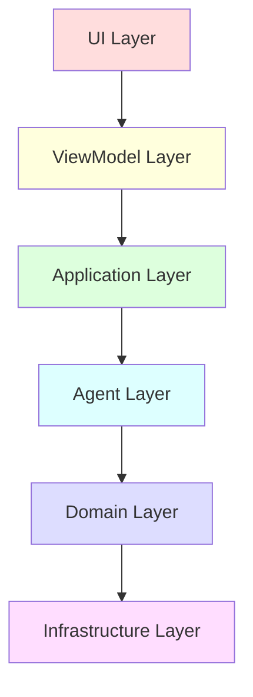
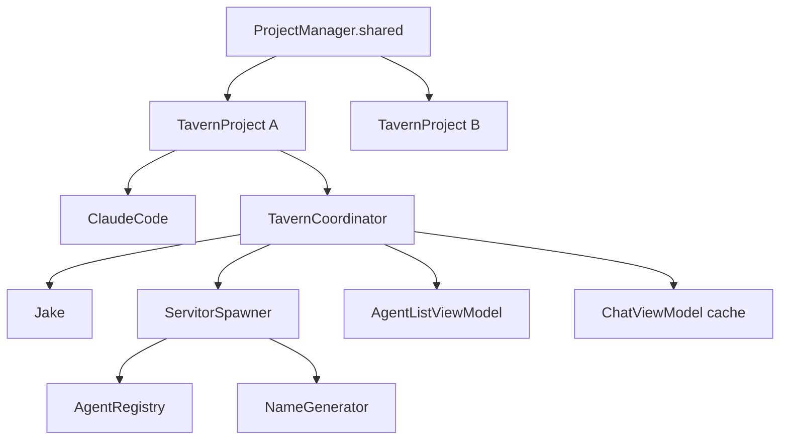

# 003 — System Architecture Specification

**Status:** complete
**Last Updated:** 2026-02-10

## Upstream References
- PRD: §6.1 (Tech Stack)
- Reader: §5 (Architecture Notes — tech stack, layer structure, component ownership, async primitives, threading)
- Transcripts: transcript_2026-01-24-shape-selection.md (architecture shapes), transcript_2026-01-24-async-primitives.md (async strategy), transcript_2026-01-25-0108-agent-registry-architecture.md (component ownership)

## Downstream References
- ADR: ADR-001-shape-selection.md
- Code: Tavern/Sources/TavernCore/ (all modules)
- Tests: All test targets

---

## 1. Overview
Tech stack, layer structure, concurrency rules, component ownership hierarchy, and architecture shapes. Defines the foundational architecture that all other modules build upon.

## 2. Requirements

### REQ-ARCH-001: Tech Stack
**Source:** PRD §6.1
**Priority:** must-have
**Status:** specified

**Properties:**
- Agent runtime: ClodKit v1.0.0 (Swift wrapper, spawns Claude Agent SDK as subprocess)
- Primary language: Swift 6
- Framework: SwiftUI
- Platform: macOS 26+ (Tahoe) — target only the most recent release, no backwards compatibility
- Build system: XcodeGen + redo
- Dependencies: Node.js + @anthropic-ai/claude-agent-sdk (for Agent SDK backend)
- Test framework: ViewInspector (test-only, does not ship in production)

**Testable assertion:** The project compiles with Swift 6 on macOS 26+. ClodKit v1.0.0 resolves via SPM. ViewInspector is test-only. No backwards compatibility code exists for older macOS versions.

### REQ-ARCH-002: Six-Layer Structure
**Source:** PRD §6.1, ADR-001
**Priority:** must-have
**Status:** specified

**Properties:**
- Six layers, each depending only on layers below it — never reach up:

```
UI Layer (thin, dumb)           — layout + gestures + bindings only
ViewModel Layer                 — all UX logic (@MainActor)
Application Layer               — TavernCoordinator, ServitorSpawner
Agent Layer                     — Jake, Servitor, Sidecar
Domain Layer                    — Commitment, Assignment
Infrastructure Layer            — DocStore, SessionStore, SDK
```

- No import from a higher layer exists in any lower layer's source files
- UI code contains no business logic
- ViewModels contain all UX logic

**Testable assertion:** No import from a higher layer exists in any lower layer's source files. UI code contains no business logic. ViewModels contain all UX logic.

### REQ-ARCH-003: Thin UI / Fat ViewModel
**Source:** ADR-001, Reader §5
**Priority:** must-have
**Status:** specified

**Properties:**
- SwiftUI views are dumb: layout, styling, gestures, bindings only
- All UX logic lives in ViewModels
- 90%+ of UX workflows are testable via ViewModel unit tests without touching SwiftUI
- ViewInspector tests verify wiring only, not business logic

**Testable assertion:** ViewModels can be tested without instantiating any SwiftUI views. UX logic tests use ViewModels directly. ViewInspector tests verify wiring only, not business logic.

### REQ-ARCH-004: Architecture Shapes
**Source:** ADR-001
**Priority:** must-have
**Status:** specified

**Properties:**
- Selected from 49 proposals across 16 fundamental shapes:

| Shape | Role |
|-------|------|
| E: Shared Workspace | Doc store as blackboard — if it's not in a file, it doesn't exist |
| D: Supervisor Tree | Agent hierarchy with lifecycle, Erlang-style |
| A: Reactive Streams | UI updates, with batching at 60fps |
| A: Message Bus | Agent-to-agent messaging over shared workspace |
| I: Plugin | Closed set of agent types and spawners (registered at startup) |
| C: Layer | Basic layering for testability |
| L: Sidecar | Agent responsiveness while managing children |

**See also:** §10.2.1 (doc store as filesystem), §4.2.8 (sidecar pattern per agent)

**Testable assertion:** Each shape is identifiable in the codebase. The doc store is the communication medium (E). Agent hierarchy is a tree (D). UI updates are reactive (A). Agent types are registered at startup (I). Layer dependencies go downward only (C). API calls use sidecar actors (L).

### REQ-ARCH-005: Component Ownership Hierarchy
**Source:** Reader §5 (Component Ownership Chain)
**Priority:** must-have
**Status:** specified

**Properties:**
- Each project gets its own fresh stack — agents in Project A are completely isolated from Project B
- The only singleton is `ProjectManager`; everything else is per-project
- Per-project ownership chain:

```
ProjectManager.shared (singleton)
    +-- openProjects: [TavernProject]
            +-- TavernProject (per project directory)
                    +-- ClaudeCode instance (1)
                    +-- TavernCoordinator (1)
                            +-- Jake (1)
                            +-- ServitorSpawner (1)
                            |       +-- AgentRegistry (1)
                            |       +-- NameGenerator (1)
                            +-- AgentListViewModel (1)
                            +-- ChatViewModel cache (0..*)
```

**Testable assertion:** Two projects have independent coordinators, registries, and agent sets. No shared mutable state exists between projects. `ProjectManager` is the sole singleton.

### REQ-ARCH-006: Closed Plugin Set
**Source:** ADR-001, Shape I
**Priority:** must-have
**Status:** specified

**Properties:**
- Agent types and spawners are registered at startup, not dynamically loaded
- All agent types are known at compile time
- Adding a new agent type requires code changes and recompilation

**Testable assertion:** The set of agent types is determined at compile time. No dynamic loading APIs exist. Adding a new agent type requires code changes and recompilation.

### REQ-ARCH-007: Concurrency Model
**Source:** Reader §5 (Async Primitive Strategy), CLAUDE.md
**Priority:** must-have
**Status:** specified

**Properties:**
- `@MainActor` on all ViewModels and UI-bound types
- Never block the cooperative thread pool (`Thread.sleep`, `DispatchSemaphore.wait`, sync file I/O) — sidecars exist for this reason
- Global semaphore for concurrent Anthropic calls (max ~10)
- UI updates via Combine or @Observable, never block main thread
- All mutable state protected by serial `DispatchQueue`:

| Type | Queue Label | Protected State |
|------|-------------|-----------------|
| Jake | `com.tavern.Jake` | `_sessionId`, `_isCogitating`, `_mcpServer` |
| Servitor | `com.tavern.Servitor` | `_state`, `_sessionId` |
| AgentRegistry | `com.tavern.AgentRegistry` | `_agents`, `_nameToId` |
| NameGenerator | `com.tavern.NameGenerator` | `_usedNames`, indices |
| CommitmentList | `com.tavern.CommitmentList` | `_commitments` |
| DocStore | `com.tavern.DocStore` | file operations |

**See also:** §4.2.8 (sidecar pattern per agent)

**Testable assertion:** No `Thread.sleep` or `DispatchSemaphore.wait` calls exist in the cooperative thread pool. All mutable state has a documented protection mechanism. Concurrent API calls respect the global semaphore limit.

### REQ-ARCH-008: Async Primitive Strategy
**Source:** Reader §5 (Async Primitive Strategy)
**Priority:** must-have
**Status:** specified

**Properties:**
- Long-term direction: AsyncStream/AsyncSequence (language-level concurrency)
- Combine bridges at the ViewModel boundary only
- `@Observable` at SwiftUI boundary, AsyncStream for everything below
- Bridge once, at the ViewModel layer

**Testable assertion:** Below the ViewModel layer, async/await and AsyncSequence are used. Combine is only present at the ViewModel/UI boundary.

### REQ-ARCH-009: Dependency Injection for Testability
**Source:** ADR-003, CLAUDE.md
**Priority:** must-have
**Status:** specified

**Properties:**
- Two mocking layers for testing:
  1. `MockAgent` — conforms to `Agent` protocol, returns canned responses (for testing ViewModels and coordinators)
  2. `AgentMessenger` protocol — abstracts SDK boundary; `LiveMessenger` (production) and `MockMessenger` (test double)
- Jake and Servitor accept `AgentMessenger` via constructor injection, defaulting to `LiveMessenger()`
- Any new agent type that calls the SDK must accept `AgentMessenger` for testability

**Testable assertion:** Tests can substitute `MockAgent` for any real agent. Tests can substitute `MockMessenger` for `LiveMessenger`. No test requires a real Claude API call for Grade 1+2 testing.

### REQ-ARCH-010: No Sandbox Entitlement
**Source:** CLAUDE.md
**Priority:** must-have
**Status:** specified

**Properties:**
- The app does not use the macOS app sandbox (`com.apple.security.app-sandbox: false`)
- Unrestricted filesystem and network access, required for agent operations

**Testable assertion:** The `Tavern.entitlements` file contains `com.apple.security.app-sandbox` set to `false`.

## 3. Architecture Diagrams

### Layer Dependency



Arrows point downward only. No layer imports from a layer above it.

### Component Ownership



## 4. Open Questions

- **Multi-project/Jake-per-project:** PRD §14 lists this as "emerges through building." Current implementation has one Jake per project. Is this the final design or might Jake span projects?

- **GUI-less core:** PRD §6.1 mentions "GUI-less framework core, TUI equivalent." Is TavernCore sufficient as the GUI-less core, or does it need additional abstraction?

## 5. Coverage Gaps

- **Build system specification:** The redo build scripts are documented in CLAUDE.md but not formally specified. Redo script behavior (dependency tracking, caching) is not specified.

- **Deployment and distribution:** No specification for how the app is packaged and distributed (App Store, DMG, Homebrew, etc.).

- **Update mechanism:** No specification for how users receive updates to the app.
