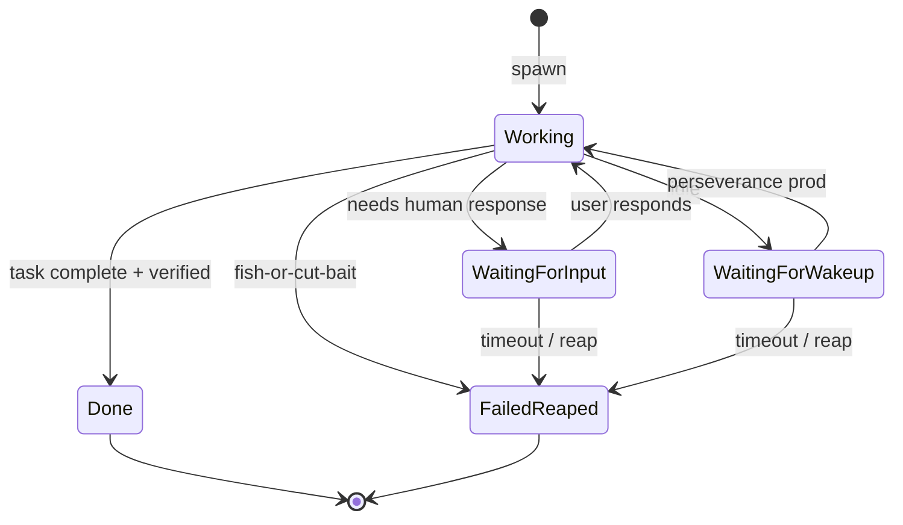

# 004 — Agents Specification

**Status:** complete
**Last Updated:** 2026-02-10

## Upstream References
- PRD: §4.1 (Agent Types), §4.2 (Agent States), §4.3 (Task Modes)
- Reader: §3 (Core Concepts), §5 (Architecture Notes — sidecar pattern, two-level orchestration)
- Transcripts: transcript_2026-01-19-1144.md (agent types, task modes), transcript_2026-01-28-jake-spawn-tool.md (two-level orchestration)

## Downstream References
- ADR: ADR-001-shape-selection.md
- Code: Tavern/Sources/TavernCore/Agents/ (Jake.swift, Servitor.swift, ServitorSpawner.swift)
- Tests: Tavern/Tests/TavernCoreTests/, Tavern/Tests/TavernTests/

---

## 1. Overview
Agent types (Jake daemon, mortal agents, drones, monitor daemons), their states, task modes, and the sidecar I/O pattern. Defines the two-level orchestration model where Tavern agents are persistent tracked work and Task subagents are ephemeral parallel workers.

## 2. Requirements

### REQ-AGT-001: Jake Daemon Agent
**Source:** PRD §4.1
**Priority:** must-have
**Status:** specified

**Properties:**
- Jake is the top-level coordinating daemon agent — exactly one per open project
- Jake's lifecycle is tied to the project: starts when the project opens, stops when it closes
- Jake has the highest authority to spawn and manage other agents
- Jake has few direct capabilities himself — he coordinates, not executes
- Jake's session persists across app restarts (keyed per-project in UserDefaults)

**Testable assertion:** When a project is opened, Jake is instantiated. When the project closes, Jake is stopped. Jake's session persists across app restarts.

### REQ-AGT-002: Mortal Agents (Servitors)
**Source:** PRD §4.1
**Priority:** must-have
**Status:** specified

**Properties:**
- Mortal agents are task-scoped — their lifecycle is bound to task completion
- Mortal agents can spawn children, forming tree structures of arbitrary depth (Erlang-style)
- Parent-child relationships are tracked
- Called "Servitors" in the codebase and "The Regulars" in Jake's vocabulary

**Testable assertion:** A mortal agent can be spawned, receives an assignment, works on it, and transitions to done. A mortal agent can spawn child agents. Parent-child relationships are tracked.

### REQ-AGT-003: Drone Agents
**Source:** PRD §4.1
**Priority:** deferred
**Status:** specified

**Properties:**
- Drones complete exactly one task, then auto-terminate
- Drones use cheaper models and are cheap to fail (Meeseeks pattern)
- No recovery attempt on failure

**Testable assertion:** Deferred. When implemented: drone completes exactly one task, then auto-terminates. Drone failure is cheap (no recovery attempt).

### REQ-AGT-004: Monitor Daemons
**Source:** PRD §4.1
**Priority:** deferred
**Status:** specified

**Properties:**
- Monitor daemons run in the background, reporting to Jake
- Monitor daemons do not accept user tasks
- Monitor daemons track system health, agent progress, and spending

**Testable assertion:** Deferred. When implemented: monitor daemons run in background, report to Jake, do not accept user tasks.

### REQ-AGT-005: Agent State Machine
**Source:** PRD §4.2
**Priority:** must-have
**Status:** specified

**Properties:**
- Every agent has exactly one state at any time: Working, Waiting for Input, Waiting for Wakeup, Done, or Failed/Reaped
- Only valid transitions are permitted; invalid transitions produce an error
- All state transitions are logged at `.info` level
- Done requires verified commitments (REQ-DET-004); self-assessment has no bearing

**Testable assertion:** Given an agent in state X, only valid transitions to states Y are permitted. Attempting an invalid transition produces an error. All transitions are logged at `.info` level.

### REQ-AGT-006: Task Modes
**Source:** PRD §4.3
**Priority:** must-have
**Status:** specified

**Properties:**
- Agents can operate in five task modes: Execute, Delegate, Plan, Break up, Unify
- An agent can switch between any modes at any point during execution
- Mode transitions are observable and logged
- The current mode is queryable

**Testable assertion:** An agent can transition between any task modes. Mode transitions are observable and logged. The current mode is queryable.

### REQ-AGT-007: Two-Level Orchestration
**Source:** Reader §3 (Two-Level Orchestration Model)
**Priority:** must-have
**Status:** specified

**Properties:**
- Level 1 (Tavern Agents via spawn): Full Claude Code sessions, appear in sidebar, persist across sessions, for substantial independent work
- Level 2 (Subagents via Task tool): Ephemeral parallel workers within a single session, do not appear in sidebar, do not persist
- These two levels are orthogonal — any Tavern agent can use Task subagents internally

**Testable assertion:** Tavern agents appear in the agent list and persist across app restarts. Task subagents do not appear in the agent list and do not persist.

### REQ-AGT-008: Sidecar Pattern
**Source:** Reader §9 (Sidecar Pattern), ADR-001
**Priority:** must-have
**Status:** specified

**Properties:**
- Each agent has two conceptual components: main actor (manages state, never blocks) and sidecar (handles slow Anthropic I/O)
- The main actor remains responsive while the sidecar awaits API calls
- A global semaphore limits concurrent Anthropic calls (~10) to prevent thread pool starvation
- No agent's I/O can block another agent's state management

**Testable assertion:** Agent main actor methods return immediately (never block). All SDK/API calls go through the sidecar. Global semaphore is respected (concurrent calls do not exceed limit).

### REQ-AGT-009: Done Signal Detection
**Source:** Reader §3 (Mortal Agents), CLAUDE.md
**Priority:** must-have
**Status:** specified

**Properties:**
- Mortal agents detect done signals (`DONE`, `COMPLETED`) in their responses
- Detection triggers commitment verification (REQ-DET-004), not direct transition to done
- A waiting signal (`WAITING`, `NEED INPUT`) transitions the agent to `.waiting` state
- Responses without these signals leave the agent in working state

**Testable assertion:** A response containing `DONE` triggers verification flow. A response containing `WAITING` transitions to waiting state. Responses without these signals leave the agent in working state.

### REQ-AGT-010: Agent Protocol
**Source:** CLAUDE.md (Agent Layer)
**Priority:** must-have
**Status:** specified

**Properties:**
- All agent types conform to a common `Agent` protocol (shared interface for sending messages, querying state, managing sessions)
- Any type conforming to `Agent` can be used interchangeably in `ChatViewModel` and `TavernCoordinator`
- `MockAgent` conforms to `Agent` protocol for testing

**See also:** §3.2.9 (dependency injection strategy)

**Testable assertion:** `MockAgent` conforms to `Agent` protocol and can be substituted for any real agent in tests. `ChatViewModel` works identically with Jake, Servitor, or MockAgent.

## 3. Properties Summary

### Agent Type Properties

| Property | Jake | Servitor | Drone (deferred) | Monitor (deferred) |
|----------|------|----------|-------------------|-------------------|
| Lifecycle | Daemon (project-bound) | Mortal (task-bound) | Single-task | Daemon (background) |
| Can spawn children | Yes | Yes | No | No |
| Persists across restart | Yes | Yes | No | Yes |
| Accepts user tasks | No (coordinates) | Yes | Yes (one) | No |

### Agent State Machine

### Two-Level Orchestration

| Property | Level 1 (Tavern Agents) | Level 2 (Subagents) |
|----------|------------------------|---------------------|
| Visibility | Sidebar, dashboard | Invisible to user |
| Persistence | Across sessions | Ephemeral |
| Session | Own Claude Code session | Within parent's session |
| Use case | Substantial independent work | Quick parallel tasks |

## 4. Open Questions

- **?4 -- Agent "Done" Assertion:** How does the system know when a mortal agent's task is complete? Currently detection is keyword-based (DONE/COMPLETED in responses). A more robust signal mechanism may be needed.

- **?6 -- Perseverance Prompts and Agent Lifecycle:** What exactly triggers the transition from WaitingForWakeup back to Working? What are the perseverance prompt contents?

- **Drone model selection:** PRD says drones use "cheaper models." Which models? Is this configurable per-spawn or system-wide?

## 5. Coverage Gaps

- **Child agent failure propagation:** PRD mentions Erlang-style hierarchies but does not specify what happens when a child agent fails. Does the parent retry? Escalate? Continue without the child?

- **Agent resource limits:** No specification for per-agent memory or token limits beyond the global semaphore for API calls.
