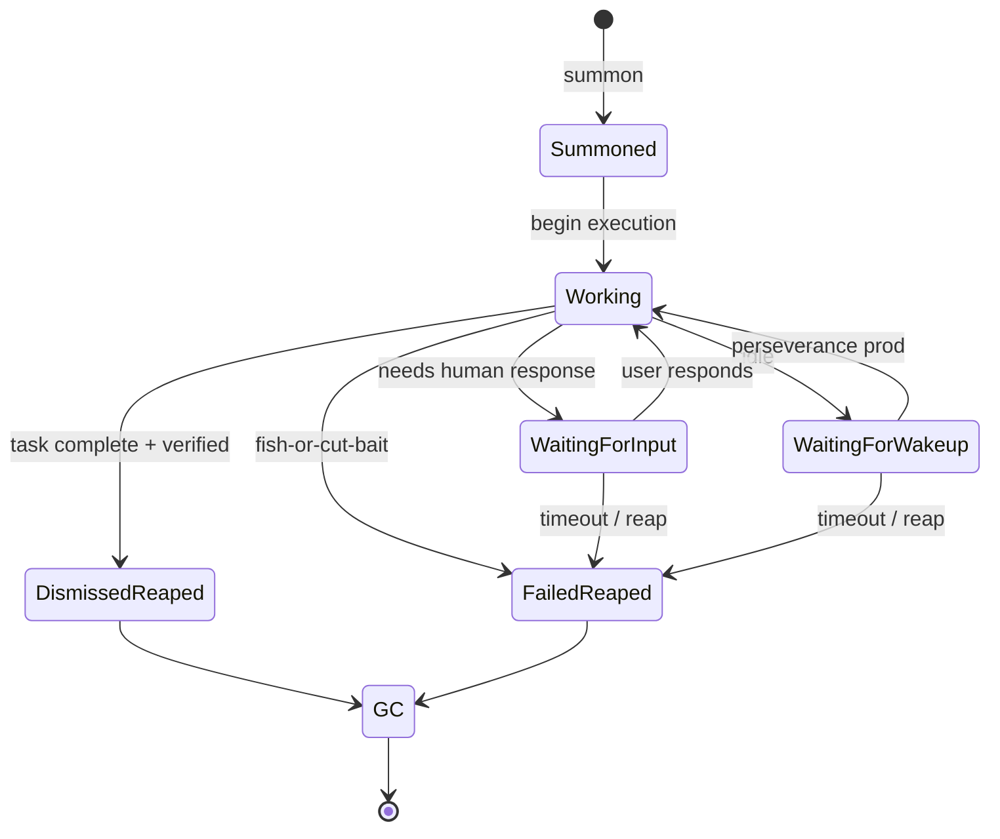

# 004 — Agents Specification

**Status:** complete
**Last Updated:** 2026-02-16

## Upstream References
- PRD: §4.1 (Agent Types), §4.2 (Agent States), §4.3 (Task Modes)
- Reader: §3 (Core Concepts), §5 (Architecture Notes — sidecar pattern, two-level orchestration)
- Transcripts: transcript_2026-01-19-1144.md (agent types, task modes), transcript_2026-01-28-jake-spawn-tool.md (two-level orchestration)

## Downstream References
- ADR: ADR-001-shape-selection.md
- Code: Tavern/Sources/TavernCore/Servitors/ (Jake.swift, Servitor.swift, MortalSpawner.swift)
- Tests: Tavern/Tests/TavernCoreTests/, Tavern/Tests/TavernTests/

---

## 1. Overview
Servitor types (Jake daemon, mortal servitors, drones, monitor daemons), their states, task modes, and the async/non-blocking I/O pattern. Defines how the Tavern manages its own trees of servitors, each running a Claude session that may internally have its own agents and subagents.

## 2. Requirements

### REQ-AGT-001: Jake Daemon Agent
**Source:** PRD §4.1
**Priority:** must-have
**Status:** specified

**Properties:**
- Jake is the top-level coordinating daemon servitor — exactly one per open project
- Jake's lifecycle is tied to the project: starts when the project opens, stops when it closes
- Jake has the highest authority to summon and manage other servitors
- Jake has few direct capabilities himself — he coordinates, not executes
- Jake's session persists across app restarts (keyed per-project in UserDefaults)
- Jake has the authority to delegate capabilities to servitors, with stipulations enforced by the deterministic shell (see §021 Capability Delegation)
- Jake cannot delegate capabilities beyond what he himself has

**Testable assertion:** When a project is opened, Jake is instantiated. When the project closes, Jake is stopped. Jake's session persists across app restarts.

### REQ-AGT-002: Mortal Agents (Servitors)
**Source:** PRD §4.1
**Priority:** must-have
**Status:** specified

**Properties:**
- Mortal servitors are task-scoped — their lifecycle is bound to task completion
- Mortal servitors can summon children, forming tree structures of arbitrary depth (Erlang-style)
- Parent-child relationships are tracked
- Called "Servitors" in the codebase and "The Regulars" in Jake's vocabulary
- These servitors are children of Jake — this is a fundamental property
- Immortal servitors (daemons) are always resuscitated when their session context becomes invalid — daemon resuscitation is a key property
- Resuscitated servitors can either run stateless or persist their state frequently, providing context to the replacement session

**Testable assertion:** A mortal servitor can be summoned, receives an assignment, works on it, and transitions to done. A mortal servitor can summon child servitors. Parent-child relationships are tracked. Daemon servitors are resuscitated when their session context becomes invalid.

### REQ-AGT-003: Drone Agents
**Source:** PRD §4.1
**Priority:** deferred
**Status:** specified

**Properties:**
- Drones complete exactly one task, then auto-terminate
- Drones use cheaper models and are cheap to fail (Meeseeks pattern)
- No recovery attempt on failure

**Testable assertion:** Deferred. When implemented: drone completes exactly one task, then auto-terminates. Drone failure is cheap (no recovery attempt).

### REQ-AGT-004: Monitor Daemons
**Source:** PRD §4.1
**Priority:** deferred
**Status:** specified

**Properties:**
- Monitor daemons run in the background, reporting to Jake
- Monitor daemons do not accept user tasks
- Monitor daemons track system health, servitor progress, and spending
- These are children of Jake, fundamentally — this is a key property

**Testable assertion:** Deferred. When implemented: monitor daemons run in background, report to Jake, do not accept user tasks.

### REQ-AGT-005: Agent State Machine
**Source:** PRD §4.2
**Priority:** must-have
**Status:** specified

**Properties:**
- Every servitor has exactly one state at any time: Summoned, Working, Waiting for Input, Waiting for Wakeup, Done/DismissedReaped, or FailedReaped
- Summoned is the initial state — servitors transition from Summoned to Working when they begin execution
- DismissedReaped = successful dismissal (completed work or dismissed by parent); FailedReaped = error termination
- Both reaped states transition to GC (garbage collection)
- Only valid transitions are permitted; invalid transitions produce an error
- State transitions logged in debug only
- Done requires verified commitments (REQ-DET-004); self-assessment has no bearing
- See §019 for canonical state machine

**Testable assertion:** Given a servitor in state X, only valid transitions to states Y are permitted. Attempting an invalid transition produces an error. State transitions are logged in debug builds.

### REQ-AGT-006: Task Modes
**Source:** PRD §4.3
**Priority:** must-have
**Status:** specified

**Properties:**
- Servitors can operate in five task modes: Execute, Delegate, Plan, Break up, Unify
- A servitor can switch between any modes at any point during execution
- Mode transitions are observable and logged
- The current mode is queryable

Pin: Task modes need further design discussion and fleshing out.

**Testable assertion:** A servitor can transition between any task modes. Mode transitions are observable and logged. The current mode is queryable.

### REQ-AGT-007: Servitor Trees vs Claude-Internal Agents
**Source:** Reader §3 (Two-Level Orchestration Model)
**Priority:** must-have
**Status:** specified

**Properties:**
- The Tavern manages its own trees of servitors — these are Tavern-managed entities with tracked lifecycle, state, and parent-child relationships
- Each servitor runs a Claude session that may internally have its own agents and subagents
- Tavern does not wrap or abstract Claude's internal agent/subagent mechanism — whatever happens inside a Claude session is opaque to the Tavern
- The distinction is: Tavern servitors (managed by Tavern's tree, visible in sidebar, persisted) vs internal session agents (opaque, ephemeral from Tavern's perspective)

**Testable assertion:** Tavern servitors appear in the agent list and persist across app restarts. Claude-internal agents within a servitor's session are not visible in the Tavern UI.

### REQ-AGT-008: Async/Non-Blocking I/O Pattern
**Source:** Reader §9 (Sidecar Pattern), ADR-001
**Priority:** must-have
**Status:** specified

**Properties:**
- Servitor state management never blocks — I/O operations (Anthropic API calls) are async and non-blocking
- Promises for future values enable restart points and non-blocking coordination
- A global semaphore limits concurrent Anthropic calls (~10) to prevent thread pool starvation
- No servitor's I/O can block another servitor's state management
- Configurable timeout for servitor pause without issuing wait/done signal — servitor is either prodded to respond or reaped. See §019 REQ-STM-006.

**Testable assertion:** Servitor state management methods return immediately (never block). All SDK/API calls are async. Global semaphore is respected (concurrent calls do not exceed limit).

### REQ-AGT-009: Done Signal Detection
**Source:** Reader §3 (Mortal Agents), CLAUDE.md
**Priority:** must-have
**Status:** specified

**Properties:**
- Mortal servitors detect done signals (`DONE`, `COMPLETED`) in their responses
- Done signal triggers a request to check commitment. Commitment verification may pass (servitor transitions to Done/DismissedReaped) or fail (servitor is sent back to work with a gap report describing what failed)
- A waiting signal (`WAITING`, `NEED INPUT`) transitions the servitor to `.waiting` state
- Responses without these signals leave the servitor in working state

**Testable assertion:** A response containing `DONE` triggers verification flow. Verification pass → DismissedReaped. Verification fail → sent back to work with gap report. A response containing `WAITING` transitions to waiting state.

### REQ-AGT-010: Agent Protocol
**Source:** CLAUDE.md (Agent Layer)
**Priority:** must-have
**Status:** specified

**Properties:**
- All agent types conform to a common `Agent` protocol (shared interface for sending messages, querying state, managing sessions)
- Any type conforming to `Agent` can be used interchangeably in `ChatViewModel` and `TavernCoordinator`
- `MockAgent` conforms to `Agent` protocol for testing

**See also:** §3.2.9 (dependency injection strategy)

**Testable assertion:** `MockAgent` conforms to `Agent` protocol and can be substituted for any real agent in tests. `ChatViewModel` works identically with Jake, Servitor, or MockAgent.

## 3. Properties Summary

### Servitor Type Properties

| Property | Jake | Servitor | Drone (deferred) | Monitor (deferred) |
|----------|------|----------|-------------------|-------------------|
| Lifecycle | Daemon (project-bound) | Mortal (task-bound) | Single-task | Daemon (background) |
| Can spawn children | Yes | Yes | No | No |
| Persists across restart | Yes | Yes | No | Yes |
| Accepts user tasks | No (coordinates) | Yes | Yes (one) | No |

### Servitor State Machine

```mermaid
stateDiagram-v2
    [*] --> Summoned : summon
    Summoned --> Working : begin execution
    Working --> WaitingForInput : needs human response
    Working --> WaitingForWakeup : idle
    Working --> DismissedReaped : task complete + verified
    Working --> FailedReaped : fish-or-cut-bait
    WaitingForInput --> Working : user responds
    WaitingForInput --> FailedReaped : timeout / reap
    WaitingForWakeup --> Working : perseverance prod
    WaitingForWakeup --> FailedReaped : timeout / reap
    DismissedReaped --> GC
    FailedReaped --> GC
    GC --> [*]
```

### Tavern Servitors vs Claude-Internal Agents

| Property | Tavern Servitors | Claude-Internal Agents |
|----------|-----------------|----------------------|
| Visibility | Sidebar, dashboard | Invisible to Tavern |
| Persistence | Across sessions | Ephemeral (session-scoped) |
| Session | Own Claude session | Within parent's session |
| Managed by | Tavern tree | Claude session internals |

## 4. Open Questions

- **?4 -- Agent "Done" Assertion:** Resolved: Done signal triggers commitment test. Pass → DismissedReaped. Fail → sent back to work with gap report describing what failed.

- **?6 -- Perseverance Prompts and Agent Lifecycle:** Resolved: Infinite loop. Only Done exits (after verification). Any wait attempt gets a perseverance response. See §019.

- **Model selection:** Pinned: Model selection is orthogonal — any session can use any model. Needs PRD + spec. See §019 pinned items.

- **Failure boundaries:** Resolved: See §020 Servitor Trees for Erlang-style supervision strategies.

- **Agent limits:** Resolved: Token budgets and delegated capabilities limit servitors. See §020, §021.

## 5. Coverage Gaps

- **Child servitor failure propagation:** See §020 Servitor Trees for Erlang-style supervision strategies.

- **Servitor resource limits:** See §020 (token budgets) and §021 (capability delegation).
