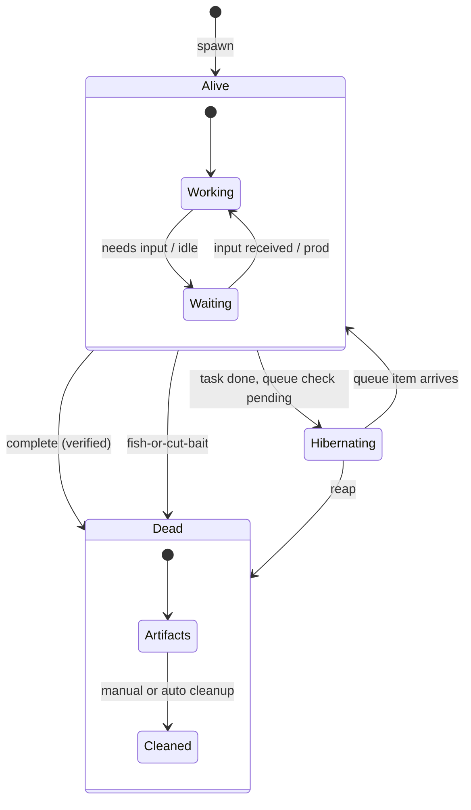

# 006 — Lifecycle Specification

**Status:** complete
**Last Updated:** 2026-02-10

## Upstream References
- PRD: §12 (Fish or Cut Bait), §13 (Rewind and Branch)
- Reader: §8 (Dead Agents Leave Bodies), §4 (Completing Work)
- Transcripts: --

## Downstream References
- ADR: --
- Code: Tavern/Sources/TavernCore/Agents/ (partial implementation)
- Tests: --

---

## 1. Overview
Agent lifecycle management including the "fish or cut bait" decision pattern, rewind-and-branch capabilities, and dead agent artifact preservation. Defines how agents are terminated when unproductive, how work can be rewound and branched, and how dead agents leave traceable artifacts.

## 2. Requirements

### REQ-LCM-001: Fish-or-Cut-Bait Triggers
**Source:** PRD §12
**Priority:** must-have
**Status:** specified

**Properties:**
- The system detects unproductive agents rather than allowing them to continue indefinitely
- Four trigger conditions exist: token budget exceeded, changeset fundamentally wrong, agent spinning, entire gang on wrong path
- Each trigger condition is detectable programmatically
- When a trigger fires, the agent transitions to Failed/Reaped state
- The parent is notified with the specific trigger reason
- An optional restart with different parameters is available (parent or user decides)

**See also:** §4.2.5 (base agent state machine), §4.2.9 (done signal detection), §8.2.4 (commitment verification)

**Testable assertion:** Each trigger condition can be detected programmatically. When a trigger fires, the agent transitions to Failed/Reaped state. The parent is notified with the trigger reason.

### REQ-LCM-002: Token Budget Enforcement
**Source:** PRD §12
**Priority:** must-have
**Status:** specified

**Properties:**
- Every agent has a token budget set at spawn time
- An agent cannot consume unbounded tokens — exceeding the budget fires the fish-or-cut-bait trigger
- Budget overshoot is bounded (the agent does not consume 10x its budget before stopping)
- The budget accounts for the agent's own API calls

**Testable assertion:** An agent with a token budget of N stops after consuming approximately N tokens. The budget overshoot is bounded.

### REQ-LCM-003: Spin Detection
**Source:** PRD §12
**Priority:** should-have
**Status:** specified

**Properties:**
- An agent that makes N identical or near-identical tool calls in succession without producing new artifacts is considered spinning
- The detection threshold N is configurable
- Spin detection triggers the fish-or-cut-bait flow (REQ-LCM-001)

**Testable assertion:** An agent that makes the same tool call N times in succession triggers spin detection. The detection threshold is configurable.

### REQ-LCM-004: Dead Agent Artifacts
**Source:** Reader §8 (Dead Agents Leave Bodies)
**Priority:** must-have
**Status:** specified

**Properties:**
- Dead agents (completed, failed, or reaped) leave persistent artifacts for review and debugging
- The agent's tile persists in the sidebar showing its final state
- The user can view the agent's final state, conversation history, and outputs after death
- Dead agent artifacts are not immediately cleaned up — initial cleanup is manual

**Testable assertion:** After an agent is reaped, its entry remains in the sidebar with a "dead" indicator. The user can view the agent's final state, conversation history, and any outputs.

### REQ-LCM-005: Rewind Capability
**Source:** PRD §13
**Priority:** deferred
**Status:** specified

**Properties:**
- Agent state can be checkpointed at any point
- Rewinding to a checkpoint restores the agent's conversation state and changeset to that point
- The original state is not destroyed by rewinding

**Testable assertion:** Deferred. When implemented: a checkpoint can be created at any point. Rewinding to a checkpoint restores the agent and its changeset to that point.

### REQ-LCM-006: Branch Capability
**Source:** PRD §13
**Priority:** deferred
**Status:** specified

**Properties:**
- Branching from a checkpoint creates an independent copy with a tweaked prompt
- The original timeline is preserved; changes in one branch do not affect the other
- Multiple branches can exist simultaneously

**Testable assertion:** Deferred. When implemented: branching from a checkpoint creates an independent copy. Changes in one branch do not affect the other.

### REQ-LCM-007: Agent Expiration and Hibernation
**Source:** Reader §4 (Completing Work)
**Priority:** should-have
**Status:** specified

**Properties:**
- Mortal agents transition to done/expired or hibernation when tasks complete
- Jake is notified when any agent completes, ensuring no open loops go unhandled
- The dashboard accurately reflects completed vs in-progress vs pending work at all times

**Testable assertion:** A completed agent transitions to done state and is marked as expired or hibernating. Jake is notified when an agent completes. Incomplete tasks are tracked.

## 3. Properties Summary

### Lifecycle Properties

| Property | Holds When | Violated When |
|----------|-----------|---------------|
| Bounded token consumption | Agent stops at or near budget | Agent consumes unbounded tokens |
| Spin detection | Repeated identical actions trigger reaping | Agent loops indefinitely without detection |
| Dead body persistence | Reaped/completed agents remain viewable | Dead agent's state disappears |
| Parent notification | Parent knows when child is reaped and why | Child reaped silently |
| No open loops | Jake tracks all incomplete work | Completed agent's unfinished tasks forgotten |

### Agent Lifecycle State Machine

## 4. Open Questions

- **Rewind storage:** What is preserved at a checkpoint? Full conversation history? Changeset state? Agent configuration? All of the above?

- **Branch limit:** How many branches can exist simultaneously? Is there a limit to prevent resource exhaustion?

- **Automatic reaping:** When does automatic cleanup of dead agent artifacts occur? After a time period? When storage is constrained? Never (always manual)?

## 5. Coverage Gaps

- **Gang-level fish-or-cut-bait:** The PRD mentions "whole gang going down wrong path" but does not specify how this is detected at the tree level vs individual agent level.

- **Restart parameters:** When an agent is restarted after FOCB, what changes? Different prompt? Different model? Different budget? The PRD says "kill and restart" but does not specify what varies.

- **Hibernation triggers:** What causes an agent to hibernate vs expire? The PRD mentions both but does not distinguish the conditions.
