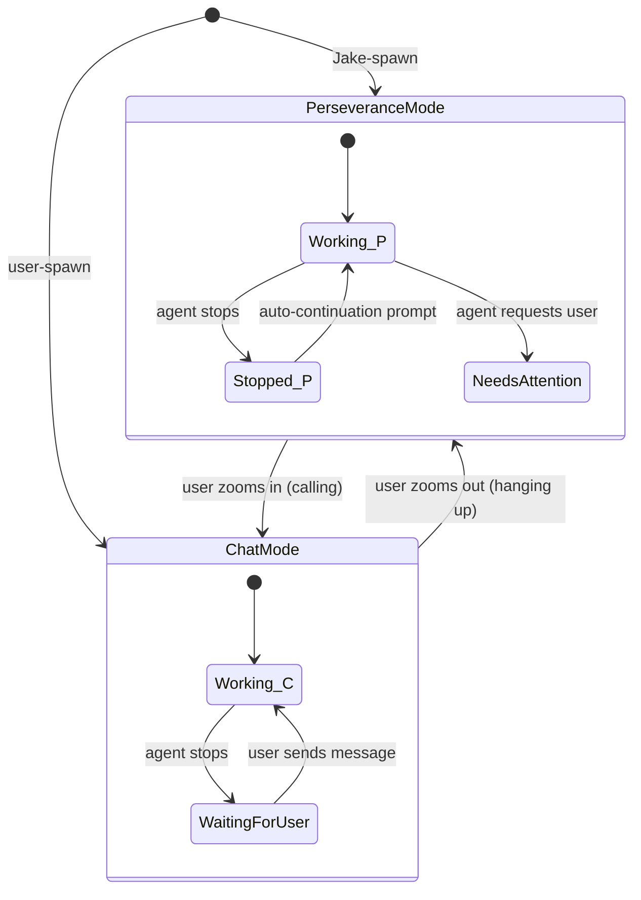

# 007 — Operating Modes Specification

**Status:** complete
**Last Updated:** 2026-02-10

## Upstream References
- PRD: §4.4 (Operating Modes), §5.2 (Attention Model)
- Reader: §3 (Perseverance Mode vs Chat Mode), §4 (Zooming In and Out)
- Transcripts: transcript_2026-01-19-1144.md (perseverance, chat, zoom), transcript_2026-01-27-testing-principles.md (two-mode spawn)

## Downstream References
- ADR: --
- Code: Tavern/Sources/TavernCore/Chat/, Tavern/Sources/TavernCore/Agents/
- Tests: Tavern/Tests/TavernCoreTests/

---

## 1. Overview
Perseverance mode vs chat mode, attention management, and the calling/hanging-up protocol. Defines how agents operate in different contexts and how the system manages user attention across concurrent agent activity.

## 2. Requirements

### REQ-OPM-001: Perseverance Mode
**Source:** PRD §4.4
**Priority:** must-have
**Status:** specified

**Properties:**
- An agent in perseverance mode operates in the background
- An agent in perseverance mode never remains idle indefinitely — the system sends auto-continuation prompts when the agent stops
- An agent in perseverance mode does not generate user-facing notifications unless it explicitly invokes an attention-requesting tool
- Perseverance mode is the default for agents working heads-down on assignments

**See also:** §4.2.5 (base agent state machine)

**Testable assertion:** An agent in perseverance mode receives an auto-continuation prompt within a configurable interval after stopping. The agent does not generate user-facing notifications unless it explicitly invokes an attention-requesting tool.

### REQ-OPM-002: Chat Mode
**Source:** PRD §4.4
**Priority:** must-have
**Status:** specified

**Properties:**
- An agent in chat mode appears in an active chat window
- An agent in chat mode does not receive auto-continuation prompts
- When an agent in chat mode stops, the user is notified
- The agent waits for user input before continuing

**See also:** §4.2.5 (base agent state machine), §4.2.9 (done signal detection)

**Testable assertion:** An agent in chat mode does not receive auto-continuation prompts. When the agent stops, a notification is surfaced to the user. The agent waits for user input before continuing.

### REQ-OPM-003: Mode Switching via Zoom
**Source:** PRD §5.2, Reader §4
**Priority:** must-have
**Status:** specified

**Properties:**
- An agent always knows whether a user is present (the agent's awareness is deterministic, not inferred)
- Mode transitions produce deterministic system messages: "user joined" on zoom-in, "user left" on zoom-out
- The agent's operating mode matches the user's engagement state: zoomed-in = chat mode, zoomed-out = perseverance mode
- The user controls which mode each agent is in

**Testable assertion:** Selecting an agent in the UI triggers a "calling" system message. Deselecting (or closing the chat) triggers a "hanging up" system message. The agent's operating mode changes accordingly.

### REQ-OPM-004: Attention Model
**Source:** PRD §5.2
**Priority:** must-have
**Status:** specified

**Properties:**
- Active agents are visible in the user's view (tabs/UX)
- Agents with pending questions display notification indicators (badges, bubbles)
- The user can zoom into any agent at any depth in the hierarchy
- Cogitating status is visible when an agent is actively processing
- The interaction pattern supports rapid context-switching ("whack-a-mole" between conversations)

**Testable assertion:** Active agents show in the user's view. Agents with pending questions display notification indicators. Cogitating status is visible when an agent is actively processing.

### REQ-OPM-005: Two-Mode Agent Spawning
**Source:** Reader §3 (Two-Mode Agent Spawning)
**Priority:** must-have
**Status:** specified

**Properties:**
- The spawn origin determines the initial operating mode — no explicit mode parameter is needed

**See also:** §4.2.7 (two-level orchestration model), §5.2.2/§5.2.3 (spawn configuration details)

**Testable assertion:** A user-spawned agent has no assignment and is in waiting state. A Jake-spawned agent has an assignment and immediately transitions to working state.

### REQ-OPM-006: Cogitation Display
**Source:** PRD §5.2, Reader §12 (Cogitation Verbs)
**Priority:** should-have
**Status:** specified

**Properties:**
- While an agent is in working state, the UI displays a cogitation verb
- Cogitation verbs are drawn from Jewish cultural and linguistic traditions (711 entries across Yiddish, Hebrew, Ladino, Judeo-Arabic, Talmudic Aramaic, Kabbalistic terminology, and diaspora communities)
- Terms appear in natural forms; awkward -ing constructions are avoided

**Testable assertion:** When an agent is in working state, a cogitation verb is displayed in the UI. The verb is selected from the approved vocabulary list.

## 3. Properties Summary

### Mode Properties

| Property | Perseverance Mode | Chat Mode |
|----------|------------------|-----------|
| Auto-continuation | Yes — system prompts on stop | No — agent waits for user |
| User notifications | Only on explicit tool call | On every stop |
| Background operation | Yes | No — visible in active window |
| Default for | Jake-spawned agents | User-spawned agents |

### Mode Transition Properties

| Property | Holds When | Violated When |
|----------|-----------|---------------|
| Agent awareness | Agent receives deterministic "joined"/"left" messages | Agent must infer user presence |
| User control | Only user actions trigger mode transitions | System or agent initiates mode change without user |
| Mode-state consistency | Agent mode matches user engagement | Agent in chat mode while user is zoomed out, or vice versa |

### Operating Mode State Machine

## 4. Open Questions

- **?6 -- Perseverance Prompts:** What are the exact contents of auto-continuation prompts? How frequently are they sent? Is there a maximum retry count before the agent is considered stuck?

- **?7 -- User Consent for New Chats:** What does "100% clear they're OK with it" mean concretely when agents spawn new chat windows? Is it preference-based, contextual inference, or per-agent consent?

- **Mode persistence across restart:** If the user was zoomed into an agent when the app closes, should the agent resume in chat mode or perseverance mode on restart?

## 5. Coverage Gaps

- **Auto-continuation prompt design:** The PRD establishes perseverance mode but does not specify the prompt contents, frequency, or failure conditions for auto-continuation.

- **Notification priority:** When multiple agents simultaneously need attention, how are notifications ordered? PRD §5.5 covers question triage but not notification prioritization.
