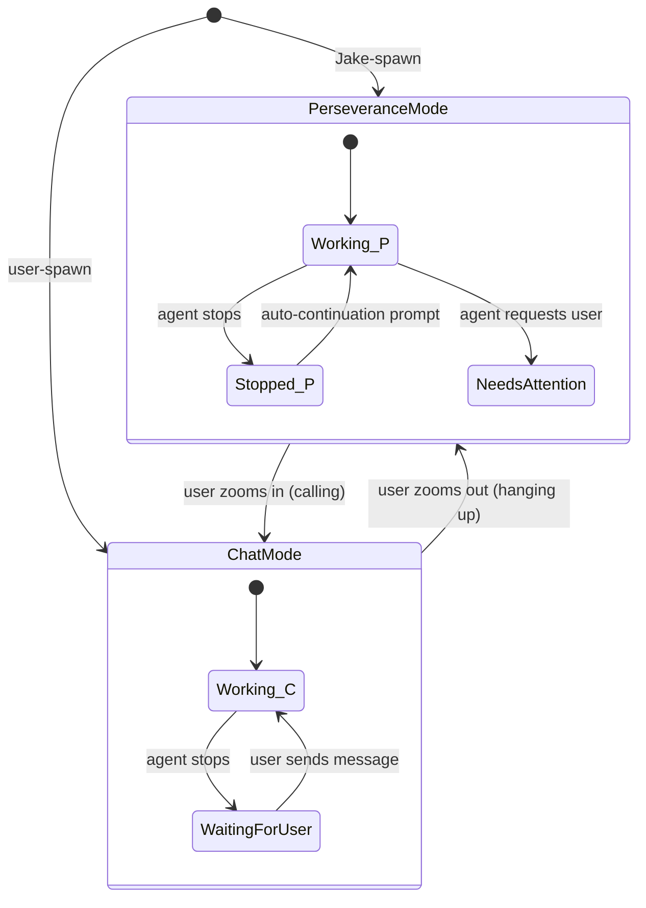

# 007 — Operating Modes Specification

**Status:** complete
**Last Updated:** 2026-02-16

## Upstream References
- PRD: §4.4 (Operating Modes), §5.2 (Attention Model)
- Reader: §3 (Perseverance Mode vs Chat Mode), §4 (Zooming In and Out)
- Transcripts: transcript_2026-01-19-1144.md (perseverance, chat, zoom), transcript_2026-01-27-testing-principles.md (two-mode spawn)

## Downstream References
- ADR: --
- Code: Tavern/Sources/TavernCore/Chat/, Tavern/Sources/TavernCore/Agents/
- Tests: Tavern/Tests/TavernCoreTests/

---

## 1. Overview
Perseverance mode vs chat mode, attention management, and the calling/hanging-up protocol. Defines how servitors operate in different contexts and how the system manages user attention across concurrent servitor activity.

Note: The canonical state/mode model is defined in §019 Servitor States & Modes. This module's state/mode content is retained for historical context but §019 is authoritative.

## 2. Requirements

### REQ-OPM-001: Perseverance Mode
**Source:** PRD §4.4
**Priority:** must-have
**Status:** specified

**Properties:**
- A servitor in perseverance mode operates in the background
- A servitor in perseverance mode never remains idle indefinitely — the system sends auto-continuation prompts when the servitor stops
- A servitor in perseverance mode does not generate user-facing notifications unless it explicitly invokes an attention-requesting tool
- Perseverance mode is the default for servitors working heads-down on assignments

**See also:** §4.2.5 (base agent state machine)

**Testable assertion:** A servitor in perseverance mode receives an auto-continuation prompt within a configurable interval after stopping. The servitor does not generate user-facing notifications unless it explicitly invokes an attention-requesting tool.

### REQ-OPM-002: Chat Mode
**Source:** PRD §4.4
**Priority:** must-have
**Status:** specified

**Properties:**
- A servitor in chat mode appears in an active chat window
- A servitor in chat mode does not receive auto-continuation prompts
- When a servitor in chat mode stops, the user is notified
- The servitor waits for user input before continuing

**See also:** §4.2.5 (base agent state machine), §4.2.9 (done signal detection)

**Testable assertion:** A servitor in chat mode does not receive auto-continuation prompts. When the servitor stops, a notification is surfaced to the user. The servitor waits for user input before continuing.

### REQ-OPM-003: User Joining/Leaving
**Source:** PRD §5.2, Reader §4
**Priority:** must-have
**Status:** specified

**Properties:**
- The user joins and leaves servitor sessions. This is technically orthogonal from perseverance and backgrounding.
- User joining = servitor is notified user is present. User leaving = servitor is notified user is absent.
- A servitor always knows whether a user is present (the servitor's awareness is deterministic, not inferred)
- Joining/leaving produce deterministic system messages: "user joined" on join, "user left" on leave
- Joining does not force a mode change — user presence is independent of operating mode
- See §019 for canonical treatment of the three orthogonal properties.

**Testable assertion:** Selecting a servitor in the UI triggers a "user joined" system message. Deselecting (or closing the chat) triggers a "user left" system message. The servitor's awareness of user presence is deterministic.

### REQ-OPM-004: Attention Model
**Source:** PRD §5.2
**Priority:** must-have
**Status:** specified

**Properties:**
- Active servitors are visible in the user's view (tabs/UX)
- Servitors with pending questions display notification indicators (badges, bubbles)
- The user can join any servitor at any depth in the hierarchy
- Cogitating status is visible when a servitor is actively processing
- The interaction pattern supports rapid context-switching ("whack-a-mole" between conversations)

**Testable assertion:** Active servitors show in the user's view. Servitors with pending questions display notification indicators. Cogitating status is visible when a servitor is actively processing.

### REQ-OPM-005: Two-Mode Servitor Summoning
**Source:** Reader §3 (Two-Mode Agent Spawning)
**Priority:** must-have
**Status:** specified

**Properties:**
- This is not a mode but rather the initial prompt plus expectations
- The distinction is between user-initiated summons (user gets direct permissions) vs Jake-initiated summons (Jake's permission scope)
- Not parametrizable — just a distinction in initial configuration

**See also:** §5.2.2/§5.2.3 (summon configuration details)

**Testable assertion:** A user-summoned servitor has no assignment and is in waiting state. A Jake-summoned servitor has an assignment and immediately transitions to working state.

### REQ-OPM-006: Cogitation Display
**Source:** PRD §5.2, Reader §12 (Cogitation Verbs)
**Priority:** should-have
**Status:** specified

**Properties:**
- Use of cogitation words during working state — the UI displays a cogitation verb while a servitor is working
- Formatting/linguistic properties of the words: terms appear in natural forms; awkward -ing constructions are avoided
- Uniqueness — each servitor's words differ from others'
- Tiered access — sets of verbs gated by conditions (e.g., hours spent in app)
- Cogitation verbs are drawn from Jewish cultural and linguistic traditions (711 entries across Yiddish, Hebrew, Ladino, Judeo-Arabic, Talmudic Aramaic, Kabbalistic terminology, and diaspora communities)

**Testable assertion:** When a servitor is in working state, a cogitation verb is displayed in the UI. The verb is selected from the approved vocabulary list. No two servitors display the same verb simultaneously.

## 3. Properties Summary

### Mode Properties

Note: This table conflates orthogonal states. The canonical model in §019 treats backgrounding, perseverance, and user presence as independent boolean properties.

| Property | Perseverance Mode | Chat Mode |
|----------|------------------|-----------|
| Auto-continuation | Yes — system prompts on stop | No — servitor waits for user |
| User notifications | Only on explicit tool call | On every stop |
| Background operation | Yes | No — visible in active window |
| Default for | Jake-summoned servitors | User-summoned servitors |

### Mode Transition Properties

| Property | Holds When | Violated When |
|----------|-----------|---------------|
| Servitor awareness | Servitor receives deterministic "joined"/"left" messages | Servitor must infer user presence |
| User control | Only user actions trigger presence transitions | System or servitor initiates presence change without user |
| Presence tracking | Servitor knows whether user is present | Servitor in wrong state regarding user presence |

### Operating Mode State Machine

```mermaid
stateDiagram-v2
    [*] --> PerseveranceMode : Jake-spawn
    [*] --> ChatMode : user-spawn

    PerseveranceMode --> ChatMode : user zooms in (calling)
    ChatMode --> PerseveranceMode : user zooms out (hanging up)

    state PerseveranceMode {
        [*] --> Working_P
        Working_P --> Stopped_P : agent stops
        Stopped_P --> Working_P : auto-continuation prompt
        Working_P --> NeedsAttention : agent requests user
    }

    state ChatMode {
        [*] --> Working_C
        Working_C --> WaitingForUser : agent stops
        WaitingForUser --> Working_C : user sends message
    }
```

## 4. Open Questions

- **?6 -- Perseverance Prompts:** Resolved: Infinite loop until confirmed done or prematurely terminated. Contents specified in §019.

- **?7 -- User Consent for New Chats:** Resolved: No focus-stealing. Grounded in user preferences, context, and per-servitor rules.

- **Mode persistence across restart:** Resolved: Modes persist across restart. Pin: safe mode/pause button for the whole app.

- **Perseverance prompt contents:** Resolved: Contents specified in §019.

- **Notification prioritization:** Resolved: Separate spec topic — not just about state/mode. Pinned for future design.

## 5. Coverage Gaps

- **Auto-continuation prompt design:** The PRD establishes perseverance mode but does not specify the prompt contents, frequency, or failure conditions for auto-continuation.

- **Notification priority:** When multiple agents simultaneously need attention, how are notifications ordered? PRD §5.5 covers question triage but not notification prioritization.
