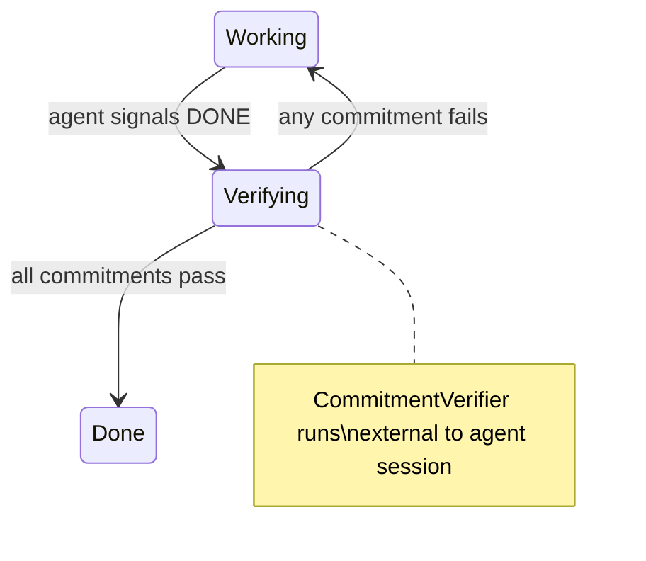

# 008 — Deterministic Shell Specification

**Status:** complete
**Last Updated:** 2026-02-10

## Upstream References
- PRD: §4.7 (Deterministic Shell)
- Reader: §3 (Jake's JSON Response Format), §9 (Sidecar Pattern)
- Transcripts: transcript_2026-01-28-jake-spawn-tool.md (JakeToolHandler protocol, continuation loop)

## Downstream References
- ADR: --
- Code: Tavern/Sources/TavernCore/Commitments/ (Commitment.swift, CommitmentList.swift, CommitmentVerifier.swift), Tavern/Sources/TavernCore/MCP/TavernMCPServer.swift
- Tests: Tavern/Tests/TavernCoreTests/

---

## 1. Overview
The deterministic shell wraps non-deterministic LLM agents with deterministic infrastructure for prompt composition, passthrough display, structured tool use, and commitment verification. The goal is to minimize reliance on non-deterministic LLM behavior by pushing correctness concerns into code.

## 2. Requirements

### REQ-DET-001: Prompt Composition
**Source:** PRD §4.7.1
**Priority:** must-have
**Status:** specified

**Properties:**
- Agent prompts are constructed by deterministic code, not by previous agent responses
- Each message to an agent includes all necessary context regardless of conversation history length
- The system never relies on the agent "remembering" previous instructions

**Testable assertion:** System prompts include all required instructions regardless of conversation history length. No prompt depends on the agent having seen prior messages.

### REQ-DET-002: Passthrough Display
**Source:** PRD §4.7.2
**Priority:** must-have
**Status:** specified

**Properties:**
- Content shown to the user from the doc store is byte-identical to the file on disk
- No LLM summarization or rephrasing occurs between storage and display
- Displayed agent responses are the actual responses received, not re-processed versions

**Testable assertion:** Content displayed with a "direct from store" indicator is byte-identical to the file on disk. Agent responses are displayed as received.

### REQ-DET-003: Structured Outputs via Tools
**Source:** PRD §4.7.3
**Priority:** must-have
**Status:** specified

**Properties:**
- Operations requiring precision (calculations, file paths, agent spawning) go through typed tool calls
- Tool calls have validated parameters; tool results have typed return values
- No free-text parsing is used for structured operations

**Testable assertion:** No precision operation uses free-text parsing. All such operations go through tool calls with validated parameters.

### REQ-DET-004: Commitment Verification
**Source:** PRD §4.7.4, Invariant REQ-INV-003
**Priority:** must-have
**Status:** specified

**Properties:**
- An agent is done IFF all its commitments pass independent verification
- Verification is performed by code external to the agent's session (`CommitmentVerifier`)
- The agent's self-assessment of completion ("I'm done") has no bearing on actual done-ness
- Verification failure leaves the agent in a non-done state regardless of what the agent claims
- Both parent-assigned and agent-supplemented commitments must pass
- The parent is notified of both verification success and failure

**See also:** §4.2.5 (agent state machine transitions), §2.2.3 (independent verification invariant)

**Testable assertion:** An agent that signals DONE but fails verification remains in a non-done state. An agent that passes verification transitions to done. Verification runs shell commands external to the agent's session.

### REQ-DET-005: Commitment Storage
**Source:** PRD §4.7
**Priority:** must-have
**Status:** specified

**Properties:**
- Commitments are stored in the doc store, attached to agent nodes
- Both parent-assigned and agent-supplemented commitments are persisted
- Commitments are machine-readable (structured data, not free text)
- Commitments survive app restart

**Testable assertion:** Commitments can be created, read, and listed for any agent. Commitments survive app restart. Each commitment has a verifiable assertion.

### REQ-DET-006: Jake's Tool Handler Protocol
**Source:** Reader §9 (Jake's JSON Response Format)
**Priority:** must-have
**Status:** specified

**Properties:**
- Jake's actions are expressed as structured data, not free text
- The handler is protocol-based (`JakeToolHandler`) — swapping the handler does not require changes to Jake's core logic
- The current handler (`JSONActionHandler`) parses a specific JSON format, but this format is an implementation detail of the handler, not a property of Jake

**Testable assertion:** `JakeToolHandler` protocol can be implemented by different handlers. Swapping the handler does not require changes to Jake's core logic. The current handler correctly parses Jake's JSON format.

### REQ-DET-007: Continuation Loop
**Source:** Reader §9 (Continuation Loop)
**Priority:** must-have
**Status:** specified

**Properties:**
- Jake can issue multiple actions in a single conversational turn
- Feedback from previous actions is available to inform subsequent actions
- The loop terminates when the handler returns nil (no further actions needed)
- The loop always terminates — there is no sequence of actions that produces infinite feedback

**Testable assertion:** After a tool action, feedback is sent back to Jake. Jake can issue additional actions based on feedback. The loop terminates when feedback is nil.

### REQ-DET-008: MCP Tool Interface
**Source:** CLAUDE.md (MCP Tools)
**Priority:** must-have
**Status:** specified

**Properties:**
- Jake's MCP server provides structured tools: `summon_servitor` and `dismiss_servitor`
- `summon_servitor` accepts optional `assignment` and `name` parameters; auto-generates name if not provided
- `dismiss_servitor` accepts a UUID and removes the corresponding agent
- Both tools use callbacks (`onSummon`, `onDismiss`) for UI updates
- New Jake tools follow this pattern: MCPTool with handler + callbacks for side effects

**Testable assertion:** `summon_servitor` with an assignment creates a working agent. `summon_servitor` without a name auto-generates one. `dismiss_servitor` removes the agent from the registry and UI.

## 3. Properties Summary

### Commitment Verification Properties

| Property | Holds When | Violated When |
|----------|-----------|---------------|
| Done IFF verified | Agent marked done only after all commitments pass | Agent in done state with failing commitments |
| Verification independence | Verifier runs outside agent's session | Verifier uses agent's self-report |
| Failure preserves state | Failed verification leaves agent in working state | Failed verification marks agent done anyway |
| Parent notification | Parent notified on both pass and fail | Pass/fail outcome not communicated to parent |
| Commitment persistence | Commitments survive restart, stored in doc store | Commitments lost on restart or held in-memory only |

### Continuation Loop Properties

| Property | Holds When | Violated When |
|----------|-----------|---------------|
| Multi-action turns | Jake issues 2+ actions before conversation continues | Jake limited to one action per turn |
| Feedback availability | Previous action results inform next action | Actions issued without knowing prior results |
| Termination guarantee | Loop ends when handler returns nil | Loop runs indefinitely |
| Handler swappability | Replacing handler requires zero changes to Jake | Handler change requires Jake modification |

### Agent State Machine — Verification Transitions

## 4. Open Questions

- **?2 -- Deterministic Shell Meaning:** What does "deterministic shell" mean concretely beyond the four mechanisms listed? Is it a full workflow DSL or state machine? The PRD establishes principles but the boundary between deterministic and non-deterministic is not fully specified.

- **Commitment assertion language:** What format do shell assertions take? Are they arbitrary shell commands? A restricted DSL? How are assertion failures reported?

- **Standard agent tool set:** PRD §14 lists this as TBD. What tools beyond summon/dismiss should all agents have?

## 5. Coverage Gaps

- **Prompt composition specifics:** PRD §14 lists "Prompt composition structure" as TBD. The requirement exists but the implementation details (how skills, instructions, and context are assembled) are not specified.

- **Verification timeout:** No specification for how long verification can run before it is considered failed. Long-running assertions could block the completion flow.

- **Partial verification:** No specification for what happens if some commitments pass and others fail. Is it all-or-nothing, or can partial completion be reported?
