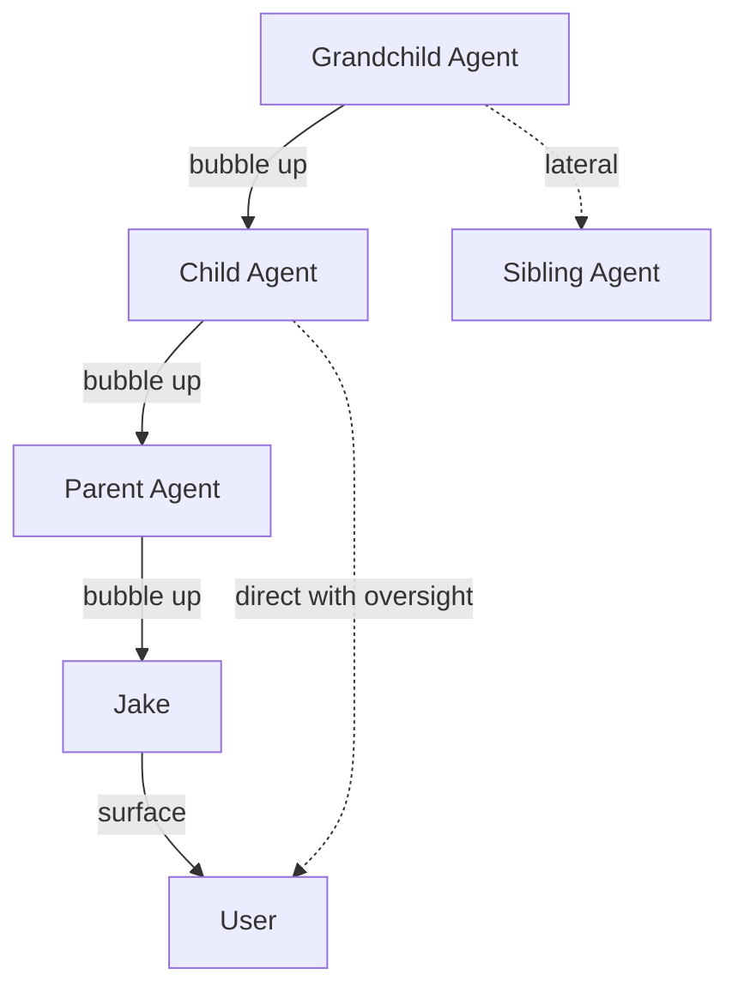

# 009 — Communication Specification

**Status:** complete
**Last Updated:** 2026-02-10

## Upstream References
- PRD: §5.3 (Bubbling), §5.5 (Question Triage)
- Reader: §9 (Agent Communication — message protocol, lateral collaboration, surfacing questions)
- Transcripts: transcript_2026-01-19-1144.md (bubbling concept)

## Downstream References
- ADR: --
- Code: Tavern/Sources/TavernCore/Chat/
- Tests: Tavern/Tests/TavernCoreTests/

---

## 1. Overview
Bubbling mechanism, question triage, and inter-agent communication. Defines how information flows through the agent hierarchy (upward, lateral, direct-to-user), how questions are classified and routed, and how agents collaborate through the shared workspace.

## 2. Requirements

### REQ-COM-001: Upward Bubbling
**Source:** PRD §5.3
**Priority:** must-have
**Status:** specified

**Properties:**
- Agents can escalate questions and information upward through the agent hierarchy: child → parent → grandparent → user
- Each level in the hierarchy can handle, transform, or pass through the message
- Jake is the final relay before the user
- Messages are never lost in transit — a message either reaches its destination or the sender is notified of delivery failure

**Testable assertion:** A message from a grandchild agent can reach the user through the parent and grandparent chain. Each intermediary receives the message and can either handle it or forward it upward.

### REQ-COM-002: Lateral Communication
**Source:** PRD §5.3
**Priority:** should-have
**Status:** specified

**Properties:**
- Sibling agents (children of the same parent) can exchange messages directly
- Lateral communication does not require routing through the parent
- The parent retains visibility into lateral communication (can observe, but is not a relay)

**Testable assertion:** Two agents with the same parent can exchange messages directly. Messages are delivered without passing through the parent agent.

### REQ-COM-003: Direct-to-User Communication
**Source:** PRD §5.3
**Priority:** should-have
**Status:** specified

**Properties:**
- Agents can communicate directly with the user, bypassing the normal bubbling chain
- Parent agents maintain visibility into direct communication (notified that it occurred)
- Direct communication requires oversight — it is not invisible to the hierarchy

**Testable assertion:** An agent can send a message directly to the user. The parent agent is notified (or can observe) that direct communication occurred.

### REQ-COM-004: Question Classification
**Source:** PRD §5.5
**Priority:** must-have
**Status:** specified

**Properties:**
- Every question from an agent is classified as quick or deep before being surfaced
- Quick questions can be answered without reading agent state; deep questions require context
- The classification is conveyed in the notification so the user knows what they're getting into before engaging

**Testable assertion:** Questions surfaced to the user include a complexity classification. The classification is determined before the notification is shown, not after the user opens the conversation.

### REQ-COM-005: Parent-Controlled Notification Mode
**Source:** PRD §5.5
**Priority:** should-have
**Status:** specified

**Properties:**
- Parent agents choose the notification approach for their children's questions: close collaboration (per-question popup) or overseer mode (periodic summary)
- The user can override the parent's choice at any time
- The notification mode affects presentation only — it does not change which questions are surfaced

**Testable assertion:** A parent agent can configure its children's notification mode. Children's questions are surfaced according to the configured mode. The user can change the mode at any time.

### REQ-COM-006: Message Protocol Expectations
**Source:** Reader §9 (Message Protocol)
**Priority:** must-have
**Status:** specified

**Properties:**
- Each message type has a defined expected response type
- A wrong or missing response within a timeout is a signal of agent malfunction
- The protocol is symmetric: for every message type X, the expected response type is known at design time

**Testable assertion:** Each message type has a defined expected response type. An agent that responds with the wrong type or fails to respond within a timeout triggers a malfunction signal.

### REQ-COM-007: Discovery Sharing
**Source:** PRD §9.3 (also referenced in observability)
**Priority:** should-have
**Status:** specified

**Properties:**
- Agent system prompts include instructions to notice oddities and report discoveries
- Discovery sharing is prompt-engineering-based (not deterministically enforceable)
- Discovery messages are delivered to parent agents without interrupting the agent's main task

**Testable assertion:** Agent system prompts include instructions to report discoveries. Discovery messages are delivered to parent agents. (Cannot deterministically verify agent compliance — prompt-based.)

### REQ-COM-008: Jake as Communication Hub
**Source:** PRD §5.3, Reader §3
**Priority:** must-have
**Status:** specified

**Properties:**
- Jake has awareness of all agents and their states (hibernating, unfinished, backlogged)
- Jake proactively suggests that the user zoom into agents when their attention is needed
- Jake coordinates cross-tree communication

**Testable assertion:** Jake can enumerate all agents and their states. Jake generates suggestions for user attention based on agent state. Suggestions are surfaced through the chat interface.

## 3. Properties Summary

### Communication Routing Properties

| Property | Holds When | Violated When |
|----------|-----------|---------------|
| Message delivery | Every message reaches its destination or sender is notified of failure | Message silently lost in transit |
| Hierarchy respect | Upward bubbling follows parent chain | Message skips levels without explicit direct-to-user mode |
| Lateral independence | Sibling messages don't route through parent | Parent is a required relay for lateral messages |
| Parent visibility | Parent can observe all child communication (bubbled, lateral, direct) | Child communicates invisibly to parent |
| Classification before display | User knows question complexity before engaging | Classification determined after user opens conversation |

### Communication Directions

Solid lines = upward bubbling. Dashed = lateral and direct.

## 4. Open Questions

- **?5 -- Bubbling Up Process:** Exactly how does bubbling work? Does the child ask the parent who decides to escalate? Can messages skip levels? Is there prioritization between bubbling messages?

- **Message protocol specifics:** PRD §14 lists this as TBD. What are the concrete message types and their expected responses?

- **Lateral communication routing:** How do siblings discover each other? Through the parent? Through the doc store? Through a registry?

## 5. Coverage Gaps

- **Message delivery guarantees:** No specification for what happens when a message cannot be delivered (agent died, busy, out of context). Is there retry logic? Dead-letter handling?

- **Communication rate limiting:** No specification for preventing message floods between agents. A chatty agent could overwhelm its parent with bubbled questions.

- **Privacy/scoping:** No specification for whether agents can read messages not addressed to them. The shared workspace pattern suggests all agents can see everything, but this may not be desirable for all message types.
