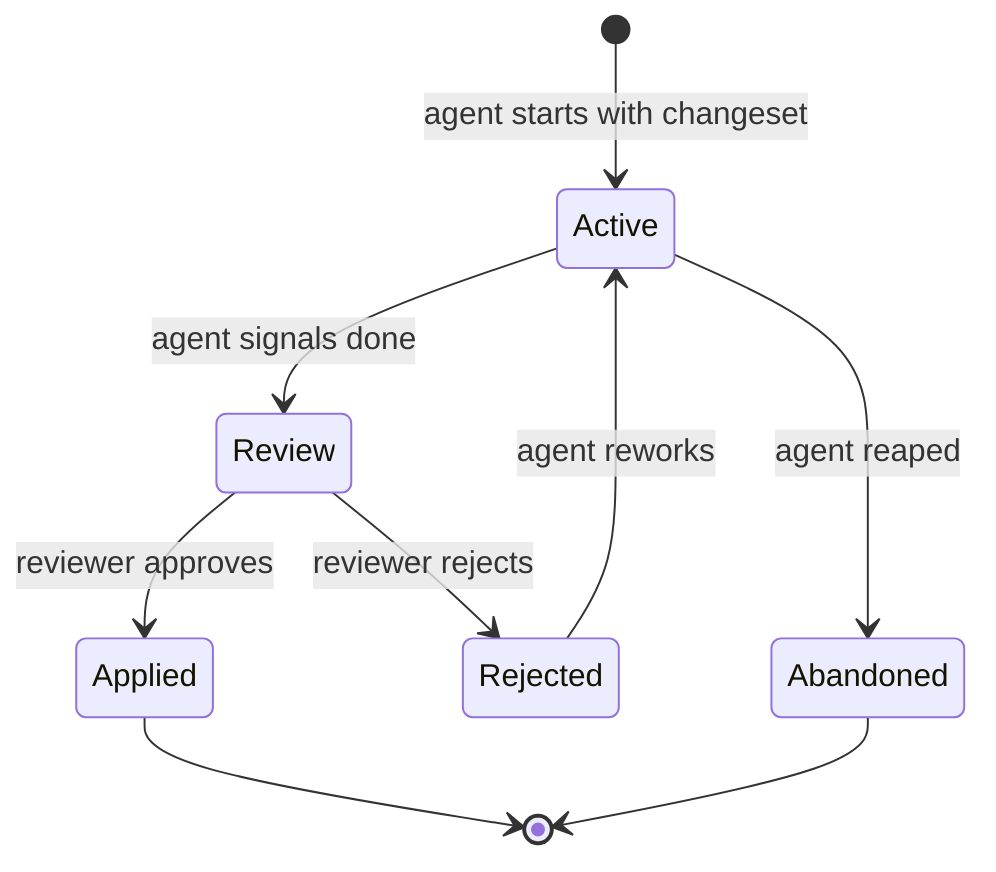

# 011 — Sandbox Specification

**Status:** complete
**Last Updated:** 2026-02-10

## Upstream References
- PRD: §4.6 (Sandbox Primitives), §6.4 (Preflight Checks)
- Reader: §6 (Sandbox and Isolation -- five primitives, preflight checks)
- Transcripts: transcript_2026-01-19-1144.md (sandbox primitives, changeset concept)

## Downstream References
- ADR: --
- Code: Not yet implemented (deferred for v1)
- Tests: --

---

## 1. Overview
Sandbox primitives for file protection, preflight checks, and the changeset model. Defines the five orthogonal isolation primitives, how agents are validated before starting, and how file mutations are managed through overlay-based changesets. Most sandbox features are deferred for post-v1.

## 2. Requirements

### REQ-SBX-001: Five Sandbox Primitives
**Source:** PRD §4.6
**Priority:** must-have (architecture), deferred (implementation)
**Status:** specified

**Properties:**
- Five orthogonal primitives exist: Changeset, Platform, Isolation, Outputs, Software
- Primitives are orthogonal — any combination is valid; no primitive depends on another
- Parent picks settings at spawn time per agent
- Changeset: overlay filesystem protecting originals; the diff between original and overlay
- Platform: where the agent runs (Mac, container, cloud, hybrid)
- Isolation: VMs, containers, OS-level sandboxes — agent can trash its environment and be reaped
- Outputs: network access control per agent
- Software: OS choice (macOS, Linux, FreeBSD, etc.)

**Testable assertion:** Architecture supports specifying each primitive independently per agent spawn. Primitives do not depend on each other (orthogonal). (Implementation deferred for v1 — agents work on actual files.)

### REQ-SBX-002: Changeset as Diff
**Source:** PRD §4.6
**Priority:** deferred
**Status:** specified

**Properties:**
- A changeset is the diff between the original files and the overlay
- Original files remain untouched until the changeset is explicitly applied (REQ-INV-008)
- Another agent can review the changeset independently before application
- Application is an explicit, irreversible action

**Testable assertion:** Deferred. When implemented: a changeset can be extracted as a diff. The diff is reviewable. Applying the diff modifies original files. Before application, original files are untouched.

### REQ-SBX-003: Source Control Orthogonality
**Source:** PRD §4.6, Reader §6
**Priority:** must-have (design), deferred (implementation)
**Status:** specified

**Properties:**
- The changeset system does not depend on git
- Changesets work in non-git directories and can span multiple repositories
- The system does not use git worktrees for agent isolation

**Testable assertion:** The changeset system does not depend on git. An agent working in a non-git directory can still use changesets. Changesets can span multiple repositories.

### REQ-SBX-004: Preflight Checks
**Source:** PRD §6.4
**Priority:** must-have
**Status:** specified

**Properties:**
- Before an agent begins autonomous work, preflight checks verify: sandbox configured correctly, resource access available, no permissions prompts expected, external accounts authenticated
- Preflight failure prevents the agent from starting — the parent receives the specific failure reason
- Preflight is binary: pass or fail, no degraded mode (REQ-SBX-005)

**Testable assertion:** A preflight check that fails prevents the agent from starting. The parent receives a notification with the failure reason. An agent that passes preflight starts normally.

### REQ-SBX-005: Preflight Fail-Fast
**Source:** PRD §6.4
**Priority:** must-have
**Status:** specified

**Properties:**
- Preflight is all-or-nothing — a single failure aborts the entire spawn
- No partial capability mode exists
- The agent is never created in a degraded state

**Testable assertion:** A single preflight failure aborts the spawn regardless of other checks passing. No partial capability mode exists.

### REQ-SBX-006: Platform Configuration
**Source:** PRD §4.6
**Priority:** deferred
**Status:** specified

**Properties:**
- Agents can run on different platforms: Mac (local), container (Docker), cloud (remote), hybrid (cloud agent + local app via protocol)
- Platform is configured at spawn time

**Testable assertion:** Deferred. When implemented: an agent can be spawned with a platform specification. The agent runs on the specified platform.

### REQ-SBX-007: Isolation Levels
**Source:** PRD §4.6
**Priority:** deferred
**Status:** specified

**Properties:**
- Multiple isolation levels available: VMs, containers, OS-level sandboxes
- An agent in isolation can trash its environment without affecting the host
- The environment can be reaped and recreated cleanly
- Isolation contains leaked writes (e.g., tools that access `~/.uv`)

**Testable assertion:** Deferred. When implemented: an agent in container isolation cannot modify host files. Destroying and recreating the container produces a clean environment.

### REQ-SBX-008: Output Control
**Source:** PRD §4.6
**Priority:** deferred
**Status:** specified

**Properties:**
- Network access is configurable per agent
- An agent with no network access cannot make outbound connections
- An agent with host-restricted access can reach only those hosts

**Testable assertion:** Deferred. When implemented: an agent with network disabled fails on outbound connection attempts. An agent with specific allowed hosts can reach only those hosts.

## 3. Properties Summary

### Sandbox Primitive Orthogonality

| Primitive | Controls | Independent Of |
|-----------|---------|----------------|
| Changeset | File mutation isolation | Platform, Isolation, Outputs, Software |
| Platform | Execution environment | Changeset, Isolation, Outputs, Software |
| Isolation | Environment containment | Changeset, Platform, Outputs, Software |
| Outputs | Network access | Changeset, Platform, Isolation, Software |
| Software | Operating system | Changeset, Platform, Isolation, Outputs |

Any combination of these five primitives is valid.

### Preflight Properties

| Property | Holds When | Violated When |
|----------|-----------|---------------|
| Fail-fast | One failure aborts entire spawn | Agent starts despite a failing check |
| Binary outcome | Pass or fail, nothing in between | Agent starts in degraded mode |
| Parent notification | Parent receives specific failure reason | Spawn fails silently |
| No partial start | Agent never created in incomplete state | Agent exists but can't function |

### Changeset Lifecycle (Post-v1)

## 4. Open Questions

- **Changeset lifecycle specifics:** PRD §14 lists this as TBD ("Per environment flavor"). How long do changesets persist? What happens to unapplied changesets when the project closes?

- **Hybrid platform protocol:** For cloud agents communicating with the local macOS app, what protocol is used? gRPC? WebSocket? HTTP?

- **Isolation cost:** Container and VM isolation have startup costs. How does this interact with the "fast test execution" requirement (REQ-QA-004)?

## 5. Coverage Gaps

- **Changeset merge conflicts:** When two agents have overlapping changesets, how are conflicts resolved? Serial merge queue (REQ-WRK-006) reduces but does not eliminate this.

- **Sandbox escape detection:** No specification for detecting when an agent escapes its sandbox boundary (other than violation monitoring, REQ-OBS-005).

- **Resource limits per sandbox:** No specification for CPU, memory, or disk limits within a sandboxed environment.
