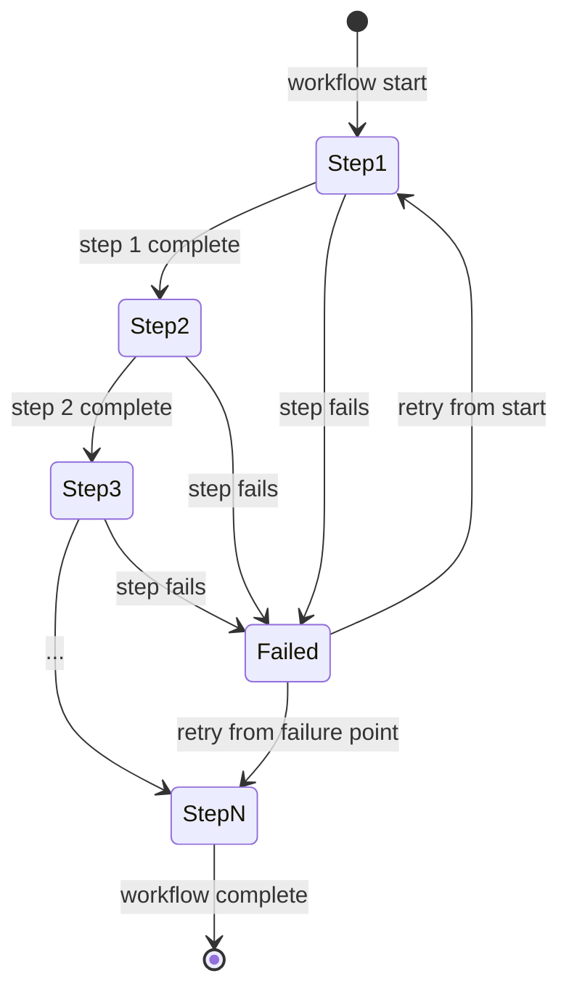
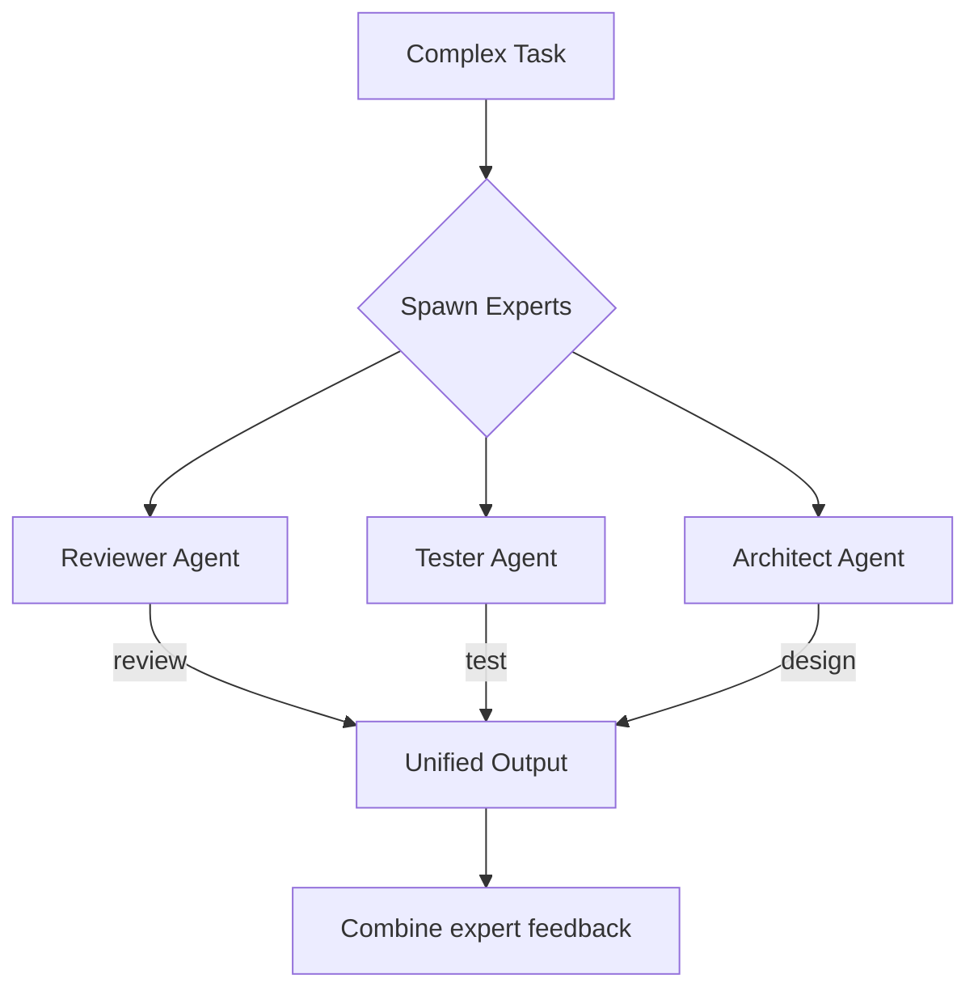
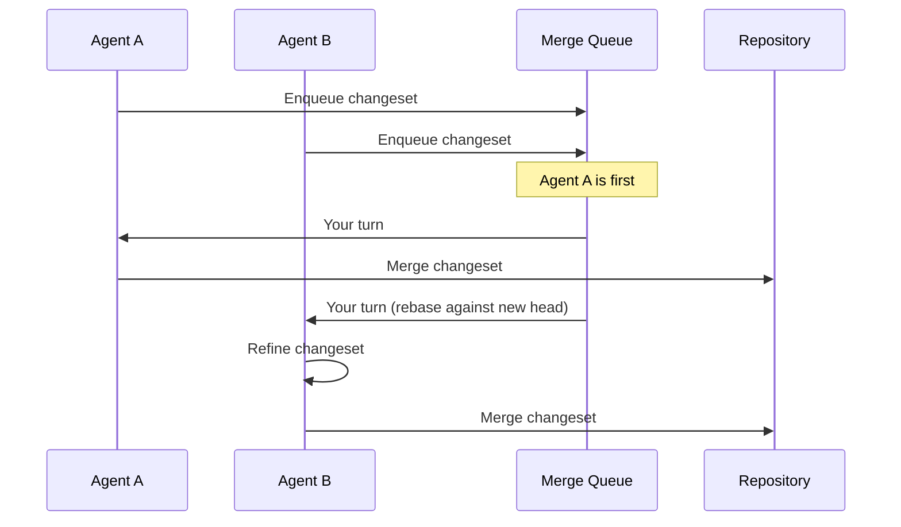
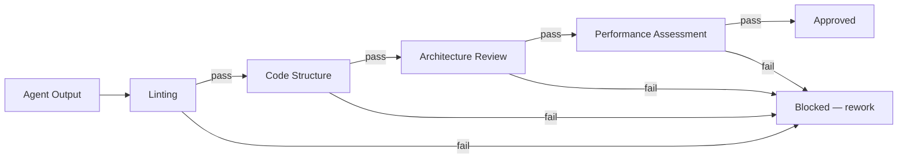

# 012 — Workflows Specification

**Status:** complete
**Last Updated:** 2026-02-16

## Upstream References
- PRD: §10 (Workflows), §9.1 (Starter Templates), §11 (Gang of Experts), §6.5 (Merge Queue)
- Reader: §7 (Workflow Engine, Spec Engine, Starter Workflows)
- Transcripts: --

## Downstream References
- ADR: --
- Code: Not yet implemented
- Tests: --

---

## 1. Overview
Workflow engine, starter templates, gang of experts pattern, and merge queue. Most of this module is deferred for post-v1, but the specifications are captured here for architectural planning and future implementation.

## 2. Requirements

### REQ-WRK-001: Workflow as State Machine
**Source:** PRD §10, Reader §7
**Priority:** deferred
**Status:** specified

**Properties:**
- A workflow is a state machine with defined states and transitions
- The workflow engine prevents invalid transitions
- Incomplete steps are surfaced (not silently skipped)
- Status is visible for long-running workflows

**Testable assertion:** Deferred. When implemented: a workflow can be defined as a set of states and transitions. The engine prevents invalid transitions. Incomplete steps are surfaced.

<!-- DROPPED: example of a workflow, not a spec requirement -->
### REQ-WRK-002: Rule of Five Template
**Source:** PRD §9.1
**Priority:** deferred
**Status:** specified

**Properties:**
- Five sequential agent passes over a single output from an initial prompt
- Each pass receives the previous pass's output and refines it
- The template is user-modifiable

**Testable assertion:** Deferred. When implemented: the Rule of 5 template spawns 5 sequential agents. Each agent receives the previous agent's output. The final output reflects 5 passes of refinement.

<!-- DROPPED: example of a workflow, not a spec requirement -->
### REQ-WRK-003: Verification Layers Template
**Source:** PRD §9.1
**Priority:** deferred
**Status:** specified

**Properties:**
- Ordered verification stages: linting → code structure → architecture review → performance assessment
- Each stage is pass/fail
- A failure at any stage blocks progression to the next

**Testable assertion:** Deferred. When implemented: the template defines ordered verification stages. Each stage must pass before the next begins. A failure at any stage blocks progression.

### REQ-WRK-004: User-Modifiable Templates
**Source:** PRD §9.1
**Priority:** deferred
**Status:** specified

**Properties:**
- Users can edit template definitions
- Agents can propose new templates (creative meta process)
- Templates persist in `.tavern/` directory

**Testable assertion:** Deferred. When implemented: users can edit template definitions. New templates can be created and saved. Templates persist in `.tavern/`.

<!-- DROPPED: Gang of Experts is a natural part of workflows, not a standalone requirement -->
### REQ-WRK-005: Gang of Experts
**Source:** PRD §11
**Priority:** deferred
**Status:** specified

**Properties:**
- Expert roles (Reviewer, Tester, Architect) are specialized prompts applied to agents, not persistent entities
- "Pull in the reviewer" = spawn an agent with reviewer instructions
- Expert prompts are user-customizable

**Testable assertion:** Deferred. When implemented: spawning an agent with an expert role applies the corresponding specialized prompt. Users can customize the prompt for each expert type.

### REQ-WRK-006: Merge Queue
**Source:** PRD §6.5
**Priority:** deferred
**Status:** specified

**Note:** This should be built on top of the workflow engine (REQ-WRK-001).

**Properties:**
- Changesets merge serially, not in parallel
- Queue order is visible to all queued agents
- Agents can refine their changes against the predictable merge target (what's ahead in the queue)
- Serial merging reduces conflicts compared to parallel merges

**Testable assertion:** Deferred. When implemented: agents can enqueue changesets. Queue order is visible. Merges happen serially. Conflicts are reduced compared to parallel merges.

### REQ-WRK-007: Spec Engine
**Source:** Reader §7 (Spec Engine)
**Priority:** deferred
**Status:** specified

**Properties:**
- Completed output is verified against the specification
- All required tasks are verified as complete (holistic check)

**Testable assertion:** Deferred. When implemented: the spec engine can compare agent output against a specification. Task completion is verified holistically.

### REQ-WRK-008: Workflow Composability
**Source:** Reader §7 (Workflow Engine)
**Priority:** deferred
**Status:** specified

**Properties:**
- Workflows can nest (a workflow can be a step in another workflow)
- Circular dependencies are prevented
- Composition does not break individual workflow guarantees

**Testable assertion:** Deferred. When implemented: workflows can nest and compose without circular dependencies.

### REQ-WRK-009: Workflow Engine
**Source:** Reader §7 (Workflow Engine)
**Priority:** deferred
**Status:** specified

**Properties:**
- A deterministic state machine runner for workflow steps
- The engine executes workflow state machines, preventing invalid transitions
- Workflows can contain other workflows as steps (Turing complete, no termination guarantee)

**Testable assertion:** Deferred. When implemented: the workflow engine executes state machines. Invalid transitions are prevented. Workflows can contain other workflows as steps.

### REQ-WRK-010: Workflow Recovery
**Source:** Reader §7 (Workflow Engine)
**Priority:** deferred
**Status:** specified

**Properties:**
- Define recovery process at different workflow points: start over, hard fail, go to a recovery stage
- Each workflow step has a defined recovery behavior on failure

**Testable assertion:** Deferred. When implemented: each workflow step has a defined recovery behavior. On failure, the system executes the defined recovery (restart, hard fail, or recovery stage).

## 3. Properties Summary

### Workflow Properties (Deferred)

| Property | Holds When | Violated When |
|----------|-----------|---------------|
| State machine validity | Only valid transitions occur | Workflow skips or repeats states |
| Stage gating | Failed stage blocks progression | Output passes despite stage failure |
| Serial merge | Changesets merge one at a time | Parallel merge produces conflicts |
| Composability | Nested workflows maintain their guarantees | Nesting breaks inner workflow |

### Workflow State Machine (Conceptual)

```mermaid
stateDiagram-v2
    [*] --> Step1 : workflow start
    Step1 --> Step2 : step 1 complete
    Step2 --> Step3 : step 2 complete
    Step3 --> StepN : ...
    StepN --> [*] : workflow complete

    Step1 --> Failed : step fails
    Step2 --> Failed : step fails
    Step3 --> Failed : step fails

    Failed --> Step1 : retry from start
    Failed --> StepN : retry from failure point
```

## 4. Example Workflows

These sketches illustrate what good workflows look like. They are examples of what the workflow system must support, not specifications of internal mechanics.

### Gang of Experts

A complex task is farmed out to specialized expert agents working in parallel. Each expert contributes their domain perspective, and results are combined into unified feedback.

```mermaid
flowchart TD
    Task[Complex Task] --> Spawn{Spawn Experts}
    Spawn --> R[Reviewer Agent]
    Spawn --> T[Tester Agent]
    Spawn --> A[Architect Agent]

    R -->|review| Output[Unified Output]
    T -->|test| Output
    A -->|design| Output

    Output --> Merge[Combine expert feedback]
```

### Merge Queue

When multiple agents produce changesets against the same codebase, they queue up and merge serially. Each agent can see what's ahead and refine against the predictable target.

```mermaid
sequenceDiagram
    participant A as Agent A
    participant B as Agent B
    participant Q as Merge Queue
    participant Repo as Repository

    A->>Q: Enqueue changeset
    B->>Q: Enqueue changeset
    Note over Q: Agent A is first
    Q->>A: Your turn
    A->>Repo: Merge changeset
    Q->>B: Your turn (rebase against new head)
    B->>B: Refine changeset
    B->>Repo: Merge changeset
```

### Verification Layers

Output passes through ordered gates. Each gate is an agent or tool with pass/fail semantics. Failure at any stage blocks progression.

```mermaid
flowchart LR
    Input[Agent Output] --> Lint[Linting]
    Lint -->|pass| Structure[Code Structure]
    Structure -->|pass| Arch[Architecture Review]
    Arch -->|pass| Perf[Performance Assessment]
    Perf -->|pass| Done[Approved]

    Lint -->|fail| Block[Blocked — rework]
    Structure -->|fail| Block
    Arch -->|fail| Block
    Perf -->|fail| Block
```

## 5. Open Questions

- **Workflow composability:** Resolved: Workflows can contain workflows. Turing complete, no termination guarantee.

- **Template format:** Pinned: Potential ADR. See pinned items.

- **Expert prompt management:** Resolved: Dropped as standalone concept — natural part of workflows.

## 6. Coverage Gaps

- **Workflow failure recovery:** Now covered by REQ-WRK-010.

- **Merge conflict resolution:** See merge queue (REQ-WRK-006).
