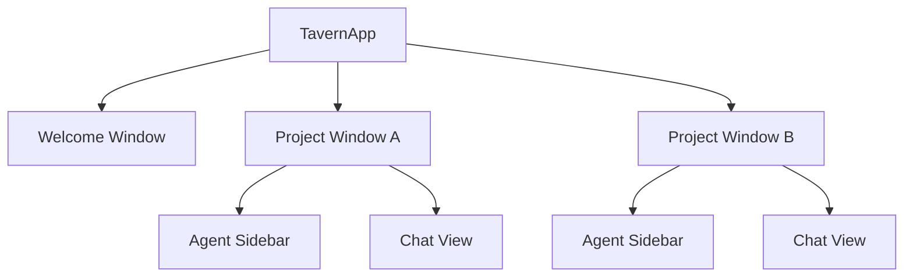

# 013 — User Experience Specification

**Status:** complete
**Last Updated:** 2026-02-10

## Upstream References
- PRD: §5.1 (The Core Loop), §5.4 (UI Principles), §8 (Progressive Unlocks), §8.1 (Concept), §8.2 (Open Questions)
- Reader: §4 (User Flow), §8 (UI Concepts — content blocks, chat header, multi-window)
- Transcripts: transcript_2026-01-19-1144.md (core loop), transcript_2026-01-22-0015.md (project-as-document, multi-window), transcript_2026-01-27-testing-principles.md (sidebar, chat description), transcript_2026-01-28-jake-spawn-tool.md (chat header)

## Downstream References
- ADR: --
- Code: Tavern/Sources/Tavern/ (TavernApp.swift, Views/), Tavern/Sources/TavernCore/UI/, Tavern/Sources/TavernCore/Project/
- Tests: Tavern/Tests/TavernTests/, Tavern/Tests/TavernUITests/

---

## 1. Overview
Core user loop, UI principles, progressive unlocks, and the project-as-document model. Defines the primary interaction pattern between users and the system, how the UI is organized, and how capabilities are revealed progressively as users engage.

## 2. Requirements

### REQ-UX-001: Fresh Project Entry
**Source:** PRD §5.1
**Priority:** must-have
**Status:** specified

**Properties:**
- A project with no history shows only Jake's chat box — no other agents, panels, or UI clutter
- Jake is the single entry point for all new interaction
- The user describes what they need; Jake coordinates from there

**Testable assertion:** Opening a project with no prior sessions shows a single chat interface for Jake. No other agents or panels are visible.

### REQ-UX-002: Task-as-Chat
**Source:** PRD §5.1
**Priority:** must-have
**Status:** specified

**Properties:**
- Every task has dual representation: a todo item (sidebar entry) AND a chat interface
- Every spawned agent is accessible through both representations
- The dashboard shows all open tasks; the user can drill into any agent

**Testable assertion:** Every spawned agent appears in both the agent list (sidebar) and has an associated chat view. Clicking an agent in the sidebar opens its chat.

### REQ-UX-003: Agent Sidebar
**Source:** PRD §5.1, Reader §4
**Priority:** must-have
**Status:** specified

**Properties:**
- The sidebar displays all agents for the current project
- Each entry shows the agent's name, status, and chat description
- Jake is always present at the top
- Selecting an agent shows its chat

**Testable assertion:** The sidebar lists all live agents. Jake always appears. Clicking an agent selects it and shows its chat. Agent status (working, waiting, done) is visible in the sidebar.

### REQ-UX-004: No Unsolicited Content
**Source:** PRD §5.4
**Priority:** must-have
**Status:** specified

**Properties:**
- No window, sheet, or modal appears without user-initiated action
- Notifications are passive indicators only (badge counts, sidebar indicators)
- The user's current view is never replaced without their action
- Agents surface questions via passive notifications, not by stealing focus

**Testable assertion:** No UI transition or content display occurs without user-initiated action (click, keyboard shortcut, or explicit preference). Notifications are passive (badges, bubbles), never modal interruptions.

### REQ-UX-005: Stream Separation
**Source:** PRD §5.4
**Priority:** should-have
**Status:** specified

**Properties:**
- Different content block types (thinking, tool use, code, chat text) have distinct visual treatments
- A dedicated "chat only" view mode exists that shows just the conversation
- Other streams (thinking, tools) are displayed alongside but visually distinct

**Testable assertion:** Different content block types render with distinct visual styles. A "chat only" view mode exists that hides non-chat blocks.

### REQ-UX-006: Content Block Rendering
**Source:** Reader §8 (Content Block Rendering)
**Priority:** must-have
**Status:** specified

**Properties:**
- Claude's responses include a `content` array with typed blocks: `text`, `tool_use`, `tool_result`, `thinking`, `web_search_result`
- Each block type has its own visual style (colored avatars, styled boxes)
- `tool_use` displays tool name and parameters
- `tool_result` displays success/error state

**Testable assertion:** Each block type renders with a distinct visual treatment. Tool use shows tool name and parameters. Tool results show success/error state.

### REQ-UX-007: Project-as-Document
**Source:** Reader §4 (Project-as-Document)
**Priority:** must-have
**Status:** specified

**Properties:**
- The app is document-based where the "document" is the project directory
- Any directory can be opened as a project, like Claude CLI
- Standard macOS document trappings: File > Open, Open Recent, Dock icon menus, drag-to-open
- State restores on app relaunch

**Testable assertion:** The app opens via File > Open (directory picker). Recent projects appear in Open Recent menu. Drag-and-drop a directory onto the Dock icon opens it. Open projects restore on app relaunch.

### REQ-UX-008: Multi-Window Support
**Source:** Reader §4 (Multi-Window Support)
**Priority:** must-have
**Status:** specified

**Properties:**
- Each open project gets a separate window
- Multiple projects can be open simultaneously with fully isolated state
- A welcome window shows recent projects
- Window positions and states restore after quit and relaunch

**Testable assertion:** Two projects can be open in two separate windows simultaneously. The welcome window lists recent projects. Window positions and states restore after quit and relaunch.

### REQ-UX-009: Chat Header
**Source:** Reader §8 (Chat Header)
**Priority:** must-have
**Status:** specified

**Properties:**
- Each chat view has a header showing the agent name
- A "New Conversation" button (compose icon `square.and.pencil`, matching Apple's convention) is present

**Testable assertion:** The chat header displays the agent name. The compose button is present and uses SF Symbol `square.and.pencil`.

### REQ-UX-010: Progressive Unlock Concept
**Source:** PRD §8.1
**Priority:** should-have
**Status:** specified

**Properties:**
- Content is revealed progressively based on user engagement (message count)
- Unlockable content includes: cogitating verbs, naming themes, Jake's vocabulary, easter eggs
- Unlocks feel organic, not gamified — Jake just starts using new words, no announcements or fanfare
- A new user sees a limited vocabulary; an engaged user sees the full range

**Testable assertion:** A new user sees a limited vocabulary. After N messages, additional vocabulary becomes available. Unlocks are not accompanied by notifications or announcements.

### REQ-UX-011: Progressive Unlock Open Questions
**Source:** PRD §8.2
**Priority:** deferred
**Status:** specified

These progressive unlock details are explicitly deferred: scope (per-project vs global), thresholds (linear vs milestone), persistence (where count is stored), reset behavior (prestige?).

**Testable assertion:** Deferred. Implementation details to be determined during development.

## 3. Properties Summary

### UI Invariants

| Property | Holds When | Violated When |
|----------|-----------|---------------|
| Fresh project = Jake only | No agents or panels visible on first open | UI shows agents/panels before user interacts |
| Dual representation | Every agent is in both sidebar and chat | Agent visible in one but not the other |
| No unsolicited content | All UI transitions require user action | Window/modal appears without user action |
| State restoration | Quit + relaunch restores everything | Layout, agents, or history lost on restart |
| Project isolation | Two open projects have completely independent state | Action in project A affects project B |

### Multi-Window Architecture

## 4. Open Questions

- **User consent UX for new chats:** PRD §14 lists this as TBD. When Jake spawns an agent, does a new chat tab appear automatically or does the user need to click to see it?

- **UI stream separation details:** PRD §14 lists this as TBD. How exactly are thinking/tool/code streams laid out relative to the chat stream? Expandable sections? Side panel? Tabs?

## 5. Coverage Gaps

- **Keyboard shortcuts:** No specification for keyboard navigation between agents, sending messages, or other common actions.

- **Accessibility:** No specification for VoiceOver, Dynamic Type, or other accessibility features.

- **Search:** No specification for searching across agent conversations or history.
