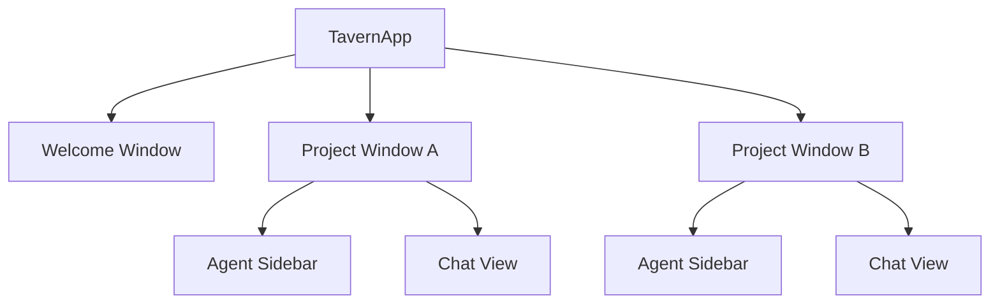

# 013 — User Experience Specification

**Status:** complete
**Last Updated:** 2026-02-16

## Upstream References
- PRD: §5.1 (The Core Loop), §5.4 (UI Principles), §8 (Progressive Unlocks), §8.1 (Concept), §8.2 (Open Questions)
- Reader: §4 (User Flow), §8 (UI Concepts — content blocks, chat header, multi-window)
- Transcripts: transcript_2026-01-19-1144.md (core loop), transcript_2026-01-22-0015.md (project-as-document, multi-window), transcript_2026-01-27-testing-principles.md (sidebar, chat description), transcript_2026-01-28-jake-spawn-tool.md (chat header)

## Downstream References
- ADR: --
- Code: Tavern/Sources/Tavern/ (TavernApp.swift, Views/), Tavern/Sources/TavernCore/UI/, Tavern/Sources/TavernCore/Project/
- Tests: Tavern/Tests/TavernTests/, Tavern/Tests/TavernUITests/

---

## 1. Overview
Core user loop, UI principles, progressive unlocks, and the project-as-document model. Defines the primary interaction pattern between users and the system, how the UI is organized, and how capabilities are revealed progressively as users engage.

## 2. Requirements

### REQ-UX-001: Fresh Project Entry
**Source:** PRD §5.1
**Priority:** must-have
**Status:** specified

**Properties:**
- A project with no history shows only Jake's chat box — no other agents, panels, or UI clutter
- Jake is the single entry point for all new interaction
- The user describes what they need; Jake coordinates from there

**Testable assertion:** Opening a project with no prior sessions shows a single chat interface for Jake. No other agents or panels are visible.

### REQ-UX-002: Task-as-Chat
**Source:** PRD §5.1
**Priority:** must-have
**Status:** specified

**Properties:**
- Each chat discussion with a servitor represents a task
- Child servitors represent subtasks
- This is conceptual — the representation elements (sidebar, tiles, etc.) are part of view architecture (§014)

**Testable assertion:** Each servitor has an associated chat discussion. Child servitors are conceptually subtasks of their parent's task.

### REQ-UX-003: Agent Discovery
**Source:** PRD §5.1, Reader §4
**Priority:** must-have
**Status:** specified

**Properties:**
- The system provides a way to find all active servitors
- Jake gets prominence
- The user can see what's going on — which servitors are working, waiting, or done

**Testable assertion:** All active servitors are discoverable. Jake is prominently displayed. Servitor status (working, waiting, done) is visible.

### REQ-UX-004: No Unsolicited Content
**Source:** PRD §5.4
**Priority:** must-have
**Status:** specified

**Properties:**
- No window, sheet, or modal appears without user-initiated action
- Notifications are passive indicators only (badge counts, sidebar indicators)
- The user's current view is never replaced without their action
- Agents surface questions via passive notifications, not by stealing focus

**Testable assertion:** No UI transition or content display occurs without user-initiated action (click, keyboard shortcut, or explicit preference). Notifications are passive (badges, bubbles), never modal interruptions.

### REQ-UX-005: Stream Separation
**Source:** PRD §5.4
**Priority:** should-have
**Status:** specified

**Properties:**
- Different content block types (thinking, tool use, code, chat text) have distinct visual treatments
- A chat-only view is possible by hiding all other content blocks (thinking, tool use, etc.)

**Testable assertion:** Different content block types render with distinct visual styles. A chat-only view mode exists that hides non-chat blocks.

### REQ-UX-006: Content Block Rendering
**Source:** Reader §8 (Content Block Rendering)
**Priority:** must-have
**Status:** specified

**Properties:**
- Claude's responses include a `content` array with typed blocks: `text`, `tool_use`, `tool_result`, `thinking`, `web_search_result`
- Each block type has its own visual style (colored avatars, styled boxes)
- `tool_use` displays tool name and parameters
- `tool_result` displays success/error state

**Testable assertion:** Each block type renders with a distinct visual treatment. Tool use shows tool name and parameters. Tool results show success/error state.

### REQ-UX-007: Project-as-Document
**Source:** Reader §4 (Project-as-Document)
**Priority:** must-have
**Status:** specified

**Properties:**
- The project IS the directory
- A .project file may exist in the root (possibly a file bundle like Xcode's), but that document isn't the project itself
- Any directory can be opened as a project, like Claude CLI
- Standard macOS document trappings: File > Open, Open Recent, Dock icon menus, drag-to-open
- State restores on app relaunch

**Testable assertion:** The app opens via File > Open (directory picker). Recent projects appear in Open Recent menu. Drag-and-drop a directory onto the Dock icon opens it. Open projects restore on app relaunch.

### REQ-UX-008: Multi-Window Support
**Source:** Reader §4 (Multi-Window Support)
**Priority:** must-have
**Status:** specified

**Properties:**
- Each open project gets a separate window
- Multiple projects can be open simultaneously with fully isolated state
- A welcome window shows recent projects
- Window positions and states restore after quit and relaunch

**Testable assertion:** Two projects can be open in two separate windows simultaneously. The welcome window lists recent projects. Window positions and states restore after quit and relaunch.

### REQ-UX-009: Chat Controls
**Source:** Reader §8 (Chat Header)
**Priority:** must-have
**Status:** specified

**Properties:**
- List of controls needed around a chat window without prescribing specific UI layout
- Controls include: agent name display, conversation management (new conversation), status indicators, and tools appropriate to the context

**Testable assertion:** Chat views include agent name display, conversation management controls, and status indicators.

### REQ-UX-010: Progressive Unlock Concept
**Source:** PRD §8.1
**Priority:** should-have
**Status:** specified

**Properties:**
- Content is revealed progressively based on user engagement (message count)
- Unlockable content includes: cogitating verbs, naming themes, Jake's vocabulary, easter eggs
- Unlocks feel organic, not gamified — Jake just starts using new words, no announcements or fanfare
- A new user sees a limited vocabulary; an engaged user sees the full range

**Testable assertion:** A new user sees a limited vocabulary. After N messages, additional vocabulary becomes available. Unlocks are not accompanied by notifications or announcements.

<!-- DROPPED: not a requirement, progressive unlock details are implementation decisions -->
### REQ-UX-011: Progressive Unlock Open Questions
**Source:** PRD §8.2
**Priority:** deferred
**Status:** specified

These progressive unlock details are explicitly deferred: scope (per-project vs global), thresholds (linear vs milestone), persistence (where count is stored), reset behavior (prestige?).

**Testable assertion:** Deferred. Implementation details to be determined during development.

### REQ-UX-012: Three-Choice Consent Pattern
**Source:** Design discussion
**Priority:** should-have
**Status:** specified

**Properties:**
- For certain actions, the app offers a yes/no/always pattern
- User can opt in to having actions happen automatically
- This must be user-configurable
- Applies to actions like new window creation, focus changes, etc.

**Testable assertion:** Actions requiring consent present yes/no/always options. Selecting "always" persists the preference. The preference is user-configurable and reversible.

## 3. Properties Summary

### UI Invariants

| Property | Holds When | Violated When |
|----------|-----------|---------------|
| Fresh project = Jake only | No agents or panels visible on first open | UI shows agents/panels before user interacts |
| No unsolicited content | All UI transitions require user action | Window/modal appears without user action |
| State restoration | Quit + relaunch restores everything | Layout, agents, or history lost on restart |
| Project isolation | Two open projects have completely independent state | Action in project A affects project B |

### Multi-Window Architecture

```mermaid
flowchart TD
    App[TavernApp] --> Welcome[Welcome Window]
    App --> PW1[Project Window A]
    App --> PW2[Project Window B]

    PW1 --> Sidebar1[Agent Sidebar]
    PW1 --> Chat1[Chat View]
    PW2 --> Sidebar2[Agent Sidebar]
    PW2 --> Chat2[Chat View]
```

## 4. Open Questions

- **User consent UX for new chats:** Resolved: Three-choice consent pattern (yes/no/always). See REQ-UX-012.

- **UI stream separation details:** Resolved: View architecture concern. See §014.

- **Keyboard shortcuts:** Resolved: New spec module §023.

- **Accessibility:** Resolved: New spec module §024.

- **Search:** Resolved: New spec module §025.

## 5. Coverage Gaps

- **Keyboard shortcuts:** Resolved: See §023 Keyboard Shortcuts.

- **Accessibility:** Resolved: See §024 Accessibility.

- **Search:** Resolved: See §025 Search.
