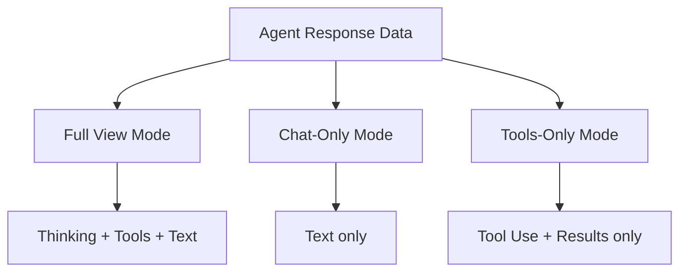

# 014 — View Architecture Specification

**Status:** complete
**Last Updated:** 2026-02-10

## Upstream References
- PRD: (none directly -- derived from Reader and transcripts)
- Reader: §8 (UI Concepts -- dynamic views, tiles, view modes, context cards, agent layout tools, persistence)
- Transcripts: transcript_2026-01-21-2345.md (dynamic view architecture), transcript_2026-01-22-0730-view-architecture.md (view architecture deep dive)

## Downstream References
- ADR: ADR-001-shape-selection.md (Shape A: Reactive Streams)
- Code: Tavern/Sources/Tavern/Views/ (partial implementation)
- Tests: Tavern/Tests/TavernUITests/ (partial)

---

## 1. Overview
View architecture for the dynamic tile-based UI, view modes, context cards, and agent layout tools. Derived primarily from seed design sessions rather than the PRD, this spec covers how the UI dynamically composes views, supports multiple presentations of the same data, and manages agent-driven layout.

## 2. Requirements

### REQ-VIW-001: Composable View Surface
**Source:** Reader §8
**Priority:** should-have
**Status:** specified

**Properties:**
- The view layer is a composable surface, not a fixed hierarchy
- Both the user and agents can reshape the layout
- Tiles live within windows; windows serve as macOS-level escape hatches when tiling is insufficient
- Multiple layout configurations can coexist

**See also:** §3.2.3 (thin UI / fat ViewModel principle)

**Testable assertion:** Views can be rearranged by the user. The layout is not hardcoded. Multiple layout configurations can coexist.

### REQ-VIW-002: View Modes
**Source:** Reader §8
**Priority:** should-have
**Status:** specified

**Properties:**
- The same agent data can be rendered in multiple view modes (like Finder's list/icon/column views)
- Switching view modes does not lose data
- Two tiles showing the same agent in different modes stay in sync
- The response stream (thinking, tools, text) stays in one place; view modes select which parts to show

**Testable assertion:** The same agent's data can be rendered in at least two different view modes. Switching view modes does not lose data. Two tiles showing the same agent in different modes stay in sync.

### REQ-VIW-003: Granular View Primitives
**Source:** Reader §8
**Priority:** should-have
**Status:** specified

**Properties:**
- Chat components decompose into granular primitives: thinking, tool use, tool results, messages
- Each primitive can be displayed independently or combined
- Custom layouts can focus on specific aspects of an agent's work (e.g., "tools only" mode)

**See also:** §13.2.6 (content block types)

**Testable assertion:** Individual content block types (thinking, tool_use, text) can be shown or hidden independently. A "tools only" view mode shows only tool use and results.

### REQ-VIW-004: Agent Hierarchy View Independence
**Source:** Reader §8
**Priority:** should-have
**Status:** specified

**Properties:**
- The view structure is independent of the agent hierarchy
- The same agents can render as a tree view (parent-child relationships) or a flat list
- Erlang-style arbitrary depth does not constrain view layout

**Testable assertion:** The agent sidebar can show agents as a flat list or as a tree. Switching between tree and flat view does not change agent relationships.

### REQ-VIW-005: Dead Agent Bodies
**Source:** Reader §8
**Priority:** must-have
**Status:** specified

**Properties:**
- Dead agents leave persistent views showing their final state
- Dead agent views are accessible for review and debugging
- The user must manually dismiss dead agent views (initial cleanup is manual)

**Testable assertion:** After an agent dies, its view remains accessible. The view shows the agent's final state, last output, and status. The user must manually dismiss dead agent views.

### REQ-VIW-006: Layout Persistence
**Source:** Reader §8
**Priority:** should-have
**Status:** specified

**Properties:**
- Session restore is automatic: quitting and relaunching restores what was open
- Named layouts support two types: templates (abstract structure, no specific agent binding) and snapshots (specific agents, specific state)
- Users can save and load named layouts

**Testable assertion:** Quitting and relaunching the app restores the previous layout. Users can save and load named layout templates.

### REQ-VIW-007: Agent Layout Suggestions
**Source:** Reader §8
**Priority:** deferred
**Status:** specified

**Properties:**
- Agents can suggest layout changes (passive — user must accept)
- Suggestions do not modify the layout directly
- The user can auto-reject suggestions

**Testable assertion:** Deferred. When implemented: agents can create layout suggestions. Suggestions appear as non-intrusive UI elements. The user must explicitly accept a suggestion for the layout to change.

### REQ-VIW-008: Agent Layout Mutations
**Source:** Reader §8
**Priority:** deferred
**Status:** specified

**Properties:**
- With explicit user permission, agents can read and directly modify the layout
- Layout mutation is a separate permission tier from suggestions
- Agents without permission cannot modify layout

**Testable assertion:** Deferred. When implemented: agents with mutation permission can modify the layout. Agents without permission cannot. Permission is granted per-agent or per-session.

### REQ-VIW-009: Context Cards
**Source:** Reader §8
**Priority:** deferred
**Status:** specified

**Properties:**
- Each agent has a context card showing: name, current assignment, current status
- Context cards enable rapid context switching without reading full chat history
- Clicking a card navigates to the agent's chat

**Testable assertion:** Deferred. When implemented: each agent has a context card. The card shows name, assignment, and status. Clicking a card navigates to the agent's chat.

## 3. Properties Summary

### View Properties

| Property | Holds When | Violated When |
|----------|-----------|---------------|
| View-hierarchy independence | View layout is independent of agent tree | Agent hierarchy constrains view layout |
| Multi-mode sync | Two tiles of same agent in different modes stay in sync | Mode change desynchronizes tiles |
| Data preservation | Switching view modes doesn't lose data | Data disappears on mode switch |
| Dead body persistence | Dead agent views remain until manually dismissed | Dead agent views auto-disappear |
| Session restore | Quit + relaunch restores layout | Layout lost on restart |

### View Mode Concept

## 4. Open Questions

- **UI stream separation details:** PRD §14 lists this as TBD. The specific component-based chat view implementation is not yet designed.

- **Tile sizing and constraints:** No specification for minimum/maximum tile sizes, or how tiles share space when the window is resized.

- **Multi-monitor support:** No specification for whether tiles can be detached to separate windows on different monitors.

## 5. Coverage Gaps

- **Drag and drop:** No specification for drag-and-drop tile rearrangement. Is it supported? What are the valid drop targets?

- **Animation:** No specification for layout transition animations when tiles are added, removed, or rearranged.

- **Responsive layout:** No specification for how the layout adapts to very small or very large window sizes.
