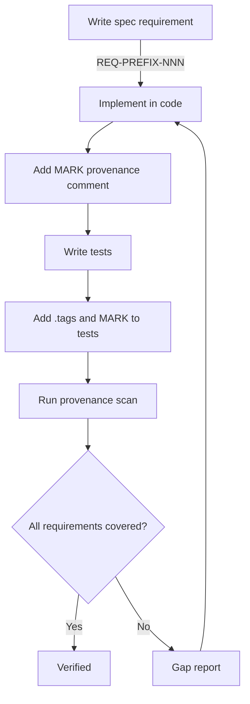

# 018 — Spec Fidelity

**Status:** complete
**Last Updated:** 2026-02-14

## Upstream References
- PRD: §19.4 (Completeness and Correctness Standards)
- PRD: §2 (Invariants — specifically Invariant #3: Commitments must be verified independently)
- Reader: §8 (Commitment Verification)

## Downstream References
- ADR: ADR-007 (Provenance Tracking)
- Code: `// MARK: - Provenance:` comments in Tavern/Sources/
- Tests: `.tags()` with requirement-derived tags in Tavern/Tests/

---

## 1. Overview

This module specifies the provenance tracking system that makes completeness and correctness verifiable questions rather than guesses. Every requirement traces forward to code and tests; every piece of code traces backward to the requirement it satisfies. The self-verification principle applies: the development process is held to the same standard as the system's agents (Invariant #3).

## 2. Requirements

### REQ-FID-001: Completeness Verification
**Source:** PRD §19.4
**Priority:** must-have
**Status:** specified

**Properties:**
- Every specified requirement must be verifiably implemented — no silent gaps
- Tooling can compute a completeness report: which requirements have implementations, which do not
- The development process is held to the same verification standard as the system's agents (Invariant #3)

**Testable assertion:** Running a provenance scan produces a list of all specified requirements and their implementation status. Requirements without implementations are flagged.

**See also:** REQ-INV-003 (Commitments must be verified independently)

### REQ-FID-002: Code Provenance Comments
**Source:** PRD §19.4
**Priority:** must-have
**Status:** specified

**Properties:**
- Every Swift source file implementing a specified requirement includes a `// MARK: - Provenance: REQ-PREFIX-NNN` comment
- File-level provenance appears after imports, before the first declaration
- Function-level provenance appears immediately before the function it annotates
- Multiple requirement references are comma-separated on a single MARK line

**Testable assertion:** A grep for `// MARK: - Provenance:` in source files returns all files with provenance annotations. Each annotation contains valid requirement IDs matching the `REQ-[A-Z]+-[0-9]{3}` pattern.

### REQ-FID-003: Test Provenance Tags
**Source:** PRD §19.4
**Priority:** must-have
**Status:** specified

**Properties:**
- Tests covering specified requirements use Swift Testing `.tags()` with requirement-derived tags
- Tags are defined in a `Tags.swift` extension file per test target
- Tag naming convention: `REQ-AGT-001` becomes `.reqAGT001` (camelCase, no hyphens)
- Each tagged test also has a `// MARK: - Provenance: REQ-PREFIX-NNN` comment for discoverability

**Testable assertion:** Running `swift test --filter` with a requirement-derived tag executes all tests covering that requirement. Every test with a provenance MARK comment has a corresponding `.tags()` entry.

### REQ-FID-004: Bidirectional Reference
**Source:** PRD §19.4
**Priority:** must-have
**Status:** specified

**Properties:**
- Backward traceability (code → spec): MARK comments in source files link to requirement IDs
- Forward traceability (spec → code): computed by grep-based tooling, never manually maintained
- Spec modules maintain directory-level Downstream References as a low-churn guide to where implementations live

**Testable assertion:** Given a requirement ID, tooling can locate all source files and test files referencing it (forward trace). Given a source file with a provenance comment, the referenced requirement ID resolves to a valid entry in a spec module (backward trace).

### REQ-FID-005: Status Derivation
**Source:** PRD §19.4
**Priority:** must-have
**Status:** specified

**Properties:**
- Requirement status progresses: `specified → implemented → tested → verified`
- Status is computed from provenance scans, not manually set
- `specified`: requirement exists in a spec module
- `implemented`: at least one source file has a provenance comment referencing the requirement
- `tested`: at least one test has a provenance tag referencing the requirement
- `verified`: all tests for the requirement pass

**Testable assertion:** A status derivation tool reports the correct status for requirements at each stage. Adding a provenance comment to a source file advances the requirement from `specified` to `implemented`. Adding a tagged test advances it to `tested`.

### REQ-FID-006: Coverage Verification
**Source:** PRD §19.4
**Priority:** must-have
**Status:** specified

**Properties:**
- Orphaned provenance is flagged: code references a requirement ID that does not exist in any spec module
- Unimplemented requirements are reported: spec requirements with no matching provenance comments in code
- Untested implementations are reported: requirements with code provenance but no test provenance

**Testable assertion:** Introducing a provenance comment with a nonexistent requirement ID produces an orphan warning. Removing all provenance comments for a requirement causes it to appear in the unimplemented report.

### REQ-FID-007: Comment Format Specification
**Source:** PRD §19.4
**Priority:** must-have
**Status:** specified

**Properties:**
- Canonical regex: `// MARK: - Provenance: (REQ-[A-Z]+-[0-9]{3})(, REQ-[A-Z]+-[0-9]{3})*`
- MARK prefix integrates with Xcode's source navigator jump bar
- Comma-separated references for files implementing multiple requirements
- No trailing punctuation, no additional text after the requirement list

**Testable assertion:** All provenance comments in the codebase match the canonical regex. A linting tool rejects comments that deviate from the format.

## 3. Behavior

### Provenance Workflow

### Backfill Strategy

Provenance is added incrementally — when touching a file, add provenance for the requirements it implements. No big-bang backfill required.

## 4. Open Questions

None — the format and workflow are fully specified. Tooling implementation details are deferred to the respective tooling beads (spec-status, trace, audit-spec).
