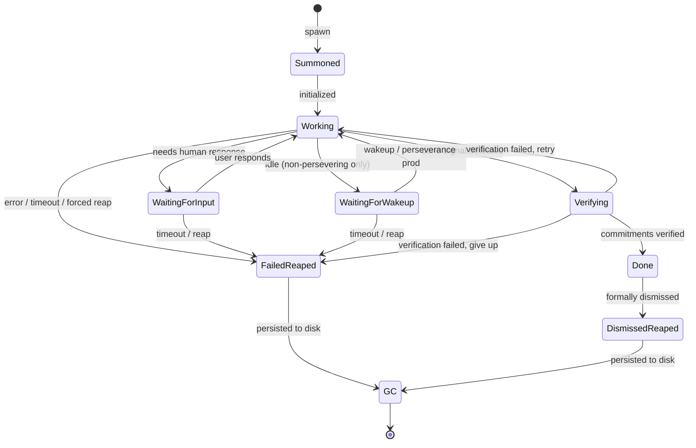

# 019 — Servitor States & Modes

**Status:** complete
**Last Updated:** 2026-02-16

## Upstream References
- PRD: §4.2 (Agent States), §4.4 (Servitor Lifecycle), §5.2 (Execution Modes)
- Reader: §3 (Core Concepts — agent states), §5 (Architecture Notes)
- Transcripts: transcript_2026-01-19-1144.md (agent states, task modes)

## Downstream References
- Code: Tavern/Sources/TavernCore/Agents/ (Servitor.swift, Jake.swift)
- Tests: Tavern/Tests/TavernCoreTests/, Tavern/Tests/TavernTests/

> **Note:** This module is the canonical source for servitor state machine and mode definitions. The state/mode sections in §004, §006, and §007 are deprecated in favor of this module.

---

## 1. Overview
Consolidates all servitor state machine and mode content into one canonical reference. Defines the state machine (Summoned through GC), three orthogonal boolean properties (backgrounding, perseverance, user presence), and their interaction rules with the state machine.

## 2. Requirements

### REQ-STM-001: Canonical State Machine
**Source:** PRD §4.2, §4.4
**Priority:** must-have
**Status:** specified

**Properties:**
- Servitor states: Summoned → Working → Waiting (WaitingForInput, WaitingForWakeup) → Verifying → Done / FailedReaped / DismissedReaped → GC
- Summoned is the initial state upon creation
- FailedReaped = error termination (unrecoverable failure, timeout, or forced reap)
- DismissedReaped = successful completion and formal dismissal by parent or self
- Both "Reaped" states transition to GC (dropped from runtime memory, persisted to disk)
- State transitions are logged at `.debug` level only
- Only valid transitions are permitted; invalid transitions produce an error

**Testable assertion:** A newly created servitor starts in Summoned state. Only valid transitions are accepted; invalid transitions produce an error. FailedReaped and DismissedReaped both transition to GC. All transitions are logged at debug level.

### REQ-STM-002: Three Orthogonal Boolean Properties
**Source:** PRD §4.4, §5.2
**Priority:** must-have
**Status:** specified

**Properties:**
- Three independent boolean properties govern servitor behavior: backgrounding, perseverance, user presence
- These three properties are orthogonal — they can combine in any permutation (2³ = 8 combinations)
- Each property is independently set and queried
- Properties are set at spawn time and may be modified during the servitor's lifetime (except where noted per-property)

**Testable assertion:** All 8 combinations of the three boolean properties are valid. Each property can be set and queried independently.

### REQ-STM-003: Backgrounding Property
**Source:** PRD §4.4
**Priority:** must-have
**Status:** specified

**Properties:**
- Background servitors do not get their own first-class chat window
- Background servitors are displayed as resources associated with their parent servitor (UX details TBD)
- Jake-spawned servitors may or may not be backgrounded (configurable at spawn time)
- User-spawned servitors are never backgrounded (they always get a chat window)

**Testable assertion:** A backgrounded servitor does not appear as a chat window target. A non-backgrounded servitor gets its own chat window. User-spawned servitors are never backgrounded.

### REQ-STM-004: Perseverance Property
**Source:** PRD §5.2
**Priority:** must-have
**Status:** specified

**Properties:**
- A persevering servitor operates in an infinite loop — only Done (after commitment verification) exits the loop
- If a persevering servitor issues any wait command, it receives a system response telling it to persevere and continue working
- The servitor is informed of its perseverance obligation both in its initial system prompt and at every incident where it attempts to wait
- Perseverance prevents the WaitingForWakeup state — the servitor is prodded back to Working immediately

**Testable assertion:** A persevering servitor that attempts to wait receives a perseverance prod and returns to Working. Only Done (verified) exits a persevering servitor. The system prompt for persevering servitors includes the perseverance obligation.

### REQ-STM-005: User Presence Property
**Source:** PRD §4.4
**Priority:** must-have
**Status:** specified

**Properties:**
- Users can "join" and "leave" servitor sessions
- The servitor receives deterministic system messages when a user joins or leaves
- The servitor may alter its behavior based on user presence (e.g., communication style, verbosity, interaction with other agents)
- User presence is a notification — the servitor is informed, not controlled

**Testable assertion:** When a user joins, the servitor receives a deterministic "user joined" system message. When a user leaves, the servitor receives a "user left" system message. These messages are delivered reliably.

### REQ-STM-006: Configurable Inactivity Timeout
**Source:** PRD §4.2
**Priority:** must-have
**Status:** specified

**Properties:**
- If a servitor pauses without issuing a wait or done signal for a configurable duration, it is either prodded to respond or reaped
- The timeout duration is adjustable per-servitor
- The action on timeout (prod vs. reap) is configurable
- Timeout applies in Working state only — waiting states have their own timeout rules

**Testable assertion:** A servitor that is inactive for longer than its configured timeout receives either a prod or is reaped, per configuration. The timeout is adjustable per-servitor.

### REQ-STM-007: State-Mode Interaction Rules
**Source:** PRD §4.2, §4.4, §5.2
**Priority:** must-have
**Status:** working-draft

**Properties:**
- Perseverance + WaitingForWakeup: Persevering servitors cannot enter WaitingForWakeup — they are prodded back to Working immediately
- Perseverance + WaitingForInput: Persevering servitors CAN enter WaitingForInput (they need human answers to continue)
- Backgrounding + User Presence: Background servitors can still have user presence toggled (user may observe/interact through parent's resource view)
- Perseverance + Backgrounding: Valid combination — a background servitor that must keep working until done
- All three enabled: Valid — a background, persevering servitor with user presence tracking

> **Note:** This requirement is a working draft. The user will iterate on these interaction rules after seeing everything together.

**Testable assertion:** A persevering servitor cannot enter WaitingForWakeup. A persevering servitor can enter WaitingForInput. All 8 boolean property combinations produce valid, well-defined behavior.

## 3. Properties Summary

### Canonical State Machine

### Three Orthogonal Boolean Properties

| Property | Default | Effect When True | Effect When False |
|----------|---------|-----------------|-------------------|
| Backgrounding | false | No chat window, displayed as parent resource | Gets own chat window |
| Perseverance | false | Infinite loop, no idle allowed | Can enter WaitingForWakeup |
| User Presence | false | User has joined the session | User has not joined / has left |

### State-Mode Interaction Matrix (Working Draft)

| State | Backgrounded | Persevering | User Present |
|-------|-------------|-------------|--------------|
| Summoned | No effect | No effect | No effect |
| Working | No chat window | Must keep working | May alter communication style |
| WaitingForInput | No chat window (input via parent) | Allowed | Affects prompt style |
| WaitingForWakeup | No chat window | **Blocked** — prodded back | No effect |
| Verifying | No effect | No effect | No effect |
| Done | No effect | Required to reach here | No effect |

## 4. Open Questions

- **UX for background servitors:** How exactly are background servitors displayed as resources of their parent? What interaction is available?

- **Perseverance prod content:** What are the exact contents of the perseverance prod message? Is it customizable per-spawn?

- **User presence behavioral expectations:** Beyond notification, are there any mandatory behavioral changes when user presence changes? Or is it purely advisory?

- **Inactivity timeout defaults:** What are sensible default timeout values? Should there be a system-wide default that per-servitor values override?

## 5. Coverage Gaps

- **State persistence across app restart:** The state machine defines runtime states, but which states survive app restart? Presumably Summoned through Working can be restored, but Verifying may need special handling.

- **Concurrent state transitions:** What happens if multiple signals arrive simultaneously (e.g., done signal and timeout fire at the same time)? Priority/ordering rules are not specified.

- **Mode changes after spawn:** Can backgrounding and perseverance be changed after initial spawn, or are they immutable? The spec says "may be modified" but specific rules are TBD.
