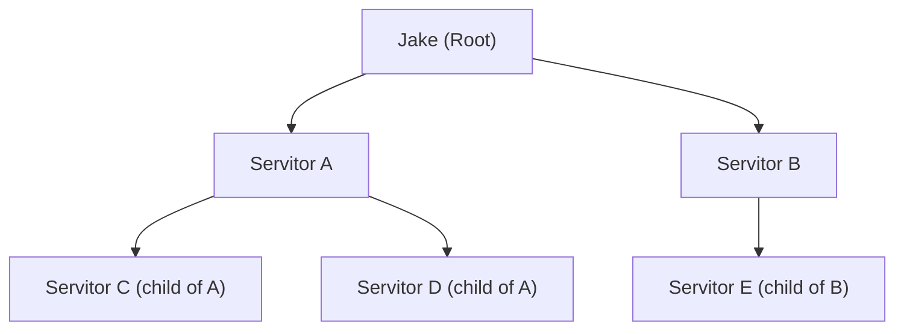

# 020 — Servitor Trees

**Status:** complete
**Last Updated:** 2026-02-16

## Upstream References
- PRD: §12 (Agent Hierarchies)
- Reader: §3 (Core Concepts — tree structures), §5 (Architecture Notes)
- Transcripts: transcript_2026-01-19-1144.md (Erlang-style hierarchies)

## Downstream References
- Code: Tavern/Sources/TavernCore/Servitors/ (Servitor.swift, MortalSpawner.swift, Jake.swift)
- Tests: Tavern/Tests/TavernCoreTests/, Tavern/Tests/TavernTests/

---

## 1. Overview
Defines the tree structure of servitors: parent-child relationships, how operating modes (backgrounding, perseverance, user presence) interact with tree depth, failure boundaries and supervision strategies (Erlang-style), gang termination, token budget inheritance, and cross-tree communication.

## 2. Requirements

### REQ-TRE-001: Tree Structure
**Source:** PRD §12
**Priority:** must-have
**Status:** specified

**Properties:**
- Servitors form trees of arbitrary depth
- Jake is the root of all servitor trees — every servitor has an ancestor chain that terminates at Jake
- Parent-child relationships are tracked and queryable
- A servitor may spawn zero or more children
- Tree structure is persisted and survives app restart

**Testable assertion:** A servitor spawned by Jake has Jake as its parent. A servitor spawned by another servitor has that servitor as its parent. The full ancestor chain is queryable. Tree structure persists across app restart.

### REQ-TRE-002: Operating Modes at Tree Positions
**Source:** PRD §12
**Priority:** must-have
**Status:** specified

**Properties:**
- Backgrounding, perseverance, and user presence (§019) apply at every tree position
- A parent can spawn children with different mode combinations than itself
- Mode values are set per-servitor, not inherited from parent by default
- The spawning parent specifies the child's initial mode values at spawn time

**Testable assertion:** A non-backgrounded parent can spawn a backgrounded child. A persevering parent can spawn a non-persevering child. Mode values are independently configured per-servitor regardless of tree position.

### REQ-TRE-003: Failure Boundaries
**Source:** PRD §12
**Priority:** must-have
**Status:** specified

**Properties:**
- Failure boundaries are properties over subtrees that determine rules on node failure
- Three supervision strategies are supported:
  - **Restart-one:** Replace the single failed worker. Other siblings continue unaffected. The failed servitor's artifacts are preserved for debugging.
  - **Restart-all:** Gang invalidation — terminate and restart the entire sibling group. Used when siblings have interdependent state that becomes inconsistent if one fails.
  - **Revert-to-pre-existence:** Catastrophic failure — revert as much as possible to the state before the failed subtree existed. Changeset drafts and artifacts are preserved for debugging but operational state is rolled back.
- The supervision strategy is set on the parent and applies to its direct children
- Default strategy is restart-one

**Testable assertion:** When a child fails under restart-one, only that child is replaced; siblings continue. Under restart-all, all siblings are terminated and restarted. Under revert-to-pre-existence, the subtree's operational state is rolled back. Artifacts are preserved in all cases.

### REQ-TRE-004: Gang Termination via Capability
**Source:** PRD §12
**Priority:** must-have
**Status:** specified

**Properties:**
- Agents may control gang termination through capabilities (see §021)
- Gang termination terminates all members of a sibling group simultaneously
- Artifacts in changeset drafts are preserved for debugging — gang termination does not destroy work products
- The capability to trigger gang termination must be explicitly granted

**Testable assertion:** An agent with gang termination capability can terminate all siblings. An agent without the capability cannot. Changeset drafts are preserved after gang termination.

### REQ-TRE-005: Token Budget Inheritance
**Source:** PRD §12
**Priority:** must-have
**Status:** specified

**Properties:**
- Token budgets are delegated through the tree from parent to child
- A child cannot exceed its parent's remaining budget
- When a parent delegates budget to a child, the parent's available budget decreases by that amount
- Agents receive periodic updates about their remaining budget
- Budget exhaustion triggers a warning, then a forced transition to Verifying or FailedReaped

**Testable assertion:** A child's budget does not exceed its parent's remaining budget. Delegating budget to a child reduces the parent's available budget. Budget exhaustion triggers appropriate state transitions. Agents receive periodic budget updates.

### REQ-TRE-006: Cross-Tree Communication
**Source:** PRD §12
**Priority:** must-have
**Status:** specified

**Properties:**
- Cross-tree communication is capability-gated (see §021)
- A servitor may communicate with servitors in other trees only if granted the lateral communication capability
- Communication scope is defined at grant time: siblings (same parent), cousins (same grandparent), or broader
- Without the capability, a servitor can only communicate up (to parent) and down (to children)

**Testable assertion:** A servitor without lateral communication capability cannot send messages to servitors outside its direct ancestor/descendant chain. A servitor with lateral communication capability can communicate with the specified scope. Default communication is up and down only.

## 3. Properties Summary

### Tree Structure

### Supervision Strategies

| Strategy | Scope | Effect | Artifact Preservation |
|----------|-------|--------|----------------------|
| Restart-one | Single failed child | Replace failed worker only | Yes |
| Restart-all | All siblings of failed child | Terminate and restart entire group | Yes |
| Revert-to-pre-existence | Entire subtree | Roll back to pre-existence state | Yes (for debugging) |

### Communication Scope

| Direction | Default | Requires Capability |
|-----------|---------|-------------------|
| Up (to parent) | Allowed | No |
| Down (to children) | Allowed | No |
| Lateral (siblings) | Blocked | Yes (lateral communication) |
| Cross-tree (cousins+) | Blocked | Yes (lateral communication, broader scope) |

## 4. Open Questions

- **Budget delegation granularity:** Are token budgets delegated as fixed amounts or as percentages of the parent's remaining budget? Can budgets be reclaimed from children?

- **Restart-all state synchronization:** When restarting all siblings, how is the shared state they depend on reconstructed? Do restarted siblings get context about why they were restarted?

- **Revert-to-pre-existence scope:** How much state can realistically be rolled back? File system changes? Doc store mutations? What are the boundaries of "as much as possible"?

- **Tree depth limits:** Is there a maximum tree depth? What prevents runaway recursive spawning?

## 5. Coverage Gaps

- **Orphan handling:** What happens to children when their parent is reaped? Are they adopted by the grandparent, or reaped as well?

- **Tree visualization:** No specification for how the tree structure is displayed to the user in the UI.

- **Concurrent spawning limits:** No per-parent limit on how many children can be spawned simultaneously.
