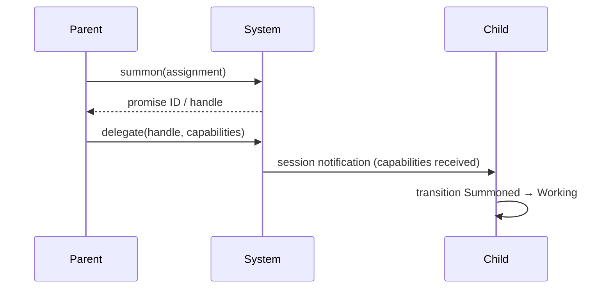

# 021 — Capability Delegation

**Status:** complete
**Last Updated:** 2026-02-16

## Upstream References
- PRD: §4.1 (Agent Types — partial capability mention)
- Reader: §3 (Core Concepts), §5 (Architecture Notes)
- Transcripts: transcript_2026-01-19-1144.md (capability concepts)

## Downstream References
- Code: Tavern/Sources/TavernCore/Agents/, Tavern/Sources/TavernCore/MCP/
- Tests: Tavern/Tests/TavernCoreTests/, Tavern/Tests/TavernTests/

> **Note:** PRD backfill needed. This spec was written first; a corresponding PRD section should be added to PRD v1.2. See Open Questions.

---

## 1. Overview
Defines the capability system: how capabilities are separated from the summon flow, delegated from parent to child, enforced by the deterministic shell, and how agents are prevented from modifying their own capabilities. Covers capability types, delegation chains, and the handle-based flow.

## 2. Requirements

### REQ-CAP-001: Separation from Summon
**Source:** PRD §4.1 (partial)
**Priority:** must-have
**Status:** specified

**Properties:**
- The summon operation is asynchronous and returns a promise ID (handle) for the spawned servitor
- Capability delegation is a separate operation that uses the handle/ID to send capabilities to the spawned agent
- This separation allows the spawner to prepare capabilities after the spawn is initiated but before the agent begins work
- The spawned agent's main actor receives the capability handle and waits for session notification before proceeding

**Testable assertion:** Summon returns a promise ID. A separate delegate command sends capabilities using that ID. The spawned agent does not begin work until capabilities are received.

### REQ-CAP-002: Capability Handle Flow
**Source:** PRD §4.1 (partial)
**Priority:** must-have
**Status:** specified

**Properties:**
- The main actor of the spawned agent receives the capability handle from the spawning system
- The agent waits for a session notification that capabilities have been received and can be invoked
- Until capabilities are received, the agent remains in Summoned state (§019 REQ-STM-001)
- The capability handle is opaque to the agent — it cannot inspect or modify the handle itself

**Testable assertion:** A spawned agent remains in Summoned state until capabilities are received. After receiving capabilities, the agent transitions to Working. The agent cannot inspect or modify its capability handle.

### REQ-CAP-003: Capability Types
**Source:** PRD §4.1 (partial)
**Priority:** must-have
**Status:** specified

**Properties:**
- Defined capability types:
  - **Filesystem access:** Read/write access to specified paths
  - **Network access:** Ability to make network requests (scope TBD)
  - **Tool access:** Access to specific MCP tools or tool categories
  - **Lateral communication:** Ability to communicate across trees (scope: siblings, cousins, or broader — see §020 REQ-TRE-006)
- Capability types are extensible — new types can be added as the system evolves
- Servitors receive capability grants only if the parent explicitly includes them in the summon-with-assignment flow

**Testable assertion:** Each capability type can be independently granted or withheld. A servitor without filesystem access cannot perform file operations. A servitor without lateral communication cannot message across trees. Capabilities are only received if explicitly granted by parent.

### REQ-CAP-004: Delegation Chains
**Source:** PRD §4.1 (partial)
**Priority:** must-have
**Status:** specified

**Properties:**
- A parent cannot delegate capabilities it does not have
- Capabilities flow downward only — from parent to child, never upward or laterally
- Jake's capabilities represent the ceiling for any servitor tree
- A child's capabilities are always a subset of (or equal to) its parent's capabilities
- Delegation is transitive: if A delegates to B and B delegates to C, C's capabilities are bounded by B's (which are bounded by A's)

**Testable assertion:** Attempting to delegate a capability the parent does not have produces an error. A child's capabilities never exceed its parent's. Jake's capabilities are the upper bound for all servitors.

### REQ-CAP-005: Deterministic Shell Enforcement
**Source:** PRD §4.1 (partial)
**Priority:** must-have
**Status:** specified

**Properties:**
- Capabilities are enforced by the deterministic shell, not by the agent's own prompt or self-discipline
- Even if a parent composes a prompt to a child that suggests broader capabilities, the system enforces the actual capability boundaries
- Capability violations are logged and reported to the parent
- The deterministic shell is the single enforcement point — no other layer can override it

**Testable assertion:** An agent that attempts an action outside its capabilities is blocked by the deterministic shell. Capability violations are logged. Prompt content cannot override capability boundaries.

### REQ-CAP-006: Agents Cannot Modify Own Capabilities
**Source:** PRD §4.1 (partial), Non-Negotiable Invariant #6
**Priority:** must-have
**Status:** specified

**Properties:**
- Agents cannot modify their own capabilities or boundaries
- Attempting to modify own capabilities is a violation, logged and reported
- This applies to all agent types including Jake (Jake's capabilities are set by the system)
- Capability modification is only possible by the parent that granted the capabilities, or by the system itself

**Testable assertion:** An agent that attempts to modify its own capabilities is blocked. The violation is logged and reported. Only the granting parent or the system can modify an agent's capabilities.

## 3. Properties Summary

### Capability Flow

### Capability Types

| Type | Scope | Default |
|------|-------|---------|
| Filesystem access | Specified paths | None |
| Network access | TBD | None |
| Tool access | Specific tools/categories | None |
| Lateral communication | Siblings / cousins / broader | None |

### Delegation Rules

| Rule | Description |
|------|-------------|
| Downward only | Capabilities flow parent → child, never upward |
| Subset constraint | Child ≤ parent ≤ ... ≤ Jake |
| No self-modification | Agents cannot modify own capabilities |
| Shell enforcement | Deterministic shell is the single enforcement point |

## 4. Open Questions

- **PRD backfill:** This module was specified ahead of the PRD. A corresponding section needs to be added to PRD v1.2 to maintain pipeline traceability.

- **Network access scoping:** What does "network access" mean in practice? Domain allowlists? Port restrictions? Protocol-level controls?

- **Capability revocation:** Can a parent revoke capabilities from a running child? What happens to in-flight operations that depend on a revoked capability?

- **Jake's capability source:** Where are Jake's capabilities defined? System configuration? Per-project settings? Hardcoded?

- **Tool access granularity:** Is tool access per-individual-tool or per-category? Can a servitor have access to `summon_servitor` but not `dismiss_servitor`?

## 5. Coverage Gaps

- **Capability persistence:** Are capabilities persisted with the servitor's state across app restart, or must they be re-delegated?

- **Audit trail:** No specification for a capability audit log (who granted what to whom, when).

- **Emergency override:** No mechanism for emergency capability escalation (e.g., a servitor discovers it needs filesystem access mid-task).
