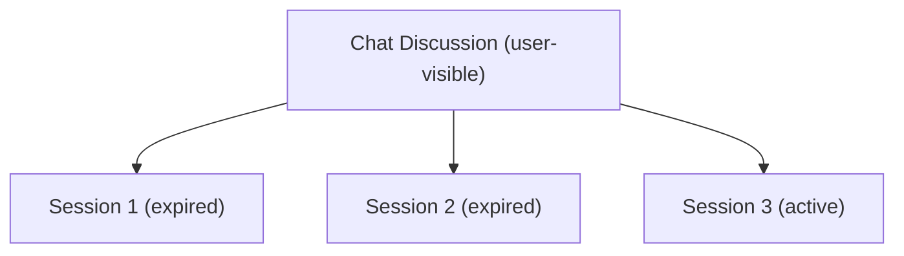
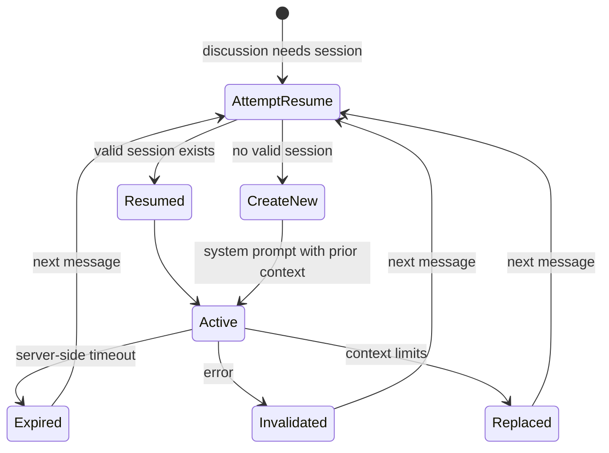

# 022 — Chat Discussions & Sessions

**Status:** complete
**Last Updated:** 2026-02-16

## Upstream References
- PRD: §4.5 (Chat & Session Management — partial)
- Reader: §3 (Core Concepts — sessions), §5 (Architecture Notes)
- Transcripts: transcript_2026-01-19-1144.md (session persistence)

## Downstream References
- Code: Tavern/Sources/TavernCore/Chat/, Tavern/Sources/TavernCore/Persistence/
- Tests: Tavern/Tests/TavernCoreTests/, Tavern/Tests/TavernTests/

---

## 1. Overview
Separates the user-visible chat discussion from the underlying Claude sessions. A chat discussion provides a contiguous conversational experience for the user, while multiple Claude sessions may exist beneath it due to session expiry, recreation, or other lifecycle events. Session boundaries are invisible to the user in normal usage.

## 2. Requirements

### REQ-CDS-001: Chat Discussion
**Source:** PRD §4.5 (partial)
**Priority:** must-have
**Status:** specified

**Properties:**
- A chat discussion is the user-visible conversation associated with a servitor
- Each servitor has exactly one chat discussion for its lifetime
- The discussion persists for the servitor's entire lifecycle (Summoned through DismissedReaped)
- The discussion provides a contiguous experience — the user sees one unbroken conversation
- Discussion history is persisted to disk and survives app restart

**Testable assertion:** Each servitor has exactly one chat discussion. The discussion persists from spawn to dismissal. Discussion history survives app restart.

### REQ-CDS-002: Underlying Sessions
**Source:** PRD §4.5 (partial)
**Priority:** must-have
**Status:** specified

**Properties:**
- A single chat discussion may be backed by multiple Claude sessions over its lifetime
- Sessions can expire (server-side timeout), be invalidated (error), or be replaced (context limits)
- The mapping from discussion to sessions is one-to-many
- Session transitions within a discussion are tracked and logged

**Testable assertion:** A chat discussion can survive the expiry of its underlying session. Multiple sessions can back a single discussion over time. Session transitions are logged.

### REQ-CDS-003: Session Resumption
**Source:** PRD §4.5 (partial)
**Priority:** must-have
**Status:** specified

**Properties:**
- When a resumable session exists (server-side state is still valid), the system continues it
- Session resumption is attempted first before creating a new session
- Resumption preserves the full server-side conversation context
- Failed resumption attempts fall through to session recreation (REQ-CDS-004)

**Testable assertion:** When a valid session exists, the system resumes it rather than creating a new one. Resumption preserves server-side context. Failed resumption triggers recreation.

### REQ-CDS-004: Session Recreation
**Source:** PRD §4.5 (partial)
**Priority:** must-have
**Status:** specified

**Properties:**
- When no resumable session exists, the system creates a new one
- The new session receives a system prompt that includes context from the prior discussion
- The system prompt summarizes the discussion state: what was accomplished, what was in progress, relevant context
- The user is not required to re-explain prior context after a session recreation

**Testable assertion:** When no resumable session exists, a new session is created. The new session's system prompt includes prior discussion context. The user does not need to re-explain context.

### REQ-CDS-005: Contiguous Experience
**Source:** PRD §4.5 (partial)
**Priority:** must-have
**Status:** specified

**Properties:**
- The app provides a contiguous chat experience regardless of underlying session changes
- Session boundaries are invisible to the user in normal usage
- Message history from all sessions within a discussion is displayed as one continuous conversation
- Optionally, a subtle indicator may show when a session boundary occurred (for debugging/advanced users), but this is not the default

**Testable assertion:** Message history from multiple sessions is displayed as one continuous conversation. Session boundaries are not visible to the user by default. The user experience is contiguous across session changes.

## 3. Properties Summary

### Discussion-Session Relationship

### Session Lifecycle

### Key Properties

| Property | Discussion | Session |
|----------|-----------|---------|
| Visibility | User-facing | Internal |
| Cardinality per servitor | Exactly one | One-to-many |
| Persistence | Disk (survives restart) | Server-side + local JSONL |
| Lifetime | Servitor lifecycle | Variable (may expire) |

## 4. Open Questions

- **Context summarization strategy:** How is prior discussion context summarized for a new session's system prompt? Full history replay? LLM-generated summary? Structured extraction?

- **Session boundary indicators:** Should advanced users have an option to see session boundaries in the chat? If so, what does the indicator look like?

- **Message deduplication:** If a message was sent at the end of session N and the context is replayed in session N+1's system prompt, how is duplication avoided in the user-visible history?

- **Maximum sessions per discussion:** Is there a practical limit on how many sessions can back a single discussion?

## 5. Coverage Gaps

- **Offline behavior:** What happens when a new session cannot be created (network unavailable)? Is the discussion frozen? Can the user still view history?

- **Session metadata display:** No specification for surfacing session health information (e.g., "session nearing context limit") to the user or to Jake.

- **Cross-discussion context:** Can context from one servitor's discussion be shared with another servitor's session? (Relates to §021 capability delegation.)
