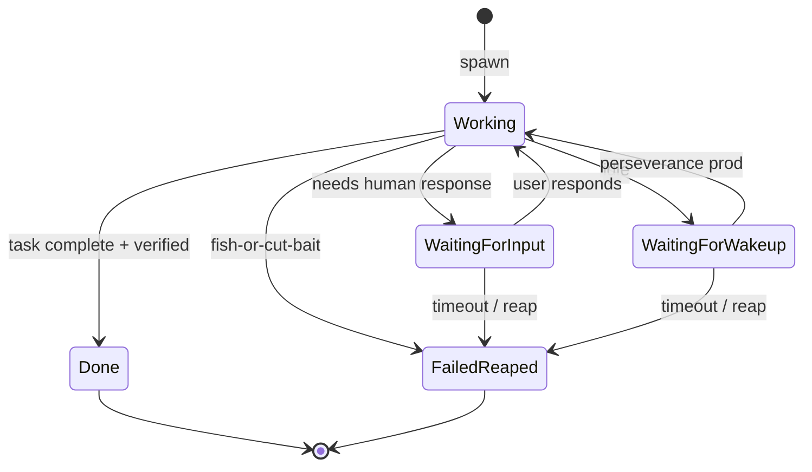
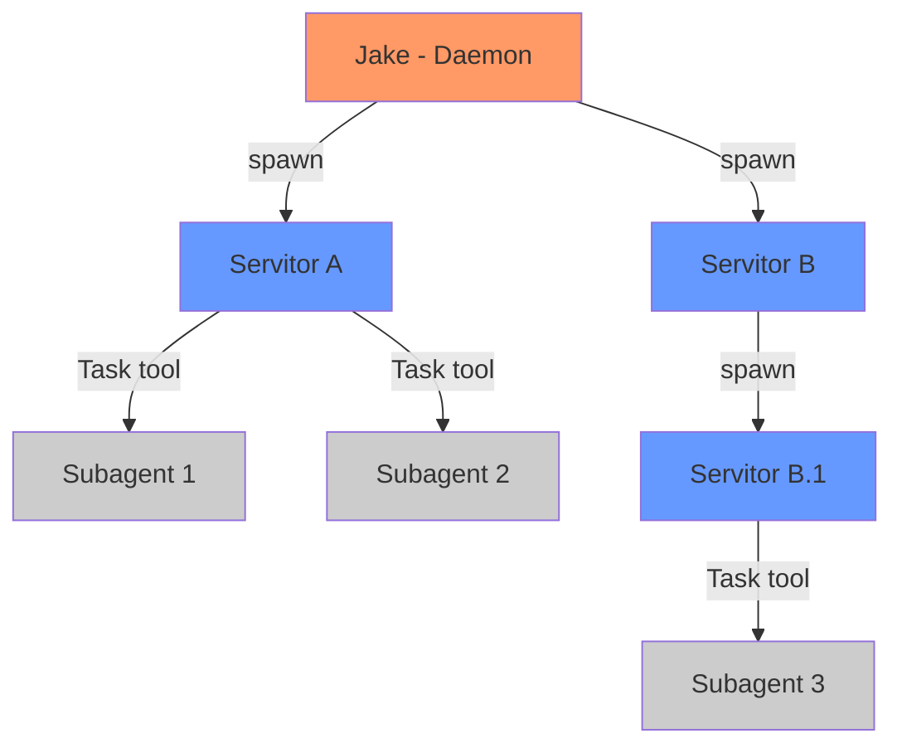
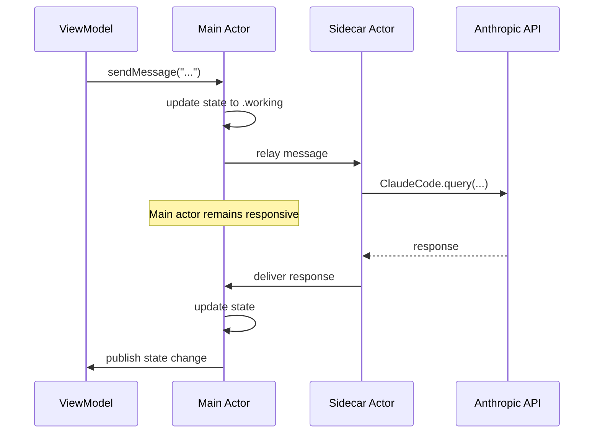

# Agents Specification

**Status:** complete
**Last Updated:** 2026-02-08

## Upstream References
- PRD: §4.1 (Agent Types), §4.2 (Agent States), §4.3 (Task Modes)
- Reader: §3 (Core Concepts), §5 (Architecture Notes — sidecar pattern, two-level orchestration)
- Transcripts: transcript_2026-01-19-1144.md (agent types, task modes), transcript_2026-01-28-jake-spawn-tool.md (two-level orchestration)

## Downstream References
- ADR: ADR-001-shape-selection.md
- Code: Tavern/Sources/TavernCore/Agents/ (Jake.swift, Servitor.swift, ServitorSpawner.swift)
- Tests: Tavern/Tests/TavernCoreTests/, Tavern/Tests/TavernTests/

---

## 1. Overview
Agent types (Jake daemon, mortal agents, drones, monitor daemons), their states, task modes, and the sidecar I/O pattern. Defines the two-level orchestration model where Tavern agents are persistent tracked work and Task subagents are ephemeral parallel workers.

## 2. Requirements

### REQ-AGT-001: Jake Daemon Agent
**Source:** PRD §4.1
**Priority:** must-have
**Status:** specified

Jake is the top-level coordinating daemon agent. Jake is always running for each open project. Jake has the highest authority to spawn and manage other agents but has few direct capabilities himself. Jake's lifecycle is tied to the app: starts when the app opens, stops when the app closes.

**Testable assertion:** When a project is opened, Jake is instantiated. When the project closes, Jake is stopped. Jake's session persists across app restarts (keyed per-project in UserDefaults).

### REQ-AGT-002: Mortal Agents (Servitors)
**Source:** PRD §4.1
**Priority:** must-have
**Status:** specified

Mortal agents are task-scoped. They are spawned to handle specific assignments and their lifecycle is bound to task completion. Mortal agents can spawn children, forming tree structures of arbitrary depth (Erlang-style). Mortal agents are called "Servitors" in the codebase and "The Regulars" in Jake's vocabulary.

**Testable assertion:** A mortal agent can be spawned, receives an assignment, works on it, and transitions to done. A mortal agent can spawn child agents. Parent-child relationships are tracked.

### REQ-AGT-003: Drone Agents
**Source:** PRD §4.1
**Priority:** deferred
**Status:** specified

Drones are single-task agents: one task, then terminate. They use cheaper models, are cheap to fail, and follow the Meeseeks pattern (exist to complete one thing). Drones are deferred to post-v1.

**Testable assertion:** Deferred. When implemented: drone completes exactly one task, then auto-terminates. Drone failure is cheap (no recovery attempt).

### REQ-AGT-004: Monitor Daemons
**Source:** PRD §4.1
**Priority:** deferred
**Status:** specified

Monitor daemons are background agents that work for Jake to monitor system health, agent progress, and spending. They are deferred to post-v1.

**Testable assertion:** Deferred. When implemented: monitor daemons run in background, report to Jake, do not accept user tasks.

### REQ-AGT-005: Agent State Machine
**Source:** PRD §4.2
**Priority:** must-have
**Status:** specified

Every agent has a state machine with these states:

- **Working** -- Agent is actively processing (saturated, doing stuff)
- **Waiting for Input** -- Agent needs human response (includes "blocked" -- same state, different flavor)
- **Waiting for Wakeup** -- Agent is idle; perseverance mode will prod it to continue
- **Done** -- Task complete, verified by deterministic assertion
- **Failed/Reaped** -- Fish-or-cut-bait triggered, agent terminated

State transitions are logged. Invalid transitions are rejected.

**Testable assertion:** Given an agent in state X, only valid transitions to states Y are permitted. Attempting an invalid transition produces an error. All transitions are logged at `.info` level.

### REQ-AGT-006: Task Modes
**Source:** PRD §4.3
**Priority:** must-have
**Status:** specified

Agents can operate in and bounce between five task modes:

1. **Execute** -- Do the work directly
2. **Delegate** -- Pass work to a new child agent
3. **Plan** -- Think more before acting
4. **Break up** -- Split task into pieces, assign to children
5. **Unify** -- Combine work from delegated children

An agent may switch between modes at any point during task execution.

**Testable assertion:** An agent can transition between any task modes. Mode transitions are observable and logged. The current mode is queryable.

### REQ-AGT-007: Two-Level Orchestration
**Source:** Reader §3 (Two-Level Orchestration Model)
**Priority:** must-have
**Status:** specified

The system operates a two-level agent model:

**Level 1 -- Tavern Agents** (via spawn): Full Claude Code sessions with their own context. Appear in sidebar, persist across sessions. For substantial, independent work streams.

**Level 2 -- Subagents** (via Task tool): Internal parallel workers within any agent's session. Lightweight, ephemeral, do not persist. For quick parallel tasks within a single work stream.

**Testable assertion:** Tavern agents appear in the agent list and persist across app restarts. Task subagents do not appear in the agent list and do not persist.

### REQ-AGT-008: Sidecar Pattern
**Source:** Reader §9 (Sidecar Pattern), ADR-001
**Priority:** must-have
**Status:** specified

Each agent has two actor components:

1. **Main actor** -- Manages tree structure, state, never blocks
2. **Sidecar actor** -- Handles slow Anthropic I/O

This prevents thread pool starvation when many agents make concurrent API calls. A global semaphore limits concurrent Anthropic calls (~10).

**Testable assertion:** Agent main actor methods return immediately (never block). All SDK/API calls go through the sidecar. Global semaphore is respected (concurrent calls do not exceed limit).

### REQ-AGT-009: Done Signal Detection
**Source:** Reader §3 (Mortal Agents), CLAUDE.md
**Priority:** must-have
**Status:** specified

Mortal agents detect done signals (`DONE`, `COMPLETED`) in their responses. Detection triggers commitment verification via `CommitmentVerifier`. A separate waiting signal (`WAITING`, `NEED INPUT`) transitions the agent to `.waiting` state.

**Testable assertion:** A response containing `DONE` triggers verification flow. A response containing `WAITING` transitions to waiting state. Responses without these signals leave the agent in working state.

### REQ-AGT-010: Agent Protocol
**Source:** CLAUDE.md (Agent Layer)
**Priority:** must-have
**Status:** specified

All agent types conform to a common `Agent` protocol that defines the shared interface for sending messages, querying state, and managing sessions. This enables polymorphic handling in `ChatViewModel` and `TavernCoordinator`.

**Testable assertion:** `MockAgent` conforms to `Agent` protocol and can be substituted for any real agent in tests. `ChatViewModel` works identically with Jake, Servitor, or MockAgent.

## 3. Behavior

### Agent State Machine

### Two-Level Orchestration

Orange = daemon, Blue = Tavern agents (persistent), Gray = subagents (ephemeral).

### Sidecar Actor Split

## 4. Open Questions

- **?4 -- Agent "Done" Assertion:** How does the system know when a mortal agent's task is complete? Currently detection is keyword-based (DONE/COMPLETED in responses). A more robust signal mechanism may be needed.

- **?6 -- Perseverance Prompts and Agent Lifecycle:** What exactly triggers the transition from WaitingForWakeup back to Working? What are the perseverance prompt contents?

- **Drone model selection:** PRD says drones use "cheaper models." Which models? Is this configurable per-spawn or system-wide?

## 5. Coverage Gaps

- **Child agent failure propagation:** PRD mentions Erlang-style hierarchies but does not specify what happens when a child agent fails. Does the parent retry? Escalate? Continue without the child?

- **Agent resource limits:** No specification for per-agent memory or token limits beyond the global semaphore for API calls.
