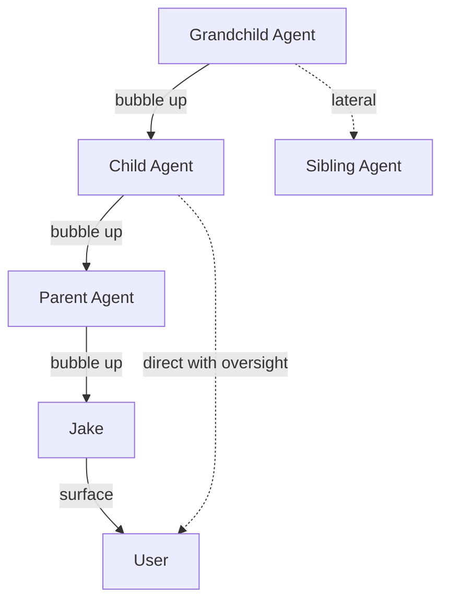
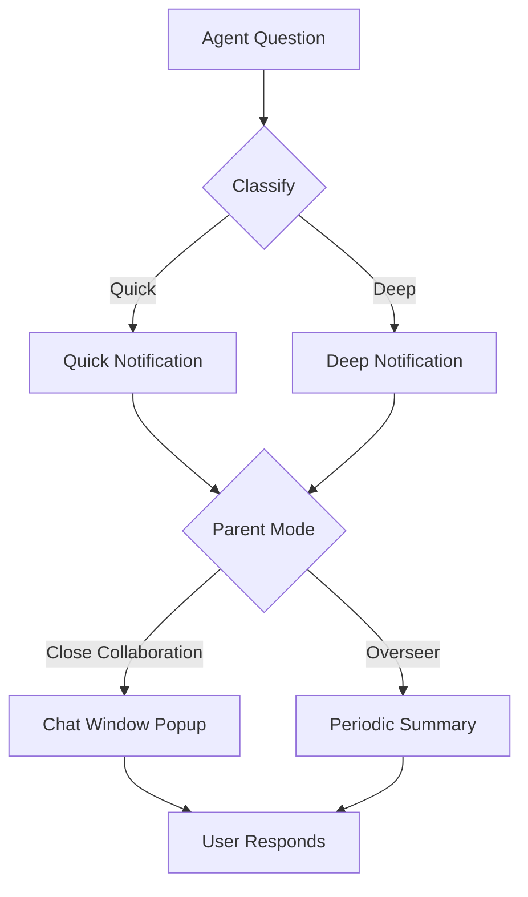
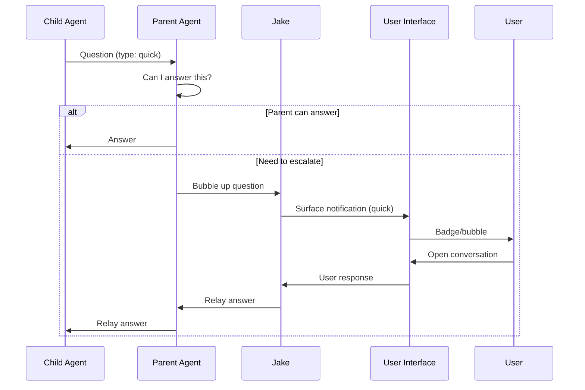

# Communication Specification

**Status:** complete
**Last Updated:** 2026-02-08

## Upstream References
- PRD: §5.3 (Bubbling), §5.5 (Question Triage)
- Reader: §9 (Agent Communication — message protocol, lateral collaboration, surfacing questions)
- Transcripts: transcript_2026-01-19-1144.md (bubbling concept)

## Downstream References
- ADR: --
- Code: Tavern/Sources/TavernCore/Chat/
- Tests: Tavern/Tests/TavernCoreTests/

---

## 1. Overview
Bubbling mechanism, question triage, and inter-agent communication. Defines how information flows through the agent hierarchy (upward, lateral, direct-to-user), how questions are classified and routed, and how agents collaborate through the shared workspace.

## 2. Requirements

### REQ-COM-001: Upward Bubbling
**Source:** PRD §5.3
**Priority:** must-have
**Status:** specified

Agents can escalate questions and information upward through the agent hierarchy: child to parent to grandparent to user. Each level in the hierarchy can handle, transform, or pass through the message. Jake, as the top-level daemon, is the final relay before the user.

**Testable assertion:** A message from a grandchild agent can reach the user through the parent and grandparent chain. Each intermediary receives the message and can either handle it or forward it upward.

### REQ-COM-002: Lateral Communication
**Source:** PRD §5.3
**Priority:** should-have
**Status:** specified

Agents can communicate laterally with siblings. Sibling agents (children of the same parent) can exchange messages to collaborate on related work. Lateral communication does not require routing through the parent.

**Testable assertion:** Two agents with the same parent can exchange messages directly. Messages are delivered without passing through the parent agent.

### REQ-COM-003: Direct-to-User Communication
**Source:** PRD §5.3
**Priority:** should-have
**Status:** specified

Agents can communicate directly with the user, with oversight by other agents in the hierarchy. Direct communication bypasses the normal bubbling chain but parent agents maintain visibility into what was communicated.

**Testable assertion:** An agent can send a message directly to the user. The parent agent is notified (or can observe) that direct communication occurred.

### REQ-COM-004: Question Classification
**Source:** PRD §5.5
**Priority:** must-have
**Status:** specified

Questions from agents are classified as quick vs deep. The classification is conveyed in the notification so the user knows what they are getting into before engaging. Quick questions can be answered without context; deep questions require reading agent state.

**Testable assertion:** Questions surfaced to the user include a complexity classification. The classification is determined before the notification is shown, not after the user opens the conversation.

### REQ-COM-005: Parent-Controlled Notification Mode
**Source:** PRD §5.5
**Priority:** should-have
**Status:** specified

Parent agents choose the notification approach for their children's questions:

- **Close collaboration:** Chat window pops up with notification for each question
- **Overseer mode:** Periodic summary of outstanding questions

The user can override the parent's choice.

**Testable assertion:** A parent agent can configure its children's notification mode. Children's questions are surfaced according to the configured mode. The user can change the mode at any time.

### REQ-COM-006: Message Protocol Expectations
**Source:** Reader §9 (Message Protocol)
**Priority:** must-have
**Status:** specified

Certain message types expect certain response types. When an agent sends a message of type X, the expected response type is known. A wrong or missing response is a signal of agent malfunction.

**Testable assertion:** Each message type has a defined expected response type. An agent that responds with the wrong type or fails to respond within a timeout triggers a malfunction signal.

### REQ-COM-007: Discovery Sharing
**Source:** PRD §9.3 (also referenced in observability)
**Priority:** should-have
**Status:** specified

Agents (including drones) are prompted to notice oddities and share discoveries via messaging, even while continuing their main task. This relies on prompt engineering encouraging curiosity and social behavior rather than deterministic hooks.

**Testable assertion:** Agent system prompts include instructions to report discoveries. Discovery messages are delivered to parent agents. (Cannot deterministically verify agent compliance -- prompt-based.)

### REQ-COM-008: Jake as Communication Hub
**Source:** PRD §5.3, Reader §3
**Priority:** must-have
**Status:** specified

Jake coordinates across all task trees. Jake is aware of hibernating agents, unfinished work, and backlogs. Jake proactively suggests that the user zoom into specific agents when their attention is needed.

**Testable assertion:** Jake can enumerate all agents and their states. Jake generates suggestions for user attention based on agent state. Suggestions are surfaced through the chat interface.

## 3. Behavior

### Bubbling Flow

Solid lines = upward bubbling. Dashed = lateral and direct.

### Question Triage

### Message Flow Sequence

## 4. Open Questions

- **?5 -- Bubbling Up Process:** Exactly how does bubbling work? Does the child ask the parent who decides to escalate? Can messages skip levels? Is there prioritization between bubbling messages?

- **Message protocol specifics:** PRD §14 lists this as TBD. What are the concrete message types and their expected responses?

- **Lateral communication routing:** How do siblings discover each other? Through the parent? Through the doc store? Through a registry?

## 5. Coverage Gaps

- **Message delivery guarantees:** No specification for what happens when a message cannot be delivered (agent died, busy, out of context). Is there retry logic? Dead-letter handling?

- **Communication rate limiting:** No specification for preventing message floods between agents. A chatty agent could overwhelm its parent with bubbled questions.

- **Privacy/scoping:** No specification for whether agents can read messages not addressed to them. The shared workspace pattern suggests all agents can see everything, but this may not be desirable for all message types.
