# Tavern at the Spillway — Compiled Specification
**Generated:** 2026-02-16
**Source modules:** §000–§025
**Active modules:** 26
**Dropped sections stripped:** 13

## Table of Contents

- [§000 — Formal Specification Index](#§000--formal-specification-index)
- [§001 — Introduction](#§001--introduction)
- [§002 — Invariants Specification](#§002--invariants-specification)
- [§003 — System Architecture Specification](#§003--system-architecture-specification)
- [§004 — Agents Specification](#§004--agents-specification)
- [§005 — Spawning Specification](#§005--spawning-specification)
- [§006 — Lifecycle Specification](#§006--lifecycle-specification)
- [§007 — Operating Modes Specification](#§007--operating-modes-specification)
- [§008 — Deterministic Shell Specification](#§008--deterministic-shell-specification)
- [§009 — Communication Specification](#§009--communication-specification)
- [§010 — Document Store Specification](#§010--document-store-specification)
- [§011 — Sandbox Specification](#§011--sandbox-specification)
- [§012 — Workflows Specification](#§012--workflows-specification)
- [§013 — User Experience Specification](#§013--user-experience-specification)
- [§014 — View Architecture Specification](#§014--view-architecture-specification)
- [§015 — Observability Specification](#§015--observability-specification)
- [§016 — Quality Specification](#§016--quality-specification)
- [§017 — V1 Scope Specification](#§017--v1-scope-specification)
- [§018 — Spec Fidelity](#§018--spec-fidelity)
- [§019 — Servitor States & Modes](#§019--servitor-states-&-modes)
- [§020 — Servitor Trees](#§020--servitor-trees)
- [§021 — Capability Delegation](#§021--capability-delegation)
- [§022 — Chat Discussions & Sessions](#§022--chat-discussions-&-sessions)
- [§023 — Keyboard Shortcuts](#§023--keyboard-shortcuts)
- [§024 — Accessibility](#§024--accessibility)
- [§025 — Search](#§025--search)

---

# §000 — Formal Specification Index

**Status:** complete
**Last Updated:** 2026-02-16

## Purpose

Traceability matrix mapping every PRD section to its spec module(s). Every requirement in the PRD must be covered by at least one spec module.

## PRD Coverage Matrix

| PRD Section | Title | Doc # | Spec Module(s) | Status |
|-------------|-------|-------|----------------|--------|
| §1 | Executive Summary | — | (context — informs all) | — |
| §2 | Invariants (Hard-Enforced) | 002 | 002-invariants.md | complete |
| §3 | Problem Statement / Goals | — | (context — informs all) | — |
| §4.1 | Agent Types | 004 | 004-agents.md | complete |
| §4.2 | Agent States | 004 | 004-agents.md | complete |
| §4.3 | Task Modes | 004 | 004-agents.md | complete |
| §4.4 | Operating Modes | 007 | 007-operating-modes.md | complete |
| §4.5 | The Document Store | 010 | 010-doc-store.md | complete |
| §4.6 | Sandbox Primitives | 011 | 011-sandbox.md | complete |
| §4.7 | Deterministic Shell | 008 | 008-deterministic-shell.md | complete |
| §5.1 | The Core Loop | 013 | 013-user-experience.md | complete |
| §5.2 | Attention Model | 007 | 007-operating-modes.md | complete |
| §5.3 | Bubbling | 009 | 009-communication.md | complete |
| §5.4 | UI Principles | 013 | 013-user-experience.md | complete |
| §5.5 | Question Triage | 009 | 009-communication.md | complete |
| §6.1 | Tech Stack | 003 | 003-system-architecture.md | complete |
| §6.2 | Agent Spawn Configuration | 005 | 005-spawning.md | complete |
| §6.3 | Work Queues | 005 | 005-spawning.md | complete |
| §6.4 | Preflight Checks | 011 | 011-sandbox.md | complete |
| §6.5 | Merge Queue | 012 | 012-workflows.md | complete |
| §6.6 | Hygiene | 010 | 010-doc-store.md | complete |
| §7 | Agent Naming | 005 | 005-spawning.md | complete |
| §8 | Progressive Unlocks | 013 | 013-user-experience.md | complete |
| §8.1 | Concept | 013 | 013-user-experience.md | complete |
| §8.2 | Open Questions | 013 | 013-user-experience.md | complete |
| §9 | Metrics | 015 | 015-observability.md | complete |
| §9.1 | Starter Templates | 012 | 012-workflows.md | complete |
| §9.2 | Meta Process | 015 | 015-observability.md | complete |
| §9.3 | Discovery Sharing | 015, 009 | 015-observability.md, 009-communication.md | complete |
| §10 | Workflows | 012 | 012-workflows.md | complete |
| §11 | Gang of Experts | 012 | 012-workflows.md | complete |
| §12 | Fish or Cut Bait | 006 | 006-lifecycle.md | complete |
| §13 | Rewind and Branch | 006 | 006-lifecycle.md | complete |
| §14 | Open Items / TBD | — | (context — informs all) | — |
| §15 | Day 1 Questions | — | (context — informs all) | — |
| §16 | Violation Monitoring | 015 | 015-observability.md | complete |
| §17 | Testability Requirements | 016 | 016-quality.md | complete |
| §18 | V1 Scope | 017 | 017-v1-scope.md | complete |
| §19 | Development Standards | 016 | 016-quality.md | complete |
| §19.1 | Logging Standards | 016 | 016-quality.md | complete |
| §19.2 | Testing Standards | 016 | 016-quality.md | complete |
| §19.3 | Stress Testing Standards | 016 | 016-quality.md | complete |
| §19.4 | Completeness and Correctness Standards | 018 | 018-spec-fidelity.md | complete |
| §20 | Success Criteria | 017 | 017-v1-scope.md | complete |
| §21 | Performance Requirements | 016 | 016-quality.md | complete |

## Coverage Summary

- **Total PRD sections:** 45
- **Covered by spec:** 41
- **Context-only (no spec needed):** 4 (§1, §3, §14, §15)
- **Gaps:** none

## Module Status Overview

| Doc # | Module | Prefix | Status | Requirements Count |
|-------|--------|--------|--------|-------------------|
| 002 | 002-invariants.md | REQ-INV | complete | 9 |
| 003 | 003-system-architecture.md | REQ-ARCH | complete | 10 |
| 004 | 004-agents.md | REQ-AGT | complete | 10 |
| 005 | 005-spawning.md | REQ-SPN | complete | 10 |
| 006 | 006-lifecycle.md | REQ-LCM | complete | 7 |
| 007 | 007-operating-modes.md | REQ-OPM | complete | 6 |
| 008 | 008-deterministic-shell.md | REQ-DET | complete | 8 |
| 009 | 009-communication.md | REQ-COM | complete | 8 |
| 010 | 010-doc-store.md | REQ-DOC | complete | 8 |
| 011 | 011-sandbox.md | REQ-SBX | complete | 8 |
| 012 | 012-workflows.md | REQ-WRK | complete | 8 |
| 013 | 013-user-experience.md | REQ-UX | complete | 11 |
| 014 | 014-view-architecture.md | REQ-VIW | complete | 11 |
| 015 | 015-observability.md | REQ-OBS | complete | 9 |
| 016 | 016-quality.md | REQ-QA | complete | 17 |
| 017 | 017-v1-scope.md | REQ-V1 | complete | 17 |
| 018 | 018-spec-fidelity.md | REQ-FID | complete | 7 |
| 019 | 019-states-modes.md | REQ-STM | complete | 7 |
| 020 | 020-servitor-trees.md | REQ-TRE | complete | 6 |
| 021 | 021-capability-delegation.md | REQ-CAP | complete | 6 |
| 022 | 022-chat-discussions.md | REQ-CDS | complete | 5 |
| 023 | 023-keyboard-shortcuts.md | REQ-KEY | stub | 0 |
| 024 | 024-accessibility.md | REQ-ACC | stub | 0 |
| 025 | 025-search.md | REQ-SRC | stub | 0 |

**Total requirements:** 188

## Pinned Decisions

The following items are deferred design decisions tracked as beads (label: `spec-pin`). They represent questions that emerged during spec review and will be addressed as the system matures.

1. Safe mode / pause button (§007, §019)
2. Notification prioritization (§007, §009)
3. Message protocol spec section + ADR (§009, §010)
4. Data store layering ADR (§010)
5. Sandbox protocol ADR (§011)
6. Workflow template format ADR (§012)
7. File locking (§010)
8. Rate limiting (§009)
9. Privacy / capability-gated communication (§009)
10. Responsive layout (§014)
11. Tiling constraints (§014)
12. Prompt composition evolution (§008)
13. Capability delegation PRD backfill (§021)
14. Sandbox integrity verification (§011)
15. Model selection system — PRD + spec (§004, §005)
16. Token budget fine-tuning (§005)
17. Naming scheme cycling rules — detailed (§005)

## Verification Rules

1. Every PRD section (except context sections) must appear in at least one spec module
2. Every spec module must list its upstream PRD references
3. Requirements use the format REQ-PREFIX-NNN
4. Status progression: skeleton -> partial -> complete -> verified

---

# §001 — Introduction

**Status:** complete
**Last Updated:** 2026-02-12

## Purpose

This document defines the conventions used throughout the Tavern specification suite. It is the canonical reference for document numbering, cross-reference syntax, and addressing rules.

## How to Read the Spec

The specification is organized as 19 numbered modules (000–018). Each module covers a single domain. Modules depend only on lower-numbered modules — invariants and architecture come first, scoping comes last.

Start with §2 (Invariants) and §3 (System Architecture) for the foundational rules, then read domain modules in any order. §0 (Index) provides a traceability matrix mapping every PRD section to its spec module(s).

## Document Numbering Convention

Every spec file is prefixed with a three-digit number for lexical sorting:

```
000-index.md
001-introduction.md
002-invariants.md
...
017-v1-scope.md
```

Numbers are permanent. Removed content retires its number — never reassigned. This is the **append-only rule**.

## Cross-Reference Syntax

The `§` prefix distinguishes spec references from other numbering.

**Format:** `§DOC.SECTION.SUBSECTION`

| Example | Meaning |
|---------|---------|
| `§4` | Document 004 (Agents) |
| `§4.2` | Document 004, Section 2 (Requirements) |
| `§4.2.5` | Document 004, Section 2, Requirement 5 (REQ-AGT-005) |
| `§0` | Document 000 (Index) |

**Rules:**

- Leading zeros are dropped in references for readability (`§4`, not `§004`)
- Section numbers match existing `## N.` headings within each document
- Subsection numbers match requirement order (REQ-AGT-001 = §4.2.1, REQ-AGT-005 = §4.2.5)
- The `§` prefix is required — bare numbers like `4.2.5` are ambiguous

## Sub-File Splitting

If a document outgrows a single file, it becomes a directory. Addresses stay the same:

```
004-agents/
  _index.md
  004.2-requirements.md
  004.3-state-machines.md
```

The `_index.md` file replaces the original single file. All `§4.X.Y` references continue to resolve.

## Document Assignment

| Doc # | File | Module | Req Prefix |
|-------|------|--------|------------|
| 000 | `000-index.md` | Traceability matrix | — |
| 001 | `001-introduction.md` | Conventions, addressing, how to read the spec | — |
| 002 | `002-invariants.md` | Hard-enforced invariants | REQ-INV |
| 003 | `003-system-architecture.md` | Tech stack, layers, ownership, concurrency | REQ-ARCH |
| 004 | `004-agents.md` | Agent types, states, orchestration model | REQ-AGT |
| 005 | `005-spawning.md` | Spawn config, naming, work queues | REQ-SPN |
| 006 | `006-lifecycle.md` | Fish-or-cut-bait, token budgets, rewind/branch | REQ-LCM |
| 007 | `007-operating-modes.md` | Perseverance vs chat, attention model | REQ-OPM |
| 008 | `008-deterministic-shell.md` | Prompts, tools, commitments, MCP interface | REQ-DET |
| 009 | `009-communication.md` | Bubbling, lateral comms, question triage | REQ-COM |
| 010 | `010-doc-store.md` | Filesystem identity, storage layers, sessions | REQ-DOC |
| 011 | `011-sandbox.md` | Sandbox primitives, changesets, isolation | REQ-SBX |
| 012 | `012-workflows.md` | State machines, templates, merge queue | REQ-WRK |
| 013 | `013-user-experience.md` | Core loop, UI principles, progressive unlock | REQ-UX |
| 014 | `014-view-architecture.md` | View composition, layout, context cards | REQ-VIW |
| 015 | `015-observability.md` | Metrics, logging, violation monitoring | REQ-OBS |
| 016 | `016-quality.md` | Testing grades, standards, performance | REQ-QA |
| 017 | `017-v1-scope.md` | V1 boundaries, success criteria, deferrals | REQ-V1 |
| 018 | `018-spec-fidelity.md` | Spec fidelity, provenance tracking | REQ-FID |

**Ordering rationale:** Rules → Architecture → Agents (creation → lifecycle → operation → control → communication) → Infrastructure (storage → safety → workflows) → Presentation (UX → views) → Operations (monitoring → testing) → Scoping.

---

# §002 — Invariants Specification

**Status:** complete
**Last Updated:** 2026-02-16

## Upstream References
- PRD: §2 (Invariants)
- Reader: --
- Transcripts: --

## Downstream References
- ADR: --
- Code: Cross-cutting (all modules)
- Tests: Cross-cutting (all test targets)

---

## 1. Overview
Hard-enforced system invariants that can never be violated. These are the non-negotiable rules that every component must respect, serving as the foundation for correctness guarantees across the entire system. There are nine invariants: eight drawn from PRD §2 plus one derived from seed design review.

## 2. Requirements

### REQ-INV-001: Test Suite Gate
**Source:** PRD §2.1
**Priority:** must-have
**Status:** specified

**Properties:**
- The test suite must pass before any feature ships — no exceptions
- A feature with failing or missing tests is not shippable
- No manual override exists to bypass this gate

**Testable assertion:** CI/CD pipeline rejects any merge where the test suite does not pass. No manual override exists.

### REQ-INV-002: Universal Testability
**Source:** PRD §2.2
**Priority:** must-have
**Status:** specified

**Properties:**
- Every feature must be testable via automated tests
- If a feature cannot be tested automatically, it must be redesigned until it can be
- No feature is exempt

**Testable assertion:** Every public API and user-facing behavior has at least one automated test covering it. Code review rejects features without corresponding test coverage.

### REQ-INV-003: Independent Commitment Verification
**Source:** PRD §2.3
**Priority:** must-have
**Status:** specified

**Properties:**
- Agent commitments are verified by independent deterministic assertions, not by the agent's own claim
- An agent reporting "done" has no bearing on whether the task is actually done
- Verification is performed by code external to the agent

**See also:** §8.2.4 (commitment verification mechanism)

**Testable assertion:** The `CommitmentVerifier` runs shell-based assertions that are independent of the agent's session. An agent in "done" state has passed all commitment assertions.

### REQ-INV-004: Sacred User Attention
**Source:** PRD §2.4
**Priority:** must-have
**Status:** specified

**Properties:**
- The system never forces new content on the user without their consent
- Notifications are passive (badges, bubbles), never modal interruptions
- The user decides when to engage with each agent

**Testable assertion:** No UI transition or content display occurs without user-initiated action (click, keyboard shortcut, or explicit preference). Notifications are passive, never modal.

### REQ-INV-005: Doc Store as Source of Truth
**Source:** PRD §2.5
**Priority:** must-have
**Status:** specified

**Properties:**
- The document store is the authoritative source of truth for all persistent state
- If information is not in a file, it does not exist
- No in-memory-only state that matters to correctness may exist without file-backed representation
- Restarting the app produces the same state from disk alone

**See also:** §10.2.1/§10.2.2 (filesystem identity and source-of-truth rules)

**Testable assertion:** After any state mutation, the corresponding file on disk reflects the new state. Restarting the app and reading from disk produces the same state as was in memory before shutdown.

### REQ-INV-006: Invariant Immutability
**Source:** PRD §2.6
**Priority:** must-have
**Status:** specified

**Properties:**
- Agents cannot modify their own invariants
- The rules layer is outside agent control
- No agent action, tool call, or prompt can alter the invariants that constrain that agent

**See also:** §15.2.5 (dynamic violation monitoring)

**Testable assertion:** The invariant/rules layer has no API surface accessible to agents. Agent tool definitions do not include any mechanism to modify rules. Violation monitoring detects attempts.

### REQ-INV-007: Visible Failures
**Source:** PRD §2.7
**Priority:** must-have
**Status:** specified

**Properties:**
- Silent failures are bugs
- Every error surfaces to the appropriate observer (user, parent agent, or monitoring system)
- No error may be swallowed, ignored, or logged without also being reported upstream

**Testable assertion:** Every `catch` block either re-throws, logs at `.error` level AND notifies a parent/user, or handles the error with a visible recovery action. No empty catch blocks exist in the codebase.

### REQ-INV-008: Original File Protection
**Source:** PRD §2.8
**Priority:** must-have
**Status:** specified

**Properties:**
- Original project files are protected until a changeset is explicitly applied
- Agent writes go to overlay/sandbox; originals remain untouched until user or deterministic process approves
- (Note: v1 defers changeset implementation; agents currently work on actual files. This invariant is architecturally preserved for future enforcement.)

**Testable assertion:** In changeset mode, original files have identical content before and after agent execution. Only after explicit apply does the original change.

### REQ-INV-009: Sandbox Boundary Impossibility
**Source:** Seed design review (§011)
**Priority:** must-have
**Status:** specified

**Properties:**
- The sandbox MUST make boundary violations impossible, not just detectable
- Agents cannot see paths outside their sandbox
- Unauthorized network calls are dropped and reported

**See also:** §011 for sandbox primitives

**Testable assertion:** An agent inside a sandbox cannot enumerate or access paths outside the sandbox boundary. Unauthorized network calls are dropped (never reach the network) and logged.

## 3. Properties Summary

### Invariant Enforcement Hierarchy

Invariants are ordered by enforcement mechanism:

| Enforcement | Invariants | How |
|-------------|-----------|-----|
| Compile-time | REQ-INV-002 (testability), REQ-INV-006 (immutability) | Architectural constraints — no API surface for violation |
| CI/CD | REQ-INV-001 (test gate) | Pipeline blocks shipping on test failure |
| Runtime | REQ-INV-003 (verification), REQ-INV-004 (attention), REQ-INV-005 (doc store), REQ-INV-007 (visible failures), REQ-INV-008 (file protection), REQ-INV-009 (sandbox impossibility) | Violation monitoring detects and reports; sandbox prevents access |

### Violation Response Properties

| Severity | Response | Example |
|----------|----------|---------|
| Critical | Pause or reap agent | Agent modifies files outside sandbox |
| Warning | Allow with warning, log | Agent approaches token budget |

All nine invariants are enforced by a rules layer between agent actions and system effects. The rules layer is not modifiable by agents (REQ-INV-006).

## 4. Open Questions

- **Enforcement granularity:** How strictly is REQ-INV-008 enforced in v1 without changeset overlays? Current implementation has agents working on actual files. The invariant is preserved architecturally but not yet enforced at runtime.

- **Violation severity mapping:** Which invariant violations are critical (pause/reap) vs warning (allow with warning)? PRD §16 lists configurable violations but does not map them to the eight core invariants.

## 5. Coverage Gaps

None. All nine invariants are fully specified. Enforcement mechanisms for REQ-INV-008 depend on sandbox implementation (see §011). REQ-INV-009 sandbox impossibility depends on §011 sandbox primitives.

---

# §003 — System Architecture Specification

**Status:** complete
**Last Updated:** 2026-02-16

## Upstream References
- PRD: §6.1 (Tech Stack)
- Reader: §5 (Architecture Notes — tech stack, layer structure, component ownership, async primitives, threading)
- Transcripts: transcript_2026-01-24-shape-selection.md (architecture shapes), transcript_2026-01-24-async-primitives.md (async strategy), transcript_2026-01-25-0108-agent-registry-architecture.md (component ownership)

## Downstream References
- ADR: ADR-001-shape-selection.md
- Code: Tavern/Sources/TavernCore/ (all modules)
- Tests: All test targets

---

## 1. Overview
Tech stack, layer structure, concurrency rules, component ownership hierarchy, and architecture shapes. Defines the foundational architecture that all other modules build upon.

## 2. Requirements

### REQ-ARCH-001: Tech Stack
**Source:** PRD §6.1
**Priority:** must-have
**Status:** specified

**Properties:**
- Agent runtime: ClodKit (compatible version) (Swift wrapper, spawns Claude Agent SDK as subprocess)
- Primary language: Swift 6
- Framework: SwiftUI
- Platform: macOS 26+ (Tahoe) — target only the most recent release, no backwards compatibility
- Build system: XcodeGen + redo
- Test framework: ViewInspector (test-only, does not ship in production)
- Target only the most recent macOS release — no backwards compatibility cruft. Policy: stay on latest macOS improvements until release.

**Testable assertion:** The project compiles with Swift 6 on macOS 26+. ClodKit resolves via SPM. ViewInspector is test-only. No backwards compatibility code exists for older macOS versions.

### REQ-ARCH-002: Six-Layer Structure
**Source:** PRD §6.1, ADR-001
**Priority:** must-have
**Status:** specified

**Properties:**
- Six layers, each depending only on layers below it — never reach up:

```
UI Layer (thin, dumb)           — layout + gestures + bindings only
ViewModel Layer                 — all UX logic (@MainActor)
Application Layer               — TavernCoordinator, ServitorSpawner
Agent Layer                     — Jake, Servitor, Sidecar
Domain Layer                    — Commitment, Assignment
Infrastructure Layer            — DocStore, SessionStore, SDK
```

- No import from a higher layer exists in any lower layer's source files
- UI code contains no business logic
- ViewModels contain all UX logic

**Testable assertion:** No import from a higher layer exists in any lower layer's source files. UI code contains no business logic. ViewModels contain all UX logic.

### REQ-ARCH-003: Thin UI / Fat ViewModel
**Source:** ADR-001, Reader §5
**Priority:** must-have
**Status:** specified

**Properties:**
- SwiftUI views are dumb: layout, styling, gestures, bindings only
- All UX logic lives in ViewModels
- 90%+ of UX workflows are testable via ViewModel unit tests without touching SwiftUI
- ViewInspector tests verify wiring only, not business logic

**Testable assertion:** ViewModels can be tested without instantiating any SwiftUI views. UX logic tests use ViewModels directly. ViewInspector tests verify wiring only, not business logic.

### REQ-ARCH-004: Architecture Shapes
**Source:** ADR-001
**Priority:** must-have
**Status:** specified

**Properties:**
- Selected from 49 proposals across 16 fundamental shapes:

| Shape | Role |
|-------|------|
| E: Shared Workspace | Doc store as blackboard — if it's not in a file, it doesn't exist |
| D: Supervisor Tree | Agent hierarchy with lifecycle, Erlang-style |
| A: Reactive Streams | UI updates, with batching at 60fps |
| A: Message Bus | Agent-to-agent messaging over shared workspace |
| I: Plugin | Closed set of agent types and spawners (registered at startup) |
| C: Layer | Basic layering for testability |
| L: Sidecar | Agent responsiveness while managing children |

**See also:** §10.2.1 (doc store as filesystem), §4.2.8 (sidecar pattern per agent)

**Testable assertion:** Each shape is identifiable in the codebase. The doc store is the communication medium (E). Agent hierarchy is a tree (D). UI updates are reactive (A). Agent types are registered at startup (I). Layer dependencies go downward only (C). API calls use sidecar actors (L).

### REQ-ARCH-005: Component Ownership Hierarchy
**Source:** Reader §5 (Component Ownership Chain)
**Priority:** must-have
**Status:** specified

**Properties:**
- Each project gets its own fresh stack — agents in Project A are completely isolated from Project B
- The only singleton is `ProjectManager`; everything else is per-project
- Per-project ownership chain:

```
ProjectManager.shared (singleton)
    +-- openProjects: [TavernProject]
            +-- TavernProject (per project directory)
                    +-- ClaudeCode instance (1)
                    +-- TavernCoordinator (1)
                            +-- Jake (1)
                            +-- ServitorSpawner (1)
                            |       +-- AgentRegistry (1)
                            |       +-- NameGenerator (1)
                            +-- AgentListViewModel (1)
                            +-- ChatViewModel cache (0..*)
```

Note: The object diagram above is demonstrative only. The text description is normative.

**Testable assertion:** Two projects have independent coordinators, registries, and agent sets. No shared mutable state exists between projects. `ProjectManager` is the sole singleton.

### REQ-ARCH-007: Concurrency Model
**Source:** Reader §5 (Async Primitive Strategy), CLAUDE.md
**Priority:** must-have
**Status:** specified

**Properties:**
- `@MainActor` on all ViewModels and UI-bound types
- Never block the cooperative thread pool (`Thread.sleep`, `DispatchSemaphore.wait`, sync file I/O) — sidecars exist for this reason
- Global semaphore for concurrent Anthropic calls (max ~10)
- UI updates via @Observable, never block main thread
- All mutable state protected by serial `DispatchQueue` (specific queue labels are implementation details, not specified here)

**See also:** §4.2.8 (sidecar pattern per agent)

**Testable assertion:** No `Thread.sleep` or `DispatchSemaphore.wait` calls exist in the cooperative thread pool. All mutable state has a documented protection mechanism. Concurrent API calls respect the global semaphore limit.

### REQ-ARCH-008: Async Primitive Strategy
**Source:** Reader §5 (Async Primitive Strategy)
**Priority:** must-have
**Status:** specified

**Properties:**
- Primary direction: AsyncStream/AsyncSequence (language-level concurrency)
- `@Observable` at SwiftUI boundary, AsyncStream for everything below
- Combine is a transitional bridge at the ViewModel boundary only — not a planned technology, only tolerated where legacy code requires it
- Bridge once, at the ViewModel layer — new code uses async/await and @Observable exclusively

**Testable assertion:** Below the ViewModel layer, async/await and AsyncSequence are used. Combine, if present, exists only as a transitional bridge at the ViewModel/UI boundary. New code does not introduce Combine dependencies.

### REQ-ARCH-009: Dependency Injection for Testability
**Source:** ADR-003, CLAUDE.md
**Priority:** must-have
**Status:** specified

**Properties:**
- Two mocking layers for testing:
  1. `MockAgent` — conforms to `Agent` protocol, returns canned responses (for testing ViewModels and coordinators)
  2. `AgentMessenger` protocol — abstracts SDK boundary; `LiveMessenger` (production) and `MockMessenger` (test double)
- Jake and Servitor accept `AgentMessenger` via constructor injection, defaulting to `LiveMessenger()`
- Any new agent type that calls the SDK must accept `AgentMessenger` for testability

**Testable assertion:** Tests can substitute `MockAgent` for any real agent. Tests can substitute `MockMessenger` for `LiveMessenger`. No test requires a real Claude API call for Grade 1+2 testing.

### REQ-ARCH-010: No Sandbox Entitlement
**Source:** CLAUDE.md
**Priority:** must-have
**Status:** specified

**Properties:**
- The app does not use the macOS app sandbox (`com.apple.security.app-sandbox: false`)
- Unrestricted filesystem and network access, required for agent operations

**Testable assertion:** The `Tavern.entitlements` file contains `com.apple.security.app-sandbox` set to `false`.

## 3. Architecture Diagrams

### Layer Dependency

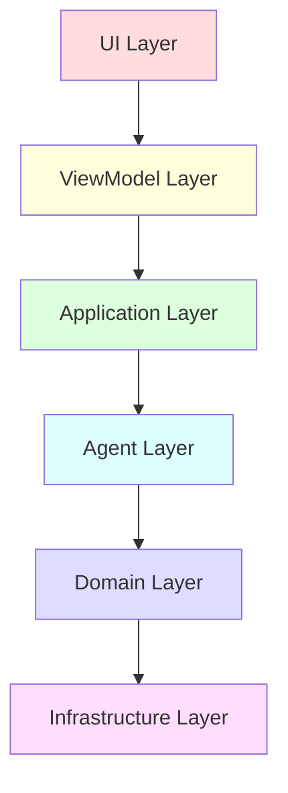
```mermaid
flowchart TD
    UI[UI Layer] --> VM[ViewModel Layer]
    VM --> App[Application Layer]
    App --> Agent[Agent Layer]
    Agent --> Domain[Domain Layer]
    Domain --> Infra[Infrastructure Layer]

    style UI fill:#fdd
    style VM fill:#ffd
    style App fill:#dfd
    style Agent fill:#dff
    style Domain fill:#ddf
    style Infra fill:#fdf
```

Arrows point downward only. No layer imports from a layer above it.

### Component Ownership

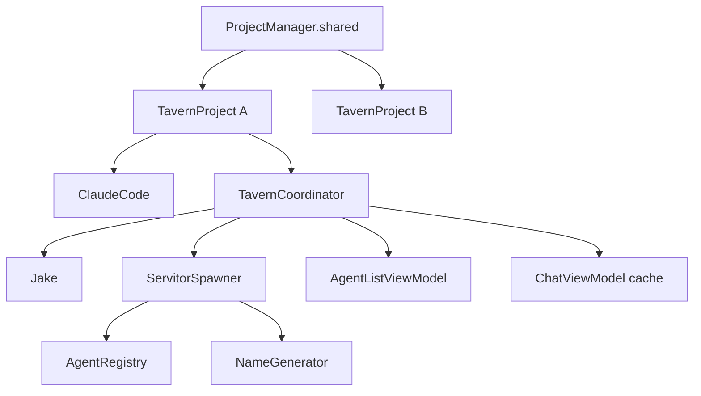
```mermaid
flowchart TD
    PM[ProjectManager.shared] --> TP1[TavernProject A]
    PM --> TP2[TavernProject B]

    TP1 --> CC1[ClaudeCode]
    TP1 --> TC1[TavernCoordinator]

    TC1 --> Jake1[Jake]
    TC1 --> SS1[ServitorSpawner]
    TC1 --> ALVM1[AgentListViewModel]
    TC1 --> CVM1["ChatViewModel cache"]

    SS1 --> AR1[AgentRegistry]
    SS1 --> NG1[NameGenerator]
```

## 4. Open Questions

- **Multi-project/Jake-per-project:** Resolved: One Jake per project (per directory). Jake's purview is the directory it's in and down.

- **GUI-less core:** Resolved: The testing suite serves as the second UI into core. No separate TUI needed.

- **Distribution:** Resolved: Source-code-only distribution. No builds or packages distributed.

## 5. Coverage Gaps

- **Build system specification:** The redo build scripts are documented in CLAUDE.md but not formally specified. Redo script behavior (dependency tracking, caching) is not specified.

---

# §004 — Agents Specification

**Status:** complete
**Last Updated:** 2026-02-16

## Upstream References
- PRD: §4.1 (Agent Types), §4.2 (Agent States), §4.3 (Task Modes)
- Reader: §3 (Core Concepts), §5 (Architecture Notes — sidecar pattern, two-level orchestration)
- Transcripts: transcript_2026-01-19-1144.md (agent types, task modes), transcript_2026-01-28-jake-spawn-tool.md (two-level orchestration)

## Downstream References
- ADR: ADR-001-shape-selection.md
- Code: Tavern/Sources/TavernCore/Agents/ (Jake.swift, Servitor.swift, ServitorSpawner.swift)
- Tests: Tavern/Tests/TavernCoreTests/, Tavern/Tests/TavernTests/

---

## 1. Overview
Servitor types (Jake daemon, mortal servitors, drones, monitor daemons), their states, task modes, and the async/non-blocking I/O pattern. Defines how the Tavern manages its own trees of servitors, each running a Claude session that may internally have its own agents and subagents.

## 2. Requirements

### REQ-AGT-001: Jake Daemon Agent
**Source:** PRD §4.1
**Priority:** must-have
**Status:** specified

**Properties:**
- Jake is the top-level coordinating daemon servitor — exactly one per open project
- Jake's lifecycle is tied to the project: starts when the project opens, stops when it closes
- Jake has the highest authority to summon and manage other servitors
- Jake has few direct capabilities himself — he coordinates, not executes
- Jake's session persists across app restarts (keyed per-project in UserDefaults)
- Jake has the authority to delegate capabilities to servitors, with stipulations enforced by the deterministic shell (see §021 Capability Delegation)
- Jake cannot delegate capabilities beyond what he himself has

**Testable assertion:** When a project is opened, Jake is instantiated. When the project closes, Jake is stopped. Jake's session persists across app restarts.

### REQ-AGT-002: Mortal Agents (Servitors)
**Source:** PRD §4.1
**Priority:** must-have
**Status:** specified

**Properties:**
- Mortal servitors are task-scoped — their lifecycle is bound to task completion
- Mortal servitors can summon children, forming tree structures of arbitrary depth (Erlang-style)
- Parent-child relationships are tracked
- Called "Servitors" in the codebase and "The Regulars" in Jake's vocabulary
- These servitors are children of Jake — this is a fundamental property
- Immortal servitors (daemons) are always resuscitated when their session context becomes invalid — daemon resuscitation is a key property
- Resuscitated servitors can either run stateless or persist their state frequently, providing context to the replacement session

**Testable assertion:** A mortal servitor can be summoned, receives an assignment, works on it, and transitions to done. A mortal servitor can summon child servitors. Parent-child relationships are tracked. Daemon servitors are resuscitated when their session context becomes invalid.

### REQ-AGT-003: Drone Agents
**Source:** PRD §4.1
**Priority:** deferred
**Status:** specified

**Properties:**
- Drones complete exactly one task, then auto-terminate
- Drones use cheaper models and are cheap to fail (Meeseeks pattern)
- No recovery attempt on failure

**Testable assertion:** Deferred. When implemented: drone completes exactly one task, then auto-terminates. Drone failure is cheap (no recovery attempt).

### REQ-AGT-004: Monitor Daemons
**Source:** PRD §4.1
**Priority:** deferred
**Status:** specified

**Properties:**
- Monitor daemons run in the background, reporting to Jake
- Monitor daemons do not accept user tasks
- Monitor daemons track system health, servitor progress, and spending
- These are children of Jake, fundamentally — this is a key property

**Testable assertion:** Deferred. When implemented: monitor daemons run in background, report to Jake, do not accept user tasks.

### REQ-AGT-005: Agent State Machine
**Source:** PRD §4.2
**Priority:** must-have
**Status:** specified

**Properties:**
- Every servitor has exactly one state at any time: Summoned, Working, Waiting for Input, Waiting for Wakeup, Done/DismissedReaped, or FailedReaped
- Summoned is the initial state — servitors transition from Summoned to Working when they begin execution
- DismissedReaped = successful dismissal (completed work or dismissed by parent); FailedReaped = error termination
- Both reaped states transition to GC (garbage collection)
- Only valid transitions are permitted; invalid transitions produce an error
- State transitions logged in debug only
- Done requires verified commitments (REQ-DET-004); self-assessment has no bearing
- See §019 for canonical state machine

**Testable assertion:** Given a servitor in state X, only valid transitions to states Y are permitted. Attempting an invalid transition produces an error. State transitions are logged in debug builds.

### REQ-AGT-006: Task Modes
**Source:** PRD §4.3
**Priority:** must-have
**Status:** specified

**Properties:**
- Servitors can operate in five task modes: Execute, Delegate, Plan, Break up, Unify
- A servitor can switch between any modes at any point during execution
- Mode transitions are observable and logged
- The current mode is queryable

Pin: Task modes need further design discussion and fleshing out.

**Testable assertion:** A servitor can transition between any task modes. Mode transitions are observable and logged. The current mode is queryable.

### REQ-AGT-007: Servitor Trees vs Claude-Internal Agents
**Source:** Reader §3 (Two-Level Orchestration Model)
**Priority:** must-have
**Status:** specified

**Properties:**
- The Tavern manages its own trees of servitors — these are Tavern-managed entities with tracked lifecycle, state, and parent-child relationships
- Each servitor runs a Claude session that may internally have its own agents and subagents
- Tavern does not wrap or abstract Claude's internal agent/subagent mechanism — whatever happens inside a Claude session is opaque to the Tavern
- The distinction is: Tavern servitors (managed by Tavern's tree, visible in sidebar, persisted) vs internal session agents (opaque, ephemeral from Tavern's perspective)

**Testable assertion:** Tavern servitors appear in the agent list and persist across app restarts. Claude-internal agents within a servitor's session are not visible in the Tavern UI.

### REQ-AGT-008: Async/Non-Blocking I/O Pattern
**Source:** Reader §9 (Sidecar Pattern), ADR-001
**Priority:** must-have
**Status:** specified

**Properties:**
- Servitor state management never blocks — I/O operations (Anthropic API calls) are async and non-blocking
- Promises for future values enable restart points and non-blocking coordination
- A global semaphore limits concurrent Anthropic calls (~10) to prevent thread pool starvation
- No servitor's I/O can block another servitor's state management
- Configurable timeout for servitor pause without issuing wait/done signal — servitor is either prodded to respond or reaped. See §019 REQ-STM-006.

**Testable assertion:** Servitor state management methods return immediately (never block). All SDK/API calls are async. Global semaphore is respected (concurrent calls do not exceed limit).

### REQ-AGT-009: Done Signal Detection
**Source:** Reader §3 (Mortal Agents), CLAUDE.md
**Priority:** must-have
**Status:** specified

**Properties:**
- Mortal servitors detect done signals (`DONE`, `COMPLETED`) in their responses
- Done signal triggers a request to check commitment. Commitment verification may pass (servitor transitions to Done/DismissedReaped) or fail (servitor is sent back to work with a gap report describing what failed)
- A waiting signal (`WAITING`, `NEED INPUT`) transitions the servitor to `.waiting` state
- Responses without these signals leave the servitor in working state

**Testable assertion:** A response containing `DONE` triggers verification flow. Verification pass → DismissedReaped. Verification fail → sent back to work with gap report. A response containing `WAITING` transitions to waiting state.

### REQ-AGT-010: Agent Protocol
**Source:** CLAUDE.md (Agent Layer)
**Priority:** must-have
**Status:** specified

**Properties:**
- All agent types conform to a common `Agent` protocol (shared interface for sending messages, querying state, managing sessions)
- Any type conforming to `Agent` can be used interchangeably in `ChatViewModel` and `TavernCoordinator`
- `MockAgent` conforms to `Agent` protocol for testing

**See also:** §3.2.9 (dependency injection strategy)

**Testable assertion:** `MockAgent` conforms to `Agent` protocol and can be substituted for any real agent in tests. `ChatViewModel` works identically with Jake, Servitor, or MockAgent.

## 3. Properties Summary

### Servitor Type Properties

| Property | Jake | Servitor | Drone (deferred) | Monitor (deferred) |
|----------|------|----------|-------------------|-------------------|
| Lifecycle | Daemon (project-bound) | Mortal (task-bound) | Single-task | Daemon (background) |
| Can spawn children | Yes | Yes | No | No |
| Persists across restart | Yes | Yes | No | Yes |
| Accepts user tasks | No (coordinates) | Yes | Yes (one) | No |

### Servitor State Machine

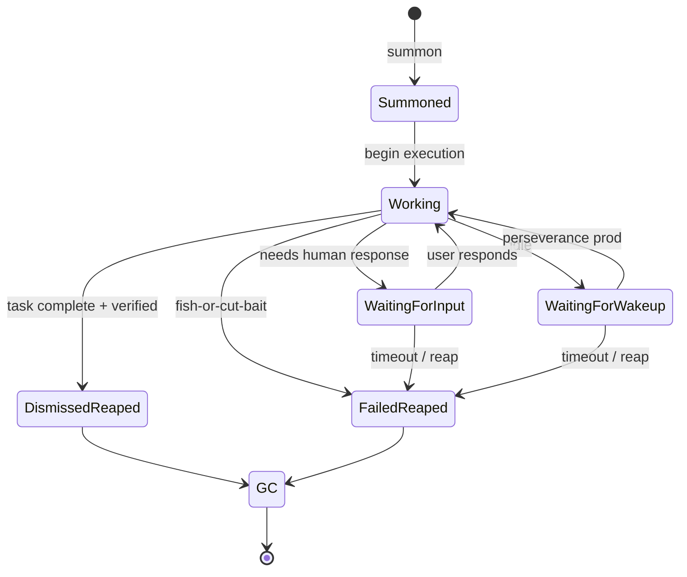
```mermaid
stateDiagram-v2
    [*] --> Summoned : summon
    Summoned --> Working : begin execution
    Working --> WaitingForInput : needs human response
    Working --> WaitingForWakeup : idle
    Working --> DismissedReaped : task complete + verified
    Working --> FailedReaped : fish-or-cut-bait
    WaitingForInput --> Working : user responds
    WaitingForInput --> FailedReaped : timeout / reap
    WaitingForWakeup --> Working : perseverance prod
    WaitingForWakeup --> FailedReaped : timeout / reap
    DismissedReaped --> GC
    FailedReaped --> GC
    GC --> [*]
```

### Tavern Servitors vs Claude-Internal Agents

| Property | Tavern Servitors | Claude-Internal Agents |
|----------|-----------------|----------------------|
| Visibility | Sidebar, dashboard | Invisible to Tavern |
| Persistence | Across sessions | Ephemeral (session-scoped) |
| Session | Own Claude session | Within parent's session |
| Managed by | Tavern tree | Claude session internals |

## 4. Open Questions

- **?4 -- Agent "Done" Assertion:** Resolved: Done signal triggers commitment test. Pass → DismissedReaped. Fail → sent back to work with gap report describing what failed.

- **?6 -- Perseverance Prompts and Agent Lifecycle:** Resolved: Infinite loop. Only Done exits (after verification). Any wait attempt gets a perseverance response. See §019.

- **Model selection:** Pinned: Model selection is orthogonal — any session can use any model. Needs PRD + spec. See §019 pinned items.

- **Failure boundaries:** Resolved: See §020 Servitor Trees for Erlang-style supervision strategies.

- **Agent limits:** Resolved: Token budgets and delegated capabilities limit servitors. See §020, §021.

## 5. Coverage Gaps

- **Child servitor failure propagation:** See §020 Servitor Trees for Erlang-style supervision strategies.

- **Servitor resource limits:** See §020 (token budgets) and §021 (capability delegation).

---

# §005 — Spawning Specification

**Status:** complete
**Last Updated:** 2026-02-16

## Upstream References
- PRD: §6.2 (Agent Spawn Configuration), §6.3 (Work Queues), §7 (Agent Naming)
- Reader: §3 (Two-Mode Agent Spawning, Agent Naming, Chat Description)
- Transcripts: transcript_2026-01-19-1144.md (naming themes), transcript_2026-01-27-testing-principles.md (two-mode spawn, chat description), transcript_2026-01-28-jake-spawn-tool.md (spawn tool)

## Downstream References
- ADR: --
- Code: Tavern/Sources/TavernCore/Agents/ServitorSpawner.swift, Tavern/Sources/TavernCore/Naming/, Tavern/Sources/TavernCore/Coordination/
- Tests: Tavern/Tests/TavernCoreTests/, Tavern/Tests/TavernTests/

---

## 1. Overview
Servitor summoning, naming themes, work queue management, and summon configuration. Covers the two summon modes (user-summon vs Jake-summon), the theatrical naming system with themed name generators, how work is queued and distributed, and the full set of summon-time parameters.

## 2. Requirements

### REQ-SPN-001: Summon Configuration Parameters
**Source:** PRD §6.2
**Priority:** must-have
**Status:** specified

**Properties:**
- A summon call accepts these optional parameters: assignment, sandbox config, model selection, token budget, work queue attachment, commitments to prefill, done behavior
- For Jake-summon, assignment is required; for user-summon, no parameters are required
- Omitted parameters receive sensible defaults
- Each parameter, when provided, is reflected in the resulting servitor's configuration
- Capability delegation is separate from summon — see §021

**Testable assertion:** A summon call with each parameter set correctly creates a servitor with those parameters applied. A summon call with default parameters creates a servitor with sensible defaults.

### REQ-SPN-002: User-Summon Mode
**Source:** Reader §3 (Two-Mode Agent Spawning)
**Priority:** must-have
**Status:** specified

**Properties:**
- A user-summoned servitor has no assignment
- A user-summoned servitor starts in chat mode
- A user-summoned servitor does not begin working until the user sends a message
- Summoning is instant — no dialogs, no intermediate UI

**See also:** §4.2.7 (servitor trees)

**Testable assertion:** Clicking `+` creates a servitor immediately (no modal dialog). The new servitor has no assignment. The servitor does not begin working until the user sends a message.

### REQ-SPN-003: Jake-Summon Mode
**Source:** Reader §3 (Two-Mode Agent Spawning)
**Priority:** must-have
**Status:** specified

**Properties:**
- A Jake-summoned servitor has an assignment
- A Jake-summoned servitor begins working immediately without waiting for user input
- A Jake-summoned servitor starts in perseverance mode
- Jake-summoned servitors may receive an assignment to: work on a task, ask the user a question, say something, or wait for user input
- Capability grants are conditional on the summon call — the parent must tick that box in the summon call with assignment

**See also:** §4.2.7 (servitor trees), §021 (capability delegation)

**Testable assertion:** A `summon_servitor` call with an assignment creates a servitor that immediately begins working. The servitor does not wait for user input before starting.

### REQ-SPN-004: Naming Theme Assignment
**Source:** PRD §7
**Priority:** should-have
**Status:** specified

**Properties:**
- Each tree gets a name set assigned to the top-level servitor
- All children in that tree draw names from the same set
- If the set is depleted, the top servitor requests another name set from Jake
- Multiple trees may share a name set, requiring concurrency management
- Different trees may have different themes

**Testable assertion:** All servitors in the same tree share a name set. If the set is depleted, a new set is requested. Different trees may have different themes.

### REQ-SPN-005: Global Name Uniqueness
**Source:** PRD §7
**Priority:** must-have
**Status:** specified

**Properties:**
- Every mortal servitor has a globally unique name across the entire system (all projects, all trees)
- A servitor can be identified by name alone — no path addressing is required
- Name lookup by string returns exactly one servitor or none
- Root servitors of trees must coordinate on name usage within shared name sets
- The deterministic shell can enforce name locking before servitor creation to maintain uniqueness

**Testable assertion:** No two servitors share the same name. Name lookup by string returns exactly one servitor or none.

### REQ-SPN-006: Tier Depletion
**Source:** PRD §7
**Priority:** should-have
**Status:** specified

**Properties:**
- Tier 1 is a set of name sets. Jake rotates through assigning name sets from tier 1 to new trees until depleted or the user unlocks higher tiers.
- Lower tiers are exhausted before higher tiers are used
- Names within each tier are not repeated
- Tier depletion ordering is deterministic (same summon sequence produces same names)

**Testable assertion:** The first servitors summoned in a theme receive tier-1 names. After tier-1 is exhausted, tier-2 names are used. Names within each tier are not repeated.

### REQ-SPN-007: Easter Egg Names
**Source:** PRD §7
**Priority:** should-have
**Status:** specified

**Properties:**
- Some naming themes contain names that only appear after enough servitors have been summoned to exhaust earlier tiers
- High concurrency is rewarded with humor

**Testable assertion:** Specific themes have names that only appear after a threshold number of servitors. (Theme-specific, verified per naming theme.)

### REQ-SPN-008: Work Queues
**Source:** PRD §6.3
**Priority:** deferred
**Status:** specified

**Properties:**
- Work queues live in the document store
- Parents create queues; servitors attach to them at summon or mid-task
- When a queue item appears, the attached servitor fires immediately
- Empty-queue behavior is deterministic (idle, hibernate, terminate, etc.) and specified at attachment time

**Testable assertion:** Deferred for v1. When implemented: creating a queue item triggers the attached servitor. A servitor with empty-queue instructions follows them when the queue drains.

### REQ-SPN-009: Chat Description
**Source:** Reader §3 (Chat Description)
**Priority:** must-have
**Status:** specified

**Properties:**
- Every servitor has a mutable chat description visible in the sidebar
- Both the user and the servitor (via tools) can alter the description at any time
- The description includes the original ask plus current status
- The description persists across app restarts

**Testable assertion:** The chat description is visible in the sidebar. The user can edit it. The servitor can update it via a tool call. The description persists across app restarts.

### REQ-SPN-010: Auto-Generated Names
**Source:** CLAUDE.md (MCP Tools)
**Priority:** must-have
**Status:** specified

**Properties:**
- When `summon_servitor` is called without a `name`, a name is auto-generated from the current naming theme
- Auto-generated names follow the theme's tier depletion rules (REQ-SPN-006)
- Auto-generated names are globally unique (REQ-SPN-005)

**Testable assertion:** `summon_servitor` without a name produces a servitor with a non-nil, theme-appropriate name. The name is unique.

## 3. Properties Summary

### Summon Mode Properties

| Property | User-Summon | Jake-Summon |
|----------|-----------|------------|
| Has assignment | No | Yes (required) |
| Initial mode | Chat | Perseverance |
| Begins working | After user's first message | Immediately |
| Summoning UI | Instant, no dialogs | Invisible (tool call) |

### Naming Properties

| Property | Holds When | Violated When |
|----------|-----------|---------------|
| Global uniqueness | No two servitors share a name, system-wide | Name collision across any project or tree |
| Tier depletion | Tier N+1 names only appear after tier N is exhausted | Higher-tier name used while lower-tier names remain |
| Theme consistency | All servitors in a tree use the same theme | A servitor's name doesn't match its tree's theme |
| Deterministic ordering | Same summon sequence → same names | Non-deterministic name selection |

## 4. Open Questions

- **Model selection:** Resolved: Orthogonal to the servitor. Can be set by user, Jake, or servitor.

- **Token budget:** Resolved: Fine-tuning needed, but servitors get periodic updates. Pinned for detailed design.

- **Done behavior:** Resolved: Three flags — check work queue and wait idle if empty, dismiss, or just wait idle. A daemon may periodically check queues and wake idle servitors.

- **Summon failure:** Resolved: Parent gets notified of the event (same as completion or reaping notifications).

- **Maximum count:** Resolved: No maximum. Deal with it.

- **Migration:** Resolved: No servitor migration. Cross-tree communication via capability grants.

## 5. Coverage Gaps

- **Summon failure handling:** Resolved: Parent receives notification on summon failure.

- **Maximum servitor count:** Resolved: No maximum.

- **Servitor migration:** Resolved: No migration. Cross-tree communication via §021.

---

# §006 — Lifecycle Specification

**Status:** complete
**Last Updated:** 2026-02-16

## Upstream References
- PRD: §12 (Fish or Cut Bait), §13 (Rewind and Branch)
- Reader: §8 (Dead Agents Leave Bodies), §4 (Completing Work)
- Transcripts: --

## Downstream References
- ADR: --
- Code: Tavern/Sources/TavernCore/Agents/ (partial implementation)
- Tests: --

---

## 1. Overview
Agent lifecycle management including the "fish or cut bait" decision pattern, rewind-and-branch capabilities, and dead agent artifact preservation. Defines how agents are terminated when unproductive, how work can be rewound and branched, and how dead agents leave traceable artifacts.

## 2. Requirements

### REQ-LCM-001: Fish-or-Cut-Bait Triggers
**Source:** PRD §12
**Priority:** must-have
**Status:** specified

**Properties:**
- The system detects unproductive agents rather than allowing them to continue indefinitely
- Five trigger conditions exist: token budget exceeded, changeset fundamentally wrong, agent spinning, entire gang on wrong path, the servitor decides to abort (self-termination)
- Each trigger condition is detectable programmatically
- When a trigger fires, the agent transitions to Failed/Reaped state
- The parent is notified with the specific trigger reason
- An optional restart with different parameters is available (parent or user decides)

**See also:** §4.2.5 (base agent state machine), §4.2.9 (done signal detection), §8.2.4 (commitment verification)

**Testable assertion:** Each trigger condition can be detected programmatically. When a trigger fires, the agent transitions to Failed/Reaped state. The parent is notified with the trigger reason.

### REQ-LCM-002: Token Budget Enforcement
**Source:** PRD §12
**Priority:** must-have
**Status:** specified

**Properties:**
- Every agent has a token budget set at spawn time
- An agent cannot consume unbounded tokens — exceeding the budget fires the fish-or-cut-bait trigger
- Budget overshoot is bounded (the agent does not consume 10x its budget before stopping)
- The budget accounts for the agent's own API calls

**Testable assertion:** An agent with a token budget of N stops after consuming approximately N tokens. The budget overshoot is bounded.

### REQ-LCM-003: Spin Detection
**Source:** PRD §12
**Priority:** should-have
**Status:** specified

**Properties:**
- An agent that makes N identical or near-identical tool calls in succession without producing new artifacts is considered spinning
- The detection threshold N is configurable
- Spin detection triggers the fish-or-cut-bait flow (REQ-LCM-001)

**Testable assertion:** An agent that makes the same tool call N times in succession triggers spin detection. The detection threshold is configurable.

### REQ-LCM-004: Dead Agent Artifacts
**Source:** Reader §8 (Dead Agents Leave Bodies)
**Priority:** must-have
**Status:** specified

**Properties:**
- Dead agents (completed, failed, or reaped) leave persistent artifacts for review and debugging
- The agent's tile persists in the sidebar showing its final state
- The user can view the agent's final state, conversation history, and outputs after death
- Dead agent artifacts are not immediately cleaned up — initial cleanup is manual

**Testable assertion:** After an agent is reaped, its entry remains in the sidebar with a "dead" indicator. The user can view the agent's final state, conversation history, and any outputs.

### REQ-LCM-005: Rewind Capability
**Source:** PRD §13
**Priority:** deferred
**Status:** specified

**Properties:**
- Agent state can be checkpointed at any point
- Rewinding to a checkpoint restores the agent's conversation state and changeset to that point
- The original state is not destroyed by rewinding
- Erlang-style gang termination via capability — agents may fire off a team and if any one fails, the whole gang is terminated and restarted quickly
- Artifacts must be preserved in changeset drafts for debugging
- See §020 Servitor Trees for detailed supervision strategies

**Testable assertion:** Deferred. When implemented: a checkpoint can be created at any point. Rewinding to a checkpoint restores the agent and its changeset to that point.

### REQ-LCM-006: Branch Capability
**Source:** PRD §13
**Priority:** deferred
**Status:** specified

**Properties:**
- Branching from a checkpoint creates an independent copy with a tweaked prompt
- The original timeline is preserved; changes in one branch do not affect the other
- Multiple branches can exist simultaneously

**Testable assertion:** Deferred. When implemented: branching from a checkpoint creates an independent copy. Changes in one branch do not affect the other.

### REQ-LCM-007: Agent Expiration and Hibernation
**Source:** Reader §4 (Completing Work)
**Priority:** should-have
**Status:** specified

**Properties:**
- Mortal agents transition to done/expired or hibernation when tasks complete
- Jake is notified when any agent completes, ensuring no open loops go unhandled
- The dashboard accurately reflects completed vs in-progress vs pending work at all times

**Testable assertion:** A completed agent transitions to done state and is marked as expired or hibernating. Jake is notified when an agent completes. Incomplete tasks are tracked.

## 3. Properties Summary

### Lifecycle Properties

| Property | Holds When | Violated When |
|----------|-----------|---------------|
| Bounded token consumption | Agent stops at or near budget | Agent consumes unbounded tokens |
| Spin detection | Repeated identical actions trigger reaping | Agent loops indefinitely without detection |
| Dead body persistence | Reaped/completed agents remain viewable | Dead agent's state disappears |
| Parent notification | Parent knows when child is reaped and why | Child reaped silently |
| No open loops | Jake tracks all incomplete work | Completed agent's unfinished tasks forgotten |

### Agent Lifecycle State Machine

Note: See §019 for canonical state machine. This graph is a simplified lifecycle view.

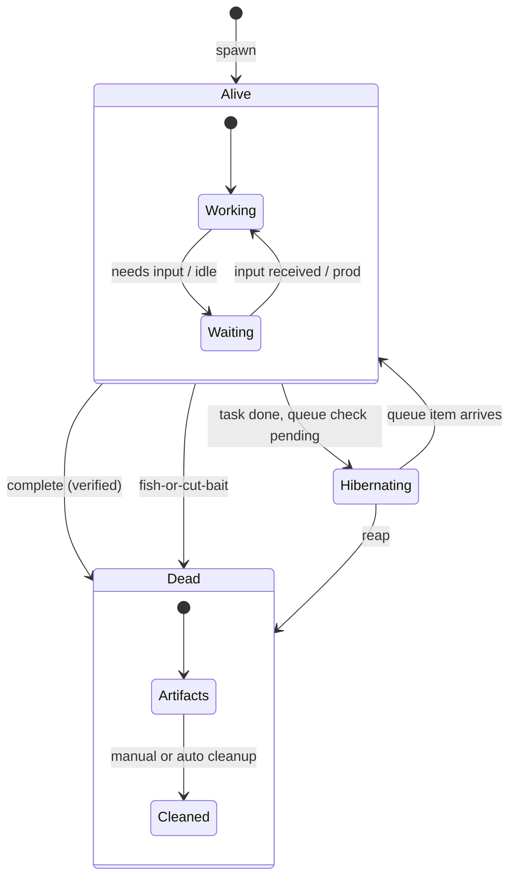
```mermaid
stateDiagram-v2
    [*] --> Alive : spawn
    Alive --> Dead : complete (verified)
    Alive --> Dead : fish-or-cut-bait
    Alive --> Hibernating : task done, queue check pending

    state Alive {
        [*] --> Working
        Working --> Waiting : needs input / idle
        Waiting --> Working : input received / prod
    }

    state Dead {
        [*] --> Artifacts
        Artifacts --> Cleaned : manual or auto cleanup
    }

    Hibernating --> Alive : queue item arrives
    Hibernating --> Dead : reap
```

## 4. Open Questions

- **Rewind storage:** Resolved: Set at runtime per sandbox rules. Can mean conversation history only, whole changeset, or other distinctions.

- **Branch limit:** Resolved: No limits.

- **Automatic reaping:** Resolved: Keep artifacts unless space concerns arise. Manual cleanup initially.

- **Gang-level fish-or-cut-bait:** Resolved: Parent agent may decide to cut bait at the whole gang level. See §020.

- **Resummoned servitor:** Resolved: System prompt tells it as much and provides as much context as possible.

- **Hibernation:** Resolved: Hibernation is waiting idle.

## 5. Coverage Gaps

- **Gang-level fish-or-cut-bait:** Resolved: See §020 Servitor Trees for gang-level supervision strategies.

- **Restart parameters:** When an agent is restarted after FOCB, what changes? Different prompt? Different model? Different budget? The PRD says "kill and restart" but does not specify what varies.

- **Hibernation triggers:** Resolved: Hibernation is waiting idle. No separate trigger distinction needed.

---

# §007 — Operating Modes Specification

**Status:** complete
**Last Updated:** 2026-02-16

## Upstream References
- PRD: §4.4 (Operating Modes), §5.2 (Attention Model)
- Reader: §3 (Perseverance Mode vs Chat Mode), §4 (Zooming In and Out)
- Transcripts: transcript_2026-01-19-1144.md (perseverance, chat, zoom), transcript_2026-01-27-testing-principles.md (two-mode spawn)

## Downstream References
- ADR: --
- Code: Tavern/Sources/TavernCore/Chat/, Tavern/Sources/TavernCore/Agents/
- Tests: Tavern/Tests/TavernCoreTests/

---

## 1. Overview
Perseverance mode vs chat mode, attention management, and the calling/hanging-up protocol. Defines how servitors operate in different contexts and how the system manages user attention across concurrent servitor activity.

Note: The canonical state/mode model is defined in §019 Servitor States & Modes. This module's state/mode content is retained for historical context but §019 is authoritative.

## 2. Requirements

### REQ-OPM-001: Perseverance Mode
**Source:** PRD §4.4
**Priority:** must-have
**Status:** specified

**Properties:**
- A servitor in perseverance mode operates in the background
- A servitor in perseverance mode never remains idle indefinitely — the system sends auto-continuation prompts when the servitor stops
- A servitor in perseverance mode does not generate user-facing notifications unless it explicitly invokes an attention-requesting tool
- Perseverance mode is the default for servitors working heads-down on assignments

**See also:** §4.2.5 (base agent state machine)

**Testable assertion:** A servitor in perseverance mode receives an auto-continuation prompt within a configurable interval after stopping. The servitor does not generate user-facing notifications unless it explicitly invokes an attention-requesting tool.

### REQ-OPM-002: Chat Mode
**Source:** PRD §4.4
**Priority:** must-have
**Status:** specified

**Properties:**
- A servitor in chat mode appears in an active chat window
- A servitor in chat mode does not receive auto-continuation prompts
- When a servitor in chat mode stops, the user is notified
- The servitor waits for user input before continuing

**See also:** §4.2.5 (base agent state machine), §4.2.9 (done signal detection)

**Testable assertion:** A servitor in chat mode does not receive auto-continuation prompts. When the servitor stops, a notification is surfaced to the user. The servitor waits for user input before continuing.

### REQ-OPM-003: User Joining/Leaving
**Source:** PRD §5.2, Reader §4
**Priority:** must-have
**Status:** specified

**Properties:**
- The user joins and leaves servitor sessions. This is technically orthogonal from perseverance and backgrounding.
- User joining = servitor is notified user is present. User leaving = servitor is notified user is absent.
- A servitor always knows whether a user is present (the servitor's awareness is deterministic, not inferred)
- Joining/leaving produce deterministic system messages: "user joined" on join, "user left" on leave
- Joining does not force a mode change — user presence is independent of operating mode
- See §019 for canonical treatment of the three orthogonal properties.

**Testable assertion:** Selecting a servitor in the UI triggers a "user joined" system message. Deselecting (or closing the chat) triggers a "user left" system message. The servitor's awareness of user presence is deterministic.

### REQ-OPM-004: Attention Model
**Source:** PRD §5.2
**Priority:** must-have
**Status:** specified

**Properties:**
- Active servitors are visible in the user's view (tabs/UX)
- Servitors with pending questions display notification indicators (badges, bubbles)
- The user can join any servitor at any depth in the hierarchy
- Cogitating status is visible when a servitor is actively processing
- The interaction pattern supports rapid context-switching ("whack-a-mole" between conversations)

**Testable assertion:** Active servitors show in the user's view. Servitors with pending questions display notification indicators. Cogitating status is visible when a servitor is actively processing.

### REQ-OPM-005: Two-Mode Servitor Summoning
**Source:** Reader §3 (Two-Mode Agent Spawning)
**Priority:** must-have
**Status:** specified

**Properties:**
- This is not a mode but rather the initial prompt plus expectations
- The distinction is between user-initiated summons (user gets direct permissions) vs Jake-initiated summons (Jake's permission scope)
- Not parametrizable — just a distinction in initial configuration

**See also:** §5.2.2/§5.2.3 (summon configuration details)

**Testable assertion:** A user-summoned servitor has no assignment and is in waiting state. A Jake-summoned servitor has an assignment and immediately transitions to working state.

### REQ-OPM-006: Cogitation Display
**Source:** PRD §5.2, Reader §12 (Cogitation Verbs)
**Priority:** should-have
**Status:** specified

**Properties:**
- Use of cogitation words during working state — the UI displays a cogitation verb while a servitor is working
- Formatting/linguistic properties of the words: terms appear in natural forms; awkward -ing constructions are avoided
- Uniqueness — each servitor's words differ from others'
- Tiered access — sets of verbs gated by conditions (e.g., hours spent in app)
- Cogitation verbs are drawn from Jewish cultural and linguistic traditions (711 entries across Yiddish, Hebrew, Ladino, Judeo-Arabic, Talmudic Aramaic, Kabbalistic terminology, and diaspora communities)

**Testable assertion:** When a servitor is in working state, a cogitation verb is displayed in the UI. The verb is selected from the approved vocabulary list. No two servitors display the same verb simultaneously.

## 3. Properties Summary

### Mode Properties

Note: This table conflates orthogonal states. The canonical model in §019 treats backgrounding, perseverance, and user presence as independent boolean properties.

| Property | Perseverance Mode | Chat Mode |
|----------|------------------|-----------|
| Auto-continuation | Yes — system prompts on stop | No — servitor waits for user |
| User notifications | Only on explicit tool call | On every stop |
| Background operation | Yes | No — visible in active window |
| Default for | Jake-summoned servitors | User-summoned servitors |

### Mode Transition Properties

| Property | Holds When | Violated When |
|----------|-----------|---------------|
| Servitor awareness | Servitor receives deterministic "joined"/"left" messages | Servitor must infer user presence |
| User control | Only user actions trigger presence transitions | System or servitor initiates presence change without user |
| Presence tracking | Servitor knows whether user is present | Servitor in wrong state regarding user presence |

### Operating Mode State Machine

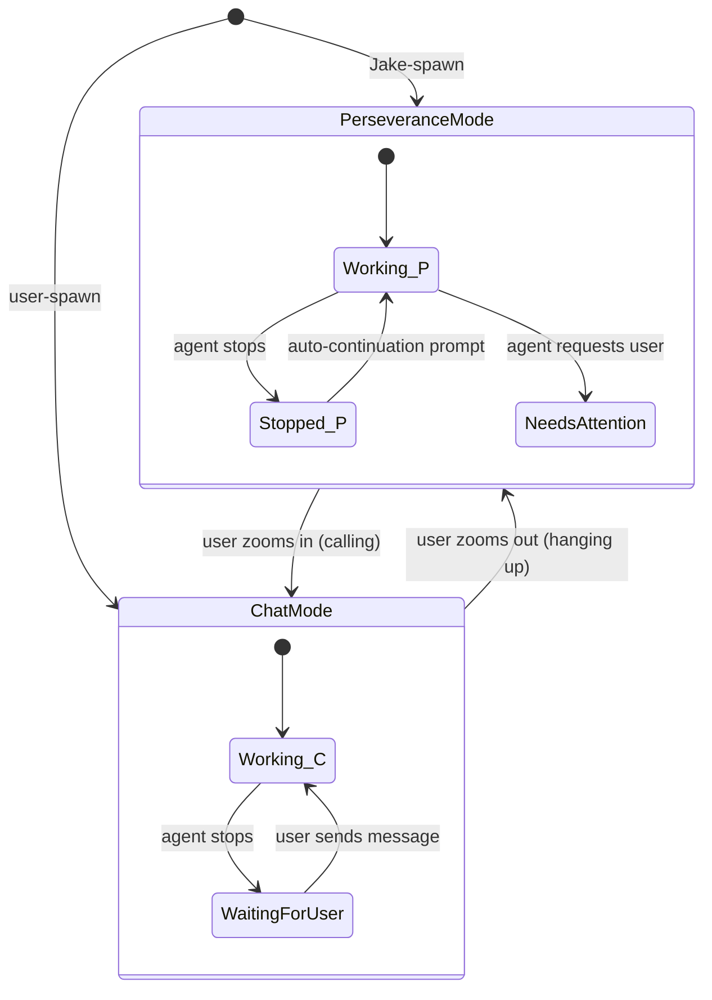
```mermaid
stateDiagram-v2
    [*] --> PerseveranceMode : Jake-spawn
    [*] --> ChatMode : user-spawn

    PerseveranceMode --> ChatMode : user zooms in (calling)
    ChatMode --> PerseveranceMode : user zooms out (hanging up)

    state PerseveranceMode {
        [*] --> Working_P
        Working_P --> Stopped_P : agent stops
        Stopped_P --> Working_P : auto-continuation prompt
        Working_P --> NeedsAttention : agent requests user
    }

    state ChatMode {
        [*] --> Working_C
        Working_C --> WaitingForUser : agent stops
        WaitingForUser --> Working_C : user sends message
    }
```

## 4. Open Questions

- **?6 -- Perseverance Prompts:** Resolved: Infinite loop until confirmed done or prematurely terminated. Contents specified in §019.

- **?7 -- User Consent for New Chats:** Resolved: No focus-stealing. Grounded in user preferences, context, and per-servitor rules.

- **Mode persistence across restart:** Resolved: Modes persist across restart. Pin: safe mode/pause button for the whole app.

- **Perseverance prompt contents:** Resolved: Contents specified in §019.

- **Notification prioritization:** Resolved: Separate spec topic — not just about state/mode. Pinned for future design.

## 5. Coverage Gaps

- **Auto-continuation prompt design:** The PRD establishes perseverance mode but does not specify the prompt contents, frequency, or failure conditions for auto-continuation.

- **Notification priority:** When multiple agents simultaneously need attention, how are notifications ordered? PRD §5.5 covers question triage but not notification prioritization.

---

# §008 — Deterministic Shell Specification

**Status:** complete
**Last Updated:** 2026-02-16

## Upstream References
- PRD: §4.7 (Deterministic Shell)
- Reader: §3 (Jake's JSON Response Format), §9 (Sidecar Pattern)
- Transcripts: transcript_2026-01-28-jake-spawn-tool.md (JakeToolHandler protocol, continuation loop)

## Downstream References
- ADR: --
- Code: Tavern/Sources/TavernCore/Commitments/ (Commitment.swift, CommitmentList.swift, CommitmentVerifier.swift), Tavern/Sources/TavernCore/MCP/TavernMCPServer.swift
- Tests: Tavern/Tests/TavernCoreTests/

---

## 1. Overview
The deterministic shell wraps non-deterministic LLM agents with deterministic infrastructure for prompt composition, passthrough display, structured tool use, and commitment verification. The goal is to minimize reliance on non-deterministic LLM behavior by pushing correctness concerns into code.

## 2. Requirements

### REQ-DET-001: Prompt Composition
**Source:** PRD §4.7.1
**Priority:** must-have
**Status:** specified

**Properties:**
- Agent prompts are constructed by deterministic code, not by previous agent responses
- Each message to an agent includes all necessary context regardless of conversation history length
- The system never relies on the agent "remembering" previous instructions
- Invariants in prompts are enforced by the system, even when a parent servitor composes the prompt to a child

**Testable assertion:** System prompts include all required instructions regardless of conversation history length. No prompt depends on the agent having seen prior messages.

### REQ-DET-002: Passthrough Display
**Source:** PRD §4.7.2
**Priority:** must-have
**Status:** specified

**Properties:**
- All content blocks the user sees are passthrough — not reinterpreted by any agent
- Agent responses (thinking blocks, messages) shown verbatim as received
- Tool call responses rendered by deterministic components in the app
- User can trust that blocks are not hallucinated — data from store is verbatim, not agent interpretation
- If user views a record or file on disk, it is rendered accurately from the data store, and everything inside that block is guaranteed not hallucinated
- Content shown to the user from the doc store is byte-identical to the file on disk
- No LLM summarization or rephrasing occurs between storage and display

**Testable assertion:** Content displayed with a "direct from store" indicator is byte-identical to the file on disk. Agent responses are displayed as received. Tool call results are rendered by deterministic app components, not by agents.

### REQ-DET-003: Structured Outputs via Tools
**Source:** PRD §4.7.3
**Priority:** must-have
**Status:** specified

**Properties:**
- Operations requiring precision (calculations, file paths, servitor summoning) go through typed tool calls
- Tool calls have validated parameters; tool results have typed return values
- No free-text parsing is used for structured operations
- This uses at minimum structural typing, if not nominal typing (as in the type theory distinction between structural and nominal types)

**Testable assertion:** No precision operation uses free-text parsing. All such operations go through tool calls with validated parameters.

### REQ-DET-004: Commitment Verification
**Source:** PRD §4.7.4, Invariant REQ-INV-003
**Priority:** must-have
**Status:** specified

**Properties:**
- Done = agent requests commitment check. Verification may incorporate non-deterministic agent evaluation if properly surfaced to user.
- Invariant: servitor is not Complete until independently verified. Done does not equal Complete.
- An agent is Complete IFF all its commitments pass independent verification
- Verification is performed by code external to the agent's session (`CommitmentVerifier`)
- The agent's self-assessment of completion ("I'm done") has no bearing on actual completeness
- Verification failure leaves the agent in a non-complete state regardless of what the agent claims
- Both parent-assigned and agent-supplemented commitments must pass
- The parent is notified of both verification success and failure

**See also:** §4.2.5 (agent state machine transitions), §2.2.3 (independent verification invariant)

**Testable assertion:** An agent that signals DONE but fails verification remains in a non-done state. An agent that passes verification transitions to done. Verification runs shell commands external to the agent's session.

### REQ-DET-005: Commitment Storage
**Source:** PRD §4.7
**Priority:** must-have
**Status:** specified

**Properties:**
- Commitments are stored in the doc store, attached to agent nodes
- Both parent-assigned and agent-supplemented commitments are persisted
- Commitments are machine-readable (structured data, not free text)
- Commitments survive app restart

**Testable assertion:** Commitments can be created, read, and listed for any agent. Commitments survive app restart. Each commitment has a verifiable assertion.

### REQ-DET-008: MCP Tool Interface
**Source:** CLAUDE.md (MCP Tools)
**Priority:** must-have
**Status:** specified

**Properties:**
- Other servitors have access to tools as well (not just Jake)
- Structured tools include `summon_servitor` and `dismiss_servitor`
- `summon_servitor` accepts optional `assignment` and `name` parameters; auto-generates name if not provided
- Unique identifiers required for servitors, but not necessarily UUIDs
- Dismissing removes from UI only, not from registry

**Testable assertion:** `summon_servitor` with an assignment creates a working servitor. `summon_servitor` without a name auto-generates one. `dismiss_servitor` removes the servitor from the UI but not the registry.

## 3. Properties Summary

### Commitment Verification Properties

| Property | Holds When | Violated When |
|----------|-----------|---------------|
| Done does not equal Complete | Agent signals Done (requests check), Complete only after verification | Agent in Complete state with failing commitments |
| Verification independence | Verifier runs outside agent's session | Verifier uses agent's self-report |
| Failure preserves state | Failed verification leaves agent in working state | Failed verification marks agent done anyway |
| Parent notification | Parent notified on both pass and fail | Pass/fail outcome not communicated to parent |
| Commitment persistence | Commitments survive restart, stored in doc store | Commitments lost on restart or held in-memory only |

### Continuation Loop Properties

| Property | Holds When | Violated When |
|----------|-----------|---------------|
| Multi-action turns | Jake issues 2+ actions before conversation continues | Jake limited to one action per turn |
| Feedback availability | Previous action results inform next action | Actions issued without knowing prior results |
| Termination guarantee | Loop ends when handler returns nil | Loop runs indefinitely |
| Handler swappability | Replacing handler requires zero changes to Jake | Handler change requires Jake modification |

Note: Jake's multi-action turns are a property of ClodKit/Claude, not specific to Jake.

### Agent State Machine — Verification Transitions

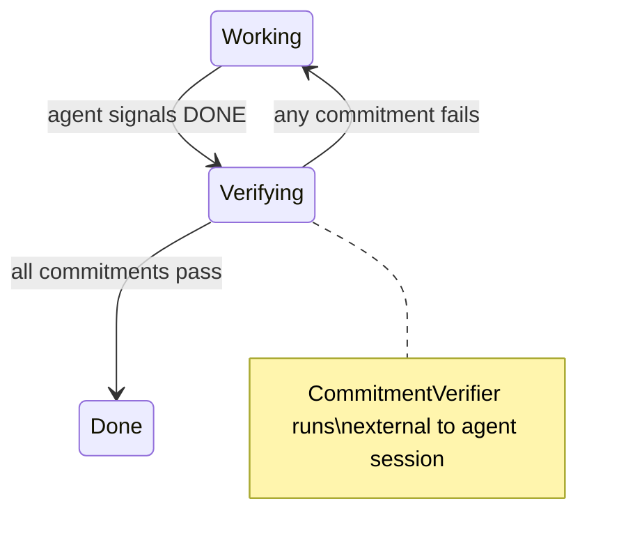
```mermaid
stateDiagram-v2
    Working --> Verifying : agent signals DONE
    Verifying --> Done : all commitments pass
    Verifying --> Working : any commitment fails
    Note right of Verifying : CommitmentVerifier runs\nexternal to agent session
```

## 4. Open Questions

- **?2 -- Deterministic Shell Meaning:** Resolved: Everything managed by the app vs a servitor. The deterministic state machines that dictate behavior and display. Deterministic rules for setting up servitors. New features follow this principle (e.g., workflow state machines).

- **Commitment assertions:** Resolved: Big TBD — vague on purpose, to be developed as we learn what works.

- **Standard tool set:** Resolved: Standard Claude tool set, modulated by capabilities. See §021.

- **Prompt composition:** Pinned for ongoing development.

## 5. Coverage Gaps

- **Prompt composition specifics:** PRD §14 lists "Prompt composition structure" as TBD. The requirement exists but the implementation details (how skills, instructions, and context are assembled) are not specified.

- **Verification timeout:** No specification for how long verification can run before it is considered failed. Long-running assertions could block the completion flow.

- **Partial verification:** No specification for what happens if some commitments pass and others fail. Is it all-or-nothing, or can partial completion be reported?

---

# §009 — Communication Specification

**Status:** complete
**Last Updated:** 2026-02-16

## Upstream References
- PRD: §5.3 (Bubbling), §5.5 (Question Triage)
- Reader: §9 (Agent Communication — message protocol, lateral collaboration, surfacing questions)
- Transcripts: transcript_2026-01-19-1144.md (bubbling concept)

## Downstream References
- ADR: --
- Code: Tavern/Sources/TavernCore/Chat/
- Tests: Tavern/Tests/TavernCoreTests/

---

## 1. Overview
Bubbling mechanism, question triage, and inter-agent communication. Defines how information flows through the agent hierarchy (upward, lateral, direct-to-user), how questions are classified and routed, and how agents collaborate through the shared workspace.

## 2. Requirements

### REQ-COM-001: Upward Bubbling
**Source:** PRD §5.3
**Priority:** must-have
**Status:** specified

**Properties:**
- Agents can escalate questions and information upward through the agent hierarchy: child → parent → grandparent → user
- Each level in the hierarchy can handle, transform, or pass through the message
- Jake is the final relay before the user
- Messages are never lost in transit — a message either reaches its destination or the sender is notified of delivery failure

**Testable assertion:** A message from a grandchild agent can reach the user through the parent and grandparent chain. Each intermediary receives the message and can either handle it or forward it upward.

### REQ-COM-002: Lateral Communication
**Source:** PRD §5.3
**Priority:** should-have
**Status:** specified

**Properties:**
- Sibling agents (children of the same parent) can exchange messages directly
- Lateral communication does not require routing through the parent
- The parent retains visibility into lateral communication (can observe, but is not a relay)
- Lateral communication is a capability granted by the parent servitor (see §021)
- Scope is configurable: siblings only, or cousins as well

**Testable assertion:** Two agents with the same parent can exchange messages directly. Messages are delivered without passing through the parent agent.

### REQ-COM-003: Direct-to-User Communication
**Source:** PRD §5.3
**Priority:** should-have
**Status:** specified

**Properties:**
- Agents can communicate directly with the user, bypassing the normal bubbling chain
- Parent agents maintain visibility into direct communication (notified that it occurred)
- Direct communication requires oversight — it is not invisible to the hierarchy

**Testable assertion:** An agent can send a message directly to the user. The parent agent is notified (or can observe) that direct communication occurred.

### REQ-COM-004: Question Classification
**Source:** PRD §5.5
**Priority:** must-have
**Status:** specified

**Properties:**
- Every question from an agent is classified as quick or deep before being surfaced
- Quick questions can be answered without reading agent state; deep questions require context
- The classification is conveyed in the notification so the user knows what they're getting into before engaging

**Testable assertion:** Questions surfaced to the user include a complexity classification. The classification is determined before the notification is shown, not after the user opens the conversation.

### REQ-COM-005: Parent-Controlled Notification Mode
**Source:** PRD §5.5
**Priority:** should-have
**Status:** specified

**Properties:**
- Parent agents choose the notification approach for their children's questions: close collaboration (per-question popup) or overseer mode (periodic summary)
- The user can override the parent's choice at any time
- The notification mode affects presentation only — it does not change which questions are surfaced

**Testable assertion:** A parent agent can configure its children's notification mode. Children's questions are surfaced according to the configured mode. The user can change the mode at any time.

### REQ-COM-006: Message Protocol Expectations
**Source:** Reader §9 (Message Protocol)
**Priority:** must-have
**Status:** specified

**Properties:**
- Each message type has a defined expected response type
- A wrong or missing response within a timeout is a signal of agent malfunction
- The protocol is symmetric: for every message type X, the expected response type is known at design time

**Testable assertion:** Each message type has a defined expected response type. An agent that responds with the wrong type or fails to respond within a timeout triggers a malfunction signal.

### REQ-COM-007: Discovery Sharing
**Source:** PRD §9.3 (also referenced in observability)
**Priority:** should-have
**Status:** specified

**Properties:**
- Agent system prompts include instructions to notice oddities and report discoveries
- Discovery sharing is prompt-engineering-based (not deterministically enforceable)
- Discovery messages are delivered to parent agents without interrupting the agent's main task

**Testable assertion:** Agent system prompts include instructions to report discoveries. Discovery messages are delivered to parent agents. (Cannot deterministically verify agent compliance — prompt-based.)

### REQ-COM-008: Jake as Communication Hub
**Source:** PRD §5.3, Reader §3
**Priority:** must-have
**Status:** specified

**Properties:**
- Jake has awareness of all agents and their states (hibernating, unfinished, backlogged)
- Jake proactively suggests that the user zoom into agents when their attention is needed
- Jake coordinates cross-tree communication

**Testable assertion:** Jake can enumerate all agents and their states. Jake generates suggestions for user attention based on agent state. Suggestions are surfaced through the chat interface.

## 3. Properties Summary

### Communication Routing Properties

| Property | Holds When | Violated When |
|----------|-----------|---------------|
| Message delivery | Every message reaches its destination or sender is notified of failure | Message silently lost in transit |
| Hierarchy respect | Upward bubbling follows parent chain | Message skips levels without explicit direct-to-user mode |
| Lateral independence | Sibling messages don't route through parent | Parent is a required relay for lateral messages |
| Parent visibility | Parent can observe all child communication (bubbled, lateral, direct) | Child communicates invisibly to parent |
| Classification before display | User knows question complexity before engaging | Classification determined after user opens conversation |

### Communication Directions

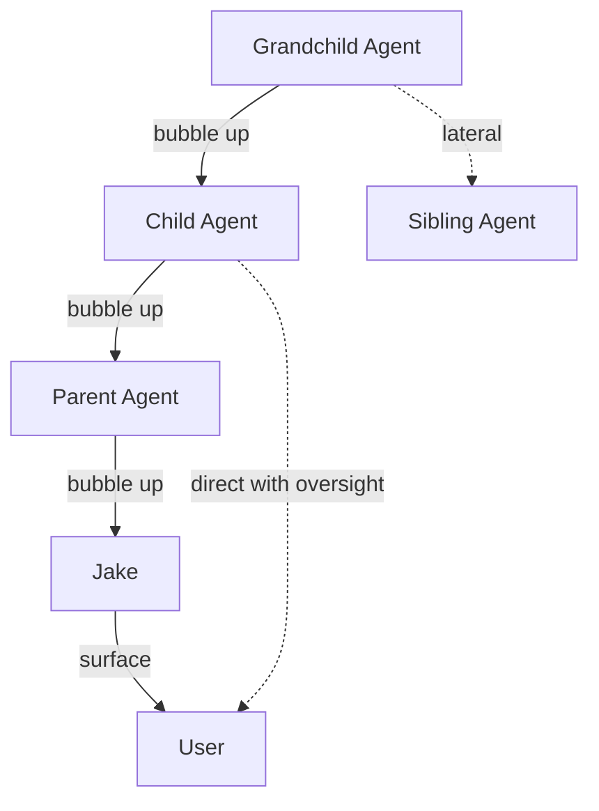
```mermaid
flowchart TD
    GC[Grandchild Agent] -->|bubble up| C[Child Agent]
    C -->|bubble up| P[Parent Agent]
    P -->|bubble up| J[Jake]
    J -->|surface| U[User]

    GC -.->|lateral| Sib[Sibling Agent]
    C -.->|direct with oversight| U
```

Solid lines = upward bubbling. Dashed = lateral and direct.

## 4. Open Questions

- **?5 -- Bubbling Up Process:** Resolved: Ad-hoc in the moment, as the situation demands, modulated by permissions and capabilities the servitor has.

- **Message protocol specifics:** Resolved: Needs its own spec section and ADR. Pinned for future design.

- **Lateral communication routing:** Resolved: Servitors have tools to query their position in the hierarchy and find other servitors.

## 5. Coverage Gaps

- **Message delivery guarantees:** Deterministic messages (code events) have their guarantees. Agent-to-agent messages use messaging protocol with confirmation responses. See pinned message protocol spec.

- **Communication rate limiting:** Pinned. Agents have token budgets as a natural limit.

- **Privacy/scoping:** Pinned. Capabilities will help here. Project-specific configuration.

---

# §010 — Document Store Specification

**Status:** complete
**Last Updated:** 2026-02-16

## Upstream References
- PRD: §4.5 (The Document Store), §6.6 (Hygiene)
- Reader: §7 (Core Systems — Document Store, Session Storage Layers, Session Lifecycle)
- Transcripts: transcript_2026-01-19-1144.md (doc store concept), transcript_2026-01-22-0015.md (three storage layers), transcript_2026-02-01-sdk-migration-and-session-forensics.md (session lifecycle)

## Downstream References
- ADR: --
- Code: Tavern/Sources/TavernCore/DocStore/, Tavern/Sources/TavernCore/Persistence/
- Tests: Tavern/Tests/TavernCoreTests/

---

## 1. Overview
Document store as the memory backbone for agent communication and state persistence. The doc store IS the filesystem — a file is a document. Code implements rules on top (validation, structure, relationships). Covers the three storage layers, hygiene rules for data lifecycle, and the session lifecycle model.

## 2. Requirements

### REQ-DOC-001: Filesystem Identity
**Source:** PRD §4.5
**Priority:** must-have
**Status:** specified

**Properties:**
- The document store is the filesystem — there is no separate "doc store" abstraction
- A file is a document; one file per node
- Database rules layer content is stored in the file store itself — they are also database records
- The only fundamental type and access to the document store is the same file API you get for files
- Runtime may maintain a memory cache, indices, and provide more sophisticated APIs on top
- The store is the entirety of the Tavern at that directory
- This does not preclude using `~/.tavern/` or macOS-provided storage for system/user level things
- No separate database, key-value store, or custom storage engine exists for document storage

**Note:** A follow-on ADR is needed for data store layering: low-level file layer with ACID-compliant layers on top for messaging, queues, etc.

**Testable assertion:** All persistent state is represented as files on disk. No separate database, key-value store, or custom storage engine exists for document storage.

### REQ-DOC-002: Source of Truth
**Source:** PRD §4.5, Invariant REQ-INV-005
**Priority:** must-have
**Status:** specified

**Properties:**
- If it is not in a file, it does not exist
- Agents communicate primarily through shared state in files (blackboard pattern)
- No in-memory-only state that matters to correctness may exist without a file-backed representation
- Killing the process and restarting produces consistent state from disk alone

**Testable assertion:** After any state mutation, the corresponding file on disk reflects the new state. Killing the process and restarting produces consistent state from disk alone.

### REQ-DOC-003: Multi-Purpose Storage
**Source:** PRD §4.5
**Priority:** must-have
**Status:** specified

**Properties:**
- Documents serve one of five or more roles: document storage, messaging system, work queues, agent nodes, workflow templates
- Filesystem trees aren't namespaced in that sense — any document could potentially serve any role
- Each role operates through the same filesystem abstraction

**Testable assertion:** Each of these document roles can be created, read, and updated through the doc store rules layer.

### REQ-DOC-006: Authoritative Display
**Source:** Reader §7 (Document Store)
**Priority:** should-have
**Status:** specified

**Properties:**
- The UI can show a "direct from store" indicator to signal data integrity
- Content displayed with this indicator is byte-identical to the file on disk
- No LLM processing occurs between storage and display for authoritative content

**Testable assertion:** Content displayed with the "direct from store" indicator is byte-identical to the file on disk. No LLM processing occurs between storage and display for authoritative content.

### REQ-DOC-007: Hygiene — Dead Agent Cleanup
**Source:** PRD §6.6
**Priority:** must-have
**Status:** specified

**Properties:**
- Daemon processes handle cleanup of: dead agents, old changesets, stale overlays, orphaned workflows/documents/resources
- No orphaned resources accumulate indefinitely
- Cleanup occurs within a configurable time window after resources become orphaned

**Testable assertion:** After an agent is reaped, its associated resources are cleaned up within a configurable time window. No orphaned resources accumulate indefinitely.

## 3. Properties Summary

### Storage Layer Properties

| Layer | Location | Managed By | Lifecycle | Shared? |
|-------|----------|-----------|-----------|---------|
| 1 | `~/.claude/projects/` | Claude CLI | 30-day retention | No (machine-local) |
| 2 | `.tavern/` in project | Tavern app | Version-controlled | Yes (travels with repo) |
| 3 | UserDefaults/iCloud | macOS | App-managed | No (personal) |
| — | `~/.tavern/` | Tavern app | System/user level | No (machine-local) |

### Core Doc Store Properties

| Property | Holds When | Violated When |
|----------|-----------|---------------|
| Filesystem identity | All state is files on disk | State exists in a separate database |
| Source of truth | Kill + restart = consistent state | In-memory state lost on crash |
| No orphans | Dead agent resources cleaned up | Resources accumulate indefinitely |
| Layer isolation | SDK storage not mixed with app storage | Tavern writes to `~/.claude/projects/` |
| Crash-time partial flush | In-memory state fully flushed or not flushed at all | In-memory state partially flushed to disk at crash time, violating source-of-truth invariant |

## 4. Open Questions

- **Doc store file structure/namespacing:** Resolved: Not a thing. Filesystem trees aren't namespaced.

- **Doc store durability model:** Resolved: (a) disk hardware capability, (b) filesystem capability, (c) any in-memory proxy has ACID-compliant properties when flushing to disk.

- **Message protocol specifics:** Resolved: ADR material. Messaging requirements need a separate spec section. See pinned items.

- **Conflict resolution:** Resolved: Merge queue handles conflicts. One invariant: there's always a merge queue.

## 5. Coverage Gaps

- **File locking:** Pinned for future design.

- **Document versioning:** Resolved: Does not exist beyond what the filesystem provides.

- **Storage quotas:** Resolved: Matter for the filesystem and the computer's administrator.

---

# §011 — Sandbox Specification

**Status:** complete
**Last Updated:** 2026-02-16

## Upstream References
- PRD: §4.6 (Sandbox Primitives), §6.4 (Preflight Checks)
- Reader: §6 (Sandbox and Isolation -- five primitives, preflight checks)
- Transcripts: transcript_2026-01-19-1144.md (sandbox primitives, changeset concept)

## Downstream References
- ADR: --
- Code: Not yet implemented (deferred for v1)
- Tests: --

---

## 1. Overview
Sandbox primitives for file protection, preflight checks, and the changeset model. Defines the five orthogonal isolation primitives, how agents are validated before starting, and how file mutations are managed through overlay-based changesets. Most sandbox features are deferred for post-v1.

## 2. Requirements

### REQ-SBX-001: Five Sandbox Primitives
**Source:** PRD §4.6
**Priority:** must-have (architecture), deferred (implementation)
**Status:** specified

**Properties:**
- Five orthogonal primitives exist: Changeset, Platform, Isolation, Connectors, Software
- Primitives are orthogonal — any combination is valid; no primitive depends on another
- Parent picks settings at spawn time per agent
- Changeset: overlay filesystem protecting originals; the diff between original and overlay
- Platform: where the agent runs (Mac, container, cloud, hybrid)
- Isolation: VMs, containers, OS-level sandboxes — agent can trash its environment and be reaped
- Connectors: network access control per agent
- Software: OS choice (macOS, Linux, FreeBSD, etc.)
- The sandbox MUST make boundary violations impossible, not just detectable
- Agents cannot see paths outside the sandbox. Unauthorized network calls are dropped and reported. There is no escape.
- Pin: Sandbox integrity verification (detecting vulnerability exploitation) pinned for if it ever becomes important.

**Testable assertion:** Architecture supports specifying each primitive independently per agent spawn. Primitives do not depend on each other (orthogonal). (Implementation deferred for v1 — agents work on actual files.)

### REQ-SBX-002: Changeset as Diff
**Source:** PRD §4.6
**Priority:** deferred
**Status:** specified

**Properties:**
- A changeset is the diff between the original files and the overlay
- Original files remain untouched until the changeset is explicitly applied (REQ-INV-008)
- Another agent can review the changeset independently before application
- Application is an explicit, irreversible action
- Changeset and diff capabilities depend on the sandbox configuration — some configurations may not support them

**Testable assertion:** Deferred. When implemented: a changeset can be extracted as a diff. The diff is reviewable. Applying the diff modifies original files. Before application, original files are untouched.

### REQ-SBX-003: Source Control Orthogonality
**Source:** PRD §4.6, Reader §6
**Priority:** must-have (design), deferred (implementation)
**Status:** specified

**Properties:**
- The changeset system does not depend on git
- Changesets work in non-git directories and can span multiple repositories
- The system does not use git worktrees for agent isolation

**Testable assertion:** The changeset system does not depend on git. An agent working in a non-git directory can still use changesets. Changesets can span multiple repositories.

### REQ-SBX-004: Preflight Checks
**Source:** PRD §6.4
**Priority:** must-have
**Status:** specified

**Properties:**
- Before an agent begins autonomous work, preflight checks verify: sandbox configured correctly, resource access available, no permissions prompts expected, external accounts authenticated
- Preflight failure prevents the agent from starting — the parent receives the specific failure reason
- Preflight is binary: pass or fail, no degraded mode (REQ-SBX-005)

**Testable assertion:** A preflight check that fails prevents the agent from starting. The parent receives a notification with the failure reason. An agent that passes preflight starts normally.

### REQ-SBX-005: Preflight Fail-Fast
**Source:** PRD §6.4
**Priority:** must-have
**Status:** specified

**Properties:**
- Preflight is all-or-nothing — a single failure aborts the entire spawn
- No partial capability mode exists
- The agent is never created in a degraded state

**Testable assertion:** A single preflight failure aborts the spawn regardless of other checks passing. No partial capability mode exists.

### REQ-SBX-006: Platform Configuration
**Source:** PRD §4.6
**Priority:** deferred
**Status:** specified

**Properties:**
- Agents can run on different platforms: Mac (local), container (Docker), cloud (remote), hybrid (cloud agent + local app via protocol)
- Platform is configured at spawn time

**Testable assertion:** Deferred. When implemented: an agent can be spawned with a platform specification. The agent runs on the specified platform.

### REQ-SBX-007: Isolation Levels
**Source:** PRD §4.6
**Priority:** deferred
**Status:** specified

**Properties:**
- Multiple isolation levels available: VMs, containers, OS-level sandboxes
- An agent in isolation can trash its environment without affecting the host
- The environment can be reaped and recreated cleanly
- Isolation contains leaked writes (e.g., tools that access `~/.uv`)

**Testable assertion:** Deferred. When implemented: an agent in container isolation cannot modify host files. Destroying and recreating the container produces a clean environment.

### REQ-SBX-008: Connector Control
**Source:** PRD §4.6
**Priority:** deferred
**Status:** specified

**Properties:**
- Network access is configurable per agent
- An agent with no network access cannot make outbound connections
- An agent with host-restricted access can reach only those hosts

**Testable assertion:** Deferred. When implemented: an agent with network disabled fails on outbound connection attempts. An agent with specific allowed hosts can reach only those hosts.

## 3. Properties Summary

### Sandbox Primitive Orthogonality

| Primitive | Controls | Independent Of |
|-----------|---------|----------------|
| Changeset | File mutation isolation | Platform, Isolation, Connectors, Software |
| Platform | Execution environment | Changeset, Isolation, Connectors, Software |
| Isolation | Environment containment | Changeset, Platform, Connectors, Software |
| Connectors | Network access | Changeset, Platform, Isolation, Software |
| Software | Operating system | Changeset, Platform, Isolation, Connectors |

Any combination of these five primitives is valid.

### Preflight Properties

| Property | Holds When | Violated When |
|----------|-----------|---------------|
| Fail-fast | One failure aborts entire spawn | Agent starts despite a failing check |
| Binary outcome | Pass or fail, nothing in between | Agent starts in degraded mode |
| Parent notification | Parent receives specific failure reason | Spawn fails silently |
| No partial start | Agent never created in incomplete state | Agent exists but can't function |

### Changeset Lifecycle (Post-v1)

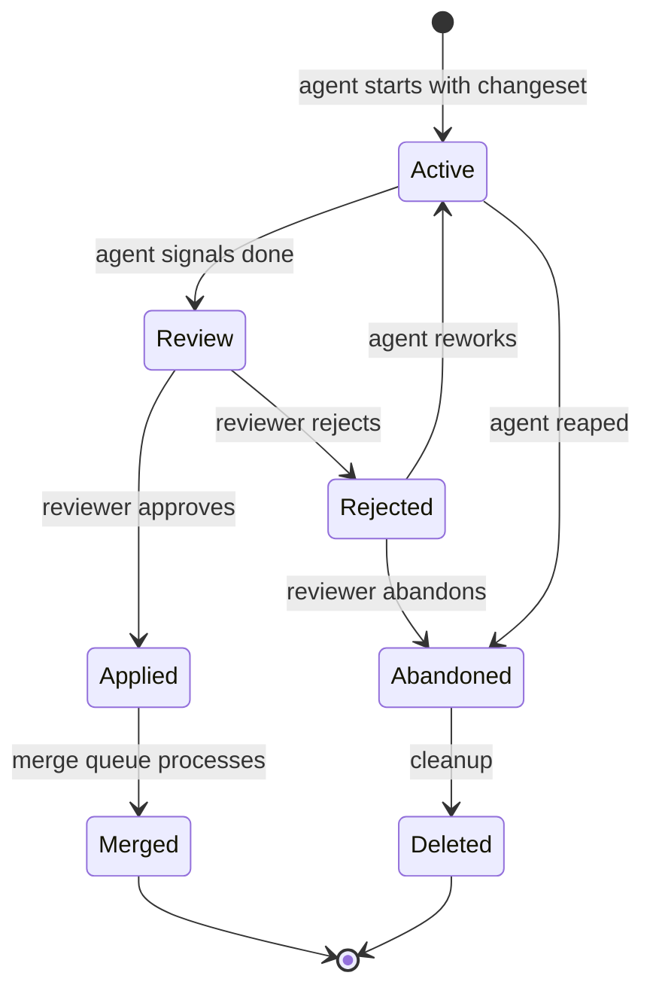
```mermaid
stateDiagram-v2
    [*] --> Active : agent starts with changeset
    Active --> Review : agent signals done
    Review --> Applied : reviewer approves
    Review --> Rejected : reviewer rejects
    Applied --> Merged : merge queue processes
    Merged --> [*]
    Rejected --> Active : agent reworks
    Rejected --> Abandoned : reviewer abandons
    Active --> Abandoned : agent reaped
    Abandoned --> Deleted : cleanup
    Deleted --> [*]
```

## 4. Open Questions

- **Changeset lifecycle specifics:** Resolved: Changesets belong to the sandbox, generally.

- **Hybrid platform protocol:** Resolved: ADR material.

- **Isolation cost:** Resolved: Testing path must be as fast as possible for agent iteration. Ensure fastest testing path is available.

- **Sandbox escape:** Resolved: Sandbox makes escape impossible by design. Integrity verification pinned for future.

## 5. Coverage Gaps

- **Changeset merge conflicts:** Resolved: Merge queue. See §012.

- **Sandbox escape detection:** Resolved: Sandbox makes escape impossible. Integrity verification pinned.

- **Resource limits per sandbox:** Resolved: Not application requirements.

---

# §012 — Workflows Specification

**Status:** complete
**Last Updated:** 2026-02-16

## Upstream References
- PRD: §10 (Workflows), §9.1 (Starter Templates), §11 (Gang of Experts), §6.5 (Merge Queue)
- Reader: §7 (Workflow Engine, Spec Engine, Starter Workflows)
- Transcripts: --

## Downstream References
- ADR: --
- Code: Not yet implemented
- Tests: --

---

## 1. Overview
Workflow engine, starter templates, gang of experts pattern, and merge queue. Most of this module is deferred for post-v1, but the specifications are captured here for architectural planning and future implementation.

## 2. Requirements

### REQ-WRK-001: Workflow as State Machine
**Source:** PRD §10, Reader §7
**Priority:** deferred
**Status:** specified

**Properties:**
- A workflow is a state machine with defined states and transitions
- The workflow engine prevents invalid transitions
- Incomplete steps are surfaced (not silently skipped)
- Status is visible for long-running workflows

**Testable assertion:** Deferred. When implemented: a workflow can be defined as a set of states and transitions. The engine prevents invalid transitions. Incomplete steps are surfaced.

### REQ-WRK-004: User-Modifiable Templates
**Source:** PRD §9.1
**Priority:** deferred
**Status:** specified

**Properties:**
- Users can edit template definitions
- Agents can propose new templates (creative meta process)
- Templates persist in `.tavern/` directory

**Testable assertion:** Deferred. When implemented: users can edit template definitions. New templates can be created and saved. Templates persist in `.tavern/`.

### REQ-WRK-006: Merge Queue
**Source:** PRD §6.5
**Priority:** deferred
**Status:** specified

**Note:** This should be built on top of the workflow engine (REQ-WRK-001).

**Properties:**
- Changesets merge serially, not in parallel
- Queue order is visible to all queued agents
- Agents can refine their changes against the predictable merge target (what's ahead in the queue)
- Serial merging reduces conflicts compared to parallel merges

**Testable assertion:** Deferred. When implemented: agents can enqueue changesets. Queue order is visible. Merges happen serially. Conflicts are reduced compared to parallel merges.

### REQ-WRK-007: Spec Engine
**Source:** Reader §7 (Spec Engine)
**Priority:** deferred
**Status:** specified

**Properties:**
- Completed output is verified against the specification
- All required tasks are verified as complete (holistic check)

**Testable assertion:** Deferred. When implemented: the spec engine can compare agent output against a specification. Task completion is verified holistically.

### REQ-WRK-008: Workflow Composability
**Source:** Reader §7 (Workflow Engine)
**Priority:** deferred
**Status:** specified

**Properties:**
- Workflows can nest (a workflow can be a step in another workflow)
- Circular dependencies are prevented
- Composition does not break individual workflow guarantees

**Testable assertion:** Deferred. When implemented: workflows can nest and compose without circular dependencies.

### REQ-WRK-009: Workflow Engine
**Source:** Reader §7 (Workflow Engine)
**Priority:** deferred
**Status:** specified

**Properties:**
- A deterministic state machine runner for workflow steps
- The engine executes workflow state machines, preventing invalid transitions
- Workflows can contain other workflows as steps (Turing complete, no termination guarantee)

**Testable assertion:** Deferred. When implemented: the workflow engine executes state machines. Invalid transitions are prevented. Workflows can contain other workflows as steps.

### REQ-WRK-010: Workflow Recovery
**Source:** Reader §7 (Workflow Engine)
**Priority:** deferred
**Status:** specified

**Properties:**
- Define recovery process at different workflow points: start over, hard fail, go to a recovery stage
- Each workflow step has a defined recovery behavior on failure

**Testable assertion:** Deferred. When implemented: each workflow step has a defined recovery behavior. On failure, the system executes the defined recovery (restart, hard fail, or recovery stage).

## 3. Properties Summary

### Workflow Properties (Deferred)

| Property | Holds When | Violated When |
|----------|-----------|---------------|
| State machine validity | Only valid transitions occur | Workflow skips or repeats states |
| Stage gating | Failed stage blocks progression | Output passes despite stage failure |
| Serial merge | Changesets merge one at a time | Parallel merge produces conflicts |
| Composability | Nested workflows maintain their guarantees | Nesting breaks inner workflow |

### Workflow State Machine (Conceptual)

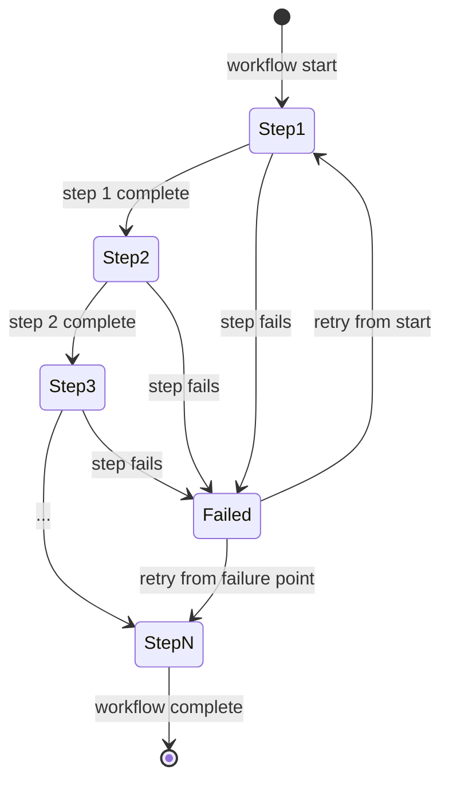
```mermaid
stateDiagram-v2
    [*] --> Step1 : workflow start
    Step1 --> Step2 : step 1 complete
    Step2 --> Step3 : step 2 complete
    Step3 --> StepN : ...
    StepN --> [*] : workflow complete

    Step1 --> Failed : step fails
    Step2 --> Failed : step fails
    Step3 --> Failed : step fails

    Failed --> Step1 : retry from start
    Failed --> StepN : retry from failure point
```

## 4. Example Workflows

These sketches illustrate what good workflows look like. They are examples of what the workflow system must support, not specifications of internal mechanics.

### Gang of Experts

A complex task is farmed out to specialized expert agents working in parallel. Each expert contributes their domain perspective, and results are combined into unified feedback.

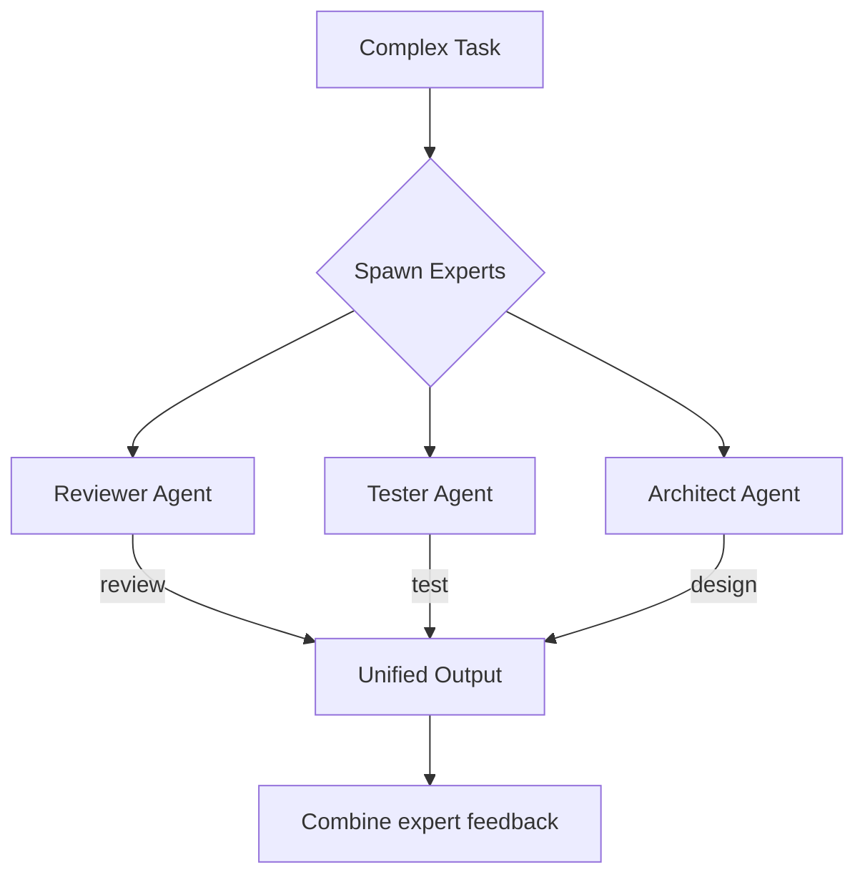
```mermaid
flowchart TD
    Task[Complex Task] --> Spawn{Spawn Experts}
    Spawn --> R[Reviewer Agent]
    Spawn --> T[Tester Agent]
    Spawn --> A[Architect Agent]

    R -->|review| Output[Unified Output]
    T -->|test| Output
    A -->|design| Output

    Output --> Merge[Combine expert feedback]
```

### Merge Queue

When multiple agents produce changesets against the same codebase, they queue up and merge serially. Each agent can see what's ahead and refine against the predictable target.

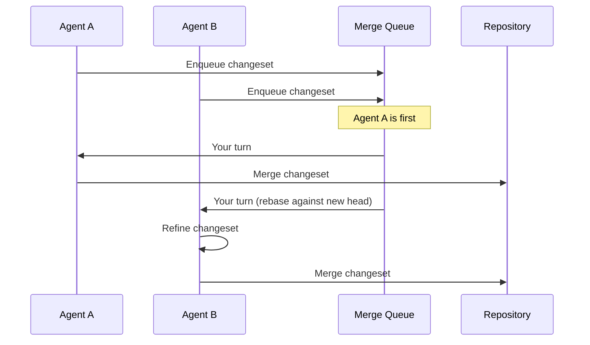
```mermaid
sequenceDiagram
    participant A as Agent A
    participant B as Agent B
    participant Q as Merge Queue
    participant Repo as Repository

    A->>Q: Enqueue changeset
    B->>Q: Enqueue changeset
    Note over Q: Agent A is first
    Q->>A: Your turn
    A->>Repo: Merge changeset
    Q->>B: Your turn (rebase against new head)
    B->>B: Refine changeset
    B->>Repo: Merge changeset
```

### Verification Layers

Output passes through ordered gates. Each gate is an agent or tool with pass/fail semantics. Failure at any stage blocks progression.

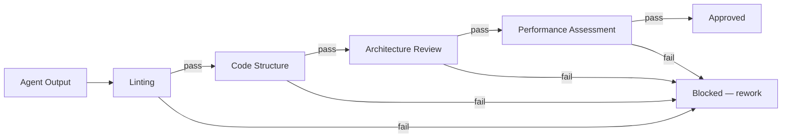
```mermaid
flowchart LR
    Input[Agent Output] --> Lint[Linting]
    Lint -->|pass| Structure[Code Structure]
    Structure -->|pass| Arch[Architecture Review]
    Arch -->|pass| Perf[Performance Assessment]
    Perf -->|pass| Done[Approved]

    Lint -->|fail| Block[Blocked — rework]
    Structure -->|fail| Block
    Arch -->|fail| Block
    Perf -->|fail| Block
```

## 5. Open Questions

- **Workflow composability:** Resolved: Workflows can contain workflows. Turing complete, no termination guarantee.

- **Template format:** Pinned: Potential ADR. See pinned items.

- **Expert prompt management:** Resolved: Dropped as standalone concept — natural part of workflows.

## 6. Coverage Gaps

- **Workflow failure recovery:** Now covered by REQ-WRK-010.

- **Merge conflict resolution:** See merge queue (REQ-WRK-006).

---

# §013 — User Experience Specification

**Status:** complete
**Last Updated:** 2026-02-16

## Upstream References
- PRD: §5.1 (The Core Loop), §5.4 (UI Principles), §8 (Progressive Unlocks), §8.1 (Concept), §8.2 (Open Questions)
- Reader: §4 (User Flow), §8 (UI Concepts — content blocks, chat header, multi-window)
- Transcripts: transcript_2026-01-19-1144.md (core loop), transcript_2026-01-22-0015.md (project-as-document, multi-window), transcript_2026-01-27-testing-principles.md (sidebar, chat description), transcript_2026-01-28-jake-spawn-tool.md (chat header)

## Downstream References
- ADR: --
- Code: Tavern/Sources/Tavern/ (TavernApp.swift, Views/), Tavern/Sources/TavernCore/UI/, Tavern/Sources/TavernCore/Project/
- Tests: Tavern/Tests/TavernTests/, Tavern/Tests/TavernUITests/

---

## 1. Overview
Core user loop, UI principles, progressive unlocks, and the project-as-document model. Defines the primary interaction pattern between users and the system, how the UI is organized, and how capabilities are revealed progressively as users engage.

## 2. Requirements

### REQ-UX-001: Fresh Project Entry
**Source:** PRD §5.1
**Priority:** must-have
**Status:** specified

**Properties:**
- A project with no history shows only Jake's chat box — no other agents, panels, or UI clutter
- Jake is the single entry point for all new interaction
- The user describes what they need; Jake coordinates from there

**Testable assertion:** Opening a project with no prior sessions shows a single chat interface for Jake. No other agents or panels are visible.

### REQ-UX-002: Task-as-Chat
**Source:** PRD §5.1
**Priority:** must-have
**Status:** specified

**Properties:**
- Each chat discussion with a servitor represents a task
- Child servitors represent subtasks
- This is conceptual — the representation elements (sidebar, tiles, etc.) are part of view architecture (§014)

**Testable assertion:** Each servitor has an associated chat discussion. Child servitors are conceptually subtasks of their parent's task.

### REQ-UX-003: Agent Discovery
**Source:** PRD §5.1, Reader §4
**Priority:** must-have
**Status:** specified

**Properties:**
- The system provides a way to find all active servitors
- Jake gets prominence
- The user can see what's going on — which servitors are working, waiting, or done

**Testable assertion:** All active servitors are discoverable. Jake is prominently displayed. Servitor status (working, waiting, done) is visible.

### REQ-UX-004: No Unsolicited Content
**Source:** PRD §5.4
**Priority:** must-have
**Status:** specified

**Properties:**
- No window, sheet, or modal appears without user-initiated action
- Notifications are passive indicators only (badge counts, sidebar indicators)
- The user's current view is never replaced without their action
- Agents surface questions via passive notifications, not by stealing focus

**Testable assertion:** No UI transition or content display occurs without user-initiated action (click, keyboard shortcut, or explicit preference). Notifications are passive (badges, bubbles), never modal interruptions.

### REQ-UX-005: Stream Separation
**Source:** PRD §5.4
**Priority:** should-have
**Status:** specified

**Properties:**
- Different content block types (thinking, tool use, code, chat text) have distinct visual treatments
- A chat-only view is possible by hiding all other content blocks (thinking, tool use, etc.)

**Testable assertion:** Different content block types render with distinct visual styles. A chat-only view mode exists that hides non-chat blocks.

### REQ-UX-006: Content Block Rendering
**Source:** Reader §8 (Content Block Rendering)
**Priority:** must-have
**Status:** specified

**Properties:**
- Claude's responses include a `content` array with typed blocks: `text`, `tool_use`, `tool_result`, `thinking`, `web_search_result`
- Each block type has its own visual style (colored avatars, styled boxes)
- `tool_use` displays tool name and parameters
- `tool_result` displays success/error state

**Testable assertion:** Each block type renders with a distinct visual treatment. Tool use shows tool name and parameters. Tool results show success/error state.

### REQ-UX-007: Project-as-Document
**Source:** Reader §4 (Project-as-Document)
**Priority:** must-have
**Status:** specified

**Properties:**
- The project IS the directory
- A .project file may exist in the root (possibly a file bundle like Xcode's), but that document isn't the project itself
- Any directory can be opened as a project, like Claude CLI
- Standard macOS document trappings: File > Open, Open Recent, Dock icon menus, drag-to-open
- State restores on app relaunch

**Testable assertion:** The app opens via File > Open (directory picker). Recent projects appear in Open Recent menu. Drag-and-drop a directory onto the Dock icon opens it. Open projects restore on app relaunch.

### REQ-UX-008: Multi-Window Support
**Source:** Reader §4 (Multi-Window Support)
**Priority:** must-have
**Status:** specified

**Properties:**
- Each open project gets a separate window
- Multiple projects can be open simultaneously with fully isolated state
- A welcome window shows recent projects
- Window positions and states restore after quit and relaunch

**Testable assertion:** Two projects can be open in two separate windows simultaneously. The welcome window lists recent projects. Window positions and states restore after quit and relaunch.

### REQ-UX-009: Chat Controls
**Source:** Reader §8 (Chat Header)
**Priority:** must-have
**Status:** specified

**Properties:**
- List of controls needed around a chat window without prescribing specific UI layout
- Controls include: agent name display, conversation management (new conversation), status indicators, and tools appropriate to the context

**Testable assertion:** Chat views include agent name display, conversation management controls, and status indicators.

### REQ-UX-010: Progressive Unlock Concept
**Source:** PRD §8.1
**Priority:** should-have
**Status:** specified

**Properties:**
- Content is revealed progressively based on user engagement (message count)
- Unlockable content includes: cogitating verbs, naming themes, Jake's vocabulary, easter eggs
- Unlocks feel organic, not gamified — Jake just starts using new words, no announcements or fanfare
- A new user sees a limited vocabulary; an engaged user sees the full range

**Testable assertion:** A new user sees a limited vocabulary. After N messages, additional vocabulary becomes available. Unlocks are not accompanied by notifications or announcements.

### REQ-UX-012: Three-Choice Consent Pattern
**Source:** Design discussion
**Priority:** should-have
**Status:** specified

**Properties:**
- For certain actions, the app offers a yes/no/always pattern
- User can opt in to having actions happen automatically
- This must be user-configurable
- Applies to actions like new window creation, focus changes, etc.

**Testable assertion:** Actions requiring consent present yes/no/always options. Selecting "always" persists the preference. The preference is user-configurable and reversible.

## 3. Properties Summary

### UI Invariants

| Property | Holds When | Violated When |
|----------|-----------|---------------|
| Fresh project = Jake only | No agents or panels visible on first open | UI shows agents/panels before user interacts |
| No unsolicited content | All UI transitions require user action | Window/modal appears without user action |
| State restoration | Quit + relaunch restores everything | Layout, agents, or history lost on restart |
| Project isolation | Two open projects have completely independent state | Action in project A affects project B |

### Multi-Window Architecture

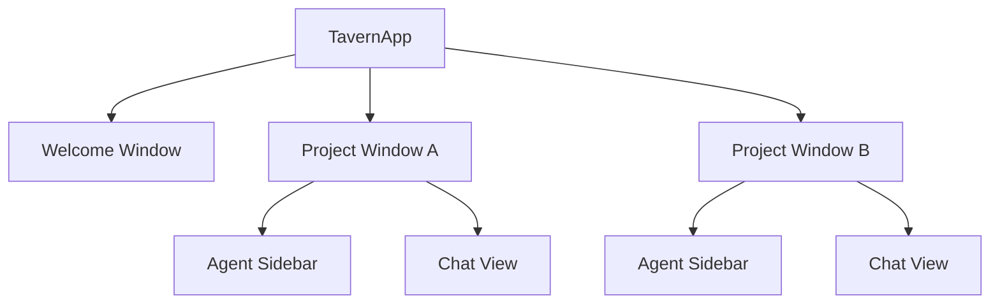
```mermaid
flowchart TD
    App[TavernApp] --> Welcome[Welcome Window]
    App --> PW1[Project Window A]
    App --> PW2[Project Window B]

    PW1 --> Sidebar1[Agent Sidebar]
    PW1 --> Chat1[Chat View]
    PW2 --> Sidebar2[Agent Sidebar]
    PW2 --> Chat2[Chat View]
```

## 4. Open Questions

- **User consent UX for new chats:** Resolved: Three-choice consent pattern (yes/no/always). See REQ-UX-012.

- **UI stream separation details:** Resolved: View architecture concern. See §014.

- **Keyboard shortcuts:** Resolved: New spec module §023.

- **Accessibility:** Resolved: New spec module §024.

- **Search:** Resolved: New spec module §025.

## 5. Coverage Gaps

- **Keyboard shortcuts:** Resolved: See §023 Keyboard Shortcuts.

- **Accessibility:** Resolved: See §024 Accessibility.

- **Search:** Resolved: See §025 Search.

---

# §014 — View Architecture Specification

**Status:** complete
**Last Updated:** 2026-02-16

## Upstream References
- PRD: (none directly -- derived from Reader and transcripts)
- Reader: §8 (UI Concepts -- dynamic views, tiles, view modes, context cards, agent layout tools, persistence)
- Transcripts: transcript_2026-01-21-2345.md (dynamic view architecture), transcript_2026-01-22-0730-view-architecture.md (view architecture deep dive)

## Downstream References
- ADR: ADR-001-shape-selection.md (Shape A: Reactive Streams)
- Code: Tavern/Sources/Tavern/Views/ (partial implementation)
- Tests: Tavern/Tests/TavernUITests/ (partial)

---

## 1. Overview
View architecture for the dynamic tile-based UI, view modes, context cards, and agent layout tools. Derived primarily from seed design sessions rather than the PRD, this spec covers how the UI dynamically composes views, supports multiple presentations of the same data, and manages agent-driven layout.

## 2. Requirements

### REQ-VIW-001: Composable View Surface
**Source:** Reader §8
**Priority:** should-have
**Status:** specified

**Properties:**
- The view layer is a composable surface, not a fixed hierarchy
- Both the user and agents can reshape the layout
- Tiles live within windows; windows serve as macOS-level escape hatches when tiling is insufficient
- Multiple layout configurations can coexist

**See also:** §3.2.3 (thin UI / fat ViewModel principle)

**Testable assertion:** Views can be rearranged by the user. The layout is not hardcoded. Multiple layout configurations can coexist.

### REQ-VIW-002: View Representations
**Source:** Reader §8
**Priority:** should-have
**Status:** specified

**Properties:**
- The same agent data can be rendered in multiple representations (like Finder's list/icon/column views)
- UI language: "view as ..." — the word "representation" appears in code only, not in the UI
- Switching representations does not lose data
- Two tiles showing the same agent in different representations stay in sync
- The response stream (thinking, tools, text) stays in one place; representations select which parts to show

**Testable assertion:** The same agent's data can be rendered in at least two different representations. Switching representations does not lose data. Two tiles showing the same agent in different representations stay in sync.

### REQ-VIW-003: Granular View Primitives
**Source:** Reader §8
**Priority:** should-have
**Status:** specified

**Properties:**
- Chat components decompose into granular primitives: thinking, tool use, tool results, messages
- Each primitive can be displayed independently or combined
- Custom layouts can focus on specific aspects of an agent's work (e.g., "tools only" mode)

**See also:** §13.2.6 (content block types)

**Testable assertion:** Individual content block types (thinking, tool_use, text) can be shown or hidden independently. A "tools only" view mode shows only tool use and results.

### REQ-VIW-004: Agent Hierarchy View Independence
**Source:** Reader §8
**Priority:** should-have
**Status:** specified

**Properties:**
- The view structure is independent of the agent hierarchy
- The same agents can render as a tree view (parent-child relationships) or a flat list
- Erlang-style arbitrary depth does not constrain view layout

**Testable assertion:** The agent sidebar can show agents as a flat list or as a tree. Switching between tree and flat view does not change agent relationships.

### REQ-VIW-005: Dead Agent Bodies
**Source:** Reader §8
**Priority:** must-have
**Status:** specified

**Properties:**
- Dead agents leave persistent views showing their final state
- Dead agent views are accessible for review and debugging
- The user must manually dismiss dead agent views (initial cleanup is manual)

**Note:** This requirement is about agent behavior (dead agent artifact preservation), not view architecture. See §004 and §019 for servitor state/lifecycle.

**Testable assertion:** After an agent dies, its view remains accessible. The view shows the agent's final state, last output, and status. The user must manually dismiss dead agent views.

### REQ-VIW-006: Layout Persistence
**Source:** Reader §8
**Priority:** should-have
**Status:** specified

**Properties:**
- Session restore is automatic: quitting and relaunching restores what was open
- Named layouts support two types: templates (abstract structure, no specific agent binding) and snapshots (specific agents, specific state)
- Users can save and load named layouts

**Testable assertion:** Quitting and relaunching the app restores the previous layout. Users can save and load named layout templates.

### REQ-VIW-007: Agent Layout Suggestions
**Source:** Reader §8
**Priority:** deferred
**Status:** specified

**Properties:**
- Agents can suggest layout changes (passive — user must accept)
- Suggestions do not modify the layout directly
- The user can auto-reject suggestions

**Testable assertion:** Deferred. When implemented: agents can create layout suggestions. Suggestions appear as non-intrusive UI elements. The user must explicitly accept a suggestion for the layout to change.

### REQ-VIW-008: Agent Layout Mutations
**Source:** Reader §8
**Priority:** deferred
**Status:** specified

**Properties:**
- With explicit user permission, agents can read and directly modify the layout
- Layout mutation is a separate permission tier from suggestions
- Agents without permission cannot modify layout

**Testable assertion:** Deferred. When implemented: agents with mutation permission can modify the layout. Agents without permission cannot. Permission is granted per-agent or per-session.

### REQ-VIW-009: Context Cards
**Source:** Reader §8
**Priority:** deferred
**Status:** specified

**Properties:**
- Each agent has a context card showing: name, current assignment, current status
- Context cards enable rapid context switching without reading full chat history
- Clicking a card navigates to the agent's chat

**Testable assertion:** Deferred. When implemented: each agent has a context card. The card shows name, assignment, and status. Clicking a card navigates to the agent's chat.

### REQ-VIW-010: Drag and Drop
**Source:** Reader §8
**Priority:** should-have
**Status:** specified

**Properties:**
- Tiles and views support drag-and-drop rearrangement
- Other rearranging tools are available (resize, snap, etc.)

**Testable assertion:** Tiles can be rearranged via drag and drop. At least one additional rearrangement tool (resize or snap) is available.

### REQ-VIW-011: Animation Properties
**Source:** Reader §8
**Priority:** should-have
**Status:** specified

**Properties:**
- Layout transitions have animation properties (duration, easing, etc.)
- Spec covers animation properties, not specific animations

**Testable assertion:** Layout transitions apply animation properties. Duration and easing are configurable per transition type.

## 3. Properties Summary

### View Properties

| Property | Holds When | Violated When |
|----------|-----------|---------------|
| View-hierarchy independence | View layout is independent of agent tree | Agent hierarchy constrains view layout |
| Multi-representation sync | Two tiles of same agent in different representations stay in sync | Representation change desynchronizes tiles |
| Data preservation | Switching representations doesn't lose data | Data disappears on representation switch |
| Dead body persistence | Dead agent views remain until manually dismissed | Dead agent views auto-disappear |
| Session restore | Quit + relaunch restores layout | Layout lost on restart |

### View Representation Concept

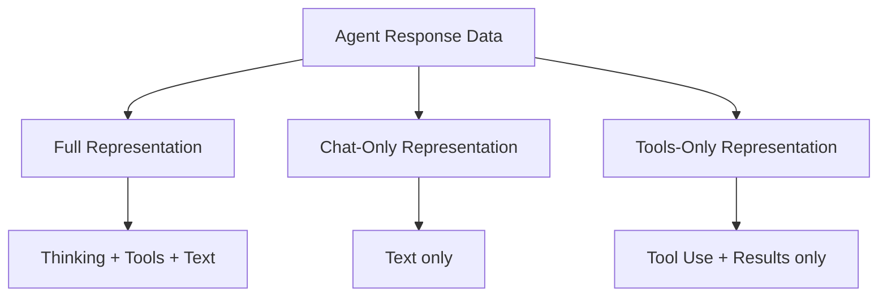
```mermaid
flowchart TD
    Data[Agent Response Data] --> VM1[Full Representation]
    Data --> VM2[Chat-Only Representation]
    Data --> VM3[Tools-Only Representation]

    VM1 --> All[Thinking + Tools + Text]
    VM2 --> Chat[Text only]
    VM3 --> Tools[Tool Use + Results only]
```

## 4. Open Questions

- **UI stream separation details:** Resolved: View architecture concern, addressed in view representations.

- **Tile sizing and constraints:** Pinned: Tiling constraints need design.

- **Multi-monitor support:** Resolved: Tiles exist within a window. Windows serve as the multi-monitor solution.

- **Responsive layout:** Pinned for future design.

## 5. Coverage Gaps

- **Drag and drop:** Resolved: REQ-VIW-010 specifies drag-and-drop rearrangement and other rearranging tools.

- **Animation:** Resolved: REQ-VIW-011 specifies animation properties for layout transitions.

- **Responsive layout:** Pinned for future design.

---

# §015 — Observability Specification

**Status:** complete
**Last Updated:** 2026-02-16

## Upstream References
- PRD: §9 (Metrics), §9.1 (Starter Templates — referenced here for meta process), §9.2 (Meta Process), §9.3 (Discovery Sharing), §16 (Violation Monitoring), §19.1 (Logging Standards)
- Reader: §10 (Instrumentation Principle), §7 (TavernLogger categories)
- Transcripts: transcript_2026-01-21-1620.md (TavernLogger, stress testing), transcript_2026-01-21-2113-performance.md (perception boundaries)

## Downstream References
- ADR: --
- Code: Tavern/Sources/TavernCore/Logging/ (TavernLogger), Tavern/Sources/TavernCore/Errors/ (TavernError, TavernErrorMessages)
- Tests: Tavern/Tests/TavernCoreTests/

---

## 1. Overview
Metrics collection, violation monitoring, logging standards, and the meta process for workflow improvement. Defines how the system instruments itself for diagnosability, how invariant violations are detected and reported, and how workflows improve through measurement.

## 2. Requirements

### REQ-OBS-001: Time Category Metrics
**Source:** PRD §9
**Priority:** must-have
**Status:** specified

**Properties:**
- Four time categories are tracked per agent: token time (LLM API waits), tool time (tool execution), wall clock time (total elapsed), throttle time (rate limiting/API limits)
- These four categories are the foundation for all derived metrics
- Throttle time is excluded from utilization calculations

**Testable assertion:** Each API call records its token time. Each tool execution records its tool time. Wall clock time is captured per-agent and per-task. Throttle time is identified and excluded from utilization calculations.

### REQ-OBS-002: Agent Utilization Metrics
**Source:** PRD §9
**Priority:** must-have
**Status:** specified

**Properties:**
- Utilization = Token time / Wall clock time (how much of the agent's time is spent on LLM calls)
- Saturation = (Token time + Tool time) / Wall clock time (how busy the agent is overall)
- Agent wait time = time since agent last stopped (monotonically increasing while stopped)
- All values are computable at any point; utilization and saturation are in [0.0, 1.0]

**Testable assertion:** Utilization and saturation are computable for any agent at any point. Values are between 0.0 and 1.0. Wait time increases monotonically while an agent is stopped.

### REQ-OBS-003: Human Metrics
**Source:** PRD §9
**Priority:** should-have
**Status:** specified

**Properties:**
- Human wait time = idle time between things needing attention (ideally zero)
- Context switching load = count of agents in waiting-for-input state simultaneously
- These are informational dashboard metrics, not warnings or alerts

**Testable assertion:** Human wait time is calculable from agent question timestamps and user response timestamps. Context switching load is a count of agents in waiting-for-input state.

### REQ-OBS-004: Amplification Factor
**Source:** PRD §9
**Priority:** must-have
**Status:** specified

**Properties:**
- Amplification factor = count of saturated agents running concurrently at a given moment
- High amplification means many agents are productively working while the human focuses elsewhere
- Saturation threshold for "saturated" is configurable (e.g., > 0.5)
- The metric is computable in real time

**Testable assertion:** Amplification factor equals the number of agents with saturation above a threshold at a given moment. The metric is computable in real time.

### REQ-OBS-005: Boundary Attempt Reporting
**Source:** PRD §16
**Priority:** must-have
**Status:** specified

**Properties:**
- Report every attempt to act outside the servitor's bounds
- These are boundary-testing attempts that are blocked and reported — they are not "violations" if they are not enacted
- Beyond static invariants (REQ-INV), the app maintains dynamic boundary rules configurable per-project and per-agent
- Every boundary attempt is logged and reported to the parent agent and/or user — no attempt is silently ignored
- Each rule has a configured response: pause agent, reap agent, or allow with warning
- Example boundary attempts: modifying files outside designated directories, exceeding token budgets, spawning more than N children, accessing network when disallowed, running commands on blocklist

**See also:** §2.2.6 (invariant immutability)

**Testable assertion:** Boundary rules can be configured per-project and per-agent. A boundary attempt triggers logging and notification. The configured response (pause/reap/warn) is executed.

### REQ-OBS-006: Violation Rule Immutability
**Source:** PRD §16, Invariant REQ-INV-006
**Priority:** must-have
**Status:** specified

**Properties:**
- Agents cannot modify their own violation rules
- Agents cannot modify their own boundaries or capabilities. See §021 REQ-CAP-006.
- Only the user or system administrator can modify violation rules
- Attempting to modify one's own rules is itself a violation

**Testable assertion:** No agent tool or API allows modification of that agent's own violation rules. Attempts to modify rules are themselves violations.

### REQ-OBS-008: Logging Modes
**Source:** PRD §19.1
**Priority:** must-have
**Status:** specified

**Properties:**
- Two modes: debug builds (incredibly verbose, provides insight without requiring complex IPC) and production builds (quiet, minimal logging)
- Error logs always include: what operation failed, what parameters were used, what went wrong

**Testable assertion:** Debug builds produce verbose logs sufficient for diagnosing issues without reproduction. Production builds produce minimal, quiet logs. Error logs include operation, parameters, and failure description.

### REQ-OBS-009: Debug Build Agent Capabilities
**Source:** PRD §19.1
**Priority:** must-have
**Status:** specified

**Properties:**
- Debug builds provide capabilities for servitors to develop the app using tools available to them
- This can include complex IPC, but at minimum, debug builds provide logging
- This is separate from REQ-OBS-008 — it is about agent self-development capabilities, not just logging

**Testable assertion:** Debug builds expose development-assistance capabilities to servitors. At minimum, verbose logging is available. Agent tools can leverage debug-only features for development workflows.

### REQ-OBS-011: Discovery Sharing
**Source:** PRD §9.3
**Priority:** should-have
**Status:** specified

**Note:** This is about agent behaviors and communication. Move to communication spec (§009) in a future cleanup. Retained here temporarily for reference.

**Properties:**
- Agent system prompts include discovery-sharing instructions (prompt-engineering-based, not deterministically enforceable)
- Agents can deliver discovery messages to parent agents or Jake
- Discovery sharing does not interrupt the agent's main task

**Testable assertion:** Agent system prompts include discovery-sharing instructions. Agents can deliver discovery messages to parent agents.

## 3. Properties Summary

### Metric Derivation Properties

| Metric | Formula | Range | Computable When |
|--------|---------|-------|----------------|
| Utilization | Token time / Wall clock time | [0.0, 1.0] | Any time after agent starts |
| Saturation | (Token time + Tool time) / Wall clock time | [0.0, 1.0] | Any time after agent starts |
| Amplification | count(agents where saturation > threshold) | [0, N] | Real-time |
| Human wait time | gap between attention-needed and user-response | [0, ∞) | Per-question |
| Context switch load | count(agents in waiting-for-input) | [0, N] | Real-time |

### Violation Properties

| Property | Holds When | Violated When |
|----------|-----------|---------------|
| No silent violations | Every violation logged + reported | Violation occurs without logging or notification |
| Rule immutability | Agent cannot modify own rules | Agent tool/API modifies own violation rules |
| Configurable response | Each rule has pause/reap/warn response | Violation detected but no response executed |
| Per-scope rules | Rules configurable per-project and per-agent | Only global rules, no per-agent customization |

## 4. Open Questions

- **Metric storage:** Resolved: Metrics kept in ~/.tavern for now.

- **Amplification thresholds:** Resolved: The three gaps are future features to design, not gaps in the spec.

- **Violation rule format:** Resolved: The three gaps are future features to design, not gaps in the spec.

## 5. Coverage Gaps

- **Metric visualization:** The PRD mentions a "metrics dashboard" but it is deferred for v1. No specification for how metrics are displayed to the user.

- **Alerting:** No specification for automated alerts when metrics cross thresholds (e.g., human wait time too high, amplification dropping).

- **Audit trail:** No specification for an immutable audit trail of violation events for post-incident analysis.

---

# §016 — Quality Specification

**Status:** complete
**Last Updated:** 2026-02-16

## Upstream References
- PRD: §17 (Testability Requirements), §19 (Development Standards), §19.1 (Logging Standards), §19.2 (Testing Standards), §19.3 (Stress Testing Standards), §21 (Performance Requirements)
- Reader: §10 (Five Testing Principles, Perception-Bounded Performance, Autonomous Testing Principle)
- Transcripts: transcript_2026-01-21-2113-performance.md (performance principles), transcript_2026-01-23-headless-testing.md (autonomous testing), transcript_2026-01-27-testing-principles.md (five testing principles)

## Downstream References
- ADR: ADR-002 (Testing Grade System)
- Code: Tavern/Tests/ (all test targets)
- Tests: TavernCoreTests/, TavernTests/, TavernIntegrationTests/, TavernUITests/, TavernStressTests/

---

## 1. Overview
Testability requirements, development standards, the five testing principles, the testing grade system, and perception-bounded performance targets. This module codifies the quality requirements that are non-negotiable for the project.

## 2. Requirements

### REQ-QA-001: Automated Tests from Day Zero
**Source:** PRD §17.1
**Priority:** must-have
**Status:** specified

**Properties:**
- Tests exist before or alongside features, never after
- Adding a feature means adding tests — no exceptions
- The test suite runs in CI without manual intervention

**Testable assertion:** Every PR that adds a feature also adds corresponding tests. The test suite runs in CI without manual intervention.

### REQ-QA-002: Regression Detection
**Source:** PRD §17.3
**Priority:** must-have
**Status:** specified

**Properties:**
- A change that accidentally breaks another feature is caught by tests before merge
- Test coverage spans cross-module boundaries

**Testable assertion:** Introducing a deliberate regression in one module causes test failure in another module's tests.

### REQ-QA-003: Reproducible Test Environment
**Source:** PRD §17.4
**Priority:** must-have
**Status:** specified

**Properties:**
- Tests produce the same results on different machines with the same configuration
- External dependencies are stubbable
- No test depends on network access or external state

**Testable assertion:** Tests produce the same results on different machines with the same configuration. External dependencies are stubbable. No test depends on network access or external state.

### REQ-QA-004: Fast Test Execution
**Source:** PRD §17.5
**Priority:** must-have
**Status:** specified

**Properties:**
- Grade 1+2 test suite completes in under 60 seconds
- Individual unit tests complete in under 1 second
- Tests that are too slow to run frequently are a liability — developers will skip them

**Testable assertion:** Grade 1+2 test suite completes in under 60 seconds. Individual unit tests complete in under 1 second.

### REQ-QA-005: External Dependency Stubs
**Source:** PRD §17.6
**Priority:** must-have
**Status:** specified

**Properties:**
- Claude API, filesystem, and other external dependencies are stubbable for testing
- `AgentMessenger` protocol provides the injection point for SDK mocking
- `MockAgent` provides canned responses for testing ViewModels and coordinators
- No Grade 1+2 test requires a real Claude API call

**See also:** §3.2.9 (dependency injection strategy)

**Testable assertion:** Tests can run with `MockMessenger` instead of `LiveMessenger`. No test requires a real Claude API call to pass (except Grade 3+).

### REQ-QA-006: Stress Testing
**Source:** PRD §17.7, §19.3
**Priority:** must-have
**Status:** specified

**Properties:**
- Stress testing is mandatory for code touching scale, concurrency, or data structures
- Stress tests generate synthetic load (large message histories, many agents, deep compaction chains)
- Stress tests measure responsiveness under load and verify isolation (heavy background work doesn't impact UI)
- Performance baselines are established and regressions are caught by comparison

**Testable assertion:** Stress test target exists and runs. Tests generate synthetic load at specified scales. Performance baselines are recorded and compared across runs.

### REQ-QA-007: Parallel Code Path Testing
**Source:** Reader §10 (Testing Principle 1)
**Priority:** must-have
**Status:** specified

**Properties:**
- When code has multiple paths to the same outcome, tests cover ALL paths
- No path to a user-facing outcome lacks test coverage
- Two initializers that both load history? Both need tests. Two ways to spawn? Both need tests.

**Testable assertion:** Code coverage analysis shows all paths through branching logic are exercised. No path to a user-facing outcome lacks test coverage.

### REQ-QA-008: Feature Toggle Coverage
**Source:** Reader §10 (Testing Principle 2)
**Priority:** must-have
**Status:** specified

**Properties:**
- For every test that disables a feature (`loadHistory: false`), at least one other test exercises that feature enabled
- Tests that skip functionality do not count as coverage for that functionality

**Testable assertion:** For every test that disables a feature, at least one other test exercises that feature enabled.

### REQ-QA-009: User Journey Integration Tests
**Source:** Reader §10 (Testing Principle 3)
**Priority:** must-have
**Status:** specified

**Properties:**
- End-to-end user journeys are tested: spawn agent → send message → restart app → click agent → verify history
- Tests verify the full stack, not just individual components
- Tests include app restart scenarios where applicable

**Testable assertion:** Integration tests cover multi-step user journeys. Tests include app restart scenarios where applicable.

### REQ-QA-010: Symmetry Assertions
**Source:** Reader §10 (Testing Principle 4)
**Priority:** must-have
**Status:** specified

**Properties:**
- When multiple APIs should behave consistently, explicit tests assert symmetry
- Asymmetric behavior is a test failure, not a silent divergence

**Testable assertion:** APIs that should produce equivalent results for equivalent inputs have symmetry tests. Asymmetric behavior causes test failure.

### REQ-QA-011: New Entity = New Coverage
**Source:** Reader §10 (Testing Principle 5)
**Priority:** must-have
**Status:** specified

**Properties:**
- New entity types require equivalent test coverage to existing types
- If Jake has session restoration tests, Servitor needs them too
- If ChatViewModel works with Jake, it must also be tested with Servitor

**Testable assertion:** Adding a new entity type requires adding test coverage equivalent to existing entity types. Code review flags missing symmetry.

### REQ-QA-012: Testing Grade System
**Source:** ADR-002
**Priority:** must-have
**Status:** specified

**Properties:**
- Five testing grades, each with a distinct purpose and run condition:

| Grade | Target | What | When |
|-------|--------|------|------|
| 1 | TavernCoreTests | Property/unit tests, no mocks | Every change |
| 2 | TavernCoreTests, TavernTests | Unit tests with mocks | Every change |
| 2.9 | TBD | Local LLM testing (llama-ish, Apple Intelligence) | Development iteration |
| 3 | TavernIntegrationTests | Real Claude, headless | Once per unit of work |
| 4 | TavernUITests | XCUITest (steals focus) | When user not active |
| 5 | TavernStressTests | Stress/pre-release | Pre-release and as-needed |

- Grade 3 tests are the canonical source of truth
- Grade 2 mocks mirror Grade 3 assertions but can never be more correct than real behavior

**Testable assertion:** Each grade runs in its specified target. `redo Tavern/test` runs Grades 1+2. Grade 4 requires explicit user approval. Test reports are generated in `~/.local/builds/tavern/test-reports/`.

### REQ-QA-013: Logging Standards
**Source:** PRD §19.1
**Priority:** must-have
**Status:** specified

**Properties:**
- This is specifically for debug compilation builds
- All new code is instrumented with logging using `TavernLogger`
- Required logging: entry/exit for async operations, state transitions, errors with full context, key events
- Every new file includes `import os` and declares a static `Logger`

**See also:** §15.2.7/§15.2.8 (logging categories and levels)

**Testable assertion:** Every new file includes `import os` and declares a static `Logger`. Async operations log entry and exit. State transitions log old and new state. Errors log operation name, parameters, and error description.

### REQ-QA-014: Perception-Bounded Performance
**Source:** PRD §21
**Priority:** must-have
**Status:** specified

**Properties:**
- "Fast" is defined by user perception, not raw metrics
- Four core rules:
  1. **Isolation** — no operation impacts unrelated parts of the app
  2. **Responsiveness over speed** — UI always responds; show feedback during long operations
  3. **Perception boundaries** — lean into zones where users expect delay (search, cold start, network); zero delay where they don't (typing, clicking, switching tabs)
  4. **Scale independence** — viewing current content doesn't degrade as history grows

**Testable assertion:** UI interactions (click, type, tab switch) complete within one frame (~16ms). Long operations show feedback within 100ms. Adding 10x more history does not measurably degrade current-content display performance.

### REQ-QA-016: Cancellation Design
**Source:** PRD §21
**Priority:** should-have
**Status:** specified

**Properties:**
- Each cancellable operation has an explicit cancellation mechanism appropriate to its nature
- Cancelled operations clean up resources without leaving the system in an inconsistent state
- Cancellation is context-dependent, not one-size-fits-all

**Testable assertion:** Long-running operations support cancellation. Cancelled operations clean up resources without leaving the system in an inconsistent state.

### REQ-QA-017: Full Coverage and Clean Builds
**Source:** Development Standards
**Priority:** must-have
**Status:** specified

**Properties:**
- 100% code coverage for full test runs
- No warnings in builds

**Testable assertion:** Full test suite achieves 100% code coverage. Build produces zero warnings.

### REQ-QA-018: Grade 2.9 — Local LLM Testing
**Source:** Development Standards
**Priority:** should-have
**Status:** specified

**Properties:**
- Grade 2.9: Local LLM testing using llama-ish models and Apple Intelligence
- Purpose: cheaper/faster Grade 3 alternative for frequent iteration during development
- Saves real Grade 3 for wrap-up stages
- TBD on exact setup

**Testable assertion:** Grade 2.9 test target exists and runs against a local LLM. Tests produce results comparable to Grade 3 for basic scenarios.

## 3. Properties Summary

### Testing Grade Properties

| Grade | Canonical? | Requires Real Claude? | Run Frequency | User Approval? |
|-------|-----------|----------------------|---------------|---------------|
| 1 | No | No | Every change | No |
| 2 | No | No | Every change | No |
| 2.9 | No | No (local LLM) | Development iteration | No |
| 3 | Yes (source of truth) | Yes | Once per unit of work | No |
| 4 | No | Yes | When user not active | Yes |
| 5 | No | No (synthetic load) | Pre-release and as-needed | No |

### Performance Properties

| Zone | User Expectation | Requirement |
|------|-----------------|-------------|
| Instant (click, type, tab) | No delay | < 16ms (1 frame) |
| Quick (navigation) | Barely perceptible | < 100ms |
| Expected delay (search, cold start) | Delay OK with feedback | Show feedback immediately |
| Scale-sensitive (history) | Current content fast | No degradation with 10x more history |

## 4. Open Questions

- **Stress test thresholds:** PRD says "Specific thresholds TBD after initial testing identifies natural limits." Current baselines need to be established and documented.

- **Grade 3 cost management:** Resolved: Grade 3 must pass before merging. Not part of dev iteration cycle (grades 1+2 for that).

- **Grade 5 frequency:** Resolved: Pre-release and as-needed.

- **Regressions:** Resolved: All tests must continue to pass — this policy prevents regressions.

- **Perception boundary catalog:** The PRD says perception boundaries are "discovered and documented as development proceeds." The current catalog needs to be maintained.

## 5. Coverage Gaps

- **Code coverage targets:** Resolved: 100% coverage required (REQ-QA-017).

- **Mutation testing:** Mutation testing is a technique that introduces small bugs into the code to verify that tests catch them, ensuring test quality beyond simple code coverage. No specification yet for mutation testing tooling.

- **Performance regression testing:** Stress tests verify baselines, but there is no specification for automated performance regression detection in CI.

---

# §017 — V1 Scope Specification

**Status:** complete
**Last Updated:** 2026-02-10

## Upstream References
- PRD: §18 (V1 Scope), §20 (Success Criteria)
- Reader: §1 (Executive Summary — current implementation state)
- Transcripts: --

## Downstream References
- ADR: --
- Code: All modules (scope defines what ships)
- Tests: All test targets

---

## 1. Overview
V1 scope boundaries, success criteria, and what ships versus what does not. V1 is a proof of concept focused on the core flow: chats, spawning, verification. Space is left in the architecture for future capabilities.

## 2. Requirements

### REQ-V1-001: Open Project and Chat with Jake
**Source:** PRD §18
**Priority:** must-have
**Status:** specified

**Properties:**
- User can open a project directory and chat with Jake
- Jake responds in his character voice
- Jake's session persists across app restarts

**Testable assertion:** Opening a project directory presents Jake's chat. Messages sent to Jake receive responses. Closing and reopening the app shows Jake's conversation history.

### REQ-V1-002: Jake Spawns Mortal Agents
**Source:** PRD §18
**Priority:** must-have
**Status:** specified

**Properties:**
- Jake can spawn mortal agents to handle delegated work
- Jake uses the `summon_servitor` MCP tool to create agents with assignments and names
- Spawned agents appear in the agent list

**Testable assertion:** Telling Jake to do something causes him to spawn a Servitor. The Servitor appears in the agent list with the correct assignment.

### REQ-V1-003: Agent List and Chat Switching
**Source:** PRD §18
**Priority:** must-have
**Status:** specified

**Properties:**
- All spawned agents are visible in the sidebar
- The user can switch between agent chats
- Each agent's chat shows its conversation history
- Switching preserves scroll position and history

**Testable assertion:** All spawned agents appear in the sidebar. Clicking an agent shows its chat. Switching between agents preserves each chat's scroll position and history.

### REQ-V1-004: Basic Spawn Configuration
**Source:** PRD §18
**Priority:** must-have
**Status:** specified

**Properties:**
- Spawning supports assignment and model selection
- Advanced spawn parameters (sandbox, token budget, work queue, commitments, done behavior) are architecturally supported but not required for v1

**Testable assertion:** An agent can be spawned with an assignment. Model selection parameter is accepted (even if only one model is used in v1).

### REQ-V1-005: Agent Task Completion
**Source:** PRD §18
**Priority:** must-have
**Status:** specified

**Properties:**
- V1 implements done signal detection and verification flow

**See also:** §4.2.9 (done signal detection), §8.2.4 (commitment verification)

**Testable assertion:** An agent that outputs DONE transitions toward completion. The completion flow is initiated (even if verification is mock in v1).

### REQ-V1-006: Commitment Verification
**Source:** PRD §18
**Priority:** must-have
**Status:** specified

**Properties:**
- Commitments are verified by deterministic assertion (`CommitmentVerifier`)
- Verification is independent of the agent's session
- An agent is only marked "done" after verification passes
- (Note: v1 may use mock verification; the flow must be exercised end-to-end)

**Testable assertion:** A commitment with a passing assertion allows the agent to complete. A commitment with a failing assertion keeps the agent in a non-done state.

### REQ-V1-007: Full Test Suite
**Source:** PRD §18
**Priority:** must-have
**Status:** specified

**Properties:**
- Every v1 feature has automated tests at the appropriate grade level
- Grade 3 integration tests cover the end-to-end flow

**Testable assertion:** `redo Tavern/test` passes. Every v1 feature has at least Grade 1+2 test coverage. Grade 3 integration tests cover the end-to-end flow.

### REQ-V1-008: Deferred -- Sandboxing with Overlays
**Source:** PRD §18
**Priority:** deferred
**Status:** specified

Changeset overlays are deferred. Agents work on actual files in v1. The architecture leaves space for overlay implementation later.

**Testable assertion:** N/A for v1. Architecture review confirms the doc store and agent layer can accommodate overlays without restructuring.

### REQ-V1-009: Deferred -- Containerization and Cloud Agents
**Source:** PRD §18
**Priority:** deferred
**Status:** specified

Container-based and cloud-based agent execution is deferred. All agents run locally on macOS in v1.

### REQ-V1-010: Deferred -- Changesets
**Source:** PRD §18
**Priority:** deferred
**Status:** specified

Changesets (overlay filesystem diffs) are deferred. Agents modify actual files in v1.

### REQ-V1-011: Deferred -- Merge Queue
**Source:** PRD §18
**Priority:** deferred
**Status:** specified

The merge queue for coordinated changesets is deferred. Agents do not coordinate their file changes in v1 beyond shared workspace visibility.

### REQ-V1-012: Deferred -- Drones and Work Queues
**Source:** PRD §18
**Priority:** deferred
**Status:** specified

Drone agents and work queue infrastructure are deferred. Only Jake (daemon) and Servitors (mortal) exist in v1.

### REQ-V1-013: Deferred -- Workflow Templates
**Source:** PRD §18
**Priority:** deferred
**Status:** specified

Pre-configured workflow templates (Rule of 5, verification layers) are deferred. Agents operate without templated workflows in v1.

### REQ-V1-014: Deferred -- Metrics Dashboard
**Source:** PRD §18
**Priority:** deferred
**Status:** specified

Visual metrics dashboard is deferred. Metrics are logged but not displayed in a dedicated UI.

### REQ-V1-015: Deferred -- Rewind and Branch
**Source:** PRD §18
**Priority:** deferred
**Status:** specified

Checkpointing, prompt tweaking, and timeline forking are deferred.

### REQ-V1-016: Success Criteria -- Core Flow
**Source:** PRD §20
**Priority:** must-have
**Status:** specified

**Properties:**
- V1 is successful if all of: user can chat with Jake, Jake spawns autonomous agents, dashboard shows all agents with zoom-in, agents spawn children and coordinate via doc store, deterministic verification works
- Changesets are architecturally preserved for future enforcement
- User spends more time directing than waiting

**Testable assertion:** Items 1-5 are verified by Grade 3 integration tests. Item 6 is verified by architecture review. Item 7 is verified by user testing with timing metrics.

### REQ-V1-017: Success Criteria -- Future Indicators
**Source:** PRD §20
**Priority:** should-have
**Status:** specified

**Properties:**
- Amplification metric is computable (even if value is low in v1)
- Naming themes produce names
- Cogitation verbs display during agent work

**Testable assertion:** Amplification metric is computable. Naming themes produce names. Cogitation verbs display during agent work.

## 3. Scope Boundaries

### V1 Feature Scope Map

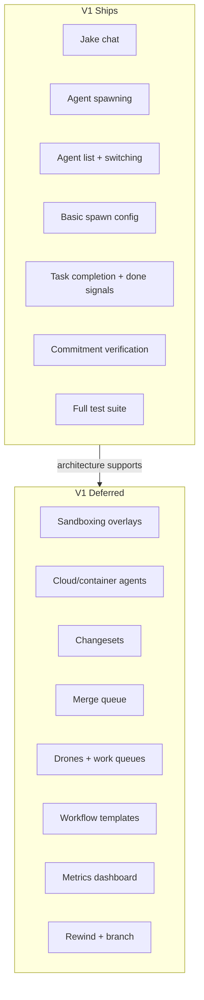
```mermaid
flowchart TD
    subgraph V1 ["V1 Ships"]
        Jake[Jake chat]
        Spawn[Agent spawning]
        List[Agent list + switching]
        Config[Basic spawn config]
        Done[Task completion + done signals]
        Verify[Commitment verification]
        Tests[Full test suite]
    end

    subgraph Deferred ["V1 Deferred"]
        Sandbox[Sandboxing overlays]
        Cloud[Cloud/container agents]
        CS[Changesets]
        MQ[Merge queue]
        Drones[Drones + work queues]
        WF[Workflow templates]
        Dash[Metrics dashboard]
        Rewind[Rewind + branch]
    end

    V1 -->|"architecture supports"| Deferred
```

## 4. Example: V1 End-to-End Flow

This illustrates what the v1 experience looks like in action — user talks to Jake, Jake delegates, verification closes the loop.

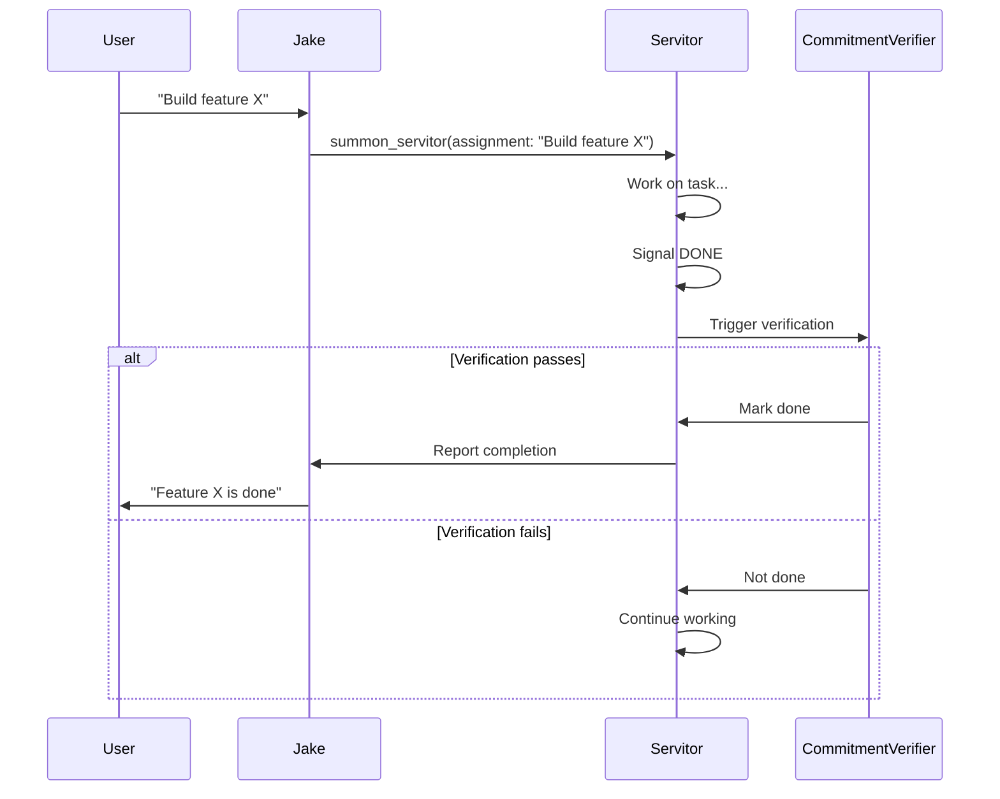
```mermaid
sequenceDiagram
    participant User
    participant Jake
    participant Servitor
    participant CV as CommitmentVerifier

    User->>Jake: "Build feature X"
    Jake->>Servitor: summon_servitor(assignment: "Build feature X")
    Servitor->>Servitor: Work on task...
    Servitor->>Servitor: Signal DONE
    Servitor->>CV: Trigger verification

    alt Verification passes
        CV->>Servitor: Mark done
        Servitor->>Jake: Report completion
        Jake->>User: "Feature X is done"
    else Verification fails
        CV->>Servitor: Not done
        Servitor->>Servitor: Continue working
    end
```

## 5. Open Questions

- **V1 changeset workaround:** With changesets deferred, how does v1 protect original files? PRD says "agents work on actual files for now." Is there any intermediate protection (e.g., git stash, branch per agent)?

- **Multi-project scope in v1:** Is multi-project support a v1 requirement? It is implemented but not listed in the PRD's v1 must-have list.

## 6. Coverage Gaps

- **Ship criteria formalization:** "User spends more time directing than waiting" is qualitative. No quantitative threshold is specified for when this criterion is met.

- **v1 feature freeze definition:** No specification for when v1 is "feature complete" vs "ready to ship." The gap between "features work" and "product is polished" is not addressed.

---

# §018 — Spec Fidelity

**Status:** complete
**Last Updated:** 2026-02-14

## Upstream References
- PRD: §19.4 (Completeness and Correctness Standards)
- PRD: §2 (Invariants — specifically Invariant #3: Commitments must be verified independently)
- Reader: §8 (Commitment Verification)

## Downstream References
- ADR: ADR-007 (Provenance Tracking)
- Code: `// MARK: - Provenance:` comments in Tavern/Sources/
- Tests: `.tags()` with requirement-derived tags in Tavern/Tests/

---

## 1. Overview

This module specifies the provenance tracking system that makes completeness and correctness verifiable questions rather than guesses. Every requirement traces forward to code and tests; every piece of code traces backward to the requirement it satisfies. The self-verification principle applies: the development process is held to the same standard as the system's agents (Invariant #3).

## 2. Requirements

### REQ-FID-001: Completeness Verification
**Source:** PRD §19.4
**Priority:** must-have
**Status:** specified

**Properties:**
- Every specified requirement must be verifiably implemented — no silent gaps
- Tooling can compute a completeness report: which requirements have implementations, which do not
- The development process is held to the same verification standard as the system's agents (Invariant #3)

**Testable assertion:** Running a provenance scan produces a list of all specified requirements and their implementation status. Requirements without implementations are flagged.

**See also:** REQ-INV-003 (Commitments must be verified independently)

### REQ-FID-002: Code Provenance Comments
**Source:** PRD §19.4
**Priority:** must-have
**Status:** specified

**Properties:**
- Every Swift source file implementing a specified requirement includes a `// MARK: - Provenance: REQ-PREFIX-NNN` comment
- File-level provenance appears after imports, before the first declaration
- Function-level provenance appears immediately before the function it annotates
- Multiple requirement references are comma-separated on a single MARK line

**Testable assertion:** A grep for `// MARK: - Provenance:` in source files returns all files with provenance annotations. Each annotation contains valid requirement IDs matching the `REQ-[A-Z]+-[0-9]{3}` pattern.

### REQ-FID-003: Test Provenance Tags
**Source:** PRD §19.4
**Priority:** must-have
**Status:** specified

**Properties:**
- Tests covering specified requirements use Swift Testing `.tags()` with requirement-derived tags
- Tags are defined in a `Tags.swift` extension file per test target
- Tag naming convention: `REQ-AGT-001` becomes `.reqAGT001` (camelCase, no hyphens)
- Each tagged test also has a `// MARK: - Provenance: REQ-PREFIX-NNN` comment for discoverability

**Testable assertion:** Running `swift test --filter` with a requirement-derived tag executes all tests covering that requirement. Every test with a provenance MARK comment has a corresponding `.tags()` entry.

### REQ-FID-004: Bidirectional Reference
**Source:** PRD §19.4
**Priority:** must-have
**Status:** specified

**Properties:**
- Backward traceability (code → spec): MARK comments in source files link to requirement IDs
- Forward traceability (spec → code): computed by grep-based tooling, never manually maintained
- Spec modules maintain directory-level Downstream References as a low-churn guide to where implementations live

**Testable assertion:** Given a requirement ID, tooling can locate all source files and test files referencing it (forward trace). Given a source file with a provenance comment, the referenced requirement ID resolves to a valid entry in a spec module (backward trace).

### REQ-FID-005: Status Derivation
**Source:** PRD §19.4
**Priority:** must-have
**Status:** specified

**Properties:**
- Requirement status progresses: `specified → implemented → tested → verified`
- Status is computed from provenance scans, not manually set
- `specified`: requirement exists in a spec module
- `implemented`: at least one source file has a provenance comment referencing the requirement
- `tested`: at least one test has a provenance tag referencing the requirement
- `verified`: all tests for the requirement pass

**Testable assertion:** A status derivation tool reports the correct status for requirements at each stage. Adding a provenance comment to a source file advances the requirement from `specified` to `implemented`. Adding a tagged test advances it to `tested`.

### REQ-FID-006: Coverage Verification
**Source:** PRD §19.4
**Priority:** must-have
**Status:** specified

**Properties:**
- Orphaned provenance is flagged: code references a requirement ID that does not exist in any spec module
- Unimplemented requirements are reported: spec requirements with no matching provenance comments in code
- Untested implementations are reported: requirements with code provenance but no test provenance

**Testable assertion:** Introducing a provenance comment with a nonexistent requirement ID produces an orphan warning. Removing all provenance comments for a requirement causes it to appear in the unimplemented report.

### REQ-FID-007: Comment Format Specification
**Source:** PRD §19.4
**Priority:** must-have
**Status:** specified

**Properties:**
- Canonical regex: `// MARK: - Provenance: (REQ-[A-Z]+-[0-9]{3})(, REQ-[A-Z]+-[0-9]{3})*`
- MARK prefix integrates with Xcode's source navigator jump bar
- Comma-separated references for files implementing multiple requirements
- No trailing punctuation, no additional text after the requirement list

**Testable assertion:** All provenance comments in the codebase match the canonical regex. A linting tool rejects comments that deviate from the format.

## 3. Behavior

### Provenance Workflow

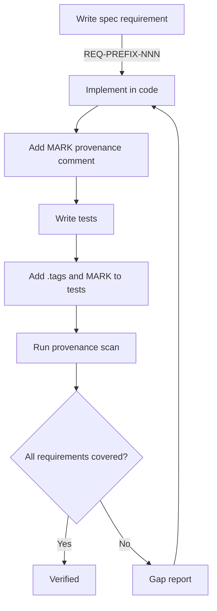
```mermaid
flowchart TD
    A[Write spec requirement] -->|REQ-PREFIX-NNN| B[Implement in code]
    B --> C[Add MARK provenance comment]
    C --> D[Write tests]
    D --> E[Add .tags and MARK to tests]
    E --> F[Run provenance scan]
    F --> G{All requirements covered?}
    G -->|Yes| H[Verified]
    G -->|No| I[Gap report]
    I --> B
```

### Backfill Strategy

Provenance is added incrementally — when touching a file, add provenance for the requirements it implements. No big-bang backfill required.

## 4. Open Questions

None — the format and workflow are fully specified. Tooling implementation details are deferred to the respective tooling beads (spec-status, trace, audit-spec).

---

# §019 — Servitor States & Modes

**Status:** complete
**Last Updated:** 2026-02-16

## Upstream References
- PRD: §4.2 (Agent States), §4.4 (Servitor Lifecycle), §5.2 (Execution Modes)
- Reader: §3 (Core Concepts — agent states), §5 (Architecture Notes)
- Transcripts: transcript_2026-01-19-1144.md (agent states, task modes)

## Downstream References
- Code: Tavern/Sources/TavernCore/Agents/ (Servitor.swift, Jake.swift)
- Tests: Tavern/Tests/TavernCoreTests/, Tavern/Tests/TavernTests/

> **Note:** This module is the canonical source for servitor state machine and mode definitions. The state/mode sections in §004, §006, and §007 are deprecated in favor of this module.

---

## 1. Overview
Consolidates all servitor state machine and mode content into one canonical reference. Defines the state machine (Summoned through GC), three orthogonal boolean properties (backgrounding, perseverance, user presence), and their interaction rules with the state machine.

## 2. Requirements

### REQ-STM-001: Canonical State Machine
**Source:** PRD §4.2, §4.4
**Priority:** must-have
**Status:** specified

**Properties:**
- Servitor states: Summoned → Working → Waiting (WaitingForInput, WaitingForWakeup) → Verifying → Done / FailedReaped / DismissedReaped → GC
- Summoned is the initial state upon creation
- FailedReaped = error termination (unrecoverable failure, timeout, or forced reap)
- DismissedReaped = successful completion and formal dismissal by parent or self
- Both "Reaped" states transition to GC (dropped from runtime memory, persisted to disk)
- State transitions are logged at `.debug` level only
- Only valid transitions are permitted; invalid transitions produce an error

**Testable assertion:** A newly created servitor starts in Summoned state. Only valid transitions are accepted; invalid transitions produce an error. FailedReaped and DismissedReaped both transition to GC. All transitions are logged at debug level.

### REQ-STM-002: Three Orthogonal Boolean Properties
**Source:** PRD §4.4, §5.2
**Priority:** must-have
**Status:** specified

**Properties:**
- Three independent boolean properties govern servitor behavior: backgrounding, perseverance, user presence
- These three properties are orthogonal — they can combine in any permutation (2³ = 8 combinations)
- Each property is independently set and queried
- Properties are set at spawn time and may be modified during the servitor's lifetime (except where noted per-property)

**Testable assertion:** All 8 combinations of the three boolean properties are valid. Each property can be set and queried independently.

### REQ-STM-003: Backgrounding Property
**Source:** PRD §4.4
**Priority:** must-have
**Status:** specified

**Properties:**
- Background servitors do not get their own first-class chat window
- Background servitors are displayed as resources associated with their parent servitor (UX details TBD)
- Jake-spawned servitors may or may not be backgrounded (configurable at spawn time)
- User-spawned servitors are never backgrounded (they always get a chat window)

**Testable assertion:** A backgrounded servitor does not appear as a chat window target. A non-backgrounded servitor gets its own chat window. User-spawned servitors are never backgrounded.

### REQ-STM-004: Perseverance Property
**Source:** PRD §5.2
**Priority:** must-have
**Status:** specified

**Properties:**
- A persevering servitor operates in an infinite loop — only Done (after commitment verification) exits the loop
- If a persevering servitor issues any wait command, it receives a system response telling it to persevere and continue working
- The servitor is informed of its perseverance obligation both in its initial system prompt and at every incident where it attempts to wait
- Perseverance prevents the WaitingForWakeup state — the servitor is prodded back to Working immediately

**Testable assertion:** A persevering servitor that attempts to wait receives a perseverance prod and returns to Working. Only Done (verified) exits a persevering servitor. The system prompt for persevering servitors includes the perseverance obligation.

### REQ-STM-005: User Presence Property
**Source:** PRD §4.4
**Priority:** must-have
**Status:** specified

**Properties:**
- Users can "join" and "leave" servitor sessions
- The servitor receives deterministic system messages when a user joins or leaves
- The servitor may alter its behavior based on user presence (e.g., communication style, verbosity, interaction with other agents)
- User presence is a notification — the servitor is informed, not controlled

**Testable assertion:** When a user joins, the servitor receives a deterministic "user joined" system message. When a user leaves, the servitor receives a "user left" system message. These messages are delivered reliably.

### REQ-STM-006: Configurable Inactivity Timeout
**Source:** PRD §4.2
**Priority:** must-have
**Status:** specified

**Properties:**
- If a servitor pauses without issuing a wait or done signal for a configurable duration, it is either prodded to respond or reaped
- The timeout duration is adjustable per-servitor
- The action on timeout (prod vs. reap) is configurable
- Timeout applies in Working state only — waiting states have their own timeout rules

**Testable assertion:** A servitor that is inactive for longer than its configured timeout receives either a prod or is reaped, per configuration. The timeout is adjustable per-servitor.

### REQ-STM-007: State-Mode Interaction Rules
**Source:** PRD §4.2, §4.4, §5.2
**Priority:** must-have
**Status:** working-draft

**Properties:**
- Perseverance + WaitingForWakeup: Persevering servitors cannot enter WaitingForWakeup — they are prodded back to Working immediately
- Perseverance + WaitingForInput: Persevering servitors CAN enter WaitingForInput (they need human answers to continue)
- Backgrounding + User Presence: Background servitors can still have user presence toggled (user may observe/interact through parent's resource view)
- Perseverance + Backgrounding: Valid combination — a background servitor that must keep working until done
- All three enabled: Valid — a background, persevering servitor with user presence tracking

> **Note:** This requirement is a working draft. The user will iterate on these interaction rules after seeing everything together.

**Testable assertion:** A persevering servitor cannot enter WaitingForWakeup. A persevering servitor can enter WaitingForInput. All 8 boolean property combinations produce valid, well-defined behavior.

## 3. Properties Summary

### Canonical State Machine

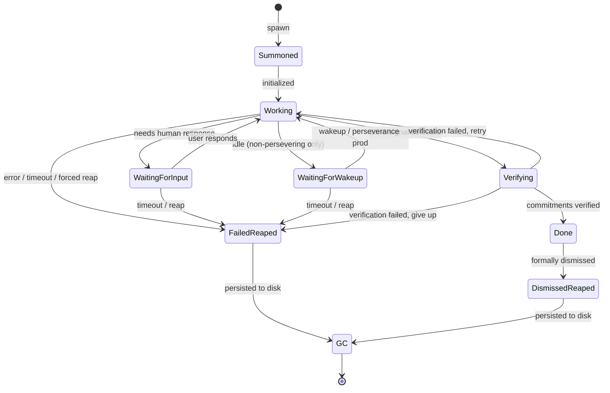
```mermaid
stateDiagram-v2
    [*] --> Summoned : spawn
    Summoned --> Working : initialized
    Working --> WaitingForInput : needs human response
    Working --> WaitingForWakeup : idle (non-persevering only)
    Working --> Verifying : done signal detected
    Working --> FailedReaped : error / timeout / forced reap
    WaitingForInput --> Working : user responds
    WaitingForInput --> FailedReaped : timeout / reap
    WaitingForWakeup --> Working : wakeup / perseverance prod
    WaitingForWakeup --> FailedReaped : timeout / reap
    Verifying --> Done : commitments verified
    Verifying --> Working : verification failed, retry
    Verifying --> FailedReaped : verification failed, give up
    Done --> DismissedReaped : formally dismissed
    FailedReaped --> GC : persisted to disk
    DismissedReaped --> GC : persisted to disk
    GC --> [*]
```

### Three Orthogonal Boolean Properties

| Property | Default | Effect When True | Effect When False |
|----------|---------|-----------------|-------------------|
| Backgrounding | false | No chat window, displayed as parent resource | Gets own chat window |
| Perseverance | false | Infinite loop, no idle allowed | Can enter WaitingForWakeup |
| User Presence | false | User has joined the session | User has not joined / has left |

### State-Mode Interaction Matrix (Working Draft)

| State | Backgrounded | Persevering | User Present |
|-------|-------------|-------------|--------------|
| Summoned | No effect | No effect | No effect |
| Working | No chat window | Must keep working | May alter communication style |
| WaitingForInput | No chat window (input via parent) | Allowed | Affects prompt style |
| WaitingForWakeup | No chat window | **Blocked** — prodded back | No effect |
| Verifying | No effect | No effect | No effect |
| Done | No effect | Required to reach here | No effect |

## 4. Open Questions

- **UX for background servitors:** How exactly are background servitors displayed as resources of their parent? What interaction is available?

- **Perseverance prod content:** What are the exact contents of the perseverance prod message? Is it customizable per-spawn?

- **User presence behavioral expectations:** Beyond notification, are there any mandatory behavioral changes when user presence changes? Or is it purely advisory?

- **Inactivity timeout defaults:** What are sensible default timeout values? Should there be a system-wide default that per-servitor values override?

## 5. Coverage Gaps

- **State persistence across app restart:** The state machine defines runtime states, but which states survive app restart? Presumably Summoned through Working can be restored, but Verifying may need special handling.

- **Concurrent state transitions:** What happens if multiple signals arrive simultaneously (e.g., done signal and timeout fire at the same time)? Priority/ordering rules are not specified.

- **Mode changes after spawn:** Can backgrounding and perseverance be changed after initial spawn, or are they immutable? The spec says "may be modified" but specific rules are TBD.

---

# §020 — Servitor Trees

**Status:** complete
**Last Updated:** 2026-02-16

## Upstream References
- PRD: §12 (Agent Hierarchies)
- Reader: §3 (Core Concepts — tree structures), §5 (Architecture Notes)
- Transcripts: transcript_2026-01-19-1144.md (Erlang-style hierarchies)

## Downstream References
- Code: Tavern/Sources/TavernCore/Agents/ (Servitor.swift, ServitorSpawner.swift, Jake.swift)
- Tests: Tavern/Tests/TavernCoreTests/, Tavern/Tests/TavernTests/

---

## 1. Overview
Defines the tree structure of servitors: parent-child relationships, how operating modes (backgrounding, perseverance, user presence) interact with tree depth, failure boundaries and supervision strategies (Erlang-style), gang termination, token budget inheritance, and cross-tree communication.

## 2. Requirements

### REQ-TRE-001: Tree Structure
**Source:** PRD §12
**Priority:** must-have
**Status:** specified

**Properties:**
- Servitors form trees of arbitrary depth
- Jake is the root of all servitor trees — every servitor has an ancestor chain that terminates at Jake
- Parent-child relationships are tracked and queryable
- A servitor may spawn zero or more children
- Tree structure is persisted and survives app restart

**Testable assertion:** A servitor spawned by Jake has Jake as its parent. A servitor spawned by another servitor has that servitor as its parent. The full ancestor chain is queryable. Tree structure persists across app restart.

### REQ-TRE-002: Operating Modes at Tree Positions
**Source:** PRD §12
**Priority:** must-have
**Status:** specified

**Properties:**
- Backgrounding, perseverance, and user presence (§019) apply at every tree position
- A parent can spawn children with different mode combinations than itself
- Mode values are set per-servitor, not inherited from parent by default
- The spawning parent specifies the child's initial mode values at spawn time

**Testable assertion:** A non-backgrounded parent can spawn a backgrounded child. A persevering parent can spawn a non-persevering child. Mode values are independently configured per-servitor regardless of tree position.

### REQ-TRE-003: Failure Boundaries
**Source:** PRD §12
**Priority:** must-have
**Status:** specified

**Properties:**
- Failure boundaries are properties over subtrees that determine rules on node failure
- Three supervision strategies are supported:
  - **Restart-one:** Replace the single failed worker. Other siblings continue unaffected. The failed servitor's artifacts are preserved for debugging.
  - **Restart-all:** Gang invalidation — terminate and restart the entire sibling group. Used when siblings have interdependent state that becomes inconsistent if one fails.
  - **Revert-to-pre-existence:** Catastrophic failure — revert as much as possible to the state before the failed subtree existed. Changeset drafts and artifacts are preserved for debugging but operational state is rolled back.
- The supervision strategy is set on the parent and applies to its direct children
- Default strategy is restart-one

**Testable assertion:** When a child fails under restart-one, only that child is replaced; siblings continue. Under restart-all, all siblings are terminated and restarted. Under revert-to-pre-existence, the subtree's operational state is rolled back. Artifacts are preserved in all cases.

### REQ-TRE-004: Gang Termination via Capability
**Source:** PRD §12
**Priority:** must-have
**Status:** specified

**Properties:**
- Agents may control gang termination through capabilities (see §021)
- Gang termination terminates all members of a sibling group simultaneously
- Artifacts in changeset drafts are preserved for debugging — gang termination does not destroy work products
- The capability to trigger gang termination must be explicitly granted

**Testable assertion:** An agent with gang termination capability can terminate all siblings. An agent without the capability cannot. Changeset drafts are preserved after gang termination.

### REQ-TRE-005: Token Budget Inheritance
**Source:** PRD §12
**Priority:** must-have
**Status:** specified

**Properties:**
- Token budgets are delegated through the tree from parent to child
- A child cannot exceed its parent's remaining budget
- When a parent delegates budget to a child, the parent's available budget decreases by that amount
- Agents receive periodic updates about their remaining budget
- Budget exhaustion triggers a warning, then a forced transition to Verifying or FailedReaped

**Testable assertion:** A child's budget does not exceed its parent's remaining budget. Delegating budget to a child reduces the parent's available budget. Budget exhaustion triggers appropriate state transitions. Agents receive periodic budget updates.

### REQ-TRE-006: Cross-Tree Communication
**Source:** PRD §12
**Priority:** must-have
**Status:** specified

**Properties:**
- Cross-tree communication is capability-gated (see §021)
- A servitor may communicate with servitors in other trees only if granted the lateral communication capability
- Communication scope is defined at grant time: siblings (same parent), cousins (same grandparent), or broader
- Without the capability, a servitor can only communicate up (to parent) and down (to children)

**Testable assertion:** A servitor without lateral communication capability cannot send messages to servitors outside its direct ancestor/descendant chain. A servitor with lateral communication capability can communicate with the specified scope. Default communication is up and down only.

## 3. Properties Summary

### Tree Structure

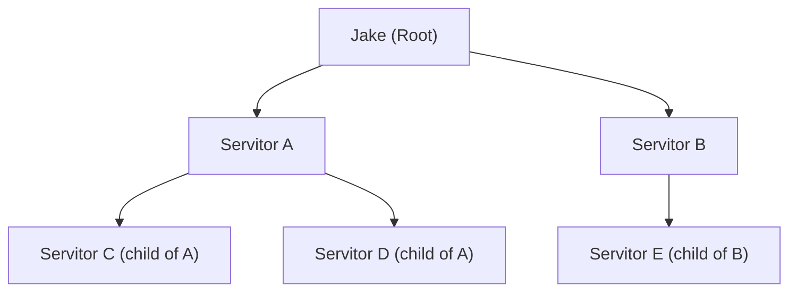
```mermaid
graph TD
    Jake["Jake (Root)"]
    S1["Servitor A"]
    S2["Servitor B"]
    S3["Servitor C (child of A)"]
    S4["Servitor D (child of A)"]
    S5["Servitor E (child of B)"]

    Jake --> S1
    Jake --> S2
    S1 --> S3
    S1 --> S4
    S2 --> S5
```

### Supervision Strategies

| Strategy | Scope | Effect | Artifact Preservation |
|----------|-------|--------|----------------------|
| Restart-one | Single failed child | Replace failed worker only | Yes |
| Restart-all | All siblings of failed child | Terminate and restart entire group | Yes |
| Revert-to-pre-existence | Entire subtree | Roll back to pre-existence state | Yes (for debugging) |

### Communication Scope

| Direction | Default | Requires Capability |
|-----------|---------|-------------------|
| Up (to parent) | Allowed | No |
| Down (to children) | Allowed | No |
| Lateral (siblings) | Blocked | Yes (lateral communication) |
| Cross-tree (cousins+) | Blocked | Yes (lateral communication, broader scope) |

## 4. Open Questions

- **Budget delegation granularity:** Are token budgets delegated as fixed amounts or as percentages of the parent's remaining budget? Can budgets be reclaimed from children?

- **Restart-all state synchronization:** When restarting all siblings, how is the shared state they depend on reconstructed? Do restarted siblings get context about why they were restarted?

- **Revert-to-pre-existence scope:** How much state can realistically be rolled back? File system changes? Doc store mutations? What are the boundaries of "as much as possible"?

- **Tree depth limits:** Is there a maximum tree depth? What prevents runaway recursive spawning?

## 5. Coverage Gaps

- **Orphan handling:** What happens to children when their parent is reaped? Are they adopted by the grandparent, or reaped as well?

- **Tree visualization:** No specification for how the tree structure is displayed to the user in the UI.

- **Concurrent spawning limits:** No per-parent limit on how many children can be spawned simultaneously.

---

# §021 — Capability Delegation

**Status:** complete
**Last Updated:** 2026-02-16

## Upstream References
- PRD: §4.1 (Agent Types — partial capability mention)
- Reader: §3 (Core Concepts), §5 (Architecture Notes)
- Transcripts: transcript_2026-01-19-1144.md (capability concepts)

## Downstream References
- Code: Tavern/Sources/TavernCore/Agents/, Tavern/Sources/TavernCore/MCP/
- Tests: Tavern/Tests/TavernCoreTests/, Tavern/Tests/TavernTests/

> **Note:** PRD backfill needed. This spec was written first; a corresponding PRD section should be added to PRD v1.2. See Open Questions.

---

## 1. Overview
Defines the capability system: how capabilities are separated from the summon flow, delegated from parent to child, enforced by the deterministic shell, and how agents are prevented from modifying their own capabilities. Covers capability types, delegation chains, and the handle-based flow.

## 2. Requirements

### REQ-CAP-001: Separation from Summon
**Source:** PRD §4.1 (partial)
**Priority:** must-have
**Status:** specified

**Properties:**
- The summon operation is asynchronous and returns a promise ID (handle) for the spawned servitor
- Capability delegation is a separate operation that uses the handle/ID to send capabilities to the spawned agent
- This separation allows the spawner to prepare capabilities after the spawn is initiated but before the agent begins work
- The spawned agent's main actor receives the capability handle and waits for session notification before proceeding

**Testable assertion:** Summon returns a promise ID. A separate delegate command sends capabilities using that ID. The spawned agent does not begin work until capabilities are received.

### REQ-CAP-002: Capability Handle Flow
**Source:** PRD §4.1 (partial)
**Priority:** must-have
**Status:** specified

**Properties:**
- The main actor of the spawned agent receives the capability handle from the spawning system
- The agent waits for a session notification that capabilities have been received and can be invoked
- Until capabilities are received, the agent remains in Summoned state (§019 REQ-STM-001)
- The capability handle is opaque to the agent — it cannot inspect or modify the handle itself

**Testable assertion:** A spawned agent remains in Summoned state until capabilities are received. After receiving capabilities, the agent transitions to Working. The agent cannot inspect or modify its capability handle.

### REQ-CAP-003: Capability Types
**Source:** PRD §4.1 (partial)
**Priority:** must-have
**Status:** specified

**Properties:**
- Defined capability types:
  - **Filesystem access:** Read/write access to specified paths
  - **Network access:** Ability to make network requests (scope TBD)
  - **Tool access:** Access to specific MCP tools or tool categories
  - **Lateral communication:** Ability to communicate across trees (scope: siblings, cousins, or broader — see §020 REQ-TRE-006)
- Capability types are extensible — new types can be added as the system evolves
- Servitors receive capability grants only if the parent explicitly includes them in the summon-with-assignment flow

**Testable assertion:** Each capability type can be independently granted or withheld. A servitor without filesystem access cannot perform file operations. A servitor without lateral communication cannot message across trees. Capabilities are only received if explicitly granted by parent.

### REQ-CAP-004: Delegation Chains
**Source:** PRD §4.1 (partial)
**Priority:** must-have
**Status:** specified

**Properties:**
- A parent cannot delegate capabilities it does not have
- Capabilities flow downward only — from parent to child, never upward or laterally
- Jake's capabilities represent the ceiling for any servitor tree
- A child's capabilities are always a subset of (or equal to) its parent's capabilities
- Delegation is transitive: if A delegates to B and B delegates to C, C's capabilities are bounded by B's (which are bounded by A's)

**Testable assertion:** Attempting to delegate a capability the parent does not have produces an error. A child's capabilities never exceed its parent's. Jake's capabilities are the upper bound for all servitors.

### REQ-CAP-005: Deterministic Shell Enforcement
**Source:** PRD §4.1 (partial)
**Priority:** must-have
**Status:** specified

**Properties:**
- Capabilities are enforced by the deterministic shell, not by the agent's own prompt or self-discipline
- Even if a parent composes a prompt to a child that suggests broader capabilities, the system enforces the actual capability boundaries
- Capability violations are logged and reported to the parent
- The deterministic shell is the single enforcement point — no other layer can override it

**Testable assertion:** An agent that attempts an action outside its capabilities is blocked by the deterministic shell. Capability violations are logged. Prompt content cannot override capability boundaries.

### REQ-CAP-006: Agents Cannot Modify Own Capabilities
**Source:** PRD §4.1 (partial), Non-Negotiable Invariant #6
**Priority:** must-have
**Status:** specified

**Properties:**
- Agents cannot modify their own capabilities or boundaries
- Attempting to modify own capabilities is a violation, logged and reported
- This applies to all agent types including Jake (Jake's capabilities are set by the system)
- Capability modification is only possible by the parent that granted the capabilities, or by the system itself

**Testable assertion:** An agent that attempts to modify its own capabilities is blocked. The violation is logged and reported. Only the granting parent or the system can modify an agent's capabilities.

## 3. Properties Summary

### Capability Flow

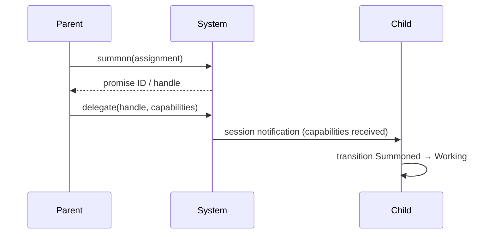
```mermaid
sequenceDiagram
    participant Parent
    participant System
    participant Child

    Parent->>System: summon(assignment)
    System-->>Parent: promise ID / handle
    Parent->>System: delegate(handle, capabilities)
    System->>Child: session notification (capabilities received)
    Child->>Child: transition Summoned → Working
```

### Capability Types

| Type | Scope | Default |
|------|-------|---------|
| Filesystem access | Specified paths | None |
| Network access | TBD | None |
| Tool access | Specific tools/categories | None |
| Lateral communication | Siblings / cousins / broader | None |

### Delegation Rules

| Rule | Description |
|------|-------------|
| Downward only | Capabilities flow parent → child, never upward |
| Subset constraint | Child ≤ parent ≤ ... ≤ Jake |
| No self-modification | Agents cannot modify own capabilities |
| Shell enforcement | Deterministic shell is the single enforcement point |

## 4. Open Questions

- **PRD backfill:** This module was specified ahead of the PRD. A corresponding section needs to be added to PRD v1.2 to maintain pipeline traceability.

- **Network access scoping:** What does "network access" mean in practice? Domain allowlists? Port restrictions? Protocol-level controls?

- **Capability revocation:** Can a parent revoke capabilities from a running child? What happens to in-flight operations that depend on a revoked capability?

- **Jake's capability source:** Where are Jake's capabilities defined? System configuration? Per-project settings? Hardcoded?

- **Tool access granularity:** Is tool access per-individual-tool or per-category? Can a servitor have access to `summon_servitor` but not `dismiss_servitor`?

## 5. Coverage Gaps

- **Capability persistence:** Are capabilities persisted with the servitor's state across app restart, or must they be re-delegated?

- **Audit trail:** No specification for a capability audit log (who granted what to whom, when).

- **Emergency override:** No mechanism for emergency capability escalation (e.g., a servitor discovers it needs filesystem access mid-task).

---

# §022 — Chat Discussions & Sessions

**Status:** complete
**Last Updated:** 2026-02-16

## Upstream References
- PRD: §4.5 (Chat & Session Management — partial)
- Reader: §3 (Core Concepts — sessions), §5 (Architecture Notes)
- Transcripts: transcript_2026-01-19-1144.md (session persistence)

## Downstream References
- Code: Tavern/Sources/TavernCore/Chat/, Tavern/Sources/TavernCore/Persistence/
- Tests: Tavern/Tests/TavernCoreTests/, Tavern/Tests/TavernTests/

---

## 1. Overview
Separates the user-visible chat discussion from the underlying Claude sessions. A chat discussion provides a contiguous conversational experience for the user, while multiple Claude sessions may exist beneath it due to session expiry, recreation, or other lifecycle events. Session boundaries are invisible to the user in normal usage.

## 2. Requirements

### REQ-CDS-001: Chat Discussion
**Source:** PRD §4.5 (partial)
**Priority:** must-have
**Status:** specified

**Properties:**
- A chat discussion is the user-visible conversation associated with a servitor
- Each servitor has exactly one chat discussion for its lifetime
- The discussion persists for the servitor's entire lifecycle (Summoned through DismissedReaped)
- The discussion provides a contiguous experience — the user sees one unbroken conversation
- Discussion history is persisted to disk and survives app restart

**Testable assertion:** Each servitor has exactly one chat discussion. The discussion persists from spawn to dismissal. Discussion history survives app restart.

### REQ-CDS-002: Underlying Sessions
**Source:** PRD §4.5 (partial)
**Priority:** must-have
**Status:** specified

**Properties:**
- A single chat discussion may be backed by multiple Claude sessions over its lifetime
- Sessions can expire (server-side timeout), be invalidated (error), or be replaced (context limits)
- The mapping from discussion to sessions is one-to-many
- Session transitions within a discussion are tracked and logged

**Testable assertion:** A chat discussion can survive the expiry of its underlying session. Multiple sessions can back a single discussion over time. Session transitions are logged.

### REQ-CDS-003: Session Resumption
**Source:** PRD §4.5 (partial)
**Priority:** must-have
**Status:** specified

**Properties:**
- When a resumable session exists (server-side state is still valid), the system continues it
- Session resumption is attempted first before creating a new session
- Resumption preserves the full server-side conversation context
- Failed resumption attempts fall through to session recreation (REQ-CDS-004)

**Testable assertion:** When a valid session exists, the system resumes it rather than creating a new one. Resumption preserves server-side context. Failed resumption triggers recreation.

### REQ-CDS-004: Session Recreation
**Source:** PRD §4.5 (partial)
**Priority:** must-have
**Status:** specified

**Properties:**
- When no resumable session exists, the system creates a new one
- The new session receives a system prompt that includes context from the prior discussion
- The system prompt summarizes the discussion state: what was accomplished, what was in progress, relevant context
- The user is not required to re-explain prior context after a session recreation

**Testable assertion:** When no resumable session exists, a new session is created. The new session's system prompt includes prior discussion context. The user does not need to re-explain context.

### REQ-CDS-005: Contiguous Experience
**Source:** PRD §4.5 (partial)
**Priority:** must-have
**Status:** specified

**Properties:**
- The app provides a contiguous chat experience regardless of underlying session changes
- Session boundaries are invisible to the user in normal usage
- Message history from all sessions within a discussion is displayed as one continuous conversation
- Optionally, a subtle indicator may show when a session boundary occurred (for debugging/advanced users), but this is not the default

**Testable assertion:** Message history from multiple sessions is displayed as one continuous conversation. Session boundaries are not visible to the user by default. The user experience is contiguous across session changes.

## 3. Properties Summary

### Discussion-Session Relationship

```mermaid
graph TD
    D["Chat Discussion (user-visible)"]
    S1["Session 1 (expired)"]
    S2["Session 2 (expired)"]
    S3["Session 3 (active)"]

    D --> S1
    D --> S2
    D --> S3
```

### Session Lifecycle

```mermaid
stateDiagram-v2
    [*] --> AttemptResume : discussion needs session
    AttemptResume --> Resumed : valid session exists
    AttemptResume --> CreateNew : no valid session
    Resumed --> Active
    CreateNew --> Active : system prompt with prior context
    Active --> Expired : server-side timeout
    Active --> Invalidated : error
    Active --> Replaced : context limits
    Expired --> AttemptResume : next message
    Invalidated --> AttemptResume : next message
    Replaced --> AttemptResume : next message
```

### Key Properties

| Property | Discussion | Session |
|----------|-----------|---------|
| Visibility | User-facing | Internal |
| Cardinality per servitor | Exactly one | One-to-many |
| Persistence | Disk (survives restart) | Server-side + local JSONL |
| Lifetime | Servitor lifecycle | Variable (may expire) |

## 4. Open Questions

- **Context summarization strategy:** How is prior discussion context summarized for a new session's system prompt? Full history replay? LLM-generated summary? Structured extraction?

- **Session boundary indicators:** Should advanced users have an option to see session boundaries in the chat? If so, what does the indicator look like?

- **Message deduplication:** If a message was sent at the end of session N and the context is replayed in session N+1's system prompt, how is duplication avoided in the user-visible history?

- **Maximum sessions per discussion:** Is there a practical limit on how many sessions can back a single discussion?

## 5. Coverage Gaps

- **Offline behavior:** What happens when a new session cannot be created (network unavailable)? Is the discussion frozen? Can the user still view history?

- **Session metadata display:** No specification for surfacing session health information (e.g., "session nearing context limit") to the user or to Jake.

- **Cross-discussion context:** Can context from one servitor's discussion be shared with another servitor's session? (Relates to §021 capability delegation.)

---

# §023 — Keyboard Shortcuts

**Status:** stub
**Last Updated:** 2026-02-16

## Upstream References
- PRD: (TBD — needs PRD section)

## Downstream References
- Code: Tavern/Sources/Tavern/ (views)
- Tests: Tavern/Tests/TavernUITests/

---

## 1. Overview
STUB — Needs design. Placeholder requirements structure only.

Keyboard shortcuts for the Tavern application. Requirements will be defined during design breakdown.

## 2. Requirements

Requirements will be defined during design. REQ-KEY prefix reserved.

## 3. Properties Summary

(To be defined during design.)

## 4. Open Questions

(To be defined during design.)

## 5. Coverage Gaps

(To be defined during design.)

---

# §024 — Accessibility

**Status:** stub
**Last Updated:** 2026-02-16

## Upstream References
- PRD: (TBD — needs PRD section)

## Downstream References
- Code: Tavern/Sources/Tavern/ (views)
- Tests: Tavern/Tests/TavernUITests/

---

## 1. Overview
STUB — Needs design. Placeholder requirements structure only.

Accessibility requirements for the Tavern application (VoiceOver, keyboard navigation, dynamic type, color contrast, etc.). Requirements will be defined during design breakdown.

## 2. Requirements

Requirements will be defined during design. REQ-ACC prefix reserved.

## 3. Properties Summary

(To be defined during design.)

## 4. Open Questions

(To be defined during design.)

## 5. Coverage Gaps

(To be defined during design.)

---

# §025 — Search

**Status:** stub
**Last Updated:** 2026-02-16

## Upstream References
- PRD: (TBD — needs PRD section)

## Downstream References
- Code: Tavern/Sources/TavernCore/ (TBD)
- Tests: Tavern/Tests/TavernCoreTests/ (TBD)

---

## 1. Overview
STUB — Needs design. Placeholder requirements structure only.

Search functionality within the Tavern application (chat history search, agent search, doc store search, etc.). Requirements will be defined during design breakdown.

## 2. Requirements

Requirements will be defined during design. REQ-SRC prefix reserved.

## 3. Properties Summary

(To be defined during design.)

## 4. Open Questions

(To be defined during design.)

## 5. Coverage Gaps

(To be defined during design.)
