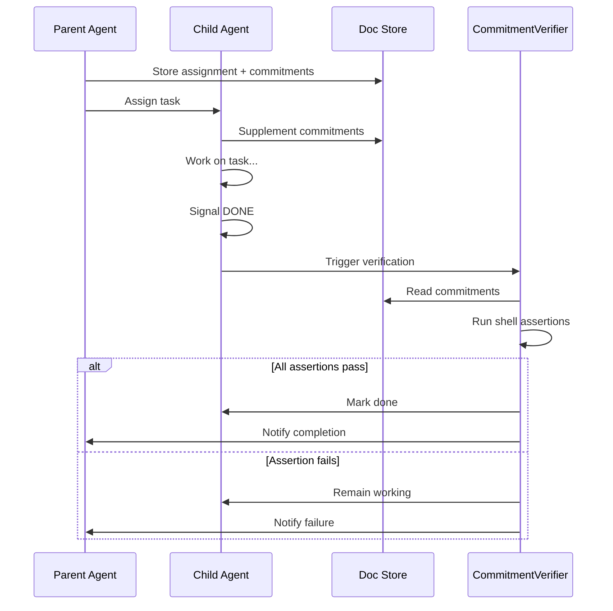
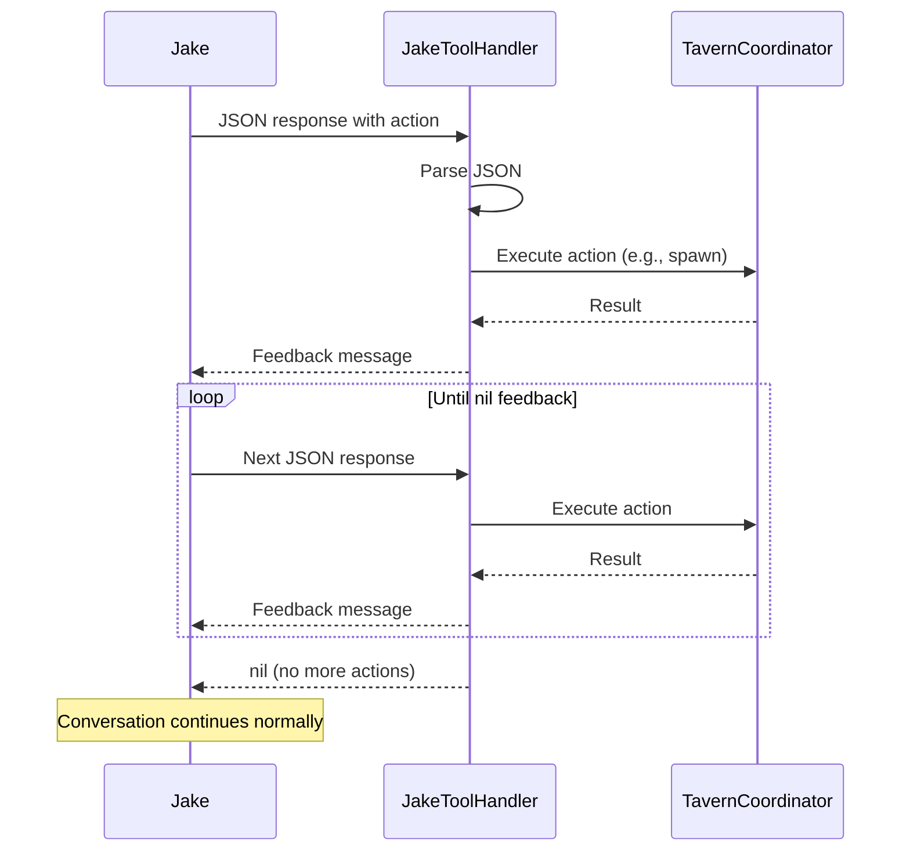

# Deterministic Shell Specification

**Status:** complete
**Last Updated:** 2026-02-08

## Upstream References
- PRD: §4.7 (Deterministic Shell)
- Reader: §3 (Jake's JSON Response Format), §9 (Sidecar Pattern)
- Transcripts: transcript_2026-01-28-jake-spawn-tool.md (JakeToolHandler protocol, continuation loop)

## Downstream References
- ADR: --
- Code: Tavern/Sources/TavernCore/Commitments/ (Commitment.swift, CommitmentList.swift, CommitmentVerifier.swift), Tavern/Sources/TavernCore/MCP/TavernMCPServer.swift
- Tests: Tavern/Tests/TavernCoreTests/

---

## 1. Overview
The deterministic shell wraps non-deterministic LLM agents with deterministic infrastructure for prompt composition, passthrough display, structured tool use, and commitment verification. The goal is to minimize reliance on non-deterministic LLM behavior by pushing correctness concerns into code.

## 2. Requirements

### REQ-DET-001: Prompt Composition
**Source:** PRD §4.7.1
**Priority:** must-have
**Status:** specified

Prompts are built programmatically from skills, instructions, and context. The system does not rely on the agent "remembering" previous instructions. Each message to an agent includes all necessary context assembled by deterministic code.

**Testable assertion:** Agent prompts are constructed by code (not by previous agent responses). System prompts include all required instructions regardless of conversation history length.

### REQ-DET-002: Passthrough Display
**Source:** PRD §4.7.2
**Priority:** must-have
**Status:** specified

The user sees what is stored, not an LLM retranscription. When displaying content from the doc store or agent outputs, the system passes through the stored content directly. No LLM summarization or rephrasing occurs on displayed content.

**Testable assertion:** Content shown to the user from the doc store is byte-identical to the file on disk. Agent responses are displayed as received, not re-processed by another LLM call.

### REQ-DET-003: Structured Outputs via Tools
**Source:** PRD §4.7.3
**Priority:** must-have
**Status:** specified

Agents use structured tools for operations that require precision (calculations, file operations, spawning). The agent does not guess at structured outputs -- it invokes tools with typed parameters, and the tool returns typed results.

**Testable assertion:** Operations requiring precision (math, file paths, agent spawning) go through tool calls with validated parameters. No free-text parsing is used for structured operations.

### REQ-DET-004: Commitment Verification
**Source:** PRD §4.7.4, Invariant REQ-INV-003
**Priority:** must-have
**Status:** specified

Agent completion is verified by deterministic assertions, not by the agent's word. The commitment flow:

1. Parent assigns task (with optional commitments)
2. Child supplements with its own commitments (stored in doc store node)
3. Child works on the task
4. Child signals completion (DONE/COMPLETED)
5. Independent `CommitmentVerifier` runs shell-based assertions
6. Only after all assertions pass is the agent marked "done"

If verification fails, the agent is not done regardless of its self-assessment.

**Testable assertion:** An agent that signals DONE but fails verification remains in a non-done state. An agent that passes verification transitions to done. Verification runs shell commands external to the agent's session.

### REQ-DET-005: Commitment Storage
**Source:** PRD §4.7
**Priority:** must-have
**Status:** specified

Commitments are stored in the doc store, attached to agent nodes. Both parent-assigned commitments and agent-supplemented commitments are persisted. Commitments are machine-readable (structured data, not free text).

**Testable assertion:** Commitments can be created, read, and listed for any agent. Commitments survive app restart. Each commitment has a verifiable assertion.

### REQ-DET-006: Jake's Tool Handler Protocol
**Source:** Reader §9 (Jake's JSON Response Format)
**Priority:** must-have
**Status:** specified

Jake uses a protocol-based `JakeToolHandler` to process structured JSON responses and execute actions. The handler is swappable -- currently `JSONActionHandler` parses `{"message": "...", "spawn": {"assignment": "...", "name": "..."}}`, but the protocol allows future migration to native SDK tools without touching Jake's core logic.

**Testable assertion:** `JakeToolHandler` protocol can be implemented by different handlers. Swapping the handler does not require changes to Jake's core logic. The current handler correctly parses Jake's JSON format.

### REQ-DET-007: Continuation Loop
**Source:** Reader §9 (Continuation Loop)
**Priority:** must-have
**Status:** specified

When the tool handler returns feedback (e.g., confirming a spawn succeeded), Jake receives it and can continue with additional actions. The loop continues until the handler returns nil feedback, signaling no further action is needed.

**Testable assertion:** After a tool action, feedback is sent back to Jake. Jake can issue additional actions based on feedback. The loop terminates when feedback is nil.

### REQ-DET-008: MCP Tool Interface
**Source:** CLAUDE.md (MCP Tools)
**Priority:** must-have
**Status:** specified

Jake's MCP server provides structured tools:

- `summon_servitor` -- Spawns a Servitor with optional `assignment` and `name`. Auto-generates name if not provided.
- `dismiss_servitor` -- Removes a Servitor by UUID.

Both tools use callbacks (`onSummon`, `onDismiss`) for UI updates from within the MCP handler context. New Jake tools follow this pattern.

**Testable assertion:** `summon_servitor` with an assignment creates a working agent. `summon_servitor` without a name auto-generates one. `dismiss_servitor` removes the agent from the registry and UI.

## 3. Behavior

### Commitment Verification Flow

### Continuation Loop

## 4. Open Questions

- **?2 -- Deterministic Shell Meaning:** What does "deterministic shell" mean concretely beyond the four mechanisms listed? Is it a full workflow DSL or state machine? The PRD establishes principles but the boundary between deterministic and non-deterministic is not fully specified.

- **Commitment assertion language:** What format do shell assertions take? Are they arbitrary shell commands? A restricted DSL? How are assertion failures reported?

- **Standard agent tool set:** PRD §14 lists this as TBD. What tools beyond summon/dismiss should all agents have?

## 5. Coverage Gaps

- **Prompt composition specifics:** PRD §14 lists "Prompt composition structure" as TBD. The requirement exists but the implementation details (how skills, instructions, and context are assembled) are not specified.

- **Verification timeout:** No specification for how long verification can run before it is considered failed. Long-running assertions could block the completion flow.

- **Partial verification:** No specification for what happens if some commitments pass and others fail. Is it all-or-nothing, or can partial completion be reported?
