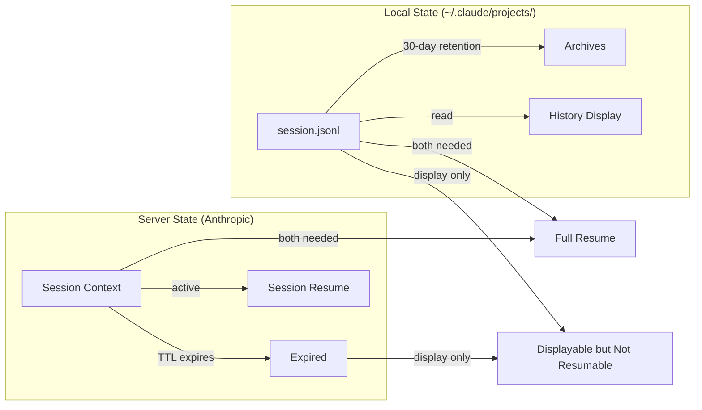
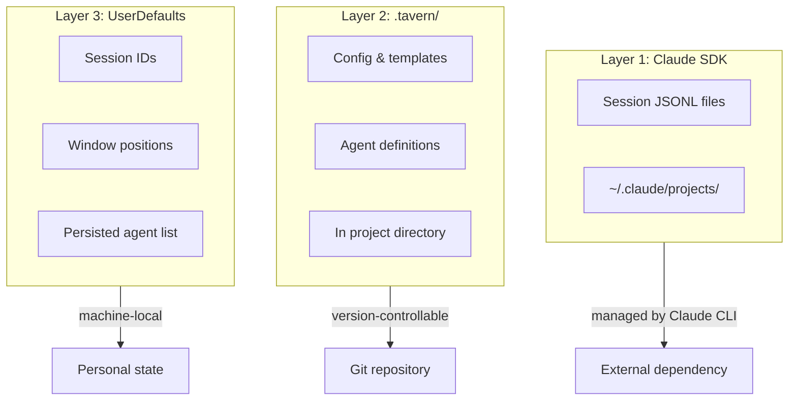

# Document Store Specification

**Status:** complete
**Last Updated:** 2026-02-08

## Upstream References
- PRD: §4.5 (The Document Store), §6.6 (Hygiene)
- Reader: §7 (Core Systems — Document Store, Session Storage Layers, Session Lifecycle)
- Transcripts: transcript_2026-01-19-1144.md (doc store concept), transcript_2026-01-22-0015.md (three storage layers), transcript_2026-02-01-sdk-migration-and-session-forensics.md (session lifecycle)

## Downstream References
- ADR: --
- Code: Tavern/Sources/TavernCore/DocStore/, Tavern/Sources/TavernCore/Persistence/
- Tests: Tavern/Tests/TavernCoreTests/

---

## 1. Overview
Document store as the memory backbone for agent communication and state persistence. The doc store IS the filesystem -- a file is a document. Code implements rules on top (validation, structure, relationships). Covers the three storage layers, hygiene rules for data lifecycle, and the session lifecycle model.

## 2. Requirements

### REQ-DOC-001: Filesystem Identity
**Source:** PRD §4.5
**Priority:** must-have
**Status:** specified

The document store is the filesystem. There is no separate "doc store" abstraction. A file is a document. One file per node. The "doc store" is the rules layer that implements validation, structure, and relationships on top of the filesystem.

**Testable assertion:** All persistent state is represented as files on disk. No separate database, key-value store, or custom storage engine exists for document storage.

### REQ-DOC-002: Source of Truth
**Source:** PRD §4.5, Invariant REQ-INV-005
**Priority:** must-have
**Status:** specified

If it is not in a file, it does not exist. The doc store is the blackboard. Agents communicate primarily through shared state in files. No in-memory-only state that matters to correctness may exist without a file-backed representation.

**Testable assertion:** After any state mutation, the corresponding file on disk reflects the new state. Killing the process and restarting produces consistent state from disk alone.

### REQ-DOC-003: Multi-Purpose Storage
**Source:** PRD §4.5
**Priority:** must-have
**Status:** specified

The document store serves multiple roles:

- **Document storage** -- Specs, PRDs, notes, code files
- **Messaging system** -- With supporting daemons for delivery
- **Work queues** -- Drone dispatch; when an item appears, a drone fires immediately
- **Agent nodes** -- With commitments attached
- **Workflow templates** -- Reusable process definitions

**Testable assertion:** Each of these document types can be created, read, and updated through the doc store rules layer. Document types are namespaced to avoid collision.

### REQ-DOC-004: Three Storage Layers
**Source:** Reader §7 (Session Storage Layers)
**Priority:** must-have
**Status:** specified

Three distinct storage locations serve different purposes:

1. **Claude SDK** (`~/.claude/projects/`) -- Conversation history, session JSONL files. Managed by Claude CLI. 30-day retention with auto-cleanup.
2. **`.tavern/` in project** -- Shareable config, templates, agent definitions. Version-controllable, travels with the repository.
3. **UserDefaults/iCloud** -- Personal state: session IDs, window positions, persisted agent list. Machine-local, not shared.

**Testable assertion:** Session IDs are stored in UserDefaults (layer 3). Session history is read from `~/.claude/projects/` (layer 1). Agent definitions and templates live in `.tavern/` (layer 2).

### REQ-DOC-005: Session Lifecycle
**Source:** Reader §5 (Session Lifecycle)
**Priority:** must-have
**Status:** specified

Session storage has two independent states:

- **Local state** (`~/.claude/projects/`): JSONL transcript files. Enables history display. 30-day retention.
- **Server state** (Anthropic's servers): Session context. Enables session resume. Server-side TTL (unknown duration).

A session can be "displayable but not resumable" if the server-side state expires while the local JSONL file remains. Archives preserve local forensics but cannot resurrect server-side sessions.

**Testable assertion:** History display works from local JSONL files alone (no API call). Session resume requires both local file and valid server-side state. A session with expired server state displays history but fails on resume with an informative error.

### REQ-DOC-006: Authoritative Display
**Source:** Reader §7 (Document Store)
**Priority:** should-have
**Status:** specified

The UI can show a "direct from store" indicator to signal data integrity. When displaying content from the doc store, the system shows what is stored (passthrough display), not an LLM retranscription.

**Testable assertion:** Content displayed with the "direct from store" indicator is byte-identical to the file on disk. No LLM processing occurs between storage and display for authoritative content.

### REQ-DOC-007: Hygiene -- Dead Agent Cleanup
**Source:** PRD §6.6
**Priority:** must-have
**Status:** specified

Daemon processes handle cleanup of:

- Dead agents (terminated, failed, or reaped)
- Old changesets (expired or applied)
- Stale overlays (orphaned from dead agents)
- Orphaned workflows, documents, and resources

**Testable assertion:** After an agent is reaped, its associated resources are cleaned up within a configurable time window. No orphaned resources accumulate indefinitely.

### REQ-DOC-008: Path Encoding
**Source:** CLAUDE.md (Session Persistence Model)
**Priority:** must-have
**Status:** specified

Session store encodes project paths for use as keys: `SessionStore.encodePathForKey()` replaces `/` and `_` with `-`, matching Claude CLI's scheme. Jake's sessions are keyed per-project (`com.tavern.jake.session.<encoded-path>`). Servitor sessions are keyed per-agent UUID.

**Testable assertion:** `encodePathForKey("/Users/yankee/Projects/foo_bar")` produces `"-Users-yankee-Projects-foo-bar"`. Session keys are unique per project and stable across app restarts.

## 3. Behavior

### Session Lifecycle

### Three Storage Layers

## 4. Open Questions

- **Doc store file structure/namespacing:** PRD §14 lists this as TBD. One file per node is established, but the directory hierarchy and naming conventions are not specified.

- **Doc store durability model:** PRD §14 says this "evolves over time." What are the initial durability guarantees? fsync after every write? Periodic flush?

- **Message protocol specifics:** PRD §14 lists this as TBD. How are messages encoded as files? What metadata is required?

- **Conflict resolution:** When two agents write to the same file simultaneously, what happens? Last-write-wins? Merge? Error?

## 5. Coverage Gaps

- **File locking:** No specification for concurrent file access by multiple agents. The shared workspace pattern (ADR-001 Shape E) implies concurrent access but the PRD does not specify locking semantics.

- **Document versioning:** The PRD mentions changesets for code files but does not specify whether doc store documents themselves are versioned.

- **Storage quotas:** No specification for maximum storage consumption by the doc store or per-agent storage limits.
