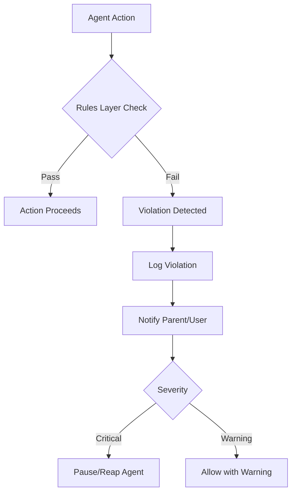

# Invariants Specification

**Status:** complete
**Last Updated:** 2026-02-08

## Upstream References
- PRD: §2 (Invariants)
- Reader: --
- Transcripts: --

## Downstream References
- ADR: --
- Code: Cross-cutting (all modules)
- Tests: Cross-cutting (all test targets)

---

## 1. Overview
Hard-enforced system invariants that can never be violated. These are the non-negotiable rules that every component must respect, serving as the foundation for correctness guarantees across the entire system. There are exactly eight invariants drawn from PRD §2.

## 2. Requirements

### REQ-INV-001: Test Suite Gate
**Source:** PRD §2.1
**Priority:** must-have
**Status:** specified

The test suite must pass before any feature ships. No exceptions. If tests do not exist for a feature, they must be written before the feature can be considered complete. A feature with failing tests or missing tests is not shippable.

**Testable assertion:** CI/CD pipeline rejects any merge where the test suite does not pass. No manual override exists.

### REQ-INV-002: Universal Testability
**Source:** PRD §2.2
**Priority:** must-have
**Status:** specified

Every feature must be testable via automated tests. If a feature cannot be tested automatically, it must be redesigned until it can be. No feature is exempt from this requirement.

**Testable assertion:** Every public API and user-facing behavior has at least one automated test covering it. Code review rejects features without corresponding test coverage.

### REQ-INV-003: Independent Commitment Verification
**Source:** PRD §2.3
**Priority:** must-have
**Status:** specified

Agent commitments must be verified by independent deterministic assertions, not by the agent's own claim of completion. An agent reporting "done" has no bearing on whether the task is actually done. Verification is performed by code external to the agent.

**Testable assertion:** The `CommitmentVerifier` runs shell-based assertions that are independent of the agent's session. An agent in "done" state has passed all commitment assertions.

### REQ-INV-004: Sacred User Attention
**Source:** PRD §2.4
**Priority:** must-have
**Status:** specified

The system must never force new content on the user without their consent. Agents surface questions and status via notification mechanisms; they do not interrupt the user's current focus. The user decides when to engage with each agent.

**Testable assertion:** No UI transition or content display occurs without user-initiated action (click, keyboard shortcut, or explicit preference). Notifications are passive (badges, bubbles), never modal interruptions.

### REQ-INV-005: Doc Store as Source of Truth
**Source:** PRD §2.5
**Priority:** must-have
**Status:** specified

The document store is the authoritative source of truth for all persistent state. If information is not in a file, it does not exist from the system's perspective. No in-memory-only state that matters to correctness or user experience may exist without a file-backed representation.

**Testable assertion:** After any state mutation, the corresponding file on disk reflects the new state. Restarting the app and reading from disk produces the same state as was in memory before shutdown.

### REQ-INV-006: Invariant Immutability
**Source:** PRD §2.6
**Priority:** must-have
**Status:** specified

Agents cannot modify their own invariants. The rules layer that governs agent behavior is outside agent control. No agent action, tool call, or prompt can alter the invariants that constrain that agent.

**Testable assertion:** The invariant/rules layer has no API surface accessible to agents. Agent tool definitions do not include any mechanism to modify rules. Violation monitoring (REQ-OBS) detects attempts.

### REQ-INV-007: Visible Failures
**Source:** PRD §2.7
**Priority:** must-have
**Status:** specified

Silent failures are bugs. If something breaks, it must surface to the appropriate observer (user, parent agent, or monitoring system). No error may be swallowed, ignored, or logged without also being reported upstream.

**Testable assertion:** Every `catch` block either re-throws, logs at `.error` level AND notifies a parent/user, or handles the error with a visible recovery action. No empty catch blocks exist in the codebase.

### REQ-INV-008: Original File Protection
**Source:** PRD §2.8
**Priority:** must-have
**Status:** specified

Original project files are protected until a changeset is explicitly applied. Agent writes go to overlay/sandbox; the original files remain untouched until the user or a deterministic process approves the changes.

**Testable assertion:** In changeset mode, original files have identical content before and after agent execution. Only after explicit apply does the original change. (Note: v1 defers changeset implementation; agents currently work on actual files. This invariant is architecturally preserved for future enforcement.)

## 3. Behavior

### Invariant Enforcement Model

All eight invariants are enforced by the rules layer, which sits between agent actions and system effects. The rules layer is not modifiable by agents (REQ-INV-006).

### Invariant Hierarchy

Invariants are ordered by enforcement mechanism:

1. **Compile-time enforced:** REQ-INV-002 (testability), REQ-INV-006 (immutability) -- architectural constraints
2. **CI/CD enforced:** REQ-INV-001 (test gate) -- pipeline blocks shipping
3. **Runtime enforced:** REQ-INV-003 (verification), REQ-INV-004 (attention), REQ-INV-005 (doc store), REQ-INV-007 (visible failures), REQ-INV-008 (file protection) -- violation monitoring at runtime

## 4. Open Questions

- **Enforcement granularity:** How strictly is REQ-INV-008 enforced in v1 without changeset overlays? Current implementation has agents working on actual files. The invariant is preserved architecturally but not yet enforced at runtime.

- **Violation severity mapping:** Which invariant violations are critical (pause/reap) vs warning (allow with warning)? PRD §16 lists configurable violations but does not map them to the eight core invariants.

## 5. Coverage Gaps

None. All eight PRD invariants are fully specified. Enforcement mechanisms for REQ-INV-008 depend on sandbox implementation (see sandbox.md).
