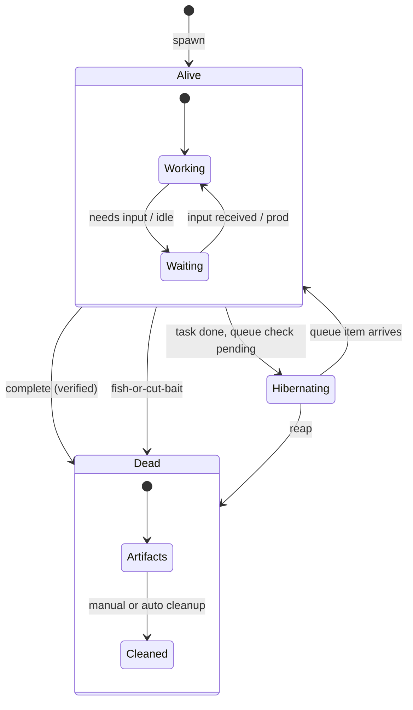
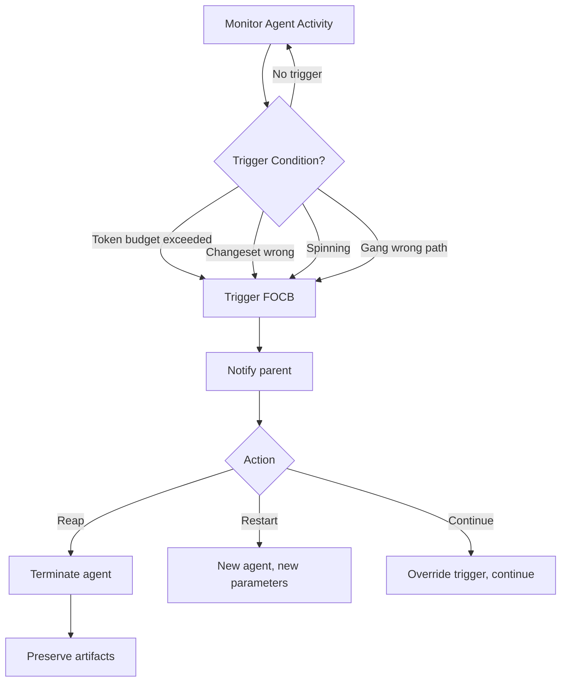

# Lifecycle Specification

**Status:** complete
**Last Updated:** 2026-02-08

## Upstream References
- PRD: §12 (Fish or Cut Bait), §13 (Rewind and Branch)
- Reader: §8 (Dead Agents Leave Bodies), §4 (Completing Work)
- Transcripts: --

## Downstream References
- ADR: --
- Code: Tavern/Sources/TavernCore/Agents/ (partial implementation)
- Tests: --

---

## 1. Overview
Agent lifecycle management including the "fish or cut bait" decision pattern, rewind-and-branch capabilities, and dead agent artifact preservation. Defines how agents are terminated when unproductive, how work can be rewound and branched, and how dead agents leave traceable artifacts.

## 2. Requirements

### REQ-LCM-001: Fish-or-Cut-Bait Triggers
**Source:** PRD §12
**Priority:** must-have
**Status:** specified

The system provides triggers to kill and restart agents rather than allowing them to continue unproductively. Triggers include:

- Token budget exceeded
- Changeset is fundamentally wrong (beyond repair)
- Agent is spinning (repeated actions without progress)
- Entire gang (agent tree) going down the wrong path

When triggered, the agent is reaped (terminated) and may optionally be restarted with different parameters.

**Testable assertion:** Each trigger condition can be detected programmatically. When a trigger fires, the agent transitions to Failed/Reaped state. The parent is notified with the trigger reason.

### REQ-LCM-002: Token Budget Enforcement
**Source:** PRD §12
**Priority:** must-have
**Status:** specified

Agents have token budgets set at spawn time. When an agent exceeds its budget, the fish-or-cut-bait trigger fires. The budget includes tokens consumed by the agent's own API calls.

**Testable assertion:** An agent with a token budget of N stops after consuming approximately N tokens. The budget overshoot is bounded (the agent does not consume 10x its budget before stopping).

### REQ-LCM-003: Spin Detection
**Source:** PRD §12
**Priority:** should-have
**Status:** specified

The system detects when an agent is spinning: performing repeated actions without making progress. Detection is based on heuristics (repeated similar tool calls, no new file changes, looping conversation patterns).

**Testable assertion:** An agent that makes the same tool call N times in succession triggers spin detection. The detection threshold is configurable.

### REQ-LCM-004: Dead Agent Artifacts
**Source:** Reader §8 (Dead Agents Leave Bodies)
**Priority:** must-have
**Status:** specified

When an agent dies (completes, fails, or is reaped), its tile persists showing the final state for review and debugging. Dead agents are not immediately cleaned up. Initial cleanup is manual; sophisticated reaping comes later.

**Testable assertion:** After an agent is reaped, its entry remains in the sidebar with a "dead" indicator. The user can view the agent's final state, conversation history, and any outputs.

### REQ-LCM-005: Rewind Capability
**Source:** PRD §13
**Priority:** deferred
**Status:** specified

General capability to checkpoint agent state, rewind to a previous point, and continue from there. Works at both the agent level (conversation state) and the changeset level (file modifications).

**Testable assertion:** Deferred. When implemented: a checkpoint can be created at any point. Rewinding to a checkpoint restores the agent and its changeset to that point.

### REQ-LCM-006: Branch Capability
**Source:** PRD §13
**Priority:** deferred
**Status:** specified

After rewinding, the user can tweak the prompt and fork a new timeline. The original timeline is preserved. Multiple branches can exist simultaneously.

**Testable assertion:** Deferred. When implemented: branching from a checkpoint creates an independent copy. Changes in one branch do not affect the other.

### REQ-LCM-007: Agent Expiration and Hibernation
**Source:** Reader §4 (Completing Work)
**Priority:** should-have
**Status:** specified

Mortal agents expire or go into hibernation when tasks complete. Jake ensures someone handles open loops. The dashboard reflects completed vs in-progress vs pending work.

**Testable assertion:** A completed agent transitions to done state and is marked as expired or hibernating. Jake is notified when an agent completes. Incomplete tasks are tracked.

## 3. Behavior

### Agent Lifecycle

### Fish-or-Cut-Bait Decision

## 4. Open Questions

- **Rewind storage:** What is preserved at a checkpoint? Full conversation history? Changeset state? Agent configuration? All of the above?

- **Branch limit:** How many branches can exist simultaneously? Is there a limit to prevent resource exhaustion?

- **Automatic reaping:** When does automatic cleanup of dead agent artifacts occur? After a time period? When storage is constrained? Never (always manual)?

## 5. Coverage Gaps

- **Gang-level fish-or-cut-bait:** The PRD mentions "whole gang going down wrong path" but does not specify how this is detected at the tree level vs individual agent level.

- **Restart parameters:** When an agent is restarted after FOCB, what changes? Different prompt? Different model? Different budget? The PRD says "kill and restart" but does not specify what varies.

- **Hibernation triggers:** What causes an agent to hibernate vs expire? The PRD mentions both but does not distinguish the conditions.
