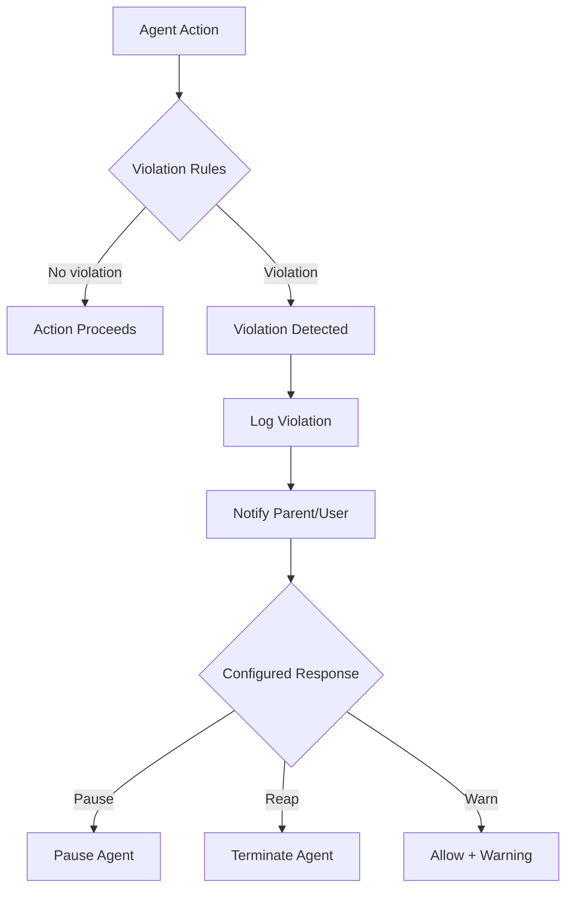

# Observability Specification

**Status:** complete
**Last Updated:** 2026-02-08

## Upstream References
- PRD: §9 (Metrics), §9.1 (Starter Templates — referenced here for meta process), §9.2 (Meta Process), §9.3 (Discovery Sharing), §16 (Violation Monitoring), §19.1 (Logging Standards)
- Reader: §10 (Instrumentation Principle), §7 (TavernLogger categories)
- Transcripts: transcript_2026-01-21-1620.md (TavernLogger, stress testing), transcript_2026-01-21-2113-performance.md (perception boundaries)

## Downstream References
- ADR: --
- Code: Tavern/Sources/TavernCore/Logging/ (TavernLogger), Tavern/Sources/TavernCore/Errors/ (TavernError, TavernErrorMessages)
- Tests: Tavern/Tests/TavernCoreTests/

---

## 1. Overview
Metrics collection, violation monitoring, logging standards, and the meta process for workflow improvement. Defines how the system instruments itself for diagnosability, how invariant violations are detected and reported, and how workflows improve through measurement.

## 2. Requirements

### REQ-OBS-001: Time Category Metrics
**Source:** PRD §9
**Priority:** must-have
**Status:** specified

The system tracks four time categories:

- **Token time** -- Time waiting for LLM API responses
- **Tool time** -- Time spent in tool execution (tests, builds, file operations)
- **Wall clock time** -- Total elapsed time from start to finish
- **Throttle time** -- Time excluded from metrics (API limits, rate limiting)

These are the foundation for all derived metrics.

**Testable assertion:** Each API call records its token time. Each tool execution records its tool time. Wall clock time is captured per-agent and per-task. Throttle time is identified and excluded from utilization calculations.

### REQ-OBS-002: Agent Utilization Metrics
**Source:** PRD §9
**Priority:** must-have
**Status:** specified

Per-agent metrics derived from time categories:

- **Utilization** = Token time / Wall clock time
- **Saturation** = (Token time + Tool time) / Wall clock time
- **Agent wait time** = Time since agent last stopped

**Testable assertion:** Utilization and saturation are computable for any agent at any point. Values are between 0.0 and 1.0. Wait time increases monotonically while an agent is stopped.

### REQ-OBS-003: Human Metrics
**Source:** PRD §9
**Priority:** should-have
**Status:** specified

Metrics tracking the human experience:

- **Human wait time** = Idle time between things needing attention (ideally zero)
- **Context switching load** = Dashboard metric showing how many agents need attention simultaneously

These are informational metrics displayed in the dashboard, not warnings or alerts.

**Testable assertion:** Human wait time is calculable from agent question timestamps and user response timestamps. Context switching load is a count of agents in waiting-for-input state.

### REQ-OBS-004: Amplification Factor
**Source:** PRD §9
**Priority:** must-have
**Status:** specified

The primary system-level metric: count of saturated agents running concurrently. High amplification means many agents are productively working while the human focuses elsewhere.

**Testable assertion:** Amplification factor equals the number of agents with saturation above a threshold (e.g., > 0.5) at a given moment. The metric is computable in real time.

### REQ-OBS-005: Violation Monitoring
**Source:** PRD §16
**Priority:** must-have
**Status:** specified

Beyond static invariants (REQ-INV), the app maintains a dynamic violation list -- rules configurable per-project or per-agent. Examples:

- Modifying files outside designated directories
- Exceeding token budgets
- Spawning more than N children
- Accessing network when disallowed
- Running commands on blocklist

When a violation is detected: log the violation, notify parent agent and/or user, and optionally pause agent, reap agent, or allow with warning.

**Testable assertion:** Violation rules can be configured per-project and per-agent. A rule violation triggers logging and notification. The configured response (pause/reap/warn) is executed.

### REQ-OBS-006: Violation Rule Immutability
**Source:** PRD §16, Invariant REQ-INV-006
**Priority:** must-have
**Status:** specified

Agents cannot modify their own violation rules. The rules layer checks agent actions against the violation list. Only the user or system administrator can modify violation rules.

**Testable assertion:** No agent tool or API allows modification of that agent's own violation rules. Attempts to modify rules are themselves violations.

### REQ-OBS-007: Logging Categories
**Source:** PRD §19.1, Reader §10
**Priority:** must-have
**Status:** specified

Structured logging via `os.log` with subsystem `com.tavern.spillway` and the following categories:

- `TavernLogger.agents` -- Agent lifecycle, state transitions
- `TavernLogger.chat` -- Message flow, conversation state
- `TavernLogger.coordination` -- Spawn, dismiss, selection
- `TavernLogger.claude` -- SDK calls, API interactions
- `TavernLogger.window` -- Window management

**Testable assertion:** Each category produces logs filterable by `category:<name>` in Console.app. All agent state transitions are logged at `.info` level. All errors are logged at `.error` level with full context.

### REQ-OBS-008: Log Levels
**Source:** PRD §19.1
**Priority:** must-have
**Status:** specified

Three log levels with defined purposes:

- `.debug` -- Verbose information for development (stripped from release builds)
- `.info` -- Key events that help understand app flow
- `.error` -- Failures that need attention

**Testable assertion:** Debug logs are present in debug builds and absent in release builds. Info logs capture key events (session creation, agent spawn/dismiss, message send/receive). Error logs include what operation failed, what parameters were used, and what went wrong.

### REQ-OBS-009: Diagnosability Principle
**Source:** PRD §19.1
**Priority:** must-have
**Status:** specified

Debug builds must produce enough logs to diagnose issues without screenshots, videos, or human reproduction steps. Entry/exit for async operations, state transitions, errors with full context, and key events must all be logged.

**Testable assertion:** Given a bug report describing a symptom, the logs from a debug build should contain enough information to identify the root cause without additional reproduction. (Verified qualitatively through issue diagnosis.)

### REQ-OBS-010: Meta Process
**Source:** PRD §9.2
**Priority:** deferred
**Status:** specified

A decision layer for selecting which workflows and tools to use for a given task. The goal is to improve overall performance through measurement and learning. The meta process observes which workflows produce better results and recommends improvements.

**Testable assertion:** Deferred. When implemented: the meta process recommends workflow changes based on historical metric data.

### REQ-OBS-011: Discovery Sharing
**Source:** PRD §9.3
**Priority:** should-have
**Status:** specified

Agents are prompted to notice oddities and share discoveries via messaging, even while continuing their main task. This is prompt-engineering-based (not deterministically enforceable) -- the system encourages curiosity and social behavior in agent prompts.

**Testable assertion:** Agent system prompts include discovery-sharing instructions. Agents can deliver discovery messages to parent agents or Jake. (Agent compliance is non-deterministic.)

## 3. Behavior

### Metrics Collection

```mermaid
flowchart TD
    Agent[Agent Activity] --> Timer[Time Tracker]
    Timer --> TT[Token Time]
    Timer --> TL[Tool Time]
    Timer --> WC[Wall Clock]
    Timer --> Thr[Throttle Time]

    TT & WC --> Util[Utilization = TT/WC]
    TT & TL & WC --> Sat[Saturation = (TT+TL)/WC]
    Sat --> Amp[Amplification = count(saturated agents)]

    Agent --> Wait[Wait Tracker]
    Wait --> HW[Human Wait Time]
    Wait --> CSL[Context Switch Load]
```

### Violation Detection Flow



## 4. Open Questions

- **Metric storage:** Where are metrics persisted? In the doc store? In memory only? How long are historical metrics retained?

- **Amplification thresholds:** What saturation level qualifies an agent as "saturated" for the amplification metric? Is it configurable?

- **Violation rule format:** What format do violation rules take? A DSL? JSON config? How are custom rules authored?

## 5. Coverage Gaps

- **Metric visualization:** The PRD mentions a "metrics dashboard" but it is deferred for v1. No specification for how metrics are displayed to the user.

- **Alerting:** No specification for automated alerts when metrics cross thresholds (e.g., human wait time too high, amplification dropping).

- **Audit trail:** No specification for an immutable audit trail of violation events for post-incident analysis.
