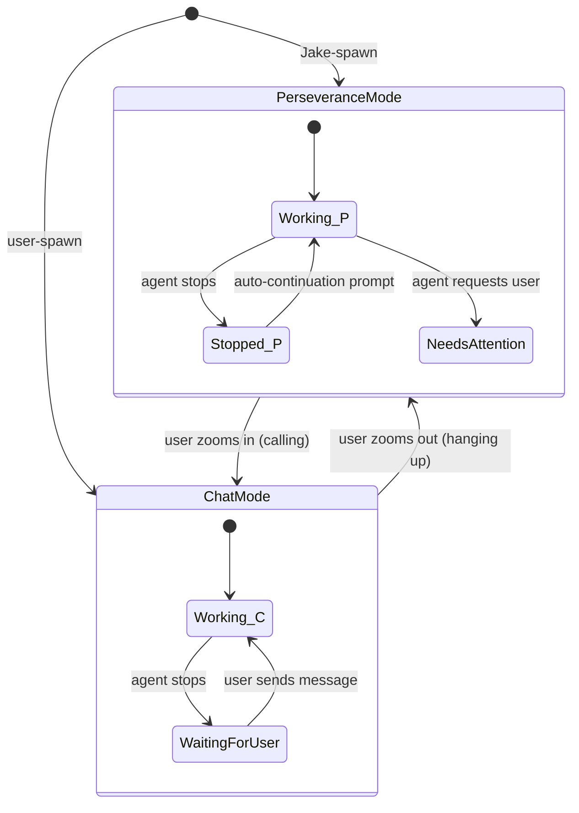
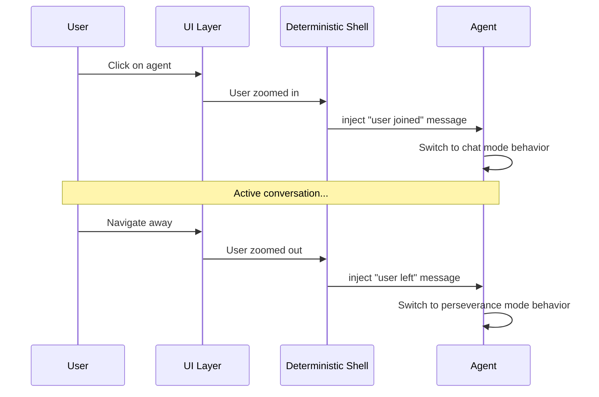

# Operating Modes Specification

**Status:** complete
**Last Updated:** 2026-02-08

## Upstream References
- PRD: §4.4 (Operating Modes), §5.2 (Attention Model)
- Reader: §3 (Perseverance Mode vs Chat Mode), §4 (Zooming In and Out)
- Transcripts: transcript_2026-01-19-1144.md (perseverance, chat, zoom), transcript_2026-01-27-testing-principles.md (two-mode spawn)

## Downstream References
- ADR: --
- Code: Tavern/Sources/TavernCore/Chat/, Tavern/Sources/TavernCore/Agents/
- Tests: Tavern/Tests/TavernCoreTests/

---

## 1. Overview
Perseverance mode vs chat mode, attention management, and the calling/hanging-up protocol. Defines how agents operate in different contexts and how the system manages user attention across concurrent agent activity.

## 2. Requirements

### REQ-OPM-001: Perseverance Mode
**Source:** PRD §4.4
**Priority:** must-have
**Status:** specified

In perseverance mode, an agent operates in the background. When the agent stops, the system automatically sends continuation prompts to keep it working. The agent must explicitly use a tool to request user attention. This is the default mode for agents working heads-down on assignments.

**Testable assertion:** An agent in perseverance mode receives an auto-continuation prompt within a configurable interval after stopping. The agent does not generate user-facing notifications unless it explicitly invokes an attention-requesting tool.

### REQ-OPM-002: Chat Mode
**Source:** PRD §4.4
**Priority:** must-have
**Status:** specified

In chat mode, the agent appears in an active chat window. The user is notified when the agent pauses or stops. The user provides the next message. This mode is used when the user is actively engaged with the agent in conversation.

**Testable assertion:** An agent in chat mode does not receive auto-continuation prompts. When the agent stops, a notification is surfaced to the user. The agent waits for user input before continuing.

### REQ-OPM-003: Mode Switching via Zoom
**Source:** PRD §5.2, Reader §4
**Priority:** must-have
**Status:** specified

The user controls which mode each agent is in. Zooming in on an agent transitions it to chat mode. Hanging up (zooming out) returns it to perseverance mode. The system injects deterministic messages to inform the agent of the transition:

- **Calling:** User zooms in. System injects "user joined" message. Agent knows someone is present.
- **Hanging up:** User zooms out. System injects "user left" message. Agent knows not to pause for interaction and continues working autonomously.

**Testable assertion:** Selecting an agent in the UI triggers a "calling" system message. Deselecting (or closing the chat) triggers a "hanging up" system message. The agent's operating mode changes accordingly.

### REQ-OPM-004: Attention Model
**Source:** PRD §5.2
**Priority:** must-have
**Status:** specified

Users see tabs/UX for agents they are actively engaged with. Notification bubbles appear when agents have questions. The interaction pattern is "whack-a-mole" -- jumping between conversations as needed. The user can zoom in on any agent at any depth in the hierarchy.

When zooming in on a busy agent, the user sees "cogitating" status while the agent works. The user can steer the agent, interrupt it, or wait.

**Testable assertion:** Active agents show in the user's view. Agents with pending questions display notification indicators. Cogitating status is visible when an agent is actively processing.

### REQ-OPM-005: Two-Mode Agent Spawning
**Source:** Reader §3 (Two-Mode Agent Spawning)
**Priority:** must-have
**Status:** specified

Agent spawning has two modes depending on who initiates:

- **User-spawn:** User clicks `+` button. No dialog. Agent is created instantly with a system prompt telling it to wait for the user's first message. Agent starts in chat mode.
- **Jake-spawn:** Jake decides to delegate work. Agent is created with an assignment and a system prompt telling it to work immediately. Agent starts in perseverance mode.

**Testable assertion:** A user-spawned agent has no assignment and is in waiting state. A Jake-spawned agent has an assignment and immediately transitions to working state.

### REQ-OPM-006: Cogitation Display
**Source:** PRD §5.2, Reader §12 (Cogitation Verbs)
**Priority:** should-have
**Status:** specified

While an agent is actively processing, the UI displays a "cogitating" status using vocabulary drawn from Jewish cultural and linguistic traditions (711 entries across Yiddish, Hebrew, Ladino, Judeo-Arabic, Talmudic Aramaic, Kabbalistic terminology, and diaspora communities). Terms appear in natural forms; awkward -ing constructions are avoided.

**Testable assertion:** When an agent is in working state, a cogitation verb is displayed in the UI. The verb is selected from the approved vocabulary list.

## 3. Behavior

### Operating Mode State Machine

### Calling / Hanging Up Sequence

## 4. Open Questions

- **?6 -- Perseverance Prompts:** What are the exact contents of auto-continuation prompts? How frequently are they sent? Is there a maximum retry count before the agent is considered stuck?

- **?7 -- User Consent for New Chats:** What does "100% clear they're OK with it" mean concretely when agents spawn new chat windows? Is it preference-based, contextual inference, or per-agent consent?

- **Mode persistence across restart:** If the user was zoomed into an agent when the app closes, should the agent resume in chat mode or perseverance mode on restart?

## 5. Coverage Gaps

- **Auto-continuation prompt design:** The PRD establishes perseverance mode but does not specify the prompt contents, frequency, or failure conditions for auto-continuation.

- **Notification priority:** When multiple agents simultaneously need attention, how are notifications ordered? PRD §5.5 covers question triage but not notification prioritization.
