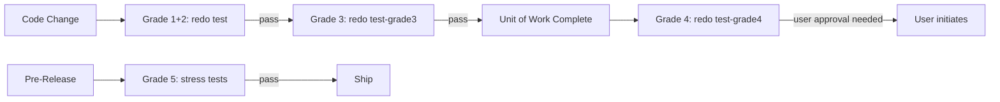
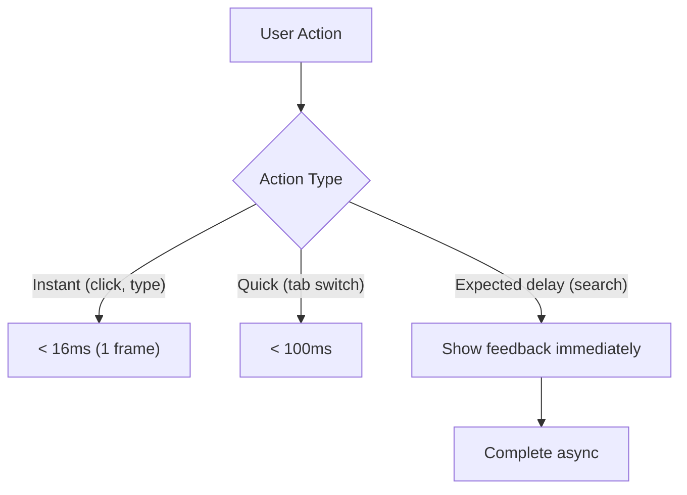

# Quality Specification

**Status:** complete
**Last Updated:** 2026-02-08

## Upstream References
- PRD: §17 (Testability Requirements), §19 (Development Standards), §19.1 (Logging Standards), §19.2 (Testing Standards), §19.3 (Stress Testing Standards), §21 (Performance Requirements)
- Reader: §10 (Five Testing Principles, Perception-Bounded Performance, Autonomous Testing Principle)
- Transcripts: transcript_2026-01-21-2113-performance.md (performance principles), transcript_2026-01-23-headless-testing.md (autonomous testing), transcript_2026-01-27-testing-principles.md (five testing principles)

## Downstream References
- ADR: ADR-002 (Testing Grade System)
- Code: Tavern/Tests/ (all test targets)
- Tests: TavernCoreTests/, TavernTests/, TavernIntegrationTests/, TavernUITests/, TavernStressTests/

---

## 1. Overview
Testability requirements, development standards, the five testing principles, the testing grade system, and perception-bounded performance targets. This module codifies the quality requirements that are non-negotiable for the project.

## 2. Requirements

### REQ-QA-001: Automated Tests from Day Zero
**Source:** PRD §17.1
**Priority:** must-have
**Status:** specified

Fully automated test suite from day 0. Tests exist before or alongside features, never after. Every feature must have tests. Adding a feature means adding tests. No exceptions.

**Testable assertion:** Every PR that adds a feature also adds corresponding tests. The test suite runs in CI without manual intervention.

### REQ-QA-002: Regression Detection
**Source:** PRD §17.3
**Priority:** must-have
**Status:** specified

The test suite catches regressions. If a change accidentally breaks something in another feature, tests catch it before merge.

**Testable assertion:** Introducing a deliberate regression in one module causes test failure in another module's tests.

### REQ-QA-003: Reproducible Test Environment
**Source:** PRD §17.4
**Priority:** must-have
**Status:** specified

The testing environment is reproducible. Test environments can be created, reused, and renewed with stubs for external dependencies (Claude API, filesystem, etc.).

**Testable assertion:** Tests produce the same results on different machines with the same configuration. External dependencies are stubbable. No test depends on network access or external state.

### REQ-QA-004: Fast Test Execution
**Source:** PRD §17.5
**Priority:** must-have
**Status:** specified

Tests run fast enough to not block developer flow. If tests are too slow, developers skip them. Grade 1+2 tests must complete in seconds, not minutes.

**Testable assertion:** Grade 1+2 test suite completes in under 60 seconds. Individual unit tests complete in under 1 second.

### REQ-QA-005: External Dependency Stubs
**Source:** PRD §17.6
**Priority:** must-have
**Status:** specified

Claude API, filesystem, and other external dependencies must be stubbable for testing. The `AgentMessenger` protocol provides the injection point for SDK mocking. `MockAgent` provides canned responses for testing ViewModels and coordinators.

**Testable assertion:** Tests can run with `MockMessenger` instead of `LiveMessenger`. No test requires a real Claude API call to pass (except Grade 3+).

### REQ-QA-006: Stress Testing
**Source:** PRD §17.7, §19.3
**Priority:** must-have
**Status:** specified

Stress testing is mandatory for code touching scale, concurrency, or data structures. Stress tests must:

- Generate synthetic load (large message histories, many agents, deep compaction chains)
- Measure responsiveness under load
- Verify isolation (heavy background work does not impact UI metrics)
- Establish baselines and catch regressions

Stress tests run before releases, after significant refactoring, and when performance issues are suspected.

**Testable assertion:** Stress test target exists and runs. Tests generate synthetic load at specified scales. Performance baselines are recorded and compared across runs.

### REQ-QA-007: Parallel Code Path Testing
**Source:** Reader §10 (Testing Principle 1)
**Priority:** must-have
**Status:** specified

When code has multiple paths to the same outcome, tests must cover ALL paths. Two initializers that both load history? Both need tests. Two ways to spawn an agent? Both need tests.

**Testable assertion:** Code coverage analysis shows all paths through branching logic are exercised. No path to a user-facing outcome lacks test coverage.

### REQ-QA-008: Feature Toggle Coverage
**Source:** Reader §10 (Testing Principle 2)
**Priority:** must-have
**Status:** specified

When tests disable a feature (`loadHistory: false`), there MUST be other tests that exercise that feature enabled. Tests that skip functionality do not count as coverage for that functionality.

**Testable assertion:** For every test that disables a feature, at least one other test exercises that feature enabled.

### REQ-QA-009: User Journey Integration Tests
**Source:** Reader §10 (Testing Principle 3)
**Priority:** must-have
**Status:** specified

Test end-to-end paths users actually take: spawn agent, send message, restart app, click agent, verify history appears. These tests verify the full stack, not just individual components.

**Testable assertion:** Integration tests cover multi-step user journeys. Tests include app restart scenarios where applicable.

### REQ-QA-010: Symmetry Assertions
**Source:** Reader §10 (Testing Principle 4)
**Priority:** must-have
**Status:** specified

When multiple APIs should behave consistently, add explicit tests that assert symmetry. This makes API drift a test failure rather than a silent divergence.

**Testable assertion:** APIs that should produce equivalent results for equivalent inputs have symmetry tests. Asymmetric behavior causes test failure.

### REQ-QA-011: New Entity = New Coverage
**Source:** Reader §10 (Testing Principle 5)
**Priority:** must-have
**Status:** specified

New entity types need equivalent test coverage to existing types. If Jake has session restoration tests, Servitor needs them too. If ChatViewModel works with Jake, it must also be tested with Servitor.

**Testable assertion:** Adding a new entity type requires adding test coverage equivalent to existing entity types. Code review flags missing symmetry.

### REQ-QA-012: Testing Grade System
**Source:** ADR-002
**Priority:** must-have
**Status:** specified

Five testing grades with distinct purposes and run conditions:

| Grade | Target | What | When |
|-------|--------|------|------|
| 1 | TavernCoreTests | Property/unit tests, no mocks | Every change |
| 2 | TavernCoreTests, TavernTests | Unit tests with mocks | Every change |
| 3 | TavernIntegrationTests | Real Claude, headless | Once per unit of work |
| 4 | TavernUITests | XCUITest (steals focus) | When user not active |
| 5 | TavernStressTests | Stress/pre-release | Pre-release |

Grade 3 tests are the canonical source of truth. Grade 2 mocks mirror their assertions but can never be more correct than real behavior.

**Testable assertion:** Each grade runs in its specified target. `redo Tavern/test` runs Grades 1+2. Grade 4 requires explicit user approval. Test reports are generated in `~/.local/builds/tavern/test-reports/`.

### REQ-QA-013: Logging Standards
**Source:** PRD §19.1
**Priority:** must-have
**Status:** specified

All new code must be instrumented with logging using `TavernLogger`. Required logging:

- Entry/exit for async operations (API calls, SDK interactions)
- State transitions (agent state changes, UI state changes)
- Errors with full context (operation, parameters, failure)
- Key events (session creation, agent spawn/dismiss, message send/receive)

**Testable assertion:** Every new file includes `import os` and declares a static `Logger`. Async operations log entry and exit. State transitions log old and new state. Errors log operation name, relevant parameters, and error description.

### REQ-QA-014: Perception-Bounded Performance
**Source:** PRD §21
**Priority:** must-have
**Status:** specified

"Fast" is defined by user perception, not raw metrics. Four core rules:

1. **Isolation** -- No operation impacts unrelated parts of the app. A search over massive history cannot cause scroll jank. A runaway agent cannot freeze the coordinator.
2. **Responsiveness over speed** -- UI always responds to user input. Show appropriate feedback (spinner, progress, skeleton) during long operations.
3. **Perception boundaries** -- Zones where the user expects delay (search, cold start, network). Lean into expectations with appropriate feedback. Where the user does not expect delay (typing, clicking, switching tabs), there must be none.
4. **Scale independence** -- Performance of viewing current content does not degrade as history grows.

**Testable assertion:** UI interactions (click, type, tab switch) complete within one frame (~16ms). Long operations show feedback within 100ms. Adding 10x more history does not measurably degrade current-content display performance.

### REQ-QA-015: RAM Budget
**Source:** PRD §21
**Priority:** must-have
**Status:** specified

No fixed RAM target. If the app causes system-wide slowdown or memory pressure warnings, that is a bug. Data structures must avoid holding unbounded data in memory when not needed.

**Testable assertion:** The app does not trigger macOS memory pressure warnings under normal use. Memory usage grows sub-linearly with agent count and history size.

### REQ-QA-016: Cancellation Design
**Source:** PRD §21
**Priority:** should-have
**Status:** specified

Cancellation is context-dependent. Each cancellable operation must be designed explicitly with a cancellation mechanism appropriate to its nature (e.g., `Task.cancel()` for Swift concurrency, abort signal for API calls).

**Testable assertion:** Long-running operations support cancellation. Cancelled operations clean up resources without leaving the system in an inconsistent state.

## 3. Behavior

### Testing Grade Flow

### Performance Budget

## 4. Open Questions

- **Stress test thresholds:** PRD says "Specific thresholds TBD after initial testing identifies natural limits." Current baselines need to be established and documented.

- **Grade 3 cost management:** Real Claude calls cost money. How frequently should Grade 3 tests run? Is there a budget per CI run?

- **Perception boundary catalog:** The PRD says perception boundaries are "discovered and documented as development proceeds." The current catalog needs to be maintained.

## 5. Coverage Gaps

- **Code coverage targets:** No numeric code coverage target is specified. The principles require comprehensive coverage but do not set a percentage floor.

- **Mutation testing:** No specification for mutation testing to verify test quality beyond code coverage.

- **Performance regression testing:** Stress tests verify baselines, but there is no specification for automated performance regression detection in CI.
