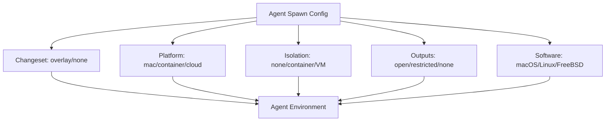
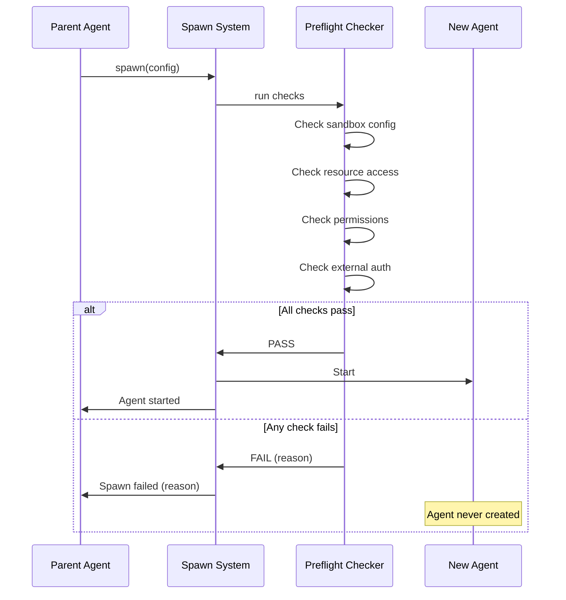
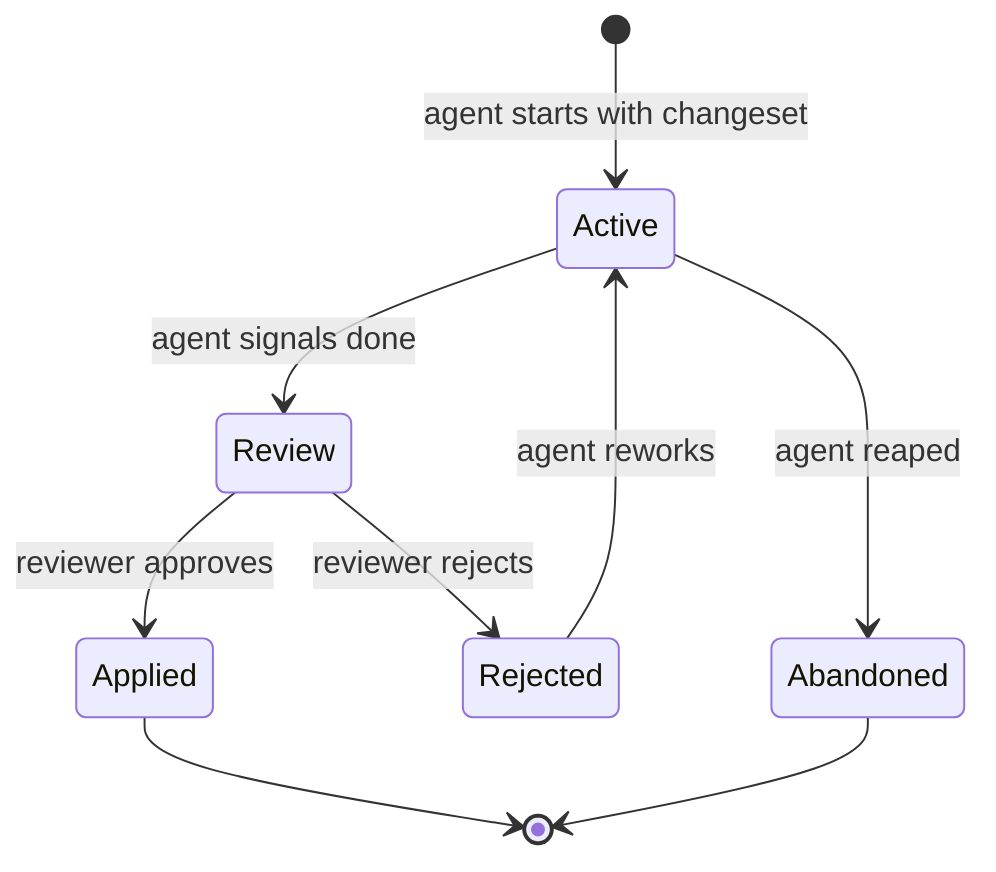

# Sandbox Specification

**Status:** complete
**Last Updated:** 2026-02-08

## Upstream References
- PRD: §4.6 (Sandbox Primitives), §6.4 (Preflight Checks)
- Reader: §6 (Sandbox and Isolation -- five primitives, preflight checks)
- Transcripts: transcript_2026-01-19-1144.md (sandbox primitives, changeset concept)

## Downstream References
- ADR: --
- Code: Not yet implemented (deferred for v1)
- Tests: --

---

## 1. Overview
Sandbox primitives for file protection, preflight checks, and the changeset model. Defines the five orthogonal isolation primitives, how agents are validated before starting, and how file mutations are managed through overlay-based changesets. Most sandbox features are deferred for post-v1.

## 2. Requirements

### REQ-SBX-001: Five Sandbox Primitives
**Source:** PRD §4.6
**Priority:** must-have (architecture), deferred (implementation)
**Status:** specified

Five orthogonal primitives, mix-and-match per agent. Parent picks settings at spawn:

1. **Changeset** -- Overlay filesystem on project root. All writes go to the overlay. The changeset is the diff between original and overlay. Protects original content.
2. **Platform** -- Where the agent program runs: Mac, container, cloud, or hybrid (cloud agent communicating with macOS app via protocol).
3. **Isolation** -- VMs, containers, OS-level sandboxes. Handles tools that leak outside expected scope. Agent can trash everything and be reaped/restarted.
4. **Outputs** -- Network access control. What can the agent reach?
5. **Software** -- OS choice: macOS, Linux, FreeBSD, etc.

**Testable assertion:** Architecture supports specifying each primitive independently per agent spawn. Primitives do not depend on each other (orthogonal). (Implementation deferred for v1 -- agents work on actual files.)

### REQ-SBX-002: Changeset as Diff
**Source:** PRD §4.6
**Priority:** deferred
**Status:** specified

A changeset is the diff between the original files and the overlay. Another agent can review the changeset independently before it is applied. Changesets protect original files (Invariant REQ-INV-008).

**Testable assertion:** Deferred. When implemented: a changeset can be extracted as a diff. The diff is reviewable. Applying the diff modifies original files. Before application, original files are untouched.

### REQ-SBX-003: Source Control Orthogonality
**Source:** PRD §4.6, Reader §6
**Priority:** must-have (design), deferred (implementation)
**Status:** specified

Source control is orthogonal to isolation. Changesets work across multiple repos, separate from git worktrees. The system does not use git worktrees for agent isolation. This resolves the design concern about worktree assumptions.

**Testable assertion:** The changeset system does not depend on git. An agent working in a non-git directory can still use changesets. Changesets can span multiple repositories.

### REQ-SBX-004: Preflight Checks
**Source:** PRD §6.4
**Priority:** must-have
**Status:** specified

At spawn time, before an agent begins autonomous work, preflight checks verify:

- Sandbox is configured correctly
- Agent has access to required resources
- No permissions prompts are expected during execution
- External accounts (AWS, etc.) are authenticated and working

Failure behavior: agent does not start. Parent is notified with the specific failure reason. No degraded mode -- it is pass/fail.

**Testable assertion:** A preflight check that fails prevents the agent from starting. The parent receives a notification with the failure reason. An agent that passes preflight starts normally.

### REQ-SBX-005: Preflight Fail-Fast
**Source:** PRD §6.4
**Priority:** must-have
**Status:** specified

Preflight is binary: pass or fail. There is no degraded mode where the agent starts with reduced capabilities. If any check fails, the entire spawn is aborted.

**Testable assertion:** A single preflight failure aborts the spawn regardless of other checks passing. No partial capability mode exists.

### REQ-SBX-006: Platform Configuration
**Source:** PRD §4.6
**Priority:** deferred
**Status:** specified

Agents can run on different platforms: Mac (local), container (Docker), cloud (remote), or hybrid (cloud agent communicating with local app via protocol). Platform is configured at spawn time.

**Testable assertion:** Deferred. When implemented: an agent can be spawned with a platform specification. The agent runs on the specified platform. The app communicates with remote agents via protocol.

### REQ-SBX-007: Isolation Levels
**Source:** PRD §4.6
**Priority:** deferred
**Status:** specified

Multiple isolation levels: VMs, containers, OS-level sandboxes. Isolation handles tools that leak outside expected scope (e.g., `uv` accessing `~/.uv`). An agent in isolation can trash its environment without affecting the host; the environment can be reaped and recreated.

**Testable assertion:** Deferred. When implemented: an agent in container isolation cannot modify host files. Destroying and recreating the container produces a clean environment. Leaked writes are contained.

### REQ-SBX-008: Output Control
**Source:** PRD §4.6
**Priority:** deferred
**Status:** specified

Network access control per agent. Configure what network resources the agent can reach. An agent with no network access cannot make outbound connections.

**Testable assertion:** Deferred. When implemented: an agent with network disabled fails on outbound connection attempts. An agent with specific allowed hosts can reach only those hosts.

## 3. Behavior

### Sandbox Primitive Composition

Each primitive is independent. Any combination is valid.

### Preflight Check Flow

### Changeset Lifecycle (Post-v1)

## 4. Open Questions

- **Changeset lifecycle specifics:** PRD §14 lists this as TBD ("Per environment flavor"). How long do changesets persist? What happens to unapplied changesets when the project closes?

- **Hybrid platform protocol:** For cloud agents communicating with the local macOS app, what protocol is used? gRPC? WebSocket? HTTP?

- **Isolation cost:** Container and VM isolation have startup costs. How does this interact with the "fast test execution" requirement (REQ-QA-004)?

## 5. Coverage Gaps

- **Changeset merge conflicts:** When two agents have overlapping changesets, how are conflicts resolved? Serial merge queue (REQ-WRK-006) reduces but does not eliminate this.

- **Sandbox escape detection:** No specification for detecting when an agent escapes its sandbox boundary (other than violation monitoring, REQ-OBS-005).

- **Resource limits per sandbox:** No specification for CPU, memory, or disk limits within a sandboxed environment.
