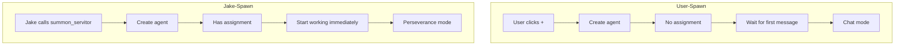
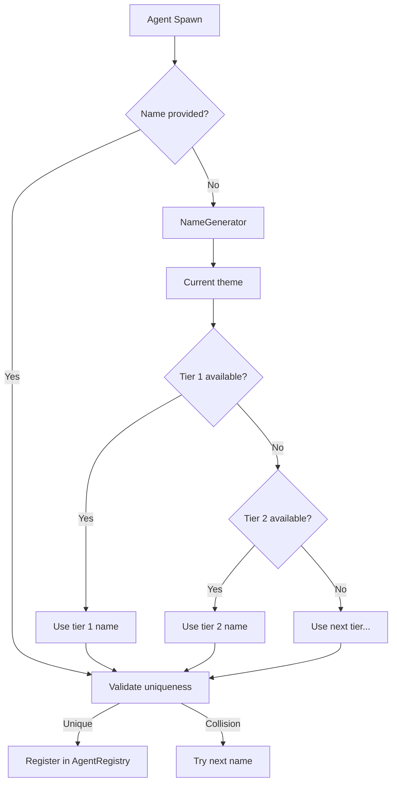

# Spawning Specification

**Status:** complete
**Last Updated:** 2026-02-08

## Upstream References
- PRD: §6.2 (Agent Spawn Configuration), §6.3 (Work Queues), §7 (Agent Naming)
- Reader: §3 (Two-Mode Agent Spawning, Agent Naming, Chat Description)
- Transcripts: transcript_2026-01-19-1144.md (naming themes), transcript_2026-01-27-testing-principles.md (two-mode spawn, chat description), transcript_2026-01-28-jake-spawn-tool.md (spawn tool)

## Downstream References
- ADR: --
- Code: Tavern/Sources/TavernCore/Agents/ServitorSpawner.swift, Tavern/Sources/TavernCore/Naming/, Tavern/Sources/TavernCore/Coordination/
- Tests: Tavern/Tests/TavernCoreTests/, Tavern/Tests/TavernTests/

---

## 1. Overview
Agent spawning, naming themes, work queue management, and spawn configuration. Covers the two spawn modes (user-spawn vs Jake-spawn), the theatrical naming system with themed name generators, how work is queued and distributed, and the full set of spawn-time parameters.

## 2. Requirements

### REQ-SPN-001: Spawn Configuration Parameters
**Source:** PRD §6.2
**Priority:** must-have
**Status:** specified

When spawning a child agent, the parent can specify:

- **Assignment** -- What the agent should do
- **Sandbox config** -- Which primitives, how configured (see sandbox.md)
- **Model selection** -- Haiku for drones, Sonnet for coordinators, Opus for architects
- **Token budget** -- Maximum tokens the agent may consume
- **Work queue attachment** -- Which queue to pull tasks from
- **Commitments to prefill** -- Initial commitments for verification
- **Done behavior** -- What to do when done: terminate, wait, or check queue

All parameters are optional except assignment (for Jake-spawn) or none (for user-spawn).

**Testable assertion:** A spawn call with each parameter set correctly creates an agent with those parameters applied. A spawn call with default parameters creates an agent with sensible defaults.

### REQ-SPN-002: User-Spawn Mode
**Source:** Reader §3 (Two-Mode Agent Spawning)
**Priority:** must-have
**Status:** specified

User clicks `+` in toolbar. No dialog is presented. An agent is created instantly with a system prompt that tells it to wait for the user's first message. The agent has no assignment and starts in chat mode.

**Testable assertion:** Clicking `+` creates an agent immediately (no modal dialog). The new agent has no assignment. The agent does not begin working until the user sends a message.

### REQ-SPN-003: Jake-Spawn Mode
**Source:** Reader §3 (Two-Mode Agent Spawning)
**Priority:** must-have
**Status:** specified

Jake decides to delegate work via the `summon_servitor` MCP tool. An agent is created with an assignment and a system prompt telling it to work on the assignment immediately before waiting for user input. The agent starts in perseverance mode.

**Testable assertion:** A `summon_servitor` call with an assignment creates an agent that immediately begins working. The agent does not wait for user input before starting.

### REQ-SPN-004: Naming Theme Assignment
**Source:** PRD §7
**Priority:** should-have
**Status:** specified

Jake assigns a naming theme to each mortal agent tree. The theme belongs to the tree root -- all children in that tree use the same theme. Themes give users an intuitive sense of which agents are related.

**Testable assertion:** All agents in the same tree share a naming theme. Different trees may have different themes. The theme is set at tree creation time.

### REQ-SPN-005: Global Name Uniqueness
**Source:** PRD §7
**Priority:** must-have
**Status:** specified

Every mortal agent has a globally unique name across the entire system. An agent can be identified by name alone -- no path addressing is required.

**Testable assertion:** No two agents (across all projects, all trees) share the same name. Name lookup by string returns exactly one agent or none.

### REQ-SPN-006: Tier Depletion
**Source:** PRD §7
**Priority:** should-have
**Status:** specified

Naming themes have escalating tiers of silliness. The system exhausts less silly names before breaking out sillier ones. This is a depletion mechanism: as more agents are spawned within a theme, names become progressively more creative.

**Testable assertion:** The first agents spawned in a theme receive tier-1 names. After tier-1 is exhausted, tier-2 names are used. Names within each tier are not repeated.

### REQ-SPN-007: Easter Egg Names
**Source:** PRD §7
**Priority:** should-have
**Status:** specified

Some naming themes contain jokes that are only revealed when enough children are spawned to exhaust earlier tiers. This rewards high concurrency with humor.

**Testable assertion:** Specific themes have names that only appear after a threshold number of agents. (Theme-specific, verified per naming theme.)

### REQ-SPN-008: Work Queues
**Source:** PRD §6.3
**Priority:** deferred
**Status:** specified

Work queues live in the document store. Parents create them. Agents attach to queues at spawn or mid-task. When a queue item appears, the attached agent fires immediately. Agents have instructions for what to do when the queue is empty (idle, hibernate, terminate, etc.). Deterministic code ensures instructions are present.

**Testable assertion:** Deferred for v1. When implemented: creating a queue item triggers the attached agent. An agent with empty-queue instructions follows them when the queue drains.

### REQ-SPN-009: Chat Description
**Source:** Reader §3 (Chat Description)
**Priority:** must-have
**Status:** specified

Each agent has a mutable chat description field visible in the sidebar. It summarizes what the chat is about. Both the user and the agent (via tools) can alter it at any time. It includes the original ask plus current status, enabling at-a-glance understanding when switching between agents.

**Testable assertion:** The chat description is visible in the sidebar. The user can edit it. The agent can update it via a tool call. The description persists across app restarts.

### REQ-SPN-010: Auto-Generated Names
**Source:** CLAUDE.md (MCP Tools)
**Priority:** must-have
**Status:** specified

When `summon_servitor` is called without a `name` parameter, a name is auto-generated from the current naming theme. The generated name follows the theme's tier depletion rules.

**Testable assertion:** `summon_servitor` without a name produces an agent with a non-nil, theme-appropriate name. The name is unique.

## 3. Behavior

### Spawn Flow

### Name Generation

## 4. Open Questions

- **Model selection availability:** PRD §6.2 says "Haiku for drones, Sonnet for coordinators, Opus for architects." Is this the exact mapping or is it configurable per-spawn? What happens if a preferred model is unavailable?

- **Token budget enforcement:** How is the token budget enforced? Does the system cut off the agent mid-response? Pre-calculate remaining budget before each API call?

- **Done behavior transitions:** When an agent finishes its task and the done behavior is "check queue," what queue does it check? Must the queue be specified at spawn time?

## 5. Coverage Gaps

- **Spawn failure handling:** What happens when a spawn fails (out of resources, name generation exhausted, SDK error)? The PRD specifies preflight checks (sandbox.md) but not spawn-level failure handling.

- **Maximum agent count:** No specification for how many agents can be alive simultaneously per project or system-wide.

- **Agent migration:** No specification for moving an agent from one tree to another, or re-parenting an agent.
