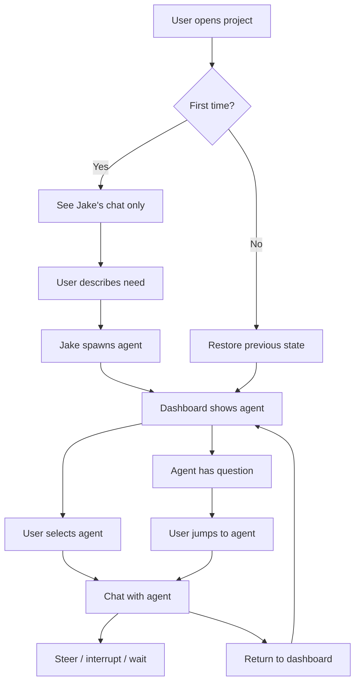
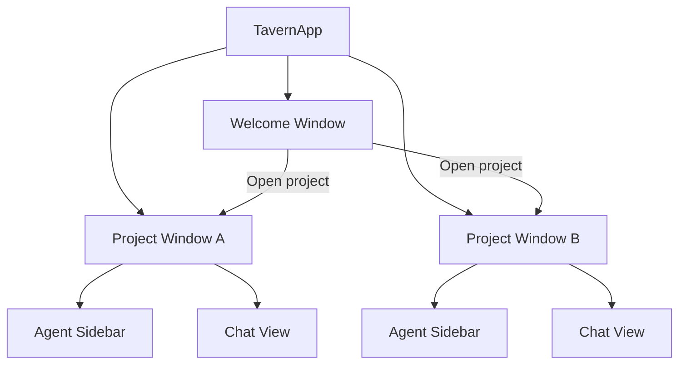

# User Experience Specification

**Status:** complete
**Last Updated:** 2026-02-08

## Upstream References
- PRD: §5.1 (The Core Loop), §5.4 (UI Principles), §8 (Progressive Unlocks), §8.1 (Concept), §8.2 (Open Questions)
- Reader: §4 (User Flow), §8 (UI Concepts — content blocks, chat header, multi-window)
- Transcripts: transcript_2026-01-19-1144.md (core loop), transcript_2026-01-22-0015.md (project-as-document, multi-window), transcript_2026-01-27-testing-principles.md (sidebar, chat description), transcript_2026-01-28-jake-spawn-tool.md (chat header)

## Downstream References
- ADR: --
- Code: Tavern/Sources/Tavern/ (TavernApp.swift, Views/), Tavern/Sources/TavernCore/UI/, Tavern/Sources/TavernCore/Project/
- Tests: Tavern/Tests/TavernTests/, Tavern/Tests/TavernUITests/

---

## 1. Overview
Core user loop, UI principles, progressive unlocks, and the project-as-document model. Defines the primary interaction pattern between users and the system, how the UI is organized, and how capabilities are revealed progressively as users engage.

## 2. Requirements

### REQ-UX-001: Fresh Project Entry
**Source:** PRD §5.1
**Priority:** must-have
**Status:** specified

When a user opens a project directory with no history, they see only Jake's chat box. This is the starting point for all interaction. The user describes what they need, and Jake spawns agents to handle it.

**Testable assertion:** Opening a project with no prior sessions shows a single chat interface for Jake. No other agents or panels are visible.

### REQ-UX-002: Task-as-Chat
**Source:** PRD §5.1
**Priority:** must-have
**Status:** specified

Each task appears as both a todo item AND a chat interface. The user can interact with any task by opening its chat. The dashboard shows all open tasks; the user can drill into any agent.

**Testable assertion:** Every spawned agent appears in both the agent list (sidebar) and has an associated chat view. Clicking an agent in the sidebar opens its chat.

### REQ-UX-003: Agent Sidebar
**Source:** PRD §5.1, Reader §4
**Priority:** must-have
**Status:** specified

A sidebar displays all agents for the current project. Each entry shows the agent's name, status, and chat description. The user selects agents by clicking. Jake is always present at the top.

**Testable assertion:** The sidebar lists all live agents. Jake always appears. Clicking an agent selects it and shows its chat. Agent status (working, waiting, done) is visible in the sidebar.

### REQ-UX-004: No Unsolicited Content
**Source:** PRD §5.4
**Priority:** must-have
**Status:** specified

North star UI principle: do not shove new stuff in front of the user without consent. Agents surface questions via passive notifications (badges, bubbles), not by stealing focus or opening windows uninvited.

**Testable assertion:** No window, sheet, or modal appears without user-initiated action. Notifications are passive indicators only (badge counts, sidebar indicators). The user's current view is never replaced without their action.

### REQ-UX-005: Stream Separation
**Source:** PRD §5.4
**Priority:** should-have
**Status:** specified

The UI provides styling cues to indicate content type: thinking, tool use, code, chat text. Each content block type has its own visual treatment. The dedicated chat view shows just the conversation in a readable format; other streams (thinking, tools) are displayed alongside.

**Testable assertion:** Different content block types (text, tool_use, tool_result, thinking) render with distinct visual styles. A "chat only" view mode exists that hides non-chat blocks.

### REQ-UX-006: Content Block Rendering
**Source:** Reader §8 (Content Block Rendering)
**Priority:** must-have
**Status:** specified

Claude's responses include a `content` array with typed blocks that each have their own visual style:

- `text` -- Plain text content
- `tool_use` -- Tool invocation with name and input parameters
- `tool_result` -- Tool result with content and isError flag
- `thinking` -- Claude's thinking process
- `web_search_result` -- Web search output

**Testable assertion:** Each block type renders with a distinct visual treatment (colored avatars, styled boxes). Tool use shows tool name and parameters. Tool results show success/error state.

### REQ-UX-007: Project-as-Document
**Source:** Reader §4 (Project-as-Document)
**Priority:** must-have
**Status:** specified

The Tavern is a document-based Mac app where the "document" is the project directory. Any directory works, like Claude CLI. Full Mac app trappings: File > Open, Open Recent, Dock icon menus, drag-to-open, state restoration on relaunch.

**Testable assertion:** The app opens via File > Open (directory picker). Recent projects appear in Open Recent menu. Drag-and-drop a directory onto the Dock icon opens it. Open projects restore on app relaunch.

### REQ-UX-008: Multi-Window Support
**Source:** Reader §4 (Multi-Window Support)
**Priority:** must-have
**Status:** specified

Each open project gets a separate window. Multiple projects can be open simultaneously. A welcome window shows recent projects. Cmd+O opens the welcome screen. Windows restore on app restart.

**Testable assertion:** Two projects can be open in two separate windows simultaneously. The welcome window lists recent projects. Window positions and states restore after quit and relaunch.

### REQ-UX-009: Chat Header
**Source:** Reader §8 (Chat Header)
**Priority:** must-have
**Status:** specified

Each chat view has a header showing the agent name and a "New Conversation" button (compose icon `square.and.pencil`, matching Apple's convention).

**Testable assertion:** The chat header displays the agent name. The compose button is present and uses SF Symbol `square.and.pencil`.

### REQ-UX-010: Progressive Unlock Concept
**Source:** PRD §8.1
**Priority:** should-have
**Status:** specified

The Tavern reveals content progressively based on user engagement (message count). As engagement grows, new content unlocks:

- **Cogitating verbs** -- Start with a core set, reveal more colorful options over time
- **Naming themes** -- Unlock new themes as engagement deepens
- **Jake's vocabulary** -- Expand his repertoire of bits and references
- **Easter eggs** -- Hidden content that appears after significant use

The unlock experience must feel organic, not gamified. Jake does not announce unlocks with fanfare -- he just starts using new words, new themes become available, new jokes appear. Subtle hints only.

**Testable assertion:** A new user sees a limited vocabulary. After N messages, additional vocabulary becomes available. Unlocks are not accompanied by notifications or announcements.

### REQ-UX-011: Progressive Unlock Open Questions
**Source:** PRD §8.2
**Priority:** deferred
**Status:** specified

These progressive unlock details are explicitly deferred:

- **Scope** -- Per-project count, global count, or both?
- **Thresholds** -- Linear progression, milestone-based, or front-loaded?
- **Persistence** -- Where is the count stored? Doc store? User preferences?
- **Reset behavior** -- Does anything reset? Can users "prestige"?

**Testable assertion:** Deferred. Implementation details to be determined during development.

## 3. Behavior

### Core User Loop

### Multi-Window Architecture

## 4. Open Questions

- **User consent UX for new chats:** PRD §14 lists this as TBD. When Jake spawns an agent, does a new chat tab appear automatically or does the user need to click to see it?

- **UI stream separation details:** PRD §14 lists this as TBD. How exactly are thinking/tool/code streams laid out relative to the chat stream? Expandable sections? Side panel? Tabs?

## 5. Coverage Gaps

- **Keyboard shortcuts:** No specification for keyboard navigation between agents, sending messages, or other common actions.

- **Accessibility:** No specification for VoiceOver, Dynamic Type, or other accessibility features.

- **Search:** No specification for searching across agent conversations or history.
