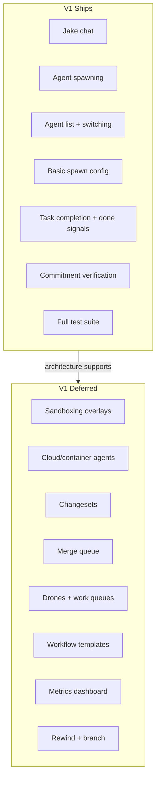
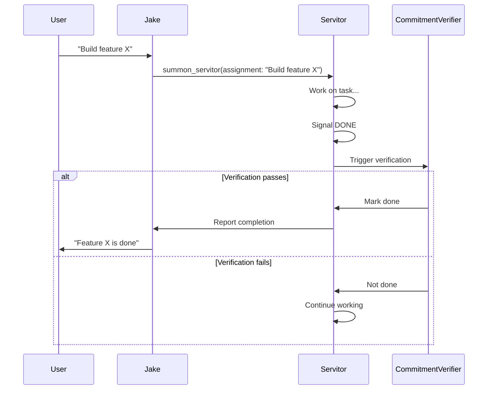

# V1 Scope Specification

**Status:** complete
**Last Updated:** 2026-02-08

## Upstream References
- PRD: §18 (V1 Scope), §20 (Success Criteria)
- Reader: §1 (Executive Summary — current implementation state)
- Transcripts: --

## Downstream References
- ADR: --
- Code: All modules (scope defines what ships)
- Tests: All test targets

---

## 1. Overview
V1 scope boundaries, success criteria, and what ships versus what does not. V1 is a proof of concept focused on the core flow: chats, spawning, verification. Space is left in the architecture for future capabilities.

## 2. Requirements

### REQ-V1-001: Open Project and Chat with Jake
**Source:** PRD §18
**Priority:** must-have
**Status:** specified

User can open a project directory and chat with Jake. Jake responds in his character voice. Jake's session persists across app restarts.

**Testable assertion:** Opening a project directory presents Jake's chat. Messages sent to Jake receive responses. Closing and reopening the app shows Jake's conversation history.

### REQ-V1-002: Jake Spawns Mortal Agents
**Source:** PRD §18
**Priority:** must-have
**Status:** specified

Jake can spawn mortal agents to handle delegated work. Jake uses the `summon_servitor` MCP tool to create agents with assignments and names.

**Testable assertion:** Telling Jake to do something causes him to spawn a Servitor. The Servitor appears in the agent list with the correct assignment.

### REQ-V1-003: Agent List and Chat Switching
**Source:** PRD §18
**Priority:** must-have
**Status:** specified

User can see a list of all agents (sidebar) and switch between their chats. Each agent's chat shows its conversation history.

**Testable assertion:** All spawned agents appear in the sidebar. Clicking an agent shows its chat. Switching between agents preserves each chat's scroll position and history.

### REQ-V1-004: Basic Spawn Configuration
**Source:** PRD §18
**Priority:** must-have
**Status:** specified

Spawning supports basic configuration: assignment and model selection. Advanced spawn parameters (sandbox, token budget, work queue, commitments, done behavior) are architecturally supported but not required for v1.

**Testable assertion:** An agent can be spawned with an assignment. Model selection parameter is accepted (even if only one model is used in v1).

### REQ-V1-005: Agent Task Completion
**Source:** PRD §18
**Priority:** must-have
**Status:** specified

Agents can complete tasks and report done. The done signal is detected from agent responses (DONE/COMPLETED keywords) and triggers the verification flow.

**Testable assertion:** An agent that outputs DONE transitions toward completion. The completion flow is initiated (even if verification is mock in v1).

### REQ-V1-006: Commitment Verification
**Source:** PRD §18
**Priority:** must-have
**Status:** specified

Commitments are verified by deterministic assertion. The `CommitmentVerifier` runs shell-based checks independent of the agent's session. An agent is only marked "done" after verification passes.

**Testable assertion:** A commitment with a passing assertion allows the agent to complete. A commitment with a failing assertion keeps the agent in a non-done state. (Note: v1 may use mock verification; the flow must be exercised end-to-end.)

### REQ-V1-007: Full Test Suite
**Source:** PRD §18
**Priority:** must-have
**Status:** specified

Full test suite for all of the above v1 features. Every v1 feature has automated tests at the appropriate grade level.

**Testable assertion:** `redo Tavern/test` passes. Every v1 feature has at least Grade 1+2 test coverage. Grade 3 integration tests cover the end-to-end flow.

### REQ-V1-008: Deferred -- Sandboxing with Overlays
**Source:** PRD §18
**Priority:** deferred
**Status:** specified

Changeset overlays are deferred. Agents work on actual files in v1. The architecture leaves space for overlay implementation later.

**Testable assertion:** N/A for v1. Architecture review confirms the doc store and agent layer can accommodate overlays without restructuring.

### REQ-V1-009: Deferred -- Containerization and Cloud Agents
**Source:** PRD §18
**Priority:** deferred
**Status:** specified

Container-based and cloud-based agent execution is deferred. All agents run locally on macOS in v1.

### REQ-V1-010: Deferred -- Changesets
**Source:** PRD §18
**Priority:** deferred
**Status:** specified

Changesets (overlay filesystem diffs) are deferred. Agents modify actual files in v1.

### REQ-V1-011: Deferred -- Merge Queue
**Source:** PRD §18
**Priority:** deferred
**Status:** specified

The merge queue for coordinated changesets is deferred. Agents do not coordinate their file changes in v1 beyond shared workspace visibility.

### REQ-V1-012: Deferred -- Drones and Work Queues
**Source:** PRD §18
**Priority:** deferred
**Status:** specified

Drone agents and work queue infrastructure are deferred. Only Jake (daemon) and Servitors (mortal) exist in v1.

### REQ-V1-013: Deferred -- Workflow Templates
**Source:** PRD §18
**Priority:** deferred
**Status:** specified

Pre-configured workflow templates (Rule of 5, verification layers) are deferred. Agents operate without templated workflows in v1.

### REQ-V1-014: Deferred -- Metrics Dashboard
**Source:** PRD §18
**Priority:** deferred
**Status:** specified

Visual metrics dashboard is deferred. Metrics are logged but not displayed in a dedicated UI.

### REQ-V1-015: Deferred -- Rewind and Branch
**Source:** PRD §18
**Priority:** deferred
**Status:** specified

Checkpointing, prompt tweaking, and timeline forking are deferred.

### REQ-V1-016: Success Criteria -- Core Flow
**Source:** PRD §20
**Priority:** must-have
**Status:** specified

V1 is successful if:

1. User can open a project and talk to Jake
2. Jake can spawn mortal agents that work autonomously
3. User can see dashboard of all agents and zoom into any
4. Agents can spawn children and coordinate via doc store
5. Deterministic verification works (agent commits, system checks)
6. Changesets protect original project from agent writes (deferred -- architecturally preserved)
7. User spends more time directing than waiting

**Testable assertion:** Items 1-5 are verified by Grade 3 integration tests. Item 6 is verified by architecture review. Item 7 is verified by user testing with timing metrics.

### REQ-V1-017: Success Criteria -- Future Indicators
**Source:** PRD §20
**Priority:** should-have
**Status:** specified

Future success indicators (not required for v1 ship, but tracked):

- High amplification factor (many saturated agents, one human)
- Workflows improving through measurement
- Users entertained by agent names and cogitation verbs

**Testable assertion:** Amplification metric is computable (even if value is low in v1). Naming themes produce names. Cogitation verbs display during agent work.

## 3. Behavior

### V1 Feature Scope Map

### V1 Verification Flow

## 4. Open Questions

- **V1 changeset workaround:** With changesets deferred, how does v1 protect original files? PRD says "agents work on actual files for now." Is there any intermediate protection (e.g., git stash, branch per agent)?

- **Multi-project scope in v1:** Is multi-project support a v1 requirement? It is implemented but not listed in the PRD's v1 must-have list.

## 5. Coverage Gaps

- **Ship criteria formalization:** "User spends more time directing than waiting" is qualitative. No quantitative threshold is specified for when this criterion is met.

- **v1 feature freeze definition:** No specification for when v1 is "feature complete" vs "ready to ship." The gap between "features work" and "product is polished" is not addressed.
