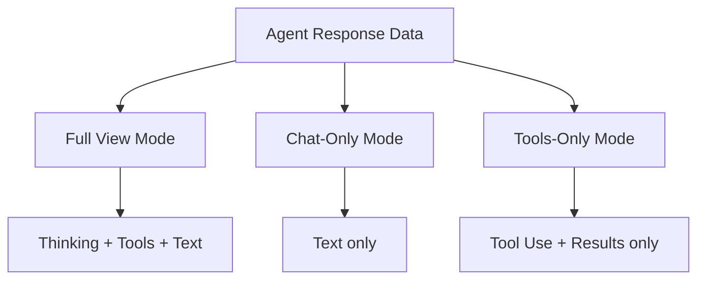
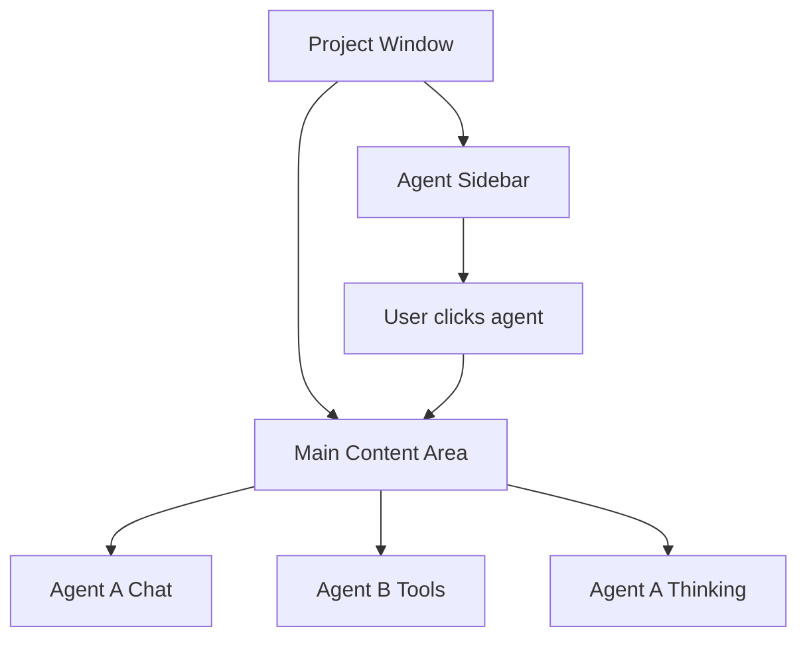
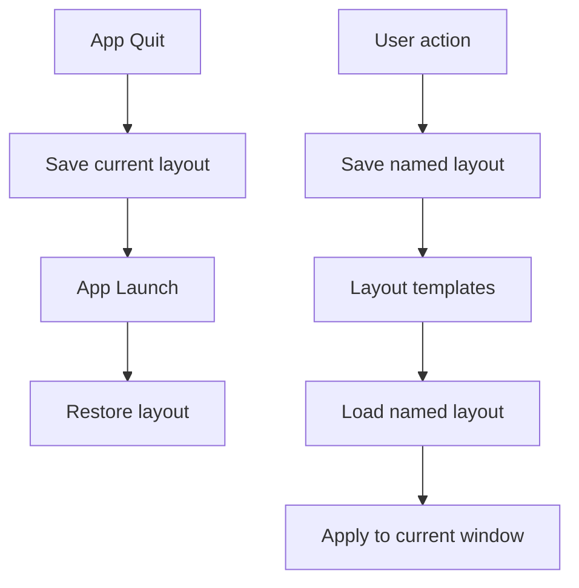

# View Architecture Specification

**Status:** complete
**Last Updated:** 2026-02-08

## Upstream References
- PRD: (none directly -- derived from Reader and transcripts)
- Reader: §8 (UI Concepts -- dynamic views, tiles, view modes, context cards, agent layout tools, persistence)
- Transcripts: transcript_2026-01-21-2345.md (dynamic view architecture), transcript_2026-01-22-0730-view-architecture.md (view architecture deep dive)

## Downstream References
- ADR: ADR-001-shape-selection.md (Shape A: Reactive Streams)
- Code: Tavern/Sources/Tavern/Views/ (partial implementation)
- Tests: Tavern/Tests/TavernUITests/ (partial)

---

## 1. Overview
View architecture for the dynamic tile-based UI, view modes, context cards, and agent layout tools. Derived primarily from seed design sessions rather than the PRD, this spec covers how the UI dynamically composes views, supports multiple presentations of the same data, and manages agent-driven layout.

## 2. Requirements

### REQ-VIW-001: Composable View Surface
**Source:** Reader §8
**Priority:** should-have
**Status:** specified

The view layer is not a fixed hierarchy. It is a composable surface that can be reshaped by both the user and agents. Tiles live within windows; windows serve as macOS-level escape hatches for when tiling is insufficient.

**Testable assertion:** Views can be rearranged by the user. The layout is not hardcoded. Multiple layout configurations can coexist.

### REQ-VIW-002: View Modes
**Source:** Reader §8
**Priority:** should-have
**Status:** specified

Different view modes present the same data differently, like Finder's list/icon/column views. The response stream (thinking, tools, text) stays in one place. Different view modes select which parts to show and how to arrange them. Multiple tiles can show different view modes of the same agent simultaneously.

**Testable assertion:** The same agent's data can be rendered in at least two different view modes. Switching view modes does not lose data. Two tiles showing the same agent in different modes stay in sync.

### REQ-VIW-003: Granular View Primitives
**Source:** Reader §8
**Priority:** should-have
**Status:** specified

Chat components can be split into granular primitives: thinking, tool use, tool results, messages. Each primitive can be displayed independently or combined. This enables custom layouts that focus on specific aspects of an agent's work.

**Testable assertion:** Individual content block types (thinking, tool_use, text) can be shown or hidden independently. A "tools only" view mode shows only tool use and results.

### REQ-VIW-004: Agent Hierarchy View Independence
**Source:** Reader §8
**Priority:** should-have
**Status:** specified

The view structure is independent of the agent hierarchy. The same agents can render as a tree view (showing parent-child relationships) or a flat list. Erlang-style arbitrary depth in the agent hierarchy does not constrain the view layout.

**Testable assertion:** The agent sidebar can show agents as a flat list or as a tree. Switching between tree and flat view does not change agent relationships.

### REQ-VIW-005: Dead Agent Bodies
**Source:** Reader §8
**Priority:** must-have
**Status:** specified

Dead agents leave bodies. When an agent completes, fails, or is reaped, its tile persists showing the final state for review and debugging. Cleanup is manual initially; sophisticated reaping comes later.

**Testable assertion:** After an agent dies, its view remains accessible. The view shows the agent's final state, last output, and status. The user must manually dismiss dead agent views.

### REQ-VIW-006: Layout Persistence
**Source:** Reader §8
**Priority:** should-have
**Status:** specified

Two types of persistence:

- **Session restore** -- Automatic: restore what was open on quit
- **Saved layouts** -- Named templates (abstract structure, no specific agent binding) AND concrete snapshots (specific agents, specific state)

**Testable assertion:** Quitting and relaunching the app restores the previous layout. Users can save and load named layout templates.

### REQ-VIW-007: Agent Layout Suggestions
**Source:** Reader §8
**Priority:** deferred
**Status:** specified

Agents can suggest layout changes (e.g., "you might want a tile for Gang B"). Suggestions are passive -- the user places them, and can auto-reject. Suggestions do not modify the layout directly.

**Testable assertion:** Deferred. When implemented: agents can create layout suggestions. Suggestions appear as non-intrusive UI elements. The user must explicitly accept a suggestion for the layout to change.

### REQ-VIW-008: Agent Layout Mutations
**Source:** Reader §8
**Priority:** deferred
**Status:** specified

With explicit permission, agents can read and directly modify the layout. This is a separate permission tier from suggestions. Layout mutations require user authorization.

**Testable assertion:** Deferred. When implemented: agents with mutation permission can modify the layout. Agents without permission cannot. Permission is granted per-agent or per-session.

### REQ-VIW-009: Context Cards
**Source:** Reader §8
**Priority:** deferred
**Status:** specified

Quick context cards for jumping into agent conversations. Each card shows:

- Agent name
- Current assignment
- Current status

Context cards let users switch contexts without reading full chat history.

**Testable assertion:** Deferred. When implemented: each agent has a context card. The card shows name, assignment, and status. Clicking a card navigates to the agent's chat.

## 3. Behavior

### View Mode Concept

### Layout Composition

### Layout Persistence

## 4. Open Questions

- **UI stream separation details:** PRD §14 lists this as TBD. The specific component-based chat view implementation is not yet designed.

- **Tile sizing and constraints:** No specification for minimum/maximum tile sizes, or how tiles share space when the window is resized.

- **Multi-monitor support:** No specification for whether tiles can be detached to separate windows on different monitors.

## 5. Coverage Gaps

- **Drag and drop:** No specification for drag-and-drop tile rearrangement. Is it supported? What are the valid drop targets?

- **Animation:** No specification for layout transition animations when tiles are added, removed, or rearranged.

- **Responsive layout:** No specification for how the layout adapts to very small or very large window sizes.
