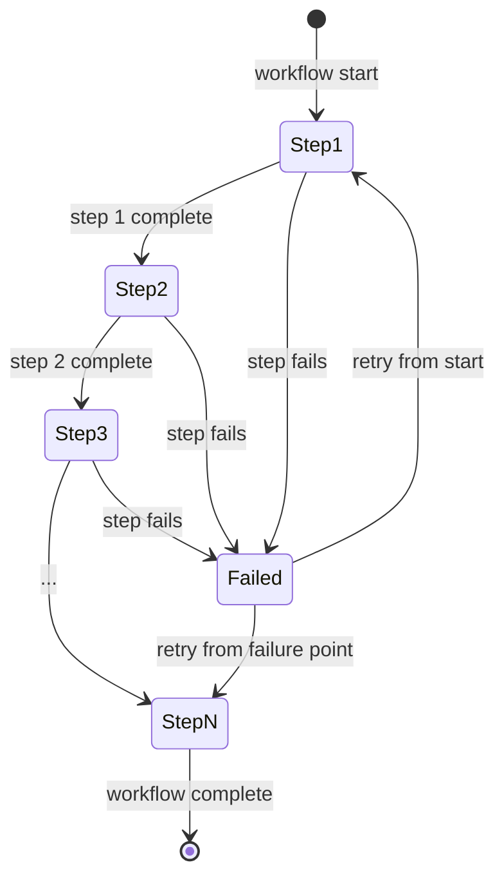
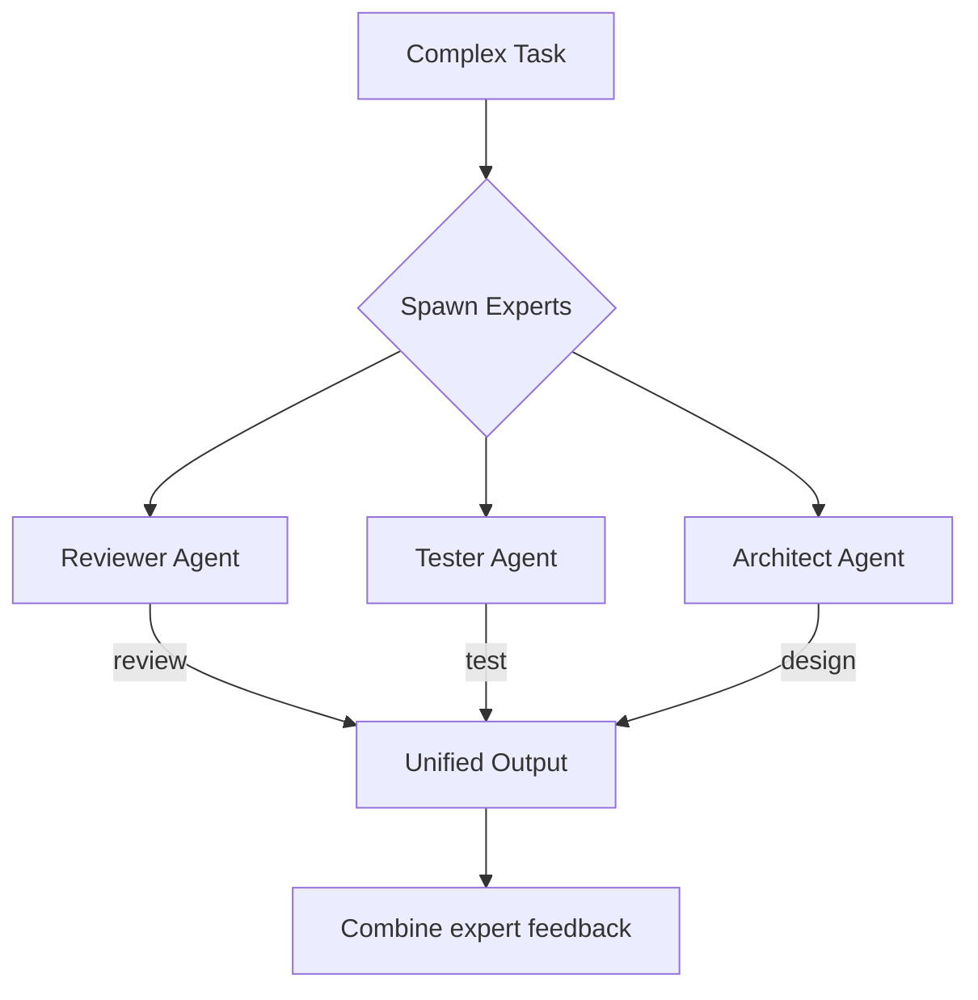
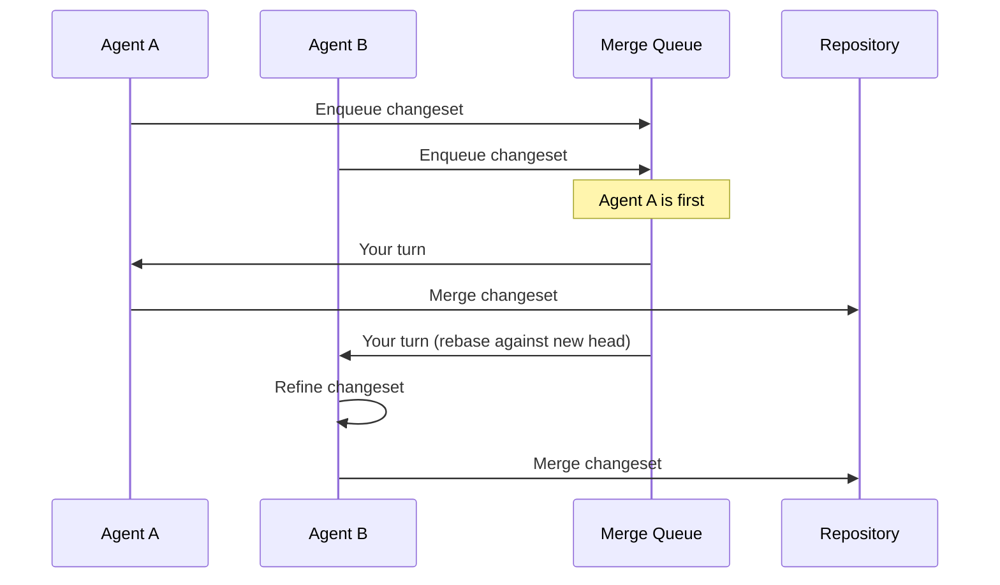

# Workflows Specification

**Status:** complete
**Last Updated:** 2026-02-08

## Upstream References
- PRD: §10 (Workflows), §9.1 (Starter Templates), §11 (Gang of Experts), §6.5 (Merge Queue)
- Reader: §7 (Workflow Engine, Spec Engine, Starter Workflows)
- Transcripts: --

## Downstream References
- ADR: --
- Code: Not yet implemented
- Tests: --

---

## 1. Overview
Workflow engine, starter templates, gang of experts pattern, and merge queue. Most of this module is deferred for post-v1, but the specifications are captured here for architectural planning and future implementation.

## 2. Requirements

### REQ-WRK-001: Workflow as State Machine
**Source:** PRD §10, Reader §7
**Priority:** deferred
**Status:** specified

A workflow is a state machine. The workflow engine tracks and enforces progress through states, manages workflow templates, surfaces open loops and incomplete steps, and shows status for long-running workflows.

**Testable assertion:** Deferred. When implemented: a workflow can be defined as a set of states and transitions. The engine prevents invalid transitions. Incomplete steps are surfaced.

### REQ-WRK-002: Rule of Five Template
**Source:** PRD §9.1
**Priority:** deferred
**Status:** specified

Starter template: five agent passes over a single output from an initial prompt. Each pass refines the output. The template can be modified by the user.

**Testable assertion:** Deferred. When implemented: the Rule of 5 template spawns 5 sequential agents. Each agent receives the previous agent's output. The final output reflects 5 passes of refinement.

### REQ-WRK-003: Verification Layers Template
**Source:** PRD §9.1
**Priority:** deferred
**Status:** specified

Starter template: progressive gates. Output must pass through: linting, then code structure analysis, then architecture review, then performance assessment. Each gate is an agent or tool with pass/fail.

**Testable assertion:** Deferred. When implemented: the template defines ordered verification stages. Each stage must pass before the next begins. A failure at any stage blocks progression.

### REQ-WRK-004: User-Modifiable Templates
**Source:** PRD §9.1
**Priority:** deferred
**Status:** specified

Users can modify workflow templates. Agents can propose new templates as a creative meta process. Templates are stored in the doc store (`.tavern/` directory).

**Testable assertion:** Deferred. When implemented: users can edit template definitions. New templates can be created and saved. Templates persist in `.tavern/`.

### REQ-WRK-005: Gang of Experts
**Source:** PRD §11
**Priority:** deferred
**Status:** specified

Specialized prompts applied to agents (not persistent entities). Examples: Reviewer, Tester, Architect. "Pull in the reviewer" means spawn an agent with reviewer instructions. Users can customize expert prompts.

**Testable assertion:** Deferred. When implemented: spawning an agent with an expert role applies the corresponding specialized prompt. Users can customize the prompt for each expert type.

### REQ-WRK-006: Merge Queue
**Source:** PRD §6.5
**Priority:** deferred
**Status:** specified

A merge queue applies to changesets and source repos. Agents queue up their changes, can see what is ahead in the queue, refine their changes against the predictable target, and merge serially to reduce conflicts.

**Testable assertion:** Deferred. When implemented: agents can enqueue changesets. Queue order is visible. Merges happen serially. Conflicts are reduced compared to parallel merges.

### REQ-WRK-007: Spec Engine
**Source:** Reader §7 (Spec Engine)
**Priority:** deferred
**Status:** specified

Correctness verification layer that:

- Verifies completed output matches the specification
- Detects if agent A destroyed agent B's work
- Checks that all agents completed all required tasks

**Testable assertion:** Deferred. When implemented: the spec engine can compare agent output against a specification. Cross-agent interference is detected. Task completion is verified holistically.

### REQ-WRK-008: Workflow Composability
**Source:** Reader §7 (Workflow Engine)
**Priority:** deferred
**Status:** specified

How workflows combine is not yet defined. The system must eventually support composing workflows (e.g., running a verification layer workflow inside a Rule of 5 workflow).

**Testable assertion:** Deferred. When implemented: workflows can nest and compose without circular dependencies.

## 3. Behavior

### Workflow State Machine (Conceptual)

### Gang of Experts Pattern

### Merge Queue

## 4. Open Questions

- **Workflow composability:** How do workflows combine? Can one workflow be a step in another? What prevents circular composition?

- **Template format:** What format do workflow templates use? YAML? JSON? A custom DSL? How are they versioned?

- **Expert prompt management:** Where do expert prompts live? In `.tavern/`? Are they per-project or global?

## 5. Coverage Gaps

- **Workflow failure recovery:** No specification for what happens when a workflow step fails partway through. Retry from start? Resume from failure point? Manual intervention?

- **Merge conflict resolution:** The merge queue reduces conflicts but does not eliminate them. No specification for how remaining conflicts are handled.

- **Workflow metrics:** No specification for tracking workflow-level metrics (total time, step durations, failure rates) separate from agent-level metrics.
