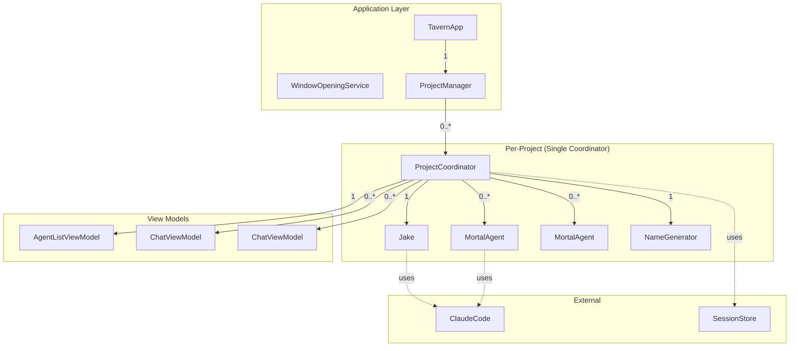

i# Flat Coordinator Architecture

**One-line summary:** Collapse TavernProject, TavernCoordinator, AgentSpawner, and AgentRegistry into a single unified `ProjectCoordinator` that owns everything for a project.

## Core Concept

The current architecture distributes coordination responsibilities across four separate types: `TavernProject` creates and owns the coordinator, `TavernCoordinator` manages agent selection and UI state, `AgentSpawner` creates agents and manages naming, and `AgentRegistry` tracks agent identity. This separation introduces indirection without providing meaningful isolation benefits at the current scale.

The Flat Coordinator collapses these into a single `ProjectCoordinator` that owns Jake, spawns mortal agents, tracks their identity, manages UI state, and serves as the single point of coordination for everything happening within a project. The mental model becomes: "one project, one coordinator, one source of truth."

This is not about cramming code into fewer files. It is about recognizing that these four types share a single lifecycle (the project's lifetime), operate on the same data (agents), and coordinate constantly. Separate types require explicit wiring, forwarding methods, and careful synchronization. A unified type eliminates this coordination overhead entirely.

## Key Components

## Pros

- **Single source of truth**: All agent-related state lives in one place. No need to synchronize between Registry, Spawner, and Coordinator.

- **Simpler mental model**: Developers (human and AI) ask "what does the coordinator do?" and the answer is "everything for this project."

- **Reduced wiring**: No constructor injection chains, no factory callbacks, no forwarding methods between types.

- **Atomic operations**: Spawn-and-select, dismiss-and-update-list, and similar compound operations become single method calls with no intermediate states.

- **Easier testing**: One mock replaces four. Test setup is straightforward.

- **Better discoverability**: New contributors find all coordination logic in one file rather than tracing through four types.

## Cons

- **Larger single file**: `ProjectCoordinator` could reach 400-600 lines. This is manageable but requires discipline to keep methods focused.

- **Mixed concerns**: Thread-safe agent storage (currently in Registry) mixes with `@MainActor` UI coordination (currently in Coordinator). Requires careful isolation via private helpers.

- **Harder to extract later**: If a subsystem needs to become an independent library, it is harder to extract from a unified type than from an already-separate type.

- **Less explicit interfaces**: The four-type architecture forces explicit protocols between components. Flat Coordinator uses internal methods, which are easier to call incorrectly.

- **Naming collision potential**: Internal helper methods for registry-like operations (agent lookup, name tracking) could collide with coordination methods. Requires disciplined naming conventions.

## When to Choose This Architecture

Choose Flat Coordinator when:

- The team prioritizes simplicity and fast iteration over formal separation
- The project is early-stage where requirements shift frequently
- The codebase will be maintained by a small team (1-3 developers)
- Integration testing is more valuable than unit testing individual subsystems
- The coordination layer is unlikely to become a reusable library

Avoid Flat Coordinator when:

- Multiple teams need to work on different subsystems independently
- The registry, spawner, or coordinator need to be tested in isolation with high coverage
- You anticipate extracting subsystems into separate packages
- The project has strict modularity requirements for architectural review
