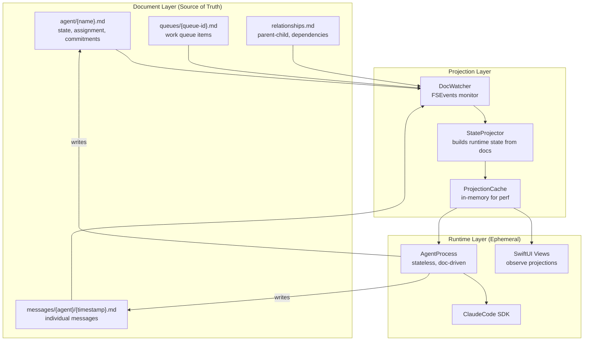

# Document-Centric Architecture

**One-line summary:** Everything flows through the doc store; agents are ephemeral, documents are eternal.

## Core Concept

The PRD declares "Doc store IS the filesystem" and "if it's not in a file, it doesn't exist." The Document-Centric architecture takes this to its logical extreme: documents become the primary abstraction, and agents become processes that transform documents rather than stateful entities that happen to persist.

In this model, an agent's state, messages, commitments, and relationships are all represented as documents in the filesystem. The "agent" you see in the UI is a projection of document state, not a runtime object with its own identity. When you spawn an agent, you create documents. When you dismiss an agent, you archive documents. When an agent responds, documents update.

This inverts the typical relationship where persistence is an afterthought. Here, documents are the source of truth, and runtime objects are ephemeral views onto that truth. The system can crash, restart, and rebuild its entire state from documents alone.

## Key Components

## Pros

- **Crash resilient by design** — No separate recovery logic needed; restart reads documents
- **Debuggable** — Full system state visible as human-readable files
- **Git-friendly** — Agent history becomes commit history; branching becomes filesystem branching
- **Multi-process safe** — Documents + FSEvents handle coordination naturally
- **Aligns with PRD invariant #5** — "If it's not in a file, it doesn't exist" becomes literal
- **Enables external tooling** — Scripts, other processes can read/write agent state directly

## Cons

- **Performance overhead** — Every state change requires file I/O
- **Complex message handling** — High-frequency chat messages need batching or special treatment
- **Document schema evolution** — Changes to agent structure require migration logic
- **Increased coupling** — Document format becomes a contract; changing it affects everything
- **Filesystem as database** — Queries become directory scans; no indices without additional infrastructure

## When to Choose This Architecture

Choose Document-Centric when:

- **Durability is paramount** — System must survive crashes, restarts, migrations without data loss
- **External integration is expected** — Other tools will read/write agent state
- **Debugging is frequent** — Developers need to inspect and modify state directly
- **Git-based workflows** — Version control of agent state is valuable
- **Scale is bounded** — Dozens of agents, not thousands; hundreds of messages, not millions

Avoid when:

- High-frequency state updates are critical (real-time streaming)
- You need complex queries across agent state
- Document format stability is impossible to maintain
