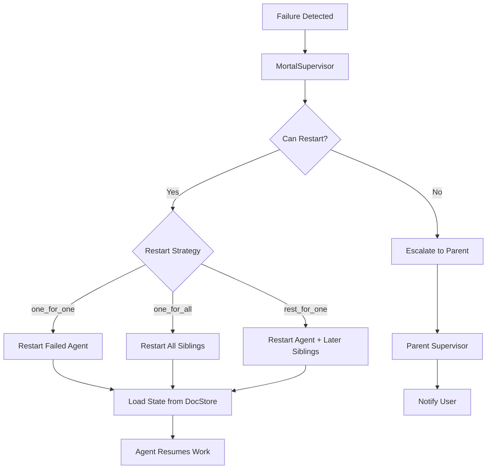

# Supervisor Trees Architecture: Complete Analysis

This document contains the full analysis and reasoning behind the Supervisor Trees architectural proposal for The Tavern at the Spillway.


## Research Findings


### Current Codebase State

The existing Tavern implementation has the following structure relevant to supervision:

**Agent Hierarchy:**
- `Jake` - Eternal top-level agent, one per project
- `MortalAgent` - Task-scoped workers spawned by the coordinator
- Future: `Drone` (single-task, cheap) and `Monitor Daemons` (background watchers)

**Current Lifecycle Management:**
- `TavernCoordinator` owns Jake and `AgentSpawner`
- `AgentSpawner` creates/destroys mortal agents via `AgentRegistry`
- `AgentRegistry` is a flat collection with name uniqueness enforcement
- No restart logic exists - agents either complete or are manually dismissed

**State Management:**
- Agents use `DispatchQueue` for thread-safe property access
- `AgentState` enum: `idle`, `working`, `waiting`, `verifying`, `done`
- Sessions persisted via `SessionStore` (UserDefaults with path-encoded keys)
- No mechanism for recovering an agent after a crash

**Error Handling:**
- `TavernError.sessionCorrupt` - only error type defined
- `AgentRegistryError` - `agentNotFound`, `nameAlreadyExists`
- Errors propagate to callers; no automatic recovery
- Logging via `TavernLogger` categories

**Relevant PRD Requirements:**
- "Fish or Cut Bait" (Section 12): kill and restart on budget exceeded, wrong changeset, agent spinning, gang going down wrong path
- "Failed/Reaped" agent state (Section 4.2)
- "Hygiene" (Section 6.6): daemons cleanup dead agents, old changesets, stale overlays
- "Violation Monitoring" (Section 16): configurable rules with pause/reap/warn responses
- "Preflight Checks" (Section 6.4): fail = agent doesn't start, parent notified


### Erlang/OTP Supervision Model

The OTP supervision model has these core concepts:

**Supervisor Process:**
- A process whose only job is to start, monitor, and restart other processes
- Does not contain business logic
- Configured with a "child specification" listing what to supervise
- Configured with a "restart strategy" defining how to handle failures

**Child Specification:**
- Defines: module, start function, restart type, shutdown strategy, type
- Restart types: `permanent` (always restart), `transient` (restart on abnormal exit), `temporary` (never restart)

**Restart Strategies:**
- `one_for_one`: Only restart the failed child
- `one_for_all`: Restart all children if any fails
- `rest_for_one`: Restart failed child and all children started after it
- `simple_one_for_one`: Dynamic pool of identical workers

**Restart Intensity:**
- `max_restarts` in `max_seconds` before supervisor gives up and crashes itself
- Example: 3 restarts in 5 seconds - if exceeded, supervisor terminates and escalates

**Supervision Trees:**
- Supervisors can supervise other supervisors
- Creates a hierarchy where failures bubble up until someone can handle them
- Root supervisor failing means application terminates

**Process Linking vs Monitoring:**
- Links: bidirectional death notification (if A dies, B dies)
- Monitors: unidirectional observation (if A dies, B gets a message)
- Supervisors use monitors to watch children without being killed by them


### Swift/macOS Mapping Challenges

Swift has different primitives than Erlang:

**Swift Actors vs Erlang Processes:**

| Erlang | Swift |
|--------|-------|
| Lightweight processes (~300 bytes) | Actors (heap-allocated objects) |
| Preemptive scheduling | Cooperative scheduling |
| Process isolation (no shared memory) | Actor isolation (shared heap, sendable checks) |
| Crash = process death | Crash = thrown error or actor deallocation |
| Supervisors as processes | Supervisors as actors or classes |

**Key Differences:**

1. **No Process Crash Equivalent**: In Erlang, a process can "crash" and be restarted with fresh state. In Swift, an actor throwing an error doesn't destroy the actor - it just propagates the error. True "crash and restart" requires explicitly deallocating and recreating the actor.

2. **No Built-in Monitoring**: Erlang has `monitor(process, Pid)`. Swift has no equivalent - you must build observation mechanisms manually using async sequences, delegate patterns, or Combine.

3. **No Preemption**: Erlang can suspend a runaway process. Swift actors cannot be interrupted mid-execution; a spinning agent blocks its isolation domain until the task completes or is cancelled.

4. **Structured Concurrency**: Swift's `TaskGroup` and `withTaskCancellationHandler` provide some supervision-like patterns, but are scoped to a single async function rather than the actor lifecycle.

**Mapping Approach:**

```swift
// Conceptual Swift supervisor
actor AgentSupervisor {
    private let childSpec: ChildSpec
    private let restartStrategy: RestartStrategy
    private var children: [UUID: any Agent] = [:]
    private var restartCounts: [UUID: RestartTracker] = [:]

    func supervise(_ child: any Agent) async {
        children[child.id] = child
        restartCounts[child.id] = RestartTracker(maxRestarts: 3, windowSeconds: 60)

        // Monitor loop - check child health periodically or via events
        Task { [weak self] in
            await self?.monitorChild(child)
        }
    }

    private func monitorChild(_ child: any Agent) async {
        while !Task.isCancelled {
            // Check if child is responsive/healthy
            let healthy = await checkHealth(child)

            if !healthy {
                await handleChildFailure(child)
            }

            try? await Task.sleep(for: .seconds(1))
        }
    }

    private func handleChildFailure(_ child: any Agent) async {
        let tracker = restartCounts[child.id]!

        if tracker.canRestart() {
            switch restartStrategy {
            case .oneForOne:
                await restartChild(child)
            case .oneForAll:
                await restartAllChildren()
            case .restForOne:
                await restartChildAndFollowing(child)
            }
        } else {
            // Escalate to parent supervisor
            throw SupervisorError.maxRestartsExceeded(child.id)
        }
    }
}
```


## Mapping to PRD Requirements


### Fish or Cut Bait (Section 12)

PRD triggers for kill-and-restart:
1. Token budget exceeded
2. Changeset is totally wrong
3. Agent spinning
4. Whole gang going down wrong path

**Supervisor Trees Mapping:**



**Token Budget Exceeded:**
- Monitor daemon tracks token usage per agent
- When budget exceeded, monitor notifies agent's supervisor
- Supervisor terminates agent, checks restart policy
- If `transient`, restart with fresh budget
- If max restarts exceeded, escalate to project supervisor

**Changeset Totally Wrong:**
- Verification layer detects bad changeset
- Reports to supervisor as abnormal termination
- Supervisor can restart agent with:
  - Clean changeset (discard overlay)
  - Modified prompt (include feedback about failure)
  - Different model (escalate from Haiku to Sonnet)

**Agent Spinning:**
- Health monitor detects stuck agent (no progress for N seconds)
- Forces termination via timeout
- Supervisor restarts or escalates

**Gang Going Wrong:**
- Parent supervisor detects multiple child failures
- Triggers `one_for_all` restart of entire gang
- Or escalates to user for human intervention


### Agent States (Section 4.2)

PRD defines: Working, Waiting for Input, Waiting for Wakeup, Done, Failed/Reaped

**Supervisor Trees Addition:**

```
Working ──────► Waiting for Input ──────► Done
    │                   │                   ▲
    │                   ▼                   │
    └──────► Waiting for Wakeup ───────────┘
                        │
                        ▼
              ┌──── Failed ────┐
              │                │
              ▼                ▼
         [Restart]       [Escalate]
              │                │
              ▼                │
          Working              ▼
                          [Reaped]
```

The supervisor layer adds the restart path from Failed - agents don't just die, they can be reborn.


### Hygiene (Section 6.6)

PRD wants daemons to cleanup dead agents, old changesets, stale overlays.

**Supervisor Integration:**

- `HygieneSupervisor` manages cleanup daemon processes
- Uses `one_for_one` strategy (cleanup daemons are independent)
- Cleanup daemons run periodically, notify supervisor on completion/failure
- If cleanup daemon fails, supervisor restarts it
- Cleanup operations are idempotent (safe to restart mid-operation)

```swift
struct CleanupDaemonSpec: ChildSpec {
    let id = "cleanup-daemon"
    let restartType: RestartType = .permanent  // Always running
    let shutdownTimeout: Duration = .seconds(30)

    func start() -> CleanupDaemon {
        CleanupDaemon(
            tasks: [
                .deadAgents,
                .oldChangesets,
                .staleOverlays,
                .orphanedDocuments
            ],
            interval: .minutes(5)
        )
    }
}
```


### Violation Monitoring (Section 16)

PRD defines configurable violation rules with responses: log, notify, pause, reap, warn.

**Supervisor Integration:**

Violation monitoring becomes a specialized supervisor function:

```swift
actor ViolationMonitorSupervisor {
    let rules: [ViolationRule]

    func childViolated(_ child: any Agent, _ violation: Violation) async {
        let rule = rules.first { $0.matches(violation) }

        switch rule?.action {
        case .log:
            TavernLogger.agents.warning("Violation: \(violation)")
        case .notify:
            await notifyParentAndUser(child, violation)
        case .pause:
            await pauseChild(child)
        case .reap:
            await terminateChild(child, reason: .violation(violation))
        case .warn:
            await warnChild(child, violation)  // Inject message into agent
        }
    }
}
```

The supervisor has full authority to pause, restart, or terminate children based on violations.


### Preflight Checks (Section 6.4)

PRD: At spawn, verify sandbox, resources, permissions. Fail = agent doesn't start.

**Supervisor Integration:**

```swift
actor MortalSupervisor {
    func spawnChild(spec: ChildSpec) async throws -> any Agent {
        // Preflight checks
        let preflight = PreflightChecker(spec: spec)
        let result = try await preflight.run()

        guard result.passed else {
            // Don't start, notify parent
            throw SpawnError.preflightFailed(result.failures)
        }

        // Start child under supervision
        let child = spec.start()
        await supervise(child)
        return child
    }
}
```

Failed preflights don't trigger restarts - they're not failures of running processes, they're failures to start.


## Trade-offs Considered


### Restart vs Human Intervention

Not all failures should trigger automatic restart:

**Restart-worthy failures:**
- Network timeout
- API rate limit
- Session corruption
- Process crash
- Temporary resource unavailability

**Human-intervention failures:**
- Wrong architectural approach
- Misunderstood requirements
- Repeated test failures (agent doesn't understand the code)
- Budget decisions (should we spend more tokens?)

The supervisor needs heuristics or explicit configuration to distinguish these.

**Proposed Approach:**

```swift
enum FailureClassification {
    case transient      // Auto-restart appropriate
    case persistent     // Retry once, then escalate
    case terminal       // Never restart, notify user
    case unknown        // Conservative: escalate
}

actor IntelligentSupervisor {
    func classifyFailure(_ failure: AgentFailure) -> FailureClassification {
        switch failure {
        case .networkError, .rateLimited, .timeout:
            return .transient
        case .testsFailed(let count) where count < 3:
            return .persistent
        case .testsFailed:
            return .terminal  // Too many failures
        case .commitmentFailed:
            return .persistent
        case .budgetExceeded:
            return .terminal  // User must decide
        default:
            return .unknown
        }
    }
}
```


### State Reconstruction

Restarted agents need to recover their state. Options:

**Option A: Stateless Agents**
- Agents have no persistent state
- All context comes from prompt + doc store
- Restart = fresh agent with same assignment
- Pro: Simple
- Con: Loses conversation history

**Option B: Session Recovery**
- Sessions persisted to doc store
- Restart loads session, resumes conversation
- Pro: Maintains context
- Con: Session might be corrupted (caused the failure)

**Option C: Checkpoint-based Recovery**
- Agents create checkpoints at safe points
- Restart loads most recent valid checkpoint
- Pro: Controlled recovery points
- Con: Complexity, checkpoint overhead

**Proposed Approach for Tavern:**

Use Option B with corruption detection:
1. Persist sessions to doc store
2. On restart, attempt to load session
3. If load fails (corruption), fall back to Option A
4. Include "you were restarted due to X" in recovery prompt

```swift
actor MortalSupervisor {
    func restartChild(_ spec: ChildSpec, reason: FailureReason) async {
        // Try to recover state
        let state: AgentState?
        do {
            state = try await DocStore.loadAgentState(spec.id)
        } catch {
            TavernLogger.agents.warning("State recovery failed: \(error)")
            state = nil
        }

        // Create new agent
        let agent = spec.start()

        // Inject recovery context
        let recoveryPrompt = """
            You were restarted due to: \(reason).
            \(state.map { "Previous state: \($0.summary)" } ?? "Starting fresh.")
            Continue your assignment.
            """

        // Resume under supervision
        await supervise(agent)
        _ = try? await agent.send(recoveryPrompt)
    }
}
```


### Supervision Granularity

How deep should the supervision tree go?

**Option A: Flat (Two Levels)**
```
AppSupervisor
├── JakeSupervisor
├── MortalSupervisor (all mortals)
└── MonitorSupervisor (all monitors)
```

**Option B: Deep (Per-Task)**
```
AppSupervisor
└── ProjectSupervisor
    ├── JakeSupervisor
    │   └── Jake
    └── TaskSupervisor (per major task)
        ├── LeadAgentSupervisor
        │   └── LeadAgent
        └── DronePoolSupervisor
            ├── Drone1
            ├── Drone2
            └── Drone3
```

**Option C: Dynamic (Emerges from Work)**
```
AppSupervisor
└── ProjectSupervisor
    ├── Jake (self-supervising)
    └── (supervisors created by Jake as needed)
```

**Trade-offs:**

| Aspect | Flat | Deep | Dynamic |
|--------|------|------|---------|
| Complexity | Low | High | Medium |
| Fault isolation | Coarse | Fine | Adaptive |
| Overhead | Low | High | Varies |
| Fits v1 | Yes | No | Maybe |

**Proposed Approach:**

Start with Option A (flat) for v1. The current codebase has a flat agent pool, and the PRD's v1 scope doesn't require deep hierarchies. Add depth in v2 when task delegation and multi-agent coordination are implemented.


### Restart Intensity Tuning

How many restarts before giving up?

**Too Few:**
- Transient failures kill agents unnecessarily
- User constantly notified about recoverable issues
- System feels fragile

**Too Many:**
- Broken agents consume resources endlessly
- Budget burns on hopeless retries
- Real problems masked by restart noise

**Proposed Defaults:**

```swift
struct RestartPolicy {
    // Per-agent limits
    static let mortalDefault = RestartPolicy(
        maxRestarts: 3,
        withinSeconds: 300,  // 5 minutes
        backoffStrategy: .exponential(base: 2, maxDelay: 60)
    )

    static let droneDefault = RestartPolicy(
        maxRestarts: 1,      // Drones are cheap, fail fast
        withinSeconds: 60,
        backoffStrategy: .none
    )

    static let jakeDefault = RestartPolicy(
        maxRestarts: .unlimited,  // Jake is eternal
        withinSeconds: 0,
        backoffStrategy: .exponential(base: 5, maxDelay: 300)
    )
}
```


## Implementation Complexity


### Required New Components

1. **Supervisor Protocol** (~100 LOC)
   - `start()`, `stop()`, `childFailed(_:)`, `childCompleted(_:)`
   - Restart strategy enum
   - Child specification struct

2. **BaseSupervisor Actor** (~300 LOC)
   - Child lifecycle management
   - Restart tracking and backoff
   - Health monitoring loop
   - Escalation to parent

3. **JakeSupervisor** (~50 LOC)
   - Specialization: unlimited restarts, session recovery

4. **MortalPoolSupervisor** (~150 LOC)
   - Dynamic child set
   - Per-child restart tracking
   - Spawning interface for TavernCoordinator

5. **MonitorSupervisor** (~100 LOC)
   - Manages health/budget/hygiene daemons
   - `one_for_one` strategy

6. **HealthMonitor** (~200 LOC)
   - Periodic health checks
   - Stuck agent detection
   - Reports to supervisor

7. **BudgetMonitor** (~150 LOC)
   - Token usage tracking
   - Budget exceeded detection
   - Reports to supervisor


### Modifications to Existing Code

1. **TavernCoordinator**
   - Replace direct agent management with supervisor delegation
   - Subscribe to supervisor events for UI updates

2. **AgentSpawner**
   - Delegate to MortalPoolSupervisor
   - Remove direct registry management

3. **AgentRegistry**
   - May become internal to supervisor
   - Or remain as shared lookup service

4. **MortalAgent / Jake**
   - Add health check interface
   - Add restart event handling
   - May need checkpoint support

5. **TavernError**
   - Add supervision-related error cases
   - Add failure classification


### Estimated Effort

| Component | New LOC | Modified LOC | Complexity |
|-----------|---------|--------------|------------|
| Supervision primitives | 600 | - | Medium |
| Monitor daemons | 350 | - | Medium |
| Coordinator integration | - | 200 | Low |
| Agent modifications | - | 150 | Low |
| Error handling | 50 | 100 | Low |
| Tests | 500 | 200 | Medium |
| **Total** | **1500** | **650** | - |

Timeline estimate: 2-3 weeks for a developer familiar with both the codebase and OTP concepts.


## Migration Path from Current State


### Phase 1: Supervision Primitives (Week 1)

1. Define `Supervisor` protocol and `ChildSpec` struct
2. Implement `BaseSupervisor` actor with restart logic
3. Add restart tracking and backoff
4. Write tests for supervisor behavior in isolation

No changes to existing agent code yet.


### Phase 2: Jake Supervision (Week 1-2)

1. Create `JakeSupervisor` wrapping existing Jake
2. Modify `TavernProject` to use `JakeSupervisor`
3. Jake now supervised but behavior unchanged
4. Test: manually crash Jake, verify restart

Existing tests should still pass.


### Phase 3: Mortal Pool Supervision (Week 2)

1. Create `MortalPoolSupervisor`
2. Modify `AgentSpawner` to delegate to supervisor
3. Update `TavernCoordinator` to interact with supervisor
4. Test: spawn agent, crash it, verify restart

At this point, basic supervision is working.


### Phase 4: Monitor Daemons (Week 2-3)

1. Implement `HealthMonitor` and `BudgetMonitor`
2. Create `MonitorSupervisor` to manage them
3. Wire monitors to report to agent supervisors
4. Test: stuck agent detected and restarted

System now has active failure detection.


### Phase 5: Polish and Integration (Week 3)

1. UI updates for restart events
2. Logging and observability
3. Configuration (restart limits, backoff)
4. Documentation
5. Integration tests


### Rollback Strategy

Each phase can be rolled back independently:
- Phase 2: Revert to direct Jake management
- Phase 3: Revert AgentSpawner to direct registry
- Phase 4: Remove monitor daemons, system works without them

The key is that supervisors wrap existing components rather than replace them entirely.


## Open Questions


### 1. Supervision of Jake

Jake is "eternal" per the PRD. Should JakeSupervisor have unlimited restarts, or should Jake failures eventually escalate to the user?

**Options:**
- A: Unlimited restarts (true eternal)
- B: High limit (e.g., 10 restarts in 1 hour) then escalate
- C: User-configurable

**Recommendation:** Option B with aggressive backoff. Even "eternal" processes can have persistent failures that warrant human attention.


### 2. Cross-Project Supervision

What happens when multiple projects are open? Should there be a global supervisor above project supervisors?

```
GlobalSupervisor
├── Project1Supervisor
│   └── ...
└── Project2Supervisor
    └── ...
```

**Recommendation:** Yes, but defer to v2. For v1, each project is independent.


### 3. State Isolation on Restart

When an agent restarts, should it:
- A: Get a fresh Claude session
- B: Resume the existing session
- C: Resume with "you were restarted" context injected

**Recommendation:** Option C. The agent should know it was restarted to avoid repeating the same mistake.


### 4. User Visibility of Restarts

Should users see every restart, or only escalations?

**Options:**
- A: Silent restarts, only notify on escalation
- B: Subtle UI indicator (badge count)
- C: Full visibility (restart appears in chat)

**Recommendation:** Option B for mortals, Option A for drones. Jake restarts should be visible.


### 5. Changeset Handling on Restart

If an agent is restarted mid-changeset:
- A: Discard changeset, start fresh
- B: Keep changeset, let agent continue
- C: Configurable per restart reason

**Recommendation:** Option C. Budget exceeded = keep changeset. Agent spinning = discard (likely corrupted).


### 6. Testing Supervision

How do we test supervision behavior without flaky timing-dependent tests?

**Approach:**
- Mock time for backoff testing
- Explicit failure injection via test doubles
- Deterministic health check responses
- Avoid `Task.sleep` in tests; use mock clocks


### 7. Integration with Future Drones

Drones are "single task then terminate." Do they need supervision, or just fire-and-forget?

**Recommendation:** Light supervision. Drones get 1 restart attempt (for transient failures), then they're reaped. No complex recovery - they're designed to be disposable.


## Conclusion

Supervisor Trees provide a principled approach to the failure handling that the PRD already demands. The "Fish or Cut Bait" philosophy maps directly to OTP's restart strategies, and the agent hierarchy naturally forms a supervision tree.

The main costs are implementation complexity (building OTP primitives in Swift) and the learning curve for developers unfamiliar with supervision concepts. However, the benefits compound over time: predictable failure behavior, clear operational semantics, and a foundation for the more complex multi-agent coordination planned for future versions.

For v1, a minimal implementation (flat supervision, simple restart policies) provides immediate value without over-engineering. The architecture can deepen as the system's complexity grows.
