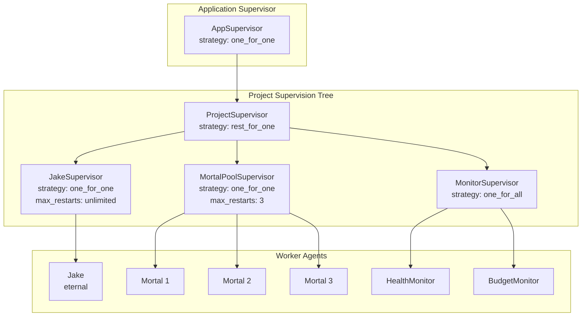

# Architecture Proposal: Supervisor Trees

**One-line summary:** Erlang/OTP-style supervision hierarchies with "let it crash" philosophy applied to Swift actors.

## Core Concept

Supervisor Trees treat failure as a first-class architectural concern rather than an exceptional case to be avoided. The system is structured as a tree of supervisors, where each supervisor is responsible for starting, monitoring, and restarting its child processes (agents) according to a defined restart strategy.

When an agent fails (crashes, hangs, exceeds budget), its supervisor decides what to do: restart just that agent, restart all sibling agents, or escalate the failure upward. This creates fault isolation boundaries - a failing drone cannot take down Jake, and a misbehaving mortal agent cannot corrupt the coordinator.

The key insight from Erlang is that recovery logic belongs in the supervision layer, not in the business logic. Agents focus on their work; supervisors focus on keeping agents alive. This separation produces cleaner code and more predictable failure behavior.

## Key Components

**Restart Strategies:**

- **one_for_one**: Only restart the failed child (default for independent workers)
- **one_for_all**: If one child fails, restart all children (for tightly coupled groups)
- **rest_for_one**: Restart the failed child and all children started after it (for ordered dependencies)

## Pros

- **Natural fit for "Fish or Cut Bait"**: PRD explicitly wants kill-and-restart semantics; this is OTP's bread and butter

- **Fault isolation by design**: Failures are contained within supervision boundaries; a crashing drone cannot corrupt Jake's state

- **Predictable recovery**: Restart policies are declarative and testable; no ad-hoc error handling scattered throughout code

- **Clean separation of concerns**: Agents do work, supervisors manage lifecycle; business logic stays focused

- **Proven at scale**: OTP has run telecom systems with 99.9999999% uptime; the model is battle-tested

- **Maps well to Swift actors**: Swift's actor model with structured concurrency provides similar isolation guarantees

- **Built-in escalation**: When local recovery fails (max restarts exceeded), failure bubbles up to parent supervisor

- **Observable by design**: Supervision events (start, stop, restart) are natural points for metrics and logging

## Cons

- **No native Swift support**: Must build supervision primitives from scratch; Swift actors are not processes

- **Message passing overhead**: Pure OTP style requires message passing for all communication; Swift reference semantics are faster

- **Restart is not always the answer**: Some failures (bad prompt, wrong architecture) need human intervention, not automated restart

- **State reconstruction complexity**: Restarted agents need to recover their state from doc store; adds persistence requirements

- **Learning curve**: OTP concepts (supervision specs, child specs, restart intensity) take time to internalize

- **Potential over-engineering**: For v1's simple hierarchy (Jake + flat mortal pool), full supervision may be overkill

## When to Choose This Architecture

Choose Supervisor Trees when:

1. **Reliability is paramount**: The system must stay operational even when individual components fail

2. **Failure modes are understood**: You know what can go wrong and have defined recovery strategies

3. **Agents are stateless or state-recoverable**: Restart is meaningful because agents can rebuild their context

4. **Isolation matters**: A failure in one area must not cascade to others

5. **Operations transparency is valued**: You want clear visibility into what's running, what failed, and what restarted

This architecture excels for production-grade systems where "the system stays up" matters more than "every request succeeds."
