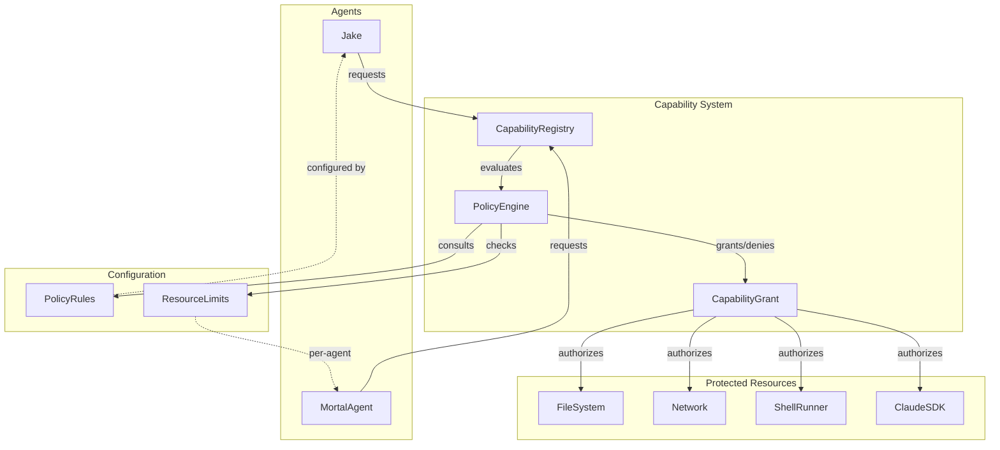

# Capability-Based Architecture

**One-line summary:** Agents request capabilities (tools, resources, permissions); the system grants or denies based on policy.

## Core Concept

In a capability-based architecture, agents are granted explicit **capability tokens** that authorize specific actions. Rather than relying on ambient authority (where any code can attempt any operation), agents must possess the appropriate capability to perform an action. The system becomes an arbiter of what agents *can* do, not just what they *should* do.

This maps directly to the PRD's invariant: "Agents cannot modify their own invariants." In this architecture, invariants are encoded as **policy rules** that govern capability grants. Agents request capabilities, and a **Policy Engine** evaluates whether to grant them based on the agent's identity, current state, and configured rules. The capability itself is then passed to the operation, making unauthorized actions structurally impossible rather than merely detectable.

The key insight is *unforgeable references*. An agent cannot manufacture a capability it wasn't granted. This transforms security from "detect and punish violations" to "violations are impossible." The PRD's violation monitoring becomes violation *prevention*.

## Key Components

## Pros

- **Structural safety** - Unauthorized operations are impossible, not just detected
- **Least privilege by design** - Agents only get capabilities they need for their task
- **Auditable** - Every capability grant is logged; complete trace of what was authorized
- **Composable** - Capabilities can be combined, delegated (with restrictions), or revoked
- **Maps to PRD** - "Agents cannot modify their own invariants" becomes "agents cannot grant themselves capabilities"
- **Testable** - Mock capabilities can be injected for testing without touching real resources
- **Future-proof** - New resources (cloud, containers) just need capability wrappers

## Cons

- **Complexity overhead** - Every resource access requires capability plumbing
- **Performance cost** - Capability checks on every operation add latency
- **Learning curve** - Unfamiliar pattern for most Swift developers
- **Verbosity** - Code becomes cluttered with capability parameters
- **Capability management** - Need infrastructure to create, store, revoke, and audit grants
- **Over-engineering risk** - For v1's scope, may be solving problems we don't have yet

## When to Choose This Architecture

Choose capability-based when:

1. **Security is paramount** - You need to *prevent* unauthorized actions, not just detect them
2. **Multi-tenant or untrusted agents** - Agents come from different sources with different trust levels
3. **Regulatory/compliance requirements** - You need complete audit trails of all authorized actions
4. **Complex permission hierarchies** - Different agents need different subsets of permissions
5. **Delegation patterns** - Parent agents grant children subsets of their own capabilities

Avoid when:

- Building a quick prototype (overhead is significant)
- Trust model is simple (all agents equally trusted)
- Performance is critical and resources are homogeneous
