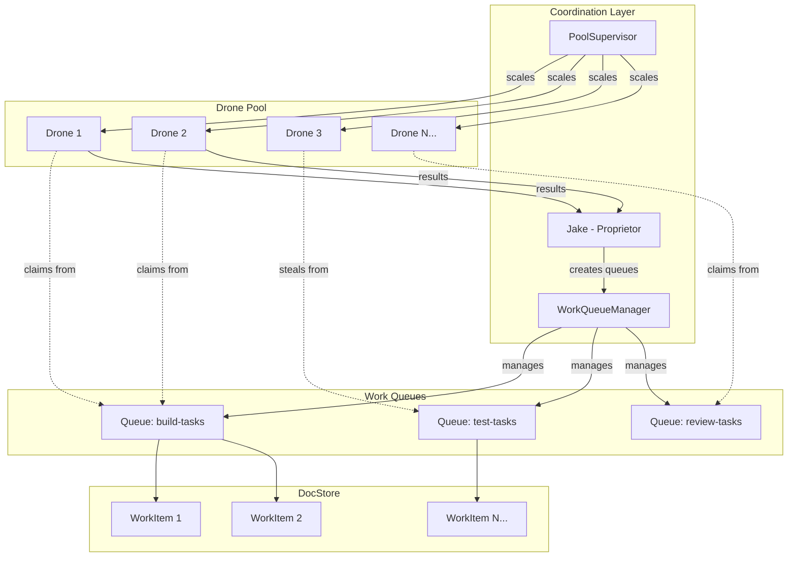

# Work-Stealing Pool Architecture

**One-line summary:** Agent pools with work queues where idle agents steal work from busy ones, optimizing throughput through dynamic load balancing.

## Core Concept

The Work-Stealing Pool architecture treats agents as pooled resources attached to work queues rather than individual task owners. When a parent decomposes work into units, those units enter a shared queue. A pool of drone agents consumes from the queue, with idle agents "stealing" work items from overloaded queues to maximize throughput.

This model aligns directly with the PRD's concept of drones as "Meeseeks-style, one task then terminate" agents. Rather than spawning a new agent per task, a pool of warm agents sits ready. When work appears, the next available drone claims it, executes, and either terminates (returning to pool) or immediately claims the next item. The pool size adapts based on queue depth and saturation metrics.

Work stealing specifically addresses the problem of uneven task distribution. If Queue A has 50 items and Queue B has 2, agents attached to Queue B can steal from Queue A when they finish. This prevents the bottleneck scenario where some agents sit idle while others are overwhelmed.

## Key Components

## Pros

- **Maximum throughput** - Work never waits while agents sit idle; stealing ensures full utilization

- **Elastic scaling** - Pool size adjusts to queue depth; spin up more drones when backlog grows

- **Cheap failure** - Drones are disposable; failed work item returns to queue for retry

- **Natural batching** - Similar tasks can share a queue, enabling specialized drone configurations

- **Reduced spawn overhead** - Warm pool means no per-task agent initialization cost

- **Metric-friendly** - Amplification factor is directly visible as concurrent drone count

## Cons

- **Coordination complexity** - Work stealing requires distributed locking or careful CAS operations

- **State isolation challenges** - Agents processing from same queue may have conflicting sandbox states

- **Less task affinity** - Agent that started a task may not finish it if stolen

- **Debugging difficulty** - Work can bounce between agents, making trace harder to follow

- **Potential for contention** - High-frequency stealing can create queue lock contention

- **Model mismatch risk** - Some tasks benefit from conversational continuity that stealing breaks

## When to Choose This Architecture

Choose Work-Stealing Pool when:

- Tasks are homogeneous and well-defined (same shape, different data)

- High amplification is the primary goal (many drones, minimal human attention)

- Individual task failure is cheap and retryable

- You have many small tasks rather than few large ones

- Work distribution is naturally uneven and unpredictable

Avoid when:

- Tasks require conversational continuity across multiple turns

- Task state is expensive to checkpoint/restore

- Agent specialization matters more than throughput

- Work items have complex interdependencies that stealing would break
