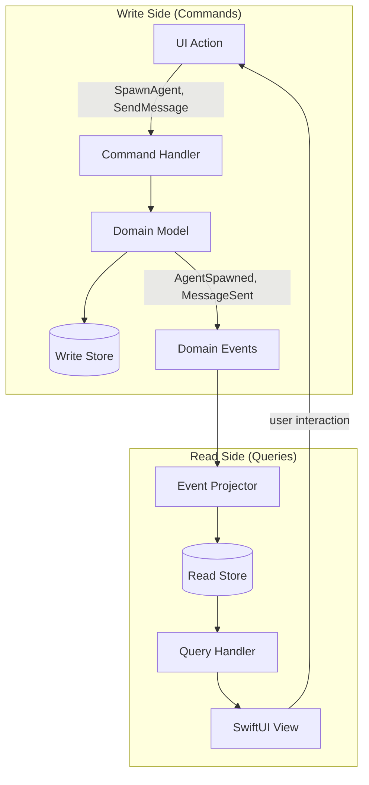

# CQRS Architecture

**One-line summary:** Separate read models optimized for UI queries from write models optimized for agent state mutations.

## Core Concept

Command Query Responsibility Segregation (CQRS) recognizes that read and write operations have fundamentally different characteristics and optimizes each path independently. In Tavern's context, the UI needs fast, frequent reads (agent list, chat history, state indicators) while agents perform infrequent but complex writes (state transitions, message storage, commitment verification). These asymmetric access patterns suggest separate models rather than a single unified one.

The write side processes commands through domain logic: `SpawnAgent`, `SendMessage`, `UpdateState`, `VerifyCommitment`. Each command validates business rules, mutates state, and optionally emits events. The read side maintains denormalized projections optimized for specific UI queries: agent list with cached assignments, chat history with pre-parsed content blocks, state summaries for notification badges. Read models subscribe to write-side events and update their projections accordingly.

For Tavern, this means the `TavernCoordinator`'s current dual role (both processing mutations and serving UI state) splits into distinct command handlers and query providers. The UI binds to read-optimized view models that update reactively when write-side events propagate. This separation enables independent scaling, caching, and optimization of each path.

## Key Components

## Pros

- **Read path optimization** -- UI queries hit denormalized projections; no joins, no lazy loading, no N+1 queries

- **Natural fit for SwiftUI** -- `@Published` view models are already read projections; CQRS formalizes this pattern

- **Independent scaling** -- Read and write models can be optimized separately for their workloads

- **Simpler view models** -- Read models contain exactly what the view needs, pre-computed and ready to display

- **Enables caching** -- Read models can be aggressively cached since they're derived, not authoritative

- **Testability** -- Command handlers and query handlers can be tested in isolation

- **Aligns with PRD asymmetry** -- UI needs fast reads (Section 21); agents do complex writes (Section 4)

## Cons

- **Eventual consistency** -- Read models may lag behind writes; UI may briefly show stale data

- **Duplication overhead** -- Same data exists in write store and read projections

- **Synchronization complexity** -- Must ensure projectors handle all events correctly

- **Overkill for simple cases** -- Adds abstraction layers where direct CRUD would suffice

- **Debugging indirection** -- Tracing a bug may require following data through multiple paths

- **Event versioning** -- Changing event schemas affects all projectors consuming them

## When to Choose This Architecture

**Choose CQRS when:**

- UI reads vastly outnumber agent writes (PRD's dashboard, agent list, chat history)

- Read and write models have different shapes (list items vs. full agent state)

- Read performance is critical and writes can tolerate latency

- You need to optimize read and write paths independently

- The codebase already has implicit CQRS (view models are de facto projections)

**Avoid CQRS when:**

- Read and write patterns are symmetric

- Strong consistency is mandatory for all operations

- The domain is simple CRUD with no complex queries

- Team unfamiliar with event-driven patterns

- Prototype stage where simplicity trumps optimization
