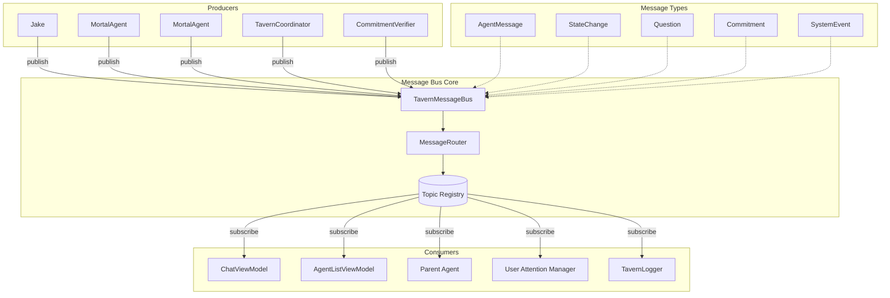

# Message Bus Architecture

**One-line summary:** All components communicate via a central message bus; decoupled producers and consumers enable flexible routing, bubbling, and inter-agent messaging.

## Core Concept

The Message Bus architecture introduces a centralized communication channel through which all system events and messages flow. Instead of components calling each other directly (Coordinator calls Spawner, Agent calls Claude, ViewModel observes Agent), they publish typed messages to the bus and subscribe to messages they care about.

This inverts control from "caller knows callee" to "publisher knows topic, subscriber knows topic." The bus becomes the nervous system of the Tavern, routing messages based on type, metadata (agent ID, project ID, priority), and routing rules. Components become loosely coupled: an agent publishes a "question" message without knowing whether it routes to the user, a parent agent, or a monitoring daemon.

The PRD describes bubbling (child to parent to user), lateral messaging (sibling collaboration), and context-dependent routing. A message bus provides the infrastructure to implement these patterns declaratively. Routing rules can specify "questions from agents at depth > 2 bubble to parent first" or "discovery messages broadcast to all siblings." The bus becomes configurable policy rather than hardcoded method calls.

## Key Components

## Pros

- **Decoupled communication** - Components publish messages without knowing consumers; new consumers can subscribe without modifying publishers

- **Flexible routing** - Bubbling, lateral, and direct messaging become routing policy rather than code; rules can change at runtime

- **Natural fit for PRD messaging requirements** - Bubbling (Section 5.3), question triage (5.5), and discovery sharing (9.3) map directly to bus topics and routing

- **Testability** - Components can be tested by injecting mock bus implementations; message flow is observable

- **Extensibility** - Adding new message types or subscribers requires no changes to existing producers

- **Audit and debugging** - Bus can log all messages, enabling replay and debugging without instrumenting each component

- **Attention model support** - User attention management becomes a specialized consumer that aggregates and prioritizes questions

## Cons

- **Indirection overhead** - Tracing message flow requires understanding routing rules, not just following method calls

- **Debugging complexity** - "Why did this message go there?" requires inspecting router configuration, not code

- **Performance characteristics** - Message serialization, routing, and dispatch add latency; high-frequency operations may suffer

- **Ordering guarantees** - Async message dispatch complicates ordering; must explicitly design for eventual consistency

- **Error handling complexity** - Errors in consumers must be surfaced through the bus; silent failures are easy to create

- **Runtime coupling** - Components still depend on message format; schema evolution requires versioning

- **Overkill for simple cases** - Direct method calls are simpler when routing is static and known at compile time

## When to Choose This Architecture

Choose the Message Bus architecture when:

- **Inter-agent communication is a core feature** - The PRD explicitly describes agent-to-agent messaging, bubbling, and coordination

- **Routing rules should be configurable** - Parent agents choosing notification approaches, context-dependent bubbling

- **The attention model requires aggregation** - Questions from multiple agents must be consolidated before surfacing to user

- **Observability matters** - All message flow should be loggable and replayable for debugging

- **New message types and consumers are expected** - The system will evolve with new agent types, daemons, and monitoring

Avoid the Message Bus architecture when:

- Communication patterns are simple and static (current v1 scope)

- Performance is critical and the message overhead is unacceptable

- The team is unfamiliar with pub/sub patterns and routing configuration

- Debugging with direct call stacks is preferred over message tracing
