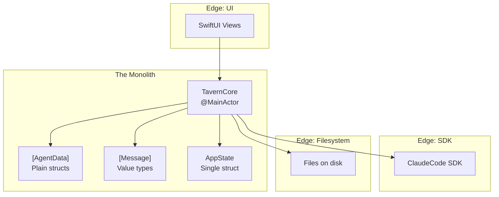

# Monolithic Core Architecture

**One-line summary:** A single coordinator class does everything; agents are data, not actors.

## Core Concept

The Monolithic Core architecture is the opposite of over-engineering. Instead of distributing responsibilities across multiple coordinating classes (TavernCoordinator, AgentSpawner, AgentRegistry, ProjectManager), a single `TavernCore` class owns all orchestration logic. Agents become pure data structures with no internal state machine, behavioral logic, or thread synchronization.

The philosophy is YAGNI (You Ain't Gonna Need It) applied ruthlessly. The current codebase has 8 classes with their own DispatchQueues, 3 ViewModels, and a complex object ownership hierarchy. Most of this exists "in case we need it later." A monolithic approach asks: what if we don't? What if one coordinator, running on MainActor, handles everything until proven otherwise?

Complexity is pushed to the edges: the Claude SDK handles API calls and session persistence, SwiftUI handles view updates, and the filesystem handles document storage. The core becomes a thin orchestration layer that moves data between these boundaries.

## Key Components Diagram

## Pros

- **Trivial to understand** — One file, one class, one thread. New developers can read the entire orchestration logic in 15 minutes.

- **No concurrency bugs** — Everything runs on MainActor. No DispatchQueues, no race conditions, no thread-safety annotations.

- **Fast iteration** — Changing behavior means editing one place. No ripple effects through protocol conformances and dependency injection.

- **Easy to test** — One mock (ClaudeCode), one entry point. Test the coordinator directly.

- **Minimal abstraction overhead** — No AnyAgent type erasure, no protocol witnesses, no registry lookups.

- **Matches current reality** — v1 is single-threaded anyway. Agents don't run in parallel. The infrastructure for parallelism is cost without benefit right now.

## Cons

- **Scalability ceiling** — If 50+ agents need to run in parallel with background execution, this approach hits a wall.

- **Testing granularity** — Can't test "just the spawner" or "just the registry" in isolation. It's all or nothing.

- **Code organization** — A 2000-line coordinator file is harder to navigate than 10 focused 200-line files.

- **Harder to add features independently** — Two developers can't easily work on "agent state machine" and "session persistence" in parallel — they're editing the same file.

- **Refactoring later is harder** — When you DO need to extract components, they're entangled with everything else.

## When to Choose This Architecture

**Choose monolithic when:**

- The product is early stage and requirements are unstable

- Single-threaded execution is sufficient for the foreseeable future

- The team is small (1-3 developers)

- Iteration speed matters more than architectural purity

- You'd rather refactor from simple to complex than simplify complex code

**Avoid monolithic when:**

- Multiple agents must execute truly in parallel (not just async)

- Team size requires parallel development on different subsystems

- The domain is well-understood and stable

- Performance isolation is critical (one agent can't starve others)
