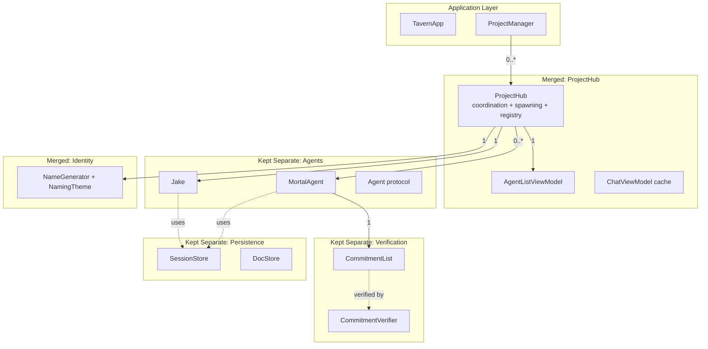

# Hybrid Layers Architecture

**One-line summary:** Merge layers that share lifecycles while keeping layers with distinct responsibilities separate, guided by actual coupling rather than dogmatic principles.

## Core Concept

The current codebase has ten distinct organizational layers in TavernCore: Agents, Chat, Commitments, Coordination, DocStore, Errors, Logging, Naming, Persistence, and Project. Some of these represent genuinely distinct domains (Agents vs Commitments), while others are artificial separations that create coordination overhead without providing isolation benefits (Coordination vs Spawner vs Registry).

Hybrid Layers applies a pragmatic filter: examine each layer's lifecycle, data dependencies, and change frequency. Layers that share the same lifecycle and constantly coordinate should merge. Layers that have distinct responsibilities, different change triggers, or represent natural seams in the domain should remain separate.

The key insight is that architectural boundaries should reflect actual system boundaries, not idealized abstractions. The Agents layer is a natural seam because agents are the core domain concept. The Commitments layer is a natural seam because verification is a distinct concern with its own rules. But the split between TavernCoordinator, AgentSpawner, and AgentRegistry is artificial because they all share the project lifecycle, operate on the same data, and must synchronize constantly.

## Key Components

## Pros

- **Right-sized abstraction**: Each merged layer reflects actual coupling. Each separate layer reflects actual independence.

- **Reduced coordination overhead**: Merging Coordinator/Spawner/Registry eliminates forwarding methods, factory injection, and cross-type synchronization.

- **Preserved testability where it matters**: Agents and Commitments remain separate, independently testable. The merged ProjectHub can be tested as a unit.

- **Clear change triggers**: When spawn logic changes, you touch ProjectHub. When verification rules change, you touch Commitments. No ambiguity about where code belongs.

- **Evolutionary architecture**: Easy to split merged layers later if genuine seams emerge. Easy to merge remaining layers if they prove coupled.

- **Matches domain boundaries**: Agents are a domain concept. Verification is a domain concept. "Registry" is not a domain concept; it is an implementation detail of tracking agents.

## Cons

- **Judgment calls required**: Deciding what to merge vs keep separate requires understanding the codebase. Wrong calls create worse architecture than consistent layering.

- **Inconsistent mental model**: Some things are merged, some are not. New contributors must learn which is which.

- **Documentation burden**: Must document why each separation exists (or does not exist). Without this, future developers may not understand the rationale.

- **Migration complexity**: Transitioning from current state requires careful refactoring. Cannot be done incrementally in some cases.

- **Risk of over-merging**: Once merged, extracting a component is harder than keeping it separate from the start.

## When to Choose This Architecture

Choose Hybrid Layers when:

1. **The codebase has accumulated artificial separations**: You inherited layers that do not reflect actual seams.

2. **Coordination overhead is visible**: You find yourself writing forwarding methods, factory callbacks, or synchronization logic between types that could share state.

3. **Different layers have different stability**: Some layers change weekly (coordination), others change rarely (logging). Keep the stable ones separate, merge the volatile ones.

4. **The team has domain expertise**: Developers understand the actual coupling well enough to make good merge/separate decisions.

5. **Pragmatism is valued over purity**: The goal is working software, not architectural elegance.

Avoid Hybrid Layers when:

- The team lacks context to make good judgment calls about coupling
- Strict modularity is a requirement (regulatory, organizational)
- The architecture must be understood by many independent teams
