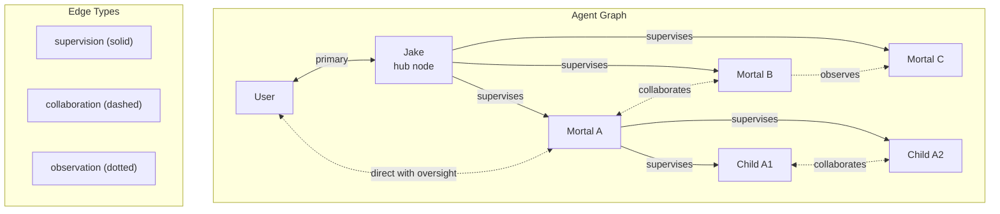

# Graph-Based Architecture

**One-line summary:** Agents as nodes in a directed graph; edges define communication channels; any agent can connect to any other with appropriate permissions.

## Core Concept

The Graph-Based architecture models the agent system as a directed graph where each agent is a node and communication pathways are edges. Unlike strict tree hierarchies where communication flows through parent nodes, graphs allow direct connections between any agents while maintaining structural clarity through explicit edge definitions.

In Tavern's context, this directly addresses the PRD's requirement for lateral messaging between siblings. The current codebase implicitly assumes tree-shaped relationships (Jake spawns mortals, mortals spawn children), but the design documents explicitly call for sibling collaboration, direct-to-user connections with oversight, and flexible bubbling patterns. A graph naturally models these arbitrary relationships without forcing everything through parent proxies.

Each edge in the graph carries metadata: connection type (supervision, collaboration, observation), permissions (read, write, bidirectional), and routing rules (for bubbling). Jake remains special not because he sits at a tree root, but because he has edges connecting him to all other agents and to the user -- he's the most-connected node, not the topmost one.

## Key Components

## Pros

- **Direct lateral messaging** -- PRD explicitly mentions siblings collaborating; graph edges make this first-class rather than a workaround

- **Flexible bubbling patterns** -- Upward, lateral, and direct-to-user routing are all just different edge traversals

- **Natural permission model** -- Edge metadata encodes who can message whom and how

- **Scales to complex workflows** -- Gang-of-experts patterns with cross-cutting relationships model cleanly

- **Supports observation patterns** -- Agents can subscribe to others' outputs without full bidirectional connections

- **Explicit topology** -- The connection structure is visible and queryable rather than implicit in code

## Cons

- **More complex than trees** -- Trees have one path between any two nodes; graphs can have many

- **Cycle detection required** -- Must prevent infinite message loops (A -> B -> C -> A)

- **Permission explosion** -- N agents can have up to N*(N-1) edges; needs careful defaults

- **Harder to visualize at scale** -- Graph layouts become cluttered with many connections

- **Routing complexity** -- Bubbling decisions require graph traversal algorithms rather than simple parent pointers

- **Verification ambiguity** -- When multiple agents can reach a target, who is responsible for delivery?

## When to Choose This Architecture

Choose Graph-Based when:

- **Lateral communication is essential** -- Sibling agents need to collaborate without parent mediation
- **Multiple communication patterns coexist** -- Some workflows need strict hierarchy, others need peer-to-peer
- **Permission granularity matters** -- Different relationships need different access levels
- **Observation patterns are common** -- Agents frequently monitor each other's work
- **Topology changes at runtime** -- Connections form and break as tasks evolve

Avoid Graph-Based when:

- **Simple hierarchies suffice** -- If all communication naturally flows through parents, trees are simpler
- **Connection count is unbounded** -- Systems where every agent talks to every other become unmanageable
- **Deterministic routing is critical** -- Graphs introduce ambiguity about which path messages take
