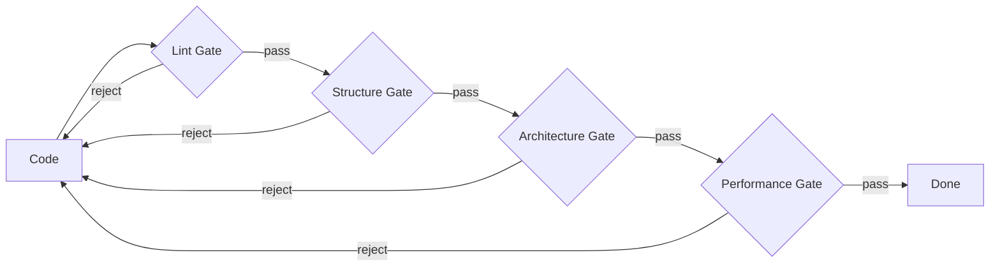

# Pipes & Filters Architecture — Complete Treatise

This document contains my complete analysis of applying Pipes & Filters patterns to the Tavern multi-agent orchestrator.


## Research Findings


### Current Codebase Analysis

The existing architecture uses a coordinator-centric pattern with discrete agents:

**Agent Structure (current):**
- `Jake` — Eternal coordinator, handles user interaction, uses ClaudeCode SDK for LLM calls
- `MortalAgent` — Task-scoped workers with assignments, commitments, and lifecycle states
- `AgentSpawner` — Factory that creates mortal agents with themed names
- `AgentRegistry` — Thread-safe registry tracking all active agents

**Communication Flow (current):**
1. User → `ChatViewModel` → `Jake.send()` → ClaudeCode → response
2. Jake (conceptually) spawns `MortalAgent` via `AgentSpawner`
3. Each agent maintains its own session with Claude
4. Commitments are verified via `CommitmentVerifier` (shell command execution)

**State Management (current):**
- `AgentState` enum: `idle`, `working`, `waiting`, `verifying`, `done`
- Serial `DispatchQueue` per agent for thread safety
- `@MainActor` for view models and coordinator
- Session IDs persisted via `SessionStore`

**Key Observation:** The current architecture treats agents as independent entities with point-to-point communication. There's no explicit notion of "work flowing through stages" — agents are spawned for tasks and report completion back. This is fundamentally different from Pipes & Filters, where work items are the primary abstraction and agents are processors that transform them.


### PRD Requirements Mapping

**Rule of 5 (Section 9.1):**
> "5 agent passes over single output from initial prompt"

This is the canonical Pipes & Filters use case:

```
Input → Filter1 → Filter2 → Filter3 → Filter4 → Filter5 → Output
```

Each filter receives the previous stage's output, refines it, and passes it forward. The "output" is a work item (document, code artifact, design spec) that accumulates improvements as it flows through.

**Mapping:**
- Pass 1: Initial implementation (Coder filter)
- Pass 2: Code review (Reviewer filter)
- Pass 3: Testing (Tester filter)
- Pass 4: Documentation (Doc Writer filter)
- Pass 5: Final polish (Integrator filter)

**Verification Layers (Section 9.1):**
> "Progressive gates: linting → code structure → architecture → performance"

This is a pipeline with gate filters. Each gate is deterministic (runs tools, checks output) and either:
- **Passes** — work item advances to next stage
- **Rejects** — work item returns to a previous stage with feedback



**Invariant 3: "Commitments verified independently":**

In Pipes & Filters, this becomes: every filter that claims to produce output has its output validated by the next stage (or a dedicated gate filter) before work advances. The commitment isn't "agent says done" — it's "downstream filter accepts the work item."

**Deterministic Shell (Section 4.7):**

Gate filters are the embodiment of the deterministic shell. They're not LLM-powered; they run static analysis, tests, linters. The non-deterministic LLM filters produce artifacts; the deterministic gate filters validate them.


### Classic Pipes & Filters Pattern

The Pipes & Filters architectural style originates from Unix shell pipelines and was formalized by Garlan & Shaw (1994). Core concepts:

**Filter:**
A processing element with:
- Typed input port(s)
- Typed output port(s)
- Transformation logic (pure function of input → output)
- No shared state with other filters

**Pipe:**
A connector between filters:
- Bounded or unbounded buffer
- FIFO ordering (typically)
- Typed to match connected ports
- May support backpressure

**Pipeline:**
A composition of filters connected by pipes:
- Can be linear, branching, or DAG
- Executes when work items are available
- Each filter processes independently (potential parallelism)

**Key Properties:**
1. **Incrementality** — Filters process work items one at a time
2. **Isolation** — Filters don't share state; all communication through pipes
3. **Composability** — Filters can be rearranged without modification
4. **Reusability** — Same filter can appear in multiple pipelines


### How Agents Map to Filters

**Jake as Router Filter:**

Jake inspects incoming work (user requests) and routes them to appropriate pipelines. He's not a coordinator in the traditional sense; he's a classifier/dispatcher:

```swift
struct JakeRouterFilter: Filter {
    typealias Input = UserRequest
    typealias Output = RoutedWorkItem

    func process(_ request: UserRequest) async -> RoutedWorkItem {
        let classification = await classifyRequest(request)
        return RoutedWorkItem(
            request: request,
            targetPipeline: classification.pipeline,
            priority: classification.priority
        )
    }
}
```

**MortalAgent as Processing Filter:**

Each mortal agent becomes a filter that transforms work items:

```swift
struct AgentFilter: Filter {
    typealias Input = WorkItem
    typealias Output = WorkItem

    let agent: MortalAgent
    let role: AgentRole  // Architect, Coder, Reviewer, etc.

    func process(_ item: WorkItem) async throws -> WorkItem {
        // Build prompt from work item context
        let prompt = buildPrompt(item, role: role)

        // Get agent's contribution
        let response = try await agent.send(prompt)

        // Update work item with agent's output
        return item.appending(
            stage: role.stageName,
            content: response,
            timestamp: Date()
        )
    }
}
```

**Gate Filters (Deterministic):**

Gate filters don't use LLMs — they run deterministic checks:

```swift
struct LintGateFilter: Filter {
    typealias Input = WorkItem
    typealias Output = Result<WorkItem, GateRejection>

    let linter: Linter

    func process(_ item: WorkItem) async -> Result<WorkItem, GateRejection> {
        let code = item.latestCode
        let result = await linter.lint(code)

        if result.passed {
            return .success(item.markingGatePassed(.lint))
        } else {
            return .failure(GateRejection(
                gate: .lint,
                errors: result.errors,
                originalItem: item
            ))
        }
    }
}
```


### Work Item as the Primary Abstraction

In Pipes & Filters, the **work item** is the central concept, not the agent:

```swift
struct WorkItem: Identifiable, Codable {
    let id: UUID
    let originalRequest: String
    let createdAt: Date

    // Accumulating history as item flows through pipeline
    var stages: [StageResult]

    // Current state in pipeline
    var currentStage: PipelineStage
    var status: WorkItemStatus

    // Metadata for routing and verification
    var targetPipeline: PipelineType
    var gatesPassed: Set<GateType>
    var rejectionHistory: [GateRejection]

    // Content at each stage
    var artifacts: [ArtifactType: Artifact]
}

struct StageResult: Codable {
    let stage: PipelineStage
    let filterName: String
    let input: String
    let output: String
    let timestamp: Date
    let metrics: StageMetrics?
}
```

**Key insight:** The work item carries its entire history. Every filter's contribution is recorded. This provides:
1. Full auditability (how did we get here?)
2. Debugging (which stage introduced the bug?)
3. Rollback (restore to any previous stage)
4. Learning (which filters are most effective?)


### Mapping to PRD Workflows


#### Rule of 5 Pipeline

```swift
let ruleOfFivePipeline = Pipeline(stages: [
    AgentFilter(role: .architect),   // Pass 1: Design
    AgentFilter(role: .coder),       // Pass 2: Implement
    AgentFilter(role: .reviewer),    // Pass 3: Review
    AgentFilter(role: .tester),      // Pass 4: Test
    AgentFilter(role: .integrator),  // Pass 5: Polish
])
```

Each stage:
1. Receives work item with all previous outputs
2. Adds its own contribution
3. Passes enriched work item forward

**Difference from current approach:** In the current architecture, Jake would spawn 5 agents and coordinate them. In Pipes & Filters, the pipeline topology IS the coordination — no explicit coordinator needed.


#### Verification Layers Pipeline

```swift
let verificationPipeline = Pipeline(stages: [
    AgentFilter(role: .coder),           // Produce code
    LintGateFilter(),                     // Gate 1
    TypeCheckGateFilter(),                // Gate 2
    AgentFilter(role: .architect),        // Architecture review
    ArchitectureGateFilter(),             // Gate 3
    PerformanceGateFilter(),              // Gate 4
])

// With rejection routing
pipeline.onRejection { rejection in
    // Route back to coder with feedback
    return PipelineAction.routeTo(
        stage: .coder,
        withContext: rejection
    )
}
```

**Rejection handling:** When a gate filter rejects, the work item is routed backward. The coder filter receives the rejection context and must address the issues before the item can advance again.


#### Bug Fix Pipeline

```swift
let bugFixPipeline = Pipeline(stages: [
    AgentFilter(role: .reproducer),  // Confirm & isolate
    AgentFilter(role: .fixer),       // Implement fix
    RegressionGateFilter(),          // Verify fix
    AgentFilter(role: .documentor),  // Update docs
])
```


### Pipeline Topology Types

**Linear Pipeline:**
```
A → B → C → D → Output
```
Work flows through each stage in order.

**Branching Pipeline (Fan-out):**
```
      ┌→ B1 →┐
A → S ├→ B2 →┼→ M → Output
      └→ B3 →┘
```
Splitter (S) creates multiple work items; Merger (M) combines results.

**Conditional Pipeline:**
```
      ┌→ B (if feature) →┐
A → R ┤                   ├→ Output
      └→ C (if bugfix) →─┘
```
Router (R) directs based on work item properties.

**Pipeline with Feedback:**
```
A → B → G ──→ Output
      ↑   ↓reject
      └───┘
```
Gate (G) can reject back to earlier stage.


### Document Store as Persistent Pipe

The PRD states: "Doc store IS the filesystem. A file is a document."

In Pipes & Filters, pipes can be **persistent** — work items are written to files, and downstream filters read from files. This enables:

1. **Crash recovery** — Work items survive process restart
2. **Inspection** — Users can see intermediate results
3. **Manual intervention** — Users can edit work items between stages
4. **Audit trail** — Complete history in version-controlled files

**Implementation:**

```swift
struct DocStorePipe<T: Codable>: Pipe {
    let directory: URL
    let fileExtension: String

    func write(_ item: T) async throws {
        let path = directory.appendingPathComponent("\(item.id).\(fileExtension)")
        let data = try JSONEncoder().encode(item)
        try data.write(to: path)
    }

    func read() async throws -> [T] {
        let files = try FileManager.default.contentsOfDirectory(at: directory, includingPropertiesForKeys: nil)
        return try files.compactMap { url in
            guard url.pathExtension == fileExtension else { return nil }
            let data = try Data(contentsOf: url)
            return try JSONDecoder().decode(T.self, from: data)
        }
    }
}
```


## Trade-offs Considered


### Sequential vs Parallel Execution

**Trade-off:** Pipes & Filters naturally serializes stages within a pipeline, but parallelizes across pipelines.

**Current approach:** Agents could theoretically work in parallel on different aspects of the same task.

**Pipes & Filters:** Within one work item's journey, stages are sequential. But multiple work items can be in different stages simultaneously.

**Analysis:**
- For Rule of 5 on a single feature: sequential is actually desired (each pass builds on previous)
- For multiple features: parallel pipelines achieve high throughput
- For sub-task parallelism: need to model as fan-out/fan-in within pipeline

**Verdict:** Sequential within work item is acceptable for v1 use cases. Fan-out patterns available for later optimization.


### Rigid Topology vs Dynamic Coordination

**Trade-off:** Pipelines have fixed topology; dynamic situations require escape hatches.

**Scenario:** Agent in Pass 3 discovers a fundamental design flaw requiring Pass 1 rework.

**In current architecture:** Agent surfaces question to Jake, who can make ad-hoc decisions.

**In Pipes & Filters:** Two options:
1. **Rejection routing** — Filter 3 rejects with feedback, work item routes to Filter 1
2. **Exception pipeline** — Work item is diverted to a "design rework" pipeline

**Analysis:**
The PRD acknowledges this: "Fish or cut bait" — sometimes you need to kill the current approach and restart. In Pipes & Filters, this is modeled as pipeline termination with a new pipeline instantiation.

**Verdict:** Rejection routing handles most cases. Catastrophic failures terminate pipeline and surface to user/Jake for replanning.


### Work Items vs Conversations

**Trade-off:** Pipes & Filters models work as data items; the current system models work as conversations.

**Current:** Agent maintains conversation history with Claude. Multi-turn interaction is the norm.

**Pipes & Filters:** Each filter invocation is (conceptually) a single transformation. Where does conversation fit?

**Analysis:**
Two approaches:
1. **Conversation as filter-local** — Each filter can have multi-turn conversation with its work item, but the interface is still input → output
2. **Conversation as work item content** — The work item carries conversation history; each filter appends to it

**Recommendation:** Hybrid. Filters can internally use multi-turn conversation, but the pipeline sees only the final output. Conversation history is logged but not part of the typed interface.

```swift
struct AgentFilter: Filter {
    func process(_ item: WorkItem) async throws -> WorkItem {
        var conversationHistory: [Message] = []

        // Multi-turn within filter
        var response = try await agent.send(buildInitialPrompt(item))
        conversationHistory.append(.assistant(response))

        while needsClarification(response) {
            let followUp = buildFollowUp(response)
            conversationHistory.append(.user(followUp))
            response = try await agent.send(followUp)
            conversationHistory.append(.assistant(response))
        }

        // But output to pipeline is just the final result
        return item.appending(
            stage: role.stageName,
            content: extractFinalOutput(response),
            conversation: conversationHistory  // For logging, not for next filter
        )
    }
}
```


### User Interaction: Side Channel or In-Band?

**Trade-off:** User input/questions don't fit cleanly into the data-flow model.

**PRD requirement:** "User attention is sacred" — agents surface questions, user responds asynchronously.

**In Pipes & Filters:** Two options:

1. **Side channel** — User interaction is separate from the pipeline; filters pause and wait for external input
2. **In-band** — User is a special filter; questions are work items routed to the "user filter"

**Analysis:**

Side channel is more practical. Treating user as a filter implies:
- User has bounded processing time (backpressure)
- Questions queue in a pipe to user
- User's responses flow back through pipes

This is awkward. Better model:

```swift
struct BlockingFilter: Filter {
    func process(_ item: WorkItem) async throws -> WorkItem {
        if needsUserInput(item) {
            // Park the work item
            await userInteractionManager.requestInput(
                forWorkItem: item,
                question: extractQuestion(item)
            )
            // Work item is suspended; pipeline continues with other items
            throw FilterSuspension.awaitingUserInput(item.id)
        }
        // Continue processing
    }
}
```

When user responds, the work item is "resumed" from the blocking filter.


### Commitment Verification: Filter or Gate?

**Trade-off:** Should commitment verification be a filter (part of the pipeline) or external?

**PRD requirement:** "Commitments verified independently" — deterministic assertion.

**Current implementation:** `CommitmentVerifier` runs shell commands after agent signals completion.

**In Pipes & Filters:** Commitments become gate filters:

```swift
struct CommitmentGateFilter: Filter {
    let commitments: [Commitment]

    func process(_ item: WorkItem) async -> Result<WorkItem, GateRejection> {
        var allPassed = true
        var failures: [String] = []

        for commitment in commitments {
            let result = await shellRunner.run(commitment.assertion)
            if !result.passed {
                allPassed = false
                failures.append(commitment.description)
            }
        }

        if allPassed {
            return .success(item.markingCommitmentsPassed())
        } else {
            return .failure(GateRejection(
                gate: .commitment,
                errors: failures,
                originalItem: item
            ))
        }
    }
}
```

**Verdict:** Commitment verification as gate filters. This keeps verification in the pipeline topology, making it visible and debuggable.


## Implementation Complexity


### New Types Required

```swift
// Core abstractions
protocol Filter {
    associatedtype Input
    associatedtype Output
    func process(_ input: Input) async throws -> Output
}

protocol Pipe {
    associatedtype Element
    func write(_ element: Element) async throws
    func read() async -> Element?
}

struct Pipeline<Input, Output> {
    let stages: [AnyFilter]
    func execute(_ input: Input) async throws -> Output
}

// Work item types
struct WorkItem: Identifiable, Codable { /* ... */ }
struct StageResult: Codable { /* ... */ }
struct GateRejection: Codable { /* ... */ }

// Filter implementations
struct AgentFilter: Filter { /* ... */ }
struct GateFilter: Filter { /* ... */ }
struct RouterFilter: Filter { /* ... */ }
struct SplitterFilter: Filter { /* ... */ }
struct MergerFilter: Filter { /* ... */ }

// Pipe implementations
struct InMemoryPipe<T>: Pipe { /* ... */ }
struct DocStorePipe<T: Codable>: Pipe { /* ... */ }

// Pipeline runtime
class PipelineExecutor {
    func run<I, O>(_ pipeline: Pipeline<I, O>, input: I) async throws -> O
    func routeRejection(_ rejection: GateRejection) async throws
}
```


### Changes to Existing Types

| Type | Change Required |
|------|-----------------|
| `Agent` protocol | Add `Filter` conformance wrapper |
| `Jake` | Becomes `RouterFilter`, no longer a conversation coordinator |
| `MortalAgent` | Wrapped in `AgentFilter`, lifecycle managed by pipeline |
| `TavernCoordinator` | Becomes `PipelineExecutor` + `PipelineManager` |
| `ChatViewModel` | May become view into work item at current stage |
| `AgentRegistry` | Replaced by filter registry per pipeline |
| `Commitment` | Converted to `CommitmentGateFilter` |
| `CommitmentVerifier` | Becomes implementation detail of gate filters |


### Estimated Effort

**Phase 1: Core abstractions** — 1 week
- `Filter` protocol and basic implementations
- `Pipe` protocol with in-memory implementation
- `WorkItem` type with serialization

**Phase 2: Pipeline runtime** — 2 weeks
- `Pipeline` composition
- `PipelineExecutor` with stage transitions
- Rejection routing and feedback loops
- DocStore pipe implementation

**Phase 3: Agent filter wrappers** — 1 week
- Wrap existing `Jake` as router filter
- Wrap `MortalAgent` as processing filter
- Adapt prompt building for work item context

**Phase 4: Gate filters** — 1 week
- Lint gate, type check gate, test gate
- Commitment gate from existing `CommitmentVerifier`
- Rejection feedback formatting

**Phase 5: UI integration** — 2 weeks
- Pipeline visualization
- Work item progress tracking
- Stage-by-stage inspection

**Total: 7-8 weeks** for full implementation, assuming familiarity with both the codebase and Pipes & Filters patterns.


### Testing Strategy

**Unit tests for filters:**

```swift
func testAgentFilterAppendsStageResult() async throws {
    let mockAgent = MockAgent(response: "Implemented feature X")
    let filter = AgentFilter(agent: mockAgent, role: .coder)

    let input = WorkItem(originalRequest: "Add feature X")
    let output = try await filter.process(input)

    XCTAssertEqual(output.stages.count, 1)
    XCTAssertEqual(output.stages[0].filterName, "coder")
    XCTAssertTrue(output.stages[0].output.contains("feature X"))
}
```

**Unit tests for gates:**

```swift
func testLintGateRejectsOnErrors() async throws {
    let mockLinter = MockLinter(errors: ["Line 5: missing semicolon"])
    let gate = LintGateFilter(linter: mockLinter)

    let input = WorkItem(artifacts: [.code: Artifact(content: "bad code")])
    let result = await gate.process(input)

    guard case .failure(let rejection) = result else {
        XCTFail("Expected rejection")
        return
    }
    XCTAssertEqual(rejection.gate, .lint)
    XCTAssertTrue(rejection.errors.contains("missing semicolon"))
}
```

**Integration tests for pipelines:**

```swift
func testRuleOfFivePipelineProducesOutput() async throws {
    let pipeline = Pipeline(stages: [
        MockAgentFilter(role: .architect, output: "Design: ..."),
        MockAgentFilter(role: .coder, output: "Code: ..."),
        MockAgentFilter(role: .reviewer, output: "Review: ..."),
        MockAgentFilter(role: .tester, output: "Tests: ..."),
        MockAgentFilter(role: .integrator, output: "Final: ..."),
    ])

    let input = WorkItem(originalRequest: "Build feature")
    let output = try await pipeline.execute(input)

    XCTAssertEqual(output.stages.count, 5)
    XCTAssertEqual(output.gatesPassed.count, 0)  // No gates in this pipeline
}
```

**Stress tests for throughput:**

```swift
func testPipelineThroughputUnderLoad() async throws {
    let pipeline = makeVerificationPipeline()
    let workItems = (0..<100).map { WorkItem(originalRequest: "Task \($0)") }

    let start = Date()
    let results = try await withTaskGroup(of: WorkItem.self) { group in
        for item in workItems {
            group.addTask {
                try await pipeline.execute(item)
            }
        }
        return try await group.reduce(into: []) { $0.append($1) }
    }
    let elapsed = Date().timeIntervalSince(start)

    XCTAssertEqual(results.count, 100)
    XCTAssertLessThan(elapsed, 60.0)  // 100 items in under 60 seconds
}
```


## Migration Path from Current State


### Phase 1: Introduce Work Items (Non-Breaking)

1. Create `WorkItem` type alongside existing structures
2. Add work item creation when `MortalAgent` is spawned
3. Log work item transitions without changing behavior
4. Existing `ChatViewModel` continues to work

**Risk:** Zero. Additive only.


### Phase 2: Wrap Agents as Filters (Parallel Path)

1. Create `AgentFilter` wrapper around `MortalAgent`
2. Create `JakeRouterFilter` wrapper around `Jake`
3. Implement simple linear pipeline execution
4. Feature flag to enable pipeline mode for new work

**Risk:** Low. Old path remains default.


### Phase 3: Add Gate Filters

1. Implement `LintGateFilter`, `TestGateFilter` from existing `CommitmentVerifier`
2. Add rejection routing logic
3. Create verification pipeline template
4. Test with real linting/testing tools

**Risk:** Medium. Gate failures affect workflow.


### Phase 4: Migrate Coordination

1. Replace `TavernCoordinator` with `PipelineManager`
2. Pipeline topology defined in config, not code
3. UI shows pipeline view instead of agent list
4. Work items become primary navigation concept

**Risk:** High. Fundamental UX change.


### Phase 5: Full Migration

1. Remove old coordination code
2. All work flows through pipelines
3. Jake exists only as router filter
4. "Agent" concept replaced by "filter" in code and UI

**Risk:** High. Point of no return.


### Rollback Strategy

- **Phase 1-2:** Delete new types, revert feature flag
- **Phase 3:** Disable gate filters, route all work through old path
- **Phase 4:** This is the commitment point; rollback would be significant rework
- **Phase 5:** No rollback; this is the new architecture


## Open Questions


### 1. How do pipelines interact with the attention model?

The PRD emphasizes user attention management: bubbling, question triage, notification control.

In Pipes & Filters:
- Work items flow through stages automatically
- User interaction is a "side effect" (suspension/resumption)
- How do we surface "agent has a question" without breaking data flow?

**Proposed solution:** Work items have a "pending questions" field. A special "User Interaction" filter at pipeline entry checks this field and suspends if non-empty. This keeps questions in-band while respecting the data flow model.


### 2. How does perseverance mode work in a pipeline?

In current architecture, perseverance mode auto-prompts agents to continue working.

In Pipes & Filters:
- Work items flow without explicit prompting
- What does "continue working" mean for a filter?

**Proposed solution:** Perseverance applies at the work item level. If a work item has been "parked" (waiting for user input) for too long, the pipeline can auto-advance it with a default response or escalate to Jake for re-routing.


### 3. How do agents spawn children in a pipeline model?

The PRD describes hierarchical agent spawning: mortal agents can spawn children.

In Pipes & Filters:
- Filters don't spawn other filters
- Fan-out is explicit in pipeline topology

**Options:**
1. **Dynamic pipeline modification** — Filter can request insertion of sub-pipeline
2. **Pre-defined sub-pipelines** — Splitter filter routes to known sub-pipelines
3. **Hybrid** — Some spawning allowed, but primarily through pipeline config

**Proposed solution:** Pre-defined sub-pipelines for common patterns (e.g., "break into subtasks" is a splitter filter). Truly dynamic spawning is an escape hatch that temporarily exits pipeline model.


### 4. How do we handle agent-to-agent communication?

The PRD mentions lateral communication between siblings.

In Pipes & Filters:
- Filters communicate only through pipes (work items)
- Lateral communication requires explicit wiring

**Proposed solution:** "Collaboration filter" that merges outputs from parallel filters before proceeding. Siblings don't talk directly; they each contribute to the work item, and a merger filter combines their contributions.


### 5. How does rewind/branch work with pipelines?

The PRD mentions rewind and branch capability.

In Pipes & Filters:
- Work items carry history
- "Rewind" = restore work item to earlier stage state
- "Branch" = fork work item, run through alternative pipeline

**Proposed solution:** Work items are immutable snapshots. Rewind creates new work item from historical snapshot. Branch creates new work item with same history, routed to different pipeline.


### 6. How do we visualize pipeline progress?

The current UI shows agent list and chat views.

In Pipes & Filters:
- Primary view is pipeline progress
- Each stage shows current work items
- User can inspect work item at any stage

**Proposed solution:** Replace agent list with pipeline view:
- Horizontal stages (columns)
- Work items as cards moving through stages
- Click to expand and see work item details at that stage
- Jake's chat becomes "router interaction" view


## Conclusion

Pipes & Filters offers a compelling model for the Tavern's workflow orchestration. The pattern directly addresses:

- **Rule of 5** — Linear pipeline with 5 agent filters
- **Verification layers** — Gate filters with rejection routing
- **Deterministic shell** — Gates are pure deterministic checkers
- **Doc store integration** — Persistent pipes using filesystem

The primary costs are:
- **Conversation awkwardness** — Multi-turn interaction doesn't fit naturally
- **Rigid topology** — Dynamic situations require escape hatches
- **UX shift** — Work items replace agents as primary concept

**Recommendation:**

Pipes & Filters is a strong fit if:
- Workflows are well-defined and repeatable
- Verification gates are the primary control mechanism
- The team is comfortable with data-flow mental models

**For v1:** Consider a hybrid approach:
- Keep agent-centric model for user interaction
- Introduce pipeline concepts for workflow templates
- Gate filters for verification
- Work items for audit trail

This allows gradual adoption without full commitment to the paradigm shift. If workflows prove to be highly standardized, full migration becomes natural. If they remain exploratory and conversational, the agent-centric model stays primary.
