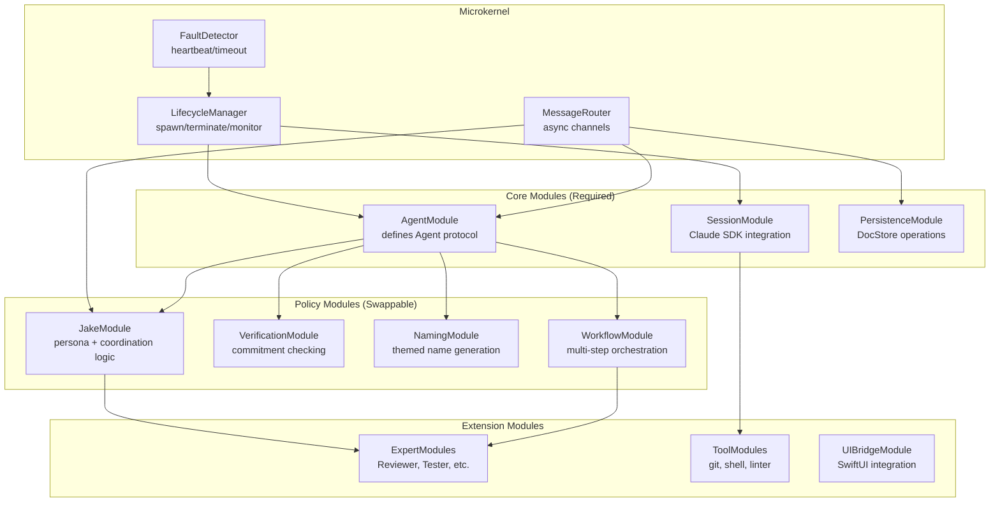

# Microkernel Architecture

**One-line summary:** Minimal kernel for lifecycle only; everything else is a loadable module communicating through well-defined interfaces.

## Core Concept

The Microkernel architecture applies operating system design principles to multi-agent orchestration. The kernel handles exactly three responsibilities: agent spawn/terminate, message routing between components, and fault detection. Everything else - agent behaviors, verification strategies, prompt composition, naming themes, workflows, and even Jake's personality - lives in modules that load at startup or runtime.

This differs from Plugin Architecture (#11) in a fundamental way: plugins extend a capable core, while modules provide all capability to a minimal core. In Plugin Architecture, the framework has opinions about how agents work, and plugins add variations. In Microkernel Architecture, the kernel has no opinions about agents at all - it only knows how to spawn processes, route messages between them, and detect when they crash. An "agent" is just whatever a module defines it to be.

The microkernel approach creates extreme separation between mechanism and policy. The kernel provides mechanisms (IPC, lifecycle management, fault notification). Modules implement policies (how Jake talks, how verification works, what "done" means). This makes the system maximally flexible - you could theoretically swap out the entire agent model by loading different modules, without touching kernel code.

## Key Components

## Pros

- **Maximum isolation** - Modules cannot accidentally depend on each other's internals; all communication goes through kernel-provided channels

- **Hot-swappable components** - Theoretically replace the verification module without restarting the system (runtime reload)

- **Clean testing boundaries** - Test each module against the kernel's interface, not against other modules

- **Extreme flexibility** - The "agent model" itself becomes a module; radically different approaches can coexist

- **Small trusted computing base** - Security-critical code is isolated in the kernel; buggy modules cannot corrupt core state

- **Natural boundary for distribution** - Modules could eventually run in separate processes or on separate machines

## Cons

- **Significant IPC overhead** - Every cross-module call goes through the message router; latency adds up

- **Complex debugging** - Stack traces stop at module boundaries; need specialized tooling to follow message flows

- **Bootstrap complexity** - Core modules must load before policy modules; circular dependencies require careful ordering

- **Over-engineering risk** - For v1's relatively simple needs, the kernel/module split adds indirection without proportional benefit

- **Interface explosion** - Every capability requires a defined message protocol; API surface area grows large

- **Swift unfriendly** - Swift's type system and actors don't naturally express microkernel patterns; lots of type erasure needed

## When to Choose This Architecture

Choose Microkernel Architecture when:

- **Radical flexibility is required** - You want to experiment with entirely different agent models without core changes

- **Security isolation is critical** - Untrusted modules (user-defined extensions) must be sandboxed from core operations

- **Runtime reconfiguration is valuable** - Loading/unloading modules without restart is a real requirement

- **Distribution is planned** - The system will evolve toward running modules on separate machines

- **The core must remain stable** - You want a frozen kernel while modules evolve rapidly

Avoid Microkernel Architecture when:

- **Performance matters** - IPC overhead may be unacceptable for hot paths

- **The domain is well-understood** - You know what you're building; the flexibility tax isn't worth paying

- **Swift-native patterns suffice** - Actors and protocols already provide isolation; microkernel adds little

- **Team is small** - The architectural overhead doesn't pay off with 1-3 developers
