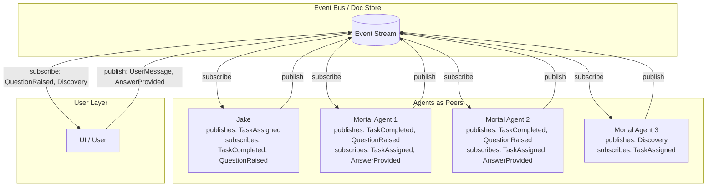

# Choreography Architecture

**One-line summary:** No central coordinator; agents self-organize via events, with emergent coordination replacing explicit orchestration.

## Core Concept

Choreography inverts the orchestration model. Instead of a central coordinator (TavernCoordinator, Jake-as-conductor) directing agent activities, each agent knows its role and reacts to events independently. Coordination emerges from the interaction patterns, like a dance where everyone knows the steps without a choreographer calling them.

In this model, Jake transforms from "conductor" to "first among equals." He is still the user's primary interface and the agent who spawns others, but he does not maintain global state or direct child agents. Instead, he publishes events (AgentSpawned, TaskAssigned) and subscribes to events (TaskCompleted, QuestionRaised). Other agents do the same. The system's behavior emerges from these event reactions rather than centralized control flow.

The fundamental insight is that complex coordination can arise from simple local rules. Each agent follows its own protocol: "when I see TaskAssigned to me, I work; when I finish, I publish TaskCompleted; when I need input, I publish QuestionRaised." No agent needs global knowledge. The Doc Store becomes the event medium - events are documents, and agents poll or subscribe to changes.

## Key Components

## Pros

- **Reduced coupling** - Agents know only their own responsibilities and event contracts, not other agents' internals

- **Natural scalability** - Adding more agents requires no coordinator changes; they just subscribe to relevant events

- **Resilience** - No single point of failure; if Jake goes down, other agents can continue reacting to events

- **Emergent collaboration** - Agents can collaborate without explicit coordination logic; sibling agents can react to each other's events

- **Aligns with PRD Discovery Sharing** - Section 9.3 describes agents noticing oddities and sharing via messaging; choreography makes this first-class

- **Simplified Jake** - Jake becomes a specialized agent rather than a god object; easier to test and reason about

- **Supports lateral communication** - PRD Section 5.3 describes lateral messaging between siblings; choreography enables this naturally

## Cons

- **Harder to understand globally** - No single place shows "what the system is doing"; must trace event flows

- **Debugging complexity** - "Why did agent X do Y?" requires reconstructing event sequences

- **Race conditions** - Multiple agents reacting to same event may conflict without coordination

- **No guaranteed order** - Events may arrive out of order; agents must be order-agnostic or implement ordering

- **Emergent behavior can surprise** - System may exhibit behaviors no one designed explicitly

- **PRD hierarchical model tension** - The PRD describes parent-child relationships with explicit oversight; pure choreography flattens this

- **Verification challenges** - "Who is responsible for verifying this commitment?" becomes unclear without explicit ownership

- **Jake's character mismatch** - Jake is "The Proprietor" who runs the show; choreography makes him just another dancer

## When to Choose This Architecture

Choose choreography when:

- **Agent collaboration patterns are complex and evolving** - When you cannot predict which agents need to coordinate with which

- **Resilience matters more than consistency** - When partial system operation is acceptable and preferred over complete failure

- **Discovery and lateral sharing are core features** - When agents learning from each other's work is valuable

- **Scale is a primary concern** - When the number of agents may grow significantly beyond current projections

- **Organic evolution is desired** - When you want the system to develop new coordination patterns without central redesign

Avoid choreography when:

- **Strict hierarchical control is required** - The PRD's invariants about verification and oversight suggest centralized authority

- **Debugging simplicity is critical** - When being able to trace "who told whom to do what" matters

- **Coordination logic is complex and stateful** - Multi-step workflows with dependencies are harder to express choreographically

- **Jake's character is central to the product** - If Jake being "in charge" is part of the user experience

- **V1 scope is limited** - When simplicity wins and the coordination patterns are well-understood
