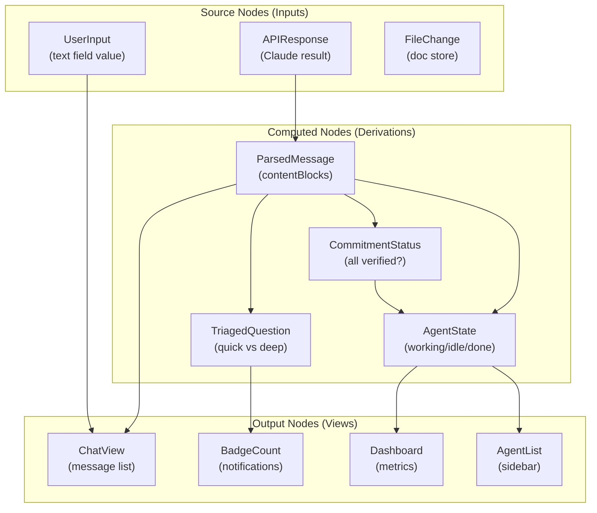

# Data Flow Architecture

**One-line summary:** Values propagate through a reactive dependency graph; changing one value automatically updates all dependent values downstream, like a spreadsheet.

## Core Concept

Data Flow architecture treats the entire system as a directed acyclic graph (DAG) of dependent values. When a source value changes, the change propagates through all downstream computations automatically. This is the mental model behind spreadsheets (change A1, all formulas referencing A1 update) and reactive UI frameworks (change model, view updates).

For Tavern, this means: agent state, messages, commitments, and UI are all nodes in a dependency graph. When an agent responds, the response flows through transformations (commitment checking, message parsing, notification triaging) and updates all dependent views without explicit push/pull logic. The data "flows" through the graph.

Unlike Reactive Streams (#10), which emphasizes backpressure and async producers/consumers, Data Flow emphasizes **synchronous propagation** and **declarative dependencies**. You don't subscribe to streams; you declare that "this value depends on these other values." The runtime handles the rest.

## Key Components

## Pros

- **Eliminates manual update propagation** — No explicit notification code; dependencies are implicit in declarations

- **Natural for SwiftUI** — SwiftUI's `@State`/`@ObservedObject`/`@Published` are already data flow primitives

- **Debugging via data inspection** — Current state is always visible; you see the graph, not stack traces

- **Automatic memoization** — Computed values cache until dependencies change

- **Composable transformations** — Build complex derived state from simple pieces

- **Referential transparency** — Same inputs produce same outputs; easier testing

## Cons

- **Glitch-prone with cycles** — Circular dependencies cause infinite update loops or undefined order

- **Memory overhead** — Every intermediate value must be stored (no streaming)

- **Eager vs lazy tradeoffs** — Full recomputation on change vs stale values and explicit invalidation

- **Complex async** — LLM responses are inherently async; data flow graphs handle sync better

- **Limited to DAG structure** — Agent-to-agent communication doesn't fit clean hierarchical flow

- **SwiftUI already does this** — Adopting data flow for business logic duplicates what SwiftUI does for views

## When to Choose This Architecture

Choose Data Flow when:

1. The system has clear input-to-output transformations without cycles (e.g., parsing responses, computing metrics)

2. You want derived state to always be consistent with source state (no stale views)

3. Most updates are synchronous or can be modeled as atomic state transitions

4. The team is comfortable with reactive/declarative paradigms (SwiftUI, Elm, React)

5. Testing via snapshot comparison of state graphs is preferred over testing method calls

Avoid if agents need bidirectional communication (breaks DAG), async operations are the primary flow (streaming LLM responses), or the team prefers imperative control flow.
